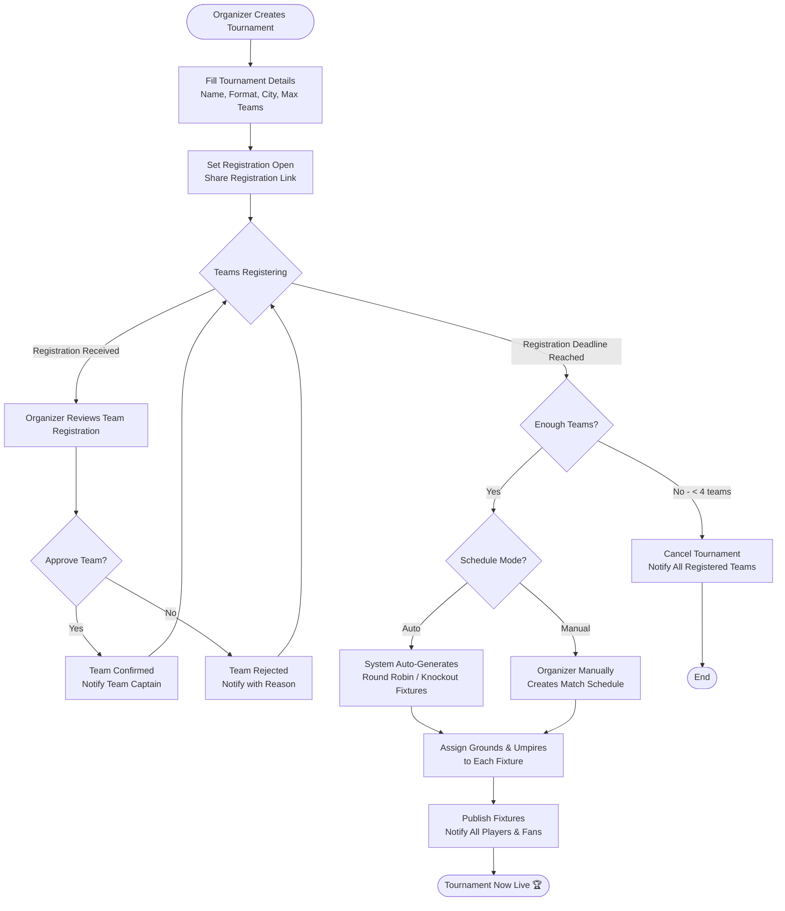
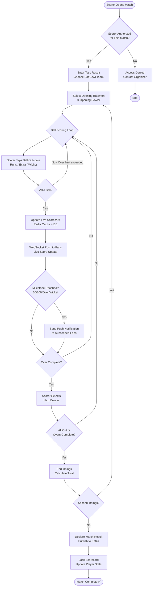

# Activity Diagrams — CricZone: Local Cricket Community Platform

> Four activity diagrams covering the most critical workflows in CricZone.

---

## AD-1: Tournament Setup & Scheduling Workflow



---

## AD-2: Ball-by-Ball Live Scoring Workflow



---

## AD-3: Player Profile & Analytics Flow

```mermaid
flowchart TD
    START([Match Completed\nKafka: MatchCompleted]) --> CONSUME[Player Analytics Service\nConsumes Event]
    CONSUME --> FETCH_BATTING[Fetch Batting Card\nfor Each Player]
    FETCH_BATTING --> AGG_BATTING[Aggregate Batting Stats\nRuns, SR, Avg, 50s/100s]
    AGG_BATTING --> FETCH_BOWLING[Fetch Bowling Card\nfor Each Player]
    FETCH_BOWLING --> AGG_BOWLING[Aggregate Bowling Stats\nWickets, Economy, BBI]
    AGG_BOWLING --> FETCH_FIELDING[Fetch Fielding Events\nCatches, Run-Outs, Stumpings]
    FETCH_FIELDING --> UPDATE_CAREER[Update player_career_stats\nIn PostgreSQL]
    UPDATE_CAREER --> COMPUTE_PPS[Run PPS Algorithm\nWeighted: Batting 40% + Bowling 40% + Fielding 20%]
    COMPUTE_PPS --> PPS_GRADE{Assign Grade}
    PPS_GRADE -->|85-100| ELITE[Grade: Elite ⭐⭐⭐]
    PPS_GRADE -->|65-84| GOOD[Grade: Good ⭐⭐]
    PPS_GRADE -->|40-64| AVERAGE[Grade: Average ⭐]
    PPS_GRADE -->|< 40| DEVELOPING[Grade: Developing]
    ELITE & GOOD & AVERAGE & DEVELOPING --> SAVE_PPS[Save PPS to DB\nPublish: PlayerPPSUpdated]
    SAVE_PPS --> GEN_INSIGHTS[AI Generates Insights\ne.g. "Weakness vs left-arm spin"]
    GEN_INSIGHTS --> GEN_CARD[Generate Shareable\nStat Card Image]
    GEN_CARD --> PLAYER_DONE([Player Profile Updated\nStat Card Ready])
```

---

## AD-4: Store Offer Discovery & Redemption Flow

```mermaid
flowchart TD
    START([Player/Fan Opens Stores Tab]) --> LOCATION{Location Permission\nGranted?}
    LOCATION -->|No| ASK_PERMISSION[Request Location Permission]
    ASK_PERMISSION --> LOCATION
    LOCATION -->|Yes| GEO_SEARCH[Geo-Query Stores\nWithin 10 km Radius]
    GEO_SEARCH --> RESULTS{Stores Found?}
    RESULTS -->|No| EXPAND[Expand Radius to 20 km\nShow Nearest Stores Message]
    RESULTS -->|Yes| DISPLAY_MAP[Display Map + List\nWith Store Pins]
    DISPLAY_MAP --> USER_ACTION{User Action}

    USER_ACTION -->|View Store| STORE_DETAIL[Show Store Profile\nPhotos, Hours, Products, Offers]
    STORE_DETAIL --> OFFER_LIST[Show Active Offers\nDiscount Cards]
    OFFER_LIST --> REDEEM_INTENT{User Wants\nto Redeem?}
    REDEEM_INTENT -->|No| USER_ACTION
    REDEEM_INTENT -->|Yes| GEN_QR[Generate Unique QR Code\nOffer Redemption Token]
    GEN_QR --> AT_STORE{At the Store?}
    AT_STORE -->|No| SAVE_QR[Save QR to "My Offers"\nFor Later Use]
    AT_STORE -->|Yes| SCAN[Store Owner Scans QR\nvia Store Owner App]
    SAVE_QR --> USER_ACTION
    SCAN --> VALIDATE{QR Valid?\nNot Expired, Not Used}
    VALIDATE -->|No| INVALID[Show: Offer Invalid\nor Already Redeemed]
    VALIDATE -->|Yes| MARK_REDEEMED[Mark Offer Redeemed\nUpdate Redemption Count]
    MARK_REDEEMED --> CONFIRM[Show Confirmation\nOffer Applied ✅]
    CONFIRM --> REVIEW{Customer Wants\nto Leave Review?}
    REVIEW -->|Yes| POST_REVIEW[Submit Star Rating + Review\nfor Store]
    REVIEW -->|No| DONE([End])
    POST_REVIEW --> DONE
    INVALID --> USER_ACTION
    EXPAND --> DISPLAY_MAP
```
