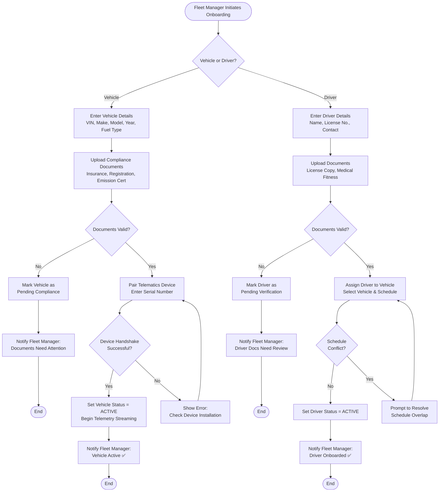
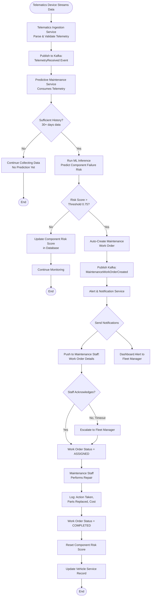
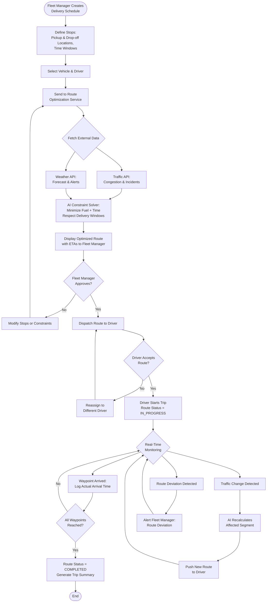
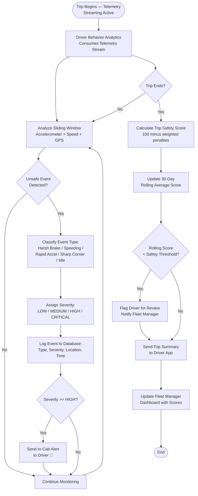

# Activity Diagrams — AI-Driven Fleet Management Optimization Platform

> **⚠️ Core Requirements**: Activity workflows map to the use cases defined in [ACTORS_AND_USE_CASES.md](./ACTORS_AND_USE_CASES.md).

## Table of Contents
1. [Fleet Onboarding Workflow](#fleet-onboarding-workflow)
2. [Predictive Maintenance Workflow](#predictive-maintenance-workflow)
3. [Route Planning & Execution Workflow](#route-planning--execution-workflow)
4. [Driver Behavior Review Workflow](#driver-behavior-review-workflow)

---

## Fleet Onboarding Workflow

**Use Cases**: UC-2 (Onboard Vehicle), UC-3 (Onboard Driver)

---

## Predictive Maintenance Workflow

**Use Case**: UC-5 (Predict Maintenance Needs)

---

## Route Planning & Execution Workflow

**Use Case**: UC-6 (Optimize Route)

---

## Driver Behavior Review Workflow

**Use Case**: UC-7 (Monitor Driver Behavior)

---

**Last Updated**: February 2026
**Version**: 1.0
