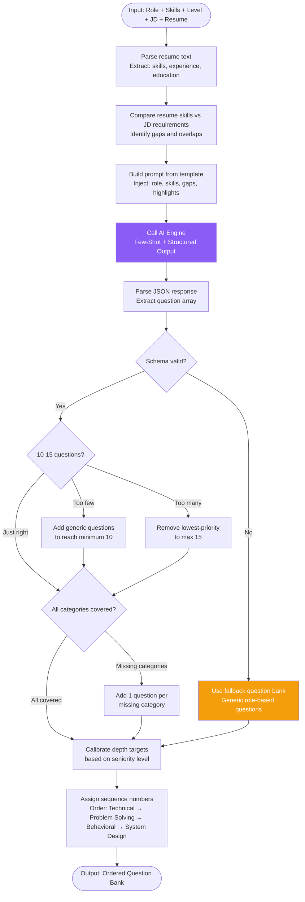
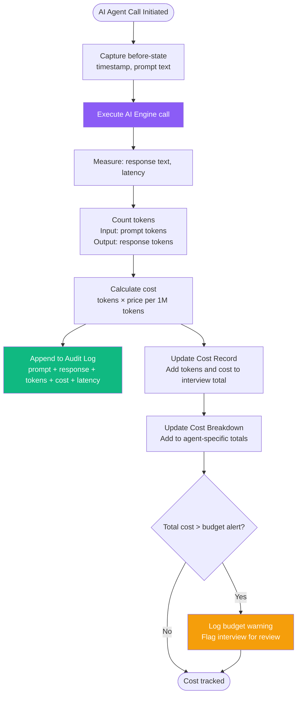

# Activity Diagram — AI-Assisted Interview Screening

---

## 1. Complete Interview Lifecycle

```mermaid
flowchart TD
    START([Start]) --> CONFIG[Hiring Manager configures interview<br/>Role + Skills + Level + JD + Resume]
    CONFIG --> VALIDATE{Valid configuration?}
    VALIDATE -->|No| ERROR_CONFIG[Show validation errors]
    ERROR_CONFIG --> CONFIG
    VALIDATE -->|Yes| GENERATE[AI generates question bank<br/>Question Generator Agent]
    GENERATE --> LOG_GEN[Log: prompt + response + tokens]
    LOG_GEN --> REVIEW_Q[Manager reviews question bank]
    REVIEW_Q --> EDIT{Edit questions?}
    EDIT -->|Yes| MODIFY[Add / Edit / Remove questions]
    MODIFY --> REVIEW_Q
    EDIT -->|No| CONFIRM[Manager confirms → Status: READY]
    CONFIRM --> SHARE[Share interview link with candidate]
    SHARE --> CANDIDATE_JOIN[Candidate opens interview]
    CANDIDATE_JOIN --> START_INT[Interview begins → Status: IN_PROGRESS]
    START_INT --> PRESENT_Q[Present question to candidate]

    PRESENT_Q --> WAIT_RESP[Wait for candidate response]
    WAIT_RESP --> RECEIVE[Receive candidate response]
    RECEIVE --> EVALUATE[AI evaluates response<br/>Response Evaluator Agent]
    EVALUATE --> LOG_EVAL[Log: scores + tokens + cost]
    LOG_EVAL --> DEPTH{Check depth score}

    DEPTH -->|"Depth ≤ 2"| EASIER[Generate easier follow-up<br/>Adaptive Agent]
    DEPTH -->|"Depth = 3"| COVERAGE{Check topic coverage}
    DEPTH -->|"Depth ≥ 4"| DEEPER[Generate deeper follow-up<br/>Adaptive Agent]

    COVERAGE -->|"All topics ≥ 60%"| CONCLUDE_CHECK{Questions ≥ 8?}
    COVERAGE -->|"Gaps remain"| NEW_TOPIC[Switch to least-covered topic<br/>Adaptive Agent]

    CONCLUDE_CHECK -->|Yes| CONCLUDE[Conclude interview]
    CONCLUDE_CHECK -->|No| NEW_TOPIC

    EASIER --> LOG_ADAPT[Log: adaptation + tokens]
    DEEPER --> LOG_ADAPT
    NEW_TOPIC --> LOG_ADAPT

    LOG_ADAPT --> MAX_CHECK{Questions ≥ 12?}
    MAX_CHECK -->|Yes| CONCLUDE
    MAX_CHECK -->|No| PRESENT_Q

    CONCLUDE --> SYNTHESIZE[AI generates feedback summary<br/>Feedback Synthesizer Agent]
    SYNTHESIZE --> CALC_SCORE[Calculate overall scores<br/>& recommendation]
    CALC_SCORE --> LOG_SYNTH[Log: summary + tokens + cost]
    LOG_SYNTH --> COMPLETE[Interview COMPLETED]
    COMPLETE --> NOTIFY_REV[Notify reviewer: interview ready]

    NOTIFY_REV --> OPEN_REVIEW[Reviewer opens review page]
    OPEN_REVIEW --> VIEW_QA[View Q&A pairs with AI scores]
    VIEW_QA --> ASSESS[Reviewer assesses AI recommendation]
    ASSESS --> DECISION{Reviewer decision}

    DECISION -->|Approve| APPROVE[Accept AI scores as-is]
    DECISION -->|Adjust| ADJUST[Modify scores + add justification]
    DECISION -->|Reject| REJECT[Override recommendation + reason]

    APPROVE --> LOG_REVIEW[Log: review decision + attribution]
    ADJUST --> RECALC[Recalculate recommendation]
    RECALC --> LOG_REVIEW
    REJECT --> LOG_REVIEW

    LOG_REVIEW --> FINAL[Status: REVIEWED<br/>Final decision recorded]
    FINAL --> END([End])

    style GENERATE fill:#8b5cf6,color:#fff
    style EVALUATE fill:#8b5cf6,color:#fff
    style EASIER fill:#8b5cf6,color:#fff
    style DEEPER fill:#8b5cf6,color:#fff
    style NEW_TOPIC fill:#8b5cf6,color:#fff
    style SYNTHESIZE fill:#8b5cf6,color:#fff
    style LOG_GEN fill:#10b981,color:#fff
    style LOG_EVAL fill:#10b981,color:#fff
    style LOG_ADAPT fill:#10b981,color:#fff
    style LOG_SYNTH fill:#10b981,color:#fff
    style LOG_REVIEW fill:#10b981,color:#fff
```

---

## 2. AI Question Generation Workflow

```mermaid
flowchart TD
    START([Input: Role + Skills + Level + JD + Resume]) --> PARSE[Parse resume text<br/>Extract: skills, experience, education]
    PARSE --> IDENTIFY_GAPS[Compare resume skills vs JD requirements<br/>Identify gaps and overlaps]
    IDENTIFY_GAPS --> BUILD_PROMPT[Build prompt from template<br/>Inject: role, skills, gaps, highlights]
    BUILD_PROMPT --> CALL_LLM[Call AI Engine<br/>Few-Shot + Structured Output]
    CALL_LLM --> PARSE_RESPONSE[Parse JSON response<br/>Extract question array]
    PARSE_RESPONSE --> VALIDATE_SCHEMA{Schema valid?}

    VALIDATE_SCHEMA -->|No| FALLBACK[Use fallback question bank<br/>Generic role-based questions]
    VALIDATE_SCHEMA -->|Yes| CHECK_COUNT{10-15 questions?}

    CHECK_COUNT -->|Too few| PAD[Add generic questions<br/>to reach minimum 10]
    CHECK_COUNT -->|Too many| TRIM[Remove lowest-priority<br/>to max 15]
    CHECK_COUNT -->|Just right| COVERAGE_CHECK{All categories covered?}

    PAD --> COVERAGE_CHECK
    TRIM --> COVERAGE_CHECK

    COVERAGE_CHECK -->|Missing categories| ADD_CATEGORY[Add 1 question per<br/>missing category]
    COVERAGE_CHECK -->|All covered| CALIBRATE[Calibrate depth targets<br/>based on seniority level]

    ADD_CATEGORY --> CALIBRATE
    FALLBACK --> CALIBRATE

    CALIBRATE --> SEQUENCE[Assign sequence numbers<br/>Order: Technical → Problem Solving → Behavioral → System Design]
    SEQUENCE --> OUTPUT([Output: Ordered Question Bank])

    style CALL_LLM fill:#8b5cf6,color:#fff
    style FALLBACK fill:#f59e0b,color:#fff
```

---

## 3. Cost Tracking Workflow

```mermaid
flowchart TD
    START([AI Agent Call Initiated]) --> CAPTURE[Capture before-state<br/>timestamp, prompt text]
    CAPTURE --> EXECUTE[Execute AI Engine call]
    EXECUTE --> MEASURE[Measure: response text, latency]
    MEASURE --> COUNT[Count tokens<br/>Input: prompt tokens<br/>Output: response tokens]
    COUNT --> CALC_COST[Calculate cost<br/>tokens × price per 1M tokens]

    CALC_COST --> LOG_AUDIT[Append to Audit Log<br/>prompt + response + tokens + cost + latency]
    CALC_COST --> UPDATE_COST[Update Cost Record<br/>Add tokens and cost to interview total]

    UPDATE_COST --> UPDATE_BREAKDOWN[Update Cost Breakdown<br/>Add to agent-specific totals]
    UPDATE_BREAKDOWN --> CHECK_BUDGET{Total cost > budget alert?}

    CHECK_BUDGET -->|Yes| ALERT[Log budget warning<br/>Flag interview for review]
    CHECK_BUDGET -->|No| DONE([Cost tracked])
    ALERT --> DONE

    style EXECUTE fill:#8b5cf6,color:#fff
    style LOG_AUDIT fill:#10b981,color:#fff
    style ALERT fill:#f59e0b,color:#fff
```
