# PayFlow - Actors and Use Cases

> **⚠️ Core Requirements**: Each use case is mapped to the core requirements defined in [KEY_REQUIREMENTS.md](./KEY_REQUIREMENTS.md).

## Table of Contents
1. [Actors](#actors)
2. [Use Case Diagram](#use-case-diagram)
3. [Use Case Details](#use-case-details)
4. [Use Case Relationships](#use-case-relationships)

---

## Actors

### Primary Actors

#### 1. Customer (Payer)
- **Description**: An individual using the app to send money, pay merchants, and manage their finances
- **Characteristics**:
  - Registered with phone number and IBAN
  - Can link multiple bank accounts
  - Uses QR codes for payments
  - Participates in loyalty programs
- **Goals**:
  - Send and receive money
  - Pay merchants via QR or direct transfer
  - View transaction history and receipts
  - Earn and redeem loyalty points

#### 2. Merchant (Recipient)
- **Description**: A business entity that accepts payments through the platform
- **Characteristics**:
  - Onboarded by authorized admin personnel
  - Has static QR code for storefront
  - Receives payment settlements to business bank account
  - Rated by customers for service quality
- **Goals**:
  - Accept payments from customers
  - View payment settlements and reports
  - Maintain good service rating
  - Offer promotions via platform

#### 3. Admin (Authorized Personnel)
- **Description**: Internal staff who manage merchants, cashback campaigns, and platform operations
- **Characteristics**:
  - Role-based access (Merchant Admin, Finance Admin, Super Admin)
  - Manages merchant lifecycle (onboard, suspend, deactivate)
  - Configures cashback and loyalty rules
  - Reviews fraud alerts
- **Goals**:
  - Onboard and manage merchants
  - Configure campaigns and promotions
  - Monitor platform health
  - Handle escalated issues

### Secondary Actors

#### 4. Banking Partner (External)
- **Description**: Digital banks and wallet providers integrated for payment processing
- **Characteristics**:
  - Provides payment rails (debit, credit, wallet)
  - Validates IBANs and processes settlements
  - Subject to SLA agreements
- **Goals**:
  - Process payments reliably
  - Provide account validation
  - Settle funds on schedule

#### 5. Fraud Detection Engine (System)
- **Description**: Internal ML-powered system monitoring all transactions
- **Characteristics**:
  - Real-time risk scoring
  - Pattern recognition and anomaly detection
  - Device fingerprinting integration
- **Goals**:
  - Minimize fraudulent transactions
  - Reduce false positives
  - Adapt to new fraud patterns

#### 6. Notification Service (System)
- **Description**: Omnichannel communication system
- **Characteristics**:
  - Sends SMS, email, push notifications
  - Handles receipt delivery
  - Respects user channel preferences
- **Goals**:
  - Deliver transaction confirmations
  - Send alerts and promotions
  - Ensure timely delivery

#### 7. Loyalty & Rewards Engine (System)
- **Description**: System managing points, tiers, and cashback
- **Characteristics**:
  - Tracks user points and tier status
  - Processes point redemptions during payment
  - Manages cashback campaign rules
- **Goals**:
  - Accurately credit and debit points
  - Manage tier upgrades/downgrades
  - Apply cashback according to campaign rules

---

## Use Case Diagram

```mermaid
graph TB
    subgraph Actors
        C((Customer))
        M((Merchant))
        A((Admin))
    end

    subgraph "Registration & Onboarding"
        UC1[Register Account]
        UC2[Link Bank Account]
        UC3[Complete KYC]
        UC4[Onboard Merchant]
        UC5[Manage Merchant Profile]
        UC6[Rate Merchant Service]
    end

    subgraph "Payment Operations"
        UC7[Send P2P Payment]
        UC8[Pay Merchant Directly]
        UC9[Pay via QR Code Scan]
        UC10[Generate QR Code]
    end

    subgraph "History & Communication"
        UC11[View Transaction History]
        UC12[Download/Email Receipt]
        UC13[Manage Notification Preferences]
    end

    subgraph "Fraud & Security"
        UC14[Review Fraud Alert]
    end

    subgraph "Loyalty & Cashback"
        UC15[View Loyalty Status]
        UC16[Redeem Loyalty Points]
        UC17[Manage Cashback Campaigns]
    end

    subgraph "Support"
        UC18[Open Help Chat]
    end

    C --> UC1
    C --> UC2
    C --> UC3
    C --> UC6
    C --> UC7
    C --> UC8
    C --> UC9
    C --> UC10
    C --> UC11
    C --> UC12
    C --> UC13
    C --> UC15
    C --> UC16
    C --> UC18

    M --> UC5
    M --> UC10
    M --> UC11

    A --> UC4
    A --> UC5
    A --> UC14
    A --> UC17
```

---

## Use Case Details

### UC1: Register Account

**Actor**: Customer
**Priority**: P0
**Requirement**: REQ-1 (Customer Registration)

**Description**: New customer registers on the platform with their personal details.

**Preconditions**:
- App installed on mobile device
- Valid phone number

**Main Flow**:
1. Customer opens app and selects "Register"
2. Customer enters full name
3. Customer enters phone number
4. System sends OTP to phone number
5. Customer enters OTP
6. System validates OTP
7. Customer creates PIN/password
8. System creates user account
9. System auto-enrolls user in Loyalty Program (Silver tier)
10. Customer is redirected to bank linking (UC2)

**Alternative Flows**:
- **A1**: OTP expired → resend OTP
- **A2**: Phone number already registered → prompt login
- **A3**: Invalid phone format → show validation error

**Postconditions**:
- User account created
- Phone number verified
- Loyalty account created (Silver tier)

---

### UC2: Link Bank Account

**Actor**: Customer
**Priority**: P0
**Requirement**: REQ-1

**Description**: Customer links a bank account using their IBAN for payment processing.

**Preconditions**:
- Customer is registered and authenticated

**Main Flow**:
1. Customer navigates to "Link Bank Account"
2. Customer selects their bank from supported list
3. Customer enters IBAN number
4. System validates IBAN format
5. System sends micro-deposit verification (or API validation with banking partner)
6. Customer confirms verification amount
7. System links bank account to user profile
8. Customer can now send/receive payments

**Alternative Flows**:
- **A1**: IBAN validation fails → show "Invalid IBAN" error
- **A2**: Bank not supported → show "Coming Soon" with notification opt-in
- **A3**: Customer links additional bank accounts → manage multiple accounts

**Postconditions**:
- Bank account linked and verified
- Account available as payment source/destination

---

### UC3: Complete KYC

**Actor**: Customer
**Priority**: P0
**Requirement**: REQ-1, REQ-7 (Security)

**Description**: Customer completes identity verification to unlock full functionality.

**Preconditions**:
- Customer is registered

**Main Flow**:
1. System prompts KYC during first high-value transaction or after registration
2. Customer uploads government ID (front + back)
3. Customer takes a selfie for liveness check
4. System sends documents to KYC partner for verification
5. KYC partner returns verification result
6. System updates user verification status
7. Customer is notified of verification result

**Alternative Flows**:
- **A1**: KYC rejected → customer can re-submit with different documents
- **A2**: KYC pending → limited functionality (low-value transactions only)

**Postconditions**:
- Customer identity verified or flagged for review
- Transaction limits set based on KYC level

---

### UC4: Onboard Merchant

**Actor**: Admin (Authorized Personnel)
**Priority**: P0
**Requirement**: REQ-2 (Merchant Management)

**Description**: Admin personnel register and onboard a new merchant to the platform.

**Preconditions**:
- Admin is authenticated with merchant management permissions

**Main Flow**:
1. Admin opens merchant onboarding form
2. Admin enters merchant details (business name, registration number, category)
3. Admin enters merchant contact person details
4. Admin enters merchant bank account (IBAN) for settlements
5. System validates business registration number
6. Admin uploads merchant documents (license, registration certificate)
7. System runs KYB (Know Your Business) verification
8. Admin approves merchant
9. System generates merchant static QR code
10. System creates merchant dashboard credentials
11. System sends welcome notification to merchant

**Alternative Flows**:
- **A1**: KYB verification fails → admin reviews manually
- **A2**: Merchant category not available → admin creates new category

**Postconditions**:
- Merchant account created and active
- Static QR code generated
- Merchant can accept payments

---

### UC5: Manage Merchant Profile

**Actor**: Admin / Merchant
**Priority**: P1
**Requirement**: REQ-2

**Description**: Update or manage merchant details, status, and settings.

**Preconditions**:
- Merchant is onboarded
- Actor has appropriate permissions

**Main Flow**:
1. Actor opens merchant profile
2. Actor can view/edit business details
3. Actor can update bank account for settlements
4. Admin can suspend/reactivate merchant
5. Admin can set transaction limits for merchant
6. Changes are logged in audit trail

**Alternative Flows**:
- **A1**: Merchant requests account closure → deactivation flow
- **A2**: Admin suspends merchant for fraud → all transactions blocked

**Postconditions**:
- Merchant profile updated
- Audit log created

---

### UC6: Rate Merchant Service

**Actor**: Customer
**Priority**: P1
**Requirement**: REQ-2

**Description**: Customer rates a merchant after a transaction.

**Preconditions**:
- Customer has completed a transaction with the merchant

**Main Flow**:
1. After payment, system prompts "Rate this merchant"
2. Customer selects star rating (1-5)
3. Customer optionally writes a review
4. System updates merchant's aggregate rating
5. System stores individual rating for analysis

**Alternative Flows**:
- **A1**: Customer skips rating → no action
- **A2**: Customer updates previous rating → overwrites old one

**Postconditions**:
- Merchant rating updated
- Review stored

---

### UC7: Send P2P Payment

**Actor**: Customer
**Priority**: P0
**Requirement**: REQ-3 (Payment Processing)

**Description**: Customer sends money directly to another registered user.

**Preconditions**:
- Sender is authenticated and has linked bank account
- Sender has sufficient balance/bank funds
- Recipient is registered on the platform

**Main Flow**:
1. Customer selects "Send Money"
2. Customer enters recipient phone number or selects from contacts
3. System validates recipient exists
4. Customer enters payment amount
5. Customer selects source bank account (if multiple)
6. Customer adds optional note/description
7. Customer reviews payment summary
8. Customer confirms with PIN/biometric
9. System initiates payment via banking partner
10. System records transaction
11. System sends notifications to both parties (UC13)
12. System credits loyalty points to sender (if applicable)

**Alternative Flows**:
- **A1**: Recipient not registered → show invite flow
- **A2**: Insufficient funds → show error with balance info
- **A3**: Bank API timeout → queue for retry with user notification
- **A4**: Fraud check fails → block transaction, notify user

**Postconditions**:
- Payment sent and recorded
- Both parties notified
- Loyalty points credited

---

### UC8: Pay Merchant Directly

**Actor**: Customer
**Priority**: P0
**Requirement**: REQ-3

**Description**: Customer pays a merchant by searching or selecting from merchant directory.

**Preconditions**:
- Customer is authenticated
- Merchant is active on the platform

**Main Flow**:
1. Customer selects "Pay Merchant"
2. Customer searches merchant by name or browses directory
3. Customer selects merchant
4. Customer enters payment amount
5. Customer selects payment method (bank account)
6. Customer reviews and confirms with PIN/biometric
7. System processes payment through banking partner
8. System records transaction
9. System sends receipt to customer
10. System credits merchant's account
11. System prompts service rating (UC6)

**Alternative Flows**:
- **A1**: Apply loyalty points → deduct from total before bank charge
- **A2**: Cashback eligible → apply cashback after transaction

**Postconditions**:
- Merchant paid
- Transaction recorded
- Receipt sent to customer

---

### UC9: Pay via QR Code Scan

**Actor**: Customer
**Priority**: P0
**Requirement**: REQ-3, REQ-4 (QR Code)

**Description**: Customer scans a QR code to initiate a payment.

**Preconditions**:
- Customer has camera access granted
- QR code is a valid PayFlow payment QR

**Main Flow**:
1. Customer opens camera/scanner in app
2. Customer scans merchant's or peer's QR code
3. System decodes QR payload (recipient ID, optional amount)
4. If amount is embedded → pre-fill amount
5. If no amount → customer enters amount
6. Customer selects payment source
7. Customer confirms with PIN/biometric
8. System processes payment
9. System sends receipt and notification

**Alternative Flows**:
- **A1**: Invalid QR code → show error message
- **A2**: QR is expired (for dynamic QR) → show "QR has expired"
- **A3**: QR from another payment app → show "Unsupported QR format"

**Postconditions**:
- Payment completed via QR flow
- Transaction recorded

---

### UC10: Generate QR Code

**Actor**: Customer / Merchant
**Priority**: P0
**Requirement**: REQ-4

**Description**: User generates a QR code for receiving payments.

**Preconditions**:
- User is authenticated

**Main Flow**:
1. User opens "My QR Code" or "Receive Payment"
2. For static QR: System displays user's permanent QR code
3. For dynamic QR: User enters a specific amount
4. System generates QR code with embedded data
5. User can share QR via messaging apps
6. User can download QR as PNG/SVG image
7. Merchant can print QR code for storefront display

**Alternative Flows**:
- **A1**: Regenerate QR after account changes

**Postconditions**:
- QR code generated and available for sharing/downloading

---

### UC11: View Transaction History

**Actor**: Customer / Merchant
**Priority**: P0
**Requirement**: REQ-5 (Transaction History)

**Description**: User views past transactions with search and filter capabilities.

**Preconditions**:
- User is authenticated

**Main Flow**:
1. User opens "Transaction History"
2. System loads recent transactions (default: last 30 days)
3. User can filter by date range, amount range, recipient/sender, status
4. User can search by transaction ID or description
5. System displays paginated list with transaction summary
6. User taps a transaction for full details
7. User can navigate to older records (up to 5 years)

**Alternative Flows**:
- **A1**: No transactions found → show "No transactions" message
- **A2**: Viewing old archived data → slight delay with loading indicator

**Postconditions**:
- User has viewed their transaction history

---

### UC12: Download/Email Receipt

**Actor**: Customer
**Priority**: P1
**Requirement**: REQ-5, REQ-6

**Description**: Customer downloads or emails a transaction receipt.

**Preconditions**:
- Transaction exists and belongs to the customer

**Main Flow**:
1. Customer views transaction detail
2. Customer taps "Download Receipt" or "Email Receipt"
3. If download: System generates PDF and saves to device
4. If email: Customer confirms email address; system sends receipt as PDF attachment
5. Receipt includes: date, amount, sender, recipient, reference number, status

**Alternative Flows**:
- **A1**: Email delivery fails → retry or show error

**Postconditions**:
- Receipt delivered to customer

---

### UC13: Manage Notification Preferences

**Actor**: Customer
**Priority**: P1
**Requirement**: REQ-6 (Omnichannel Notifications)

**Description**: Customer configures which notifications they receive and through which channels.

**Preconditions**:
- Customer is authenticated

**Main Flow**:
1. Customer opens "Notification Settings"
2. System shows notification categories (Transactions, Promotions, Security, Loyalty)
3. Customer toggles channels per category (Push, SMS, Email)
4. System saves preferences
5. Future notifications respect updated preferences

**Alternative Flows**:
- **A1**: Customer disables all → system warns about missing security alerts

**Postconditions**:
- Notification preferences updated

---

### UC14: Review Fraud Alert

**Actor**: Admin
**Priority**: P0
**Requirement**: REQ-7 (Fraud Detection)

**Description**: Admin reviews and acts on transactions flagged by the fraud engine.

**Preconditions**:
- Fraud engine has flagged a transaction
- Admin has fraud review permissions

**Main Flow**:
1. Admin opens fraud alert queue
2. System displays flagged transactions with risk scores
3. Admin selects a flagged transaction
4. System shows transaction details, user history, device info, geo data
5. Admin reviews evidence and makes decision:
   - **Approve**: Release held transaction
   - **Block**: Reject transaction and freeze account
   - **Escalate**: Send to compliance team
6. System logs admin decision in audit trail
7. System notifies affected customer

**Alternative Flows**:
- **A1**: Automated block for score > 95 → admin reviews post-block
- **A2**: Customer disputes fraud flag → UC18 (Help Chat)

**Postconditions**:
- Fraud alert resolved
- Audit log updated
- Customer notified

---

### UC15: View Loyalty Status

**Actor**: Customer
**Priority**: P2 (Nice-to-Have)
**Requirement**: REQ-8 (Loyalty Program)

**Description**: Customer views their loyalty tier, points balance, and earning history.

**Preconditions**:
- Customer is registered (auto-enrolled in loyalty)

**Main Flow**:
1. Customer opens "Rewards" section
2. System displays current tier (Silver/Gold/Platinum)
3. System shows total points balance
4. System shows points required for next tier
5. Customer views earning history (points per transaction)
6. Customer views available redemption options

**Postconditions**:
- Customer informed of loyalty status

---

### UC16: Redeem Loyalty Points

**Actor**: Customer
**Priority**: P2 (Nice-to-Have)
**Requirement**: REQ-8

**Description**: Customer applies loyalty points to reduce a payment amount.

**Preconditions**:
- Customer has available points
- Transaction is in progress

**Main Flow**:
1. During payment (UC7/UC8/UC9), customer selects "Apply Points"
2. System shows available points and equivalent monetary value
3. Customer selects number of points to apply (full or partial)
4. System deducts points value from payment amount
5. Remaining amount is charged to bank account
6. System debits points from loyalty balance

**Alternative Flows**:
- **A1**: Insufficient points for minimum redemption → show message
- **A2**: Points expiring soon → highlight for user

**Postconditions**:
- Points deducted
- Payment amount reduced
- Transaction recorded with loyalty details

---

### UC17: Manage Cashback Campaigns

**Actor**: Admin
**Priority**: P2 (Nice-to-Have)
**Requirement**: REQ-9 (Cashback Management)

**Description**: Admin creates and manages cashback offers tied to specific card types.

**Preconditions**:
- Admin has cashback management permissions

**Main Flow**:
1. Admin opens "Cashback Campaigns" dashboard
2. Admin creates new campaign:
   - Select card network (Visa, Mastercard, local cards)
   - Set cashback percentage or fixed amount
   - Set minimum transaction amount
   - Set campaign start/end dates
   - Set total budget cap
3. Admin previews and activates campaign
4. System applies cashback rules to eligible transactions
5. Admin monitors campaign spend vs. budget

**Alternative Flows**:
- **A1**: Budget exhausted → auto-deactivate campaign
- **A2**: Admin pauses running campaign → no new cashbacks applied

**Postconditions**:
- Campaign configured and active
- Eligible transactions receive cashback

---

### UC18: Open Help Chat

**Actor**: Customer
**Priority**: P2 (Nice-to-Have)

**Description**: Customer opens in-app help chatbot for support.

**Preconditions**:
- Customer is authenticated

**Main Flow**:
1. Customer taps "Help" / chat icon
2. System opens chatbot interface
3. Chatbot greets and suggests common topics
4. Customer types question or selects topic
5. Chatbot provides answer from FAQ knowledge base
6. If unresolved, chatbot escalates to human agent
7. Conversation is logged for quality review

**Alternative Flows**:
- **A1**: No agents available → offer callback or email ticket

**Postconditions**:
- Customer issue addressed or escalated

---

## Use Case Relationships

### Include Relationships
- UC7 (P2P Payment) **includes** Authentication + Fraud Check
- UC8 (Pay Merchant) **includes** Authentication + Fraud Check
- UC9 (QR Payment) **includes** QR Decode + Authentication + Fraud Check
- UC4 (Onboard Merchant) **includes** KYB Verification
- UC1 (Register) **includes** OTP Verification

### Extend Relationships
- UC7 (P2P Payment) **extended by** UC16 (Redeem Points)
- UC8 (Pay Merchant) **extended by** UC6 (Rate Merchant)
- UC8 (Pay Merchant) **extended by** UC16 (Redeem Points)
- UC11 (View History) **extended by** UC12 (Download Receipt)

### Generalization
- UC7, UC8, UC9 → Process Payment (abstract)
- UC1, UC4 → Register Entity (abstract)
- Push, SMS, Email → Send Notification (abstract)

---

**Last Updated**: February 2026
**Version**: 1.0
**Status**: Design Complete
