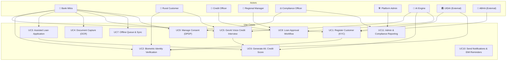

# Actors & Use Cases — Mitra Finance

> **⚠️ Core Requirements**: All use cases map to requirements in [KEY_REQUIREMENTS.md](./KEY_REQUIREMENTS.md).

## Table of Contents
1. [Actors](#actors)
2. [Use Case Diagram](#use-case-diagram)
3. [Use Case Details](#use-case-details)

---

## Actors

### Primary Actors (Human)

| # | Actor | Role | Tech Interface |
|---|-------|------|---------------|
| 1 | **Bank Mitra (BC Agent)** | Field agent who onboards customers, conducts KYC, and submits loan applications on behalf of rural customers | Android Mobile App (offline-capable) |
| 2 | **Rural Customer** | The loan applicant; New-to-Credit, low literacy, speaks local dialect | Interacts via Mitra's device + voice |
| 3 | **Credit Officer (L1)** | Reviews medium-risk loan applications forwarded by the workflow engine | Web Dashboard |
| 4 | **Regional Manager (L2)** | Approves high-value or escalated loans; monitors Mitra performance in region | Web Dashboard + Mobile |
| 5 | **Compliance Officer** | Ensures KYC, AML, DPDP Act, and RBI guideline adherence | Web Dashboard |
| 6 | **Platform Admin** | Manages Mitras, AI rules, integrations, and system configuration | Admin Panel |

### Secondary Actors (System / External)

| # | Actor | Role |
|---|-------|------|
| 7 | **AI Engine** | Conducts voice credit interview, generates risk score, routes approvals |
| 8 | **UIDAI (Aadhaar)** | External identity authority; provides eKYC and OTP verification |
| 9 | **ABHA (Health Records)** | External health identity authority; provides health data with consent |
| 10 | **Credit Bureaus** | Experian / CRIF for thin-file check; primarily a fallback |
| 11 | **RBI / Regulator** | Receives compliance reports; sets policy thresholds |

---

## Use Case Diagram

```mermaid
graph TD
    subgraph Actors
        Mitra["🧑 Bank Mitra"]
        Customer["👤 Rural Customer"]
        CO["👔 Credit Officer"]
        RM["🏢 Regional Manager"]
        Compliance["⚖️ Compliance Officer"]
        Admin["🛠 Platform Admin"]
        AI["🤖 AI Engine"]
        UIDAI["🏛 UIDAI (External)"]
        ABHA["🏥 ABHA (External)"]
    end

    subgraph Use Cases
        UC1["UC1: Register Customer (KYC)"]
        UC2["UC2: Biometric Identity Verification"]
        UC3["UC3: Assisted Loan Application"]
        UC4["UC4: Document Capture (OCR)"]
        UC5["UC5: GenAI Voice Credit Interview"]
        UC6["UC6: Generate Alt. Credit Score"]
        UC7["UC7: Offline Queue & Sync"]
        UC8["UC8: Loan Approval Workflow"]
        UC9["UC9: Manage Consent (DPDP)"]
        UC10["UC10: Send Notifications & EMI Reminders"]
        UC11["UC11: Admin & Compliance Reporting"]
    end

    Mitra --> UC1
    Mitra --> UC2
    Mitra --> UC3
    Mitra --> UC4
    Mitra --> UC5
    Mitra --> UC7
    Mitra --> UC9
    Customer --> UC2
    Customer --> UC5
    AI --> UC5
    AI --> UC6
    AI --> UC8
    UIDAI --> UC1
    UIDAI --> UC2
    ABHA --> UC1
    CO --> UC8
    RM --> UC8
    Compliance --> UC9
    Compliance --> UC11
    Admin --> UC11
    UC3 --> UC6
    UC1 --> UC2
    UC5 --> UC6
```

---

## Use Case Details

### UC1: Register Customer (KYC)
**Actor**: Bank Mitra, UIDAI, ABHA
**Precondition**: Mitra is logged in and customer is physically present
**Trigger**: Mitra taps "New Customer"

**Main Flow**:
1. Mitra enters customer's mobile number
2. System sends Aadhaar OTP to customer's Aadhaar-linked mobile
3. Customer speaks/enters OTP via Mitra's device
4. UIDAI validates OTP and returns masked eKYC data (name, DOB, address, photo)
5. Mitra captures a live selfie for liveness check
6. System matches selfie against Aadhaar photo (face matching)
7. System prompts for ABHA linkage consent (optional)
8. Customer profile created in local DB; sync queued

**Alternate Flow A (UIDAI Down)**:
- System notifies Mitra: "Aadhaar service unavailable"
- Mitra captures physical Aadhaar copy via camera (OCR)
- Application flagged for manual KYC review post-connectivity

**Alternate Flow B (No Aadhaar-linked mobile)**:
- Escalate to Offline KYC: physical document capture + supervisor sign-off

**Success Criteria**: Customer record created with verification status; KYC data not stored (only VID token)

---

### UC2: Biometric Identity Verification
**Actor**: Bank Mitra, Rural Customer, UIDAI
**Precondition**: Customer registered (UC1 complete)
**Trigger**: Customer returns for subsequent transaction (loan disbursement, EMI)

**Main Flow**:
1. Mitra finds customer by mobile number or QR code
2. System prompts fingerprint capture
3. Customer places finger on device sensor or external USB scanner
4. Biometric match verified against UIDAI (AePS-style)
5. Auth token issued (8-hour validity, cached offline)
6. Activity logged in immutable audit trail

**Alternate Flow A (Dirty/Damaged Finger)**:
- System retries 3 times → switches to face liveness check
**Alternate Flow B (Elderly with worn fingerprints)**:
- Face liveness + Mitra supervisor co-sign → conditional auth

---

### UC3: Assisted Loan Application
**Actor**: Bank Mitra
**Precondition**: Customer KYC verified (UC2 complete)
**Trigger**: Mitra taps "New Loan Application"

**Main Flow**:
1. Mitra selects loan type (Agriculture / MSME / Personal)
2. System pre-fills customer data from KYC
3. AI Credit Interview initiated (UC5)
4. Alt Credit Score generated (UC6)
5. Mitra reviews AI-extracted data; edits if needed
6. Mitra uploads supporting documents (UC4)
7. Mitra reviews final application and submits
8. If offline: Application saved locally → queued for sync
9. If online: Application submitted → Loan Workflow Engine routes it (UC8)

**Success Criteria**: Complete application in < 15 minutes; zero data loss if connection drops mid-flow

---

### UC4: Document Capture (OCR)
**Actor**: Bank Mitra
**Precondition**: Loan application open
**Trigger**: Mitra taps "Add Document"

**Main Flow**:
1. Mitra selects document type (Utility Bill, Land Record, PAN, Shop License)
2. Camera opens with guided frame overlay
3. Mitra captures image; OCR extracts key fields in real-time
4. System displays extracted data for Mitra review/correction
5. Image compressed (< 500KB) for upload
6. Document encrypted and queued for upload

**Alternate Flows**:
- Illegible document → "Poor quality, retake" prompt
- Handwritten document → low-confidence fields flagged for manual entry

---

### UC5: GenAI Voice Credit Interview
**Actor**: AI Engine, Rural Customer, Bank Mitra
**Precondition**: Loan application initiated (UC3)
**Trigger**: System auto-launches interview after KYC

**Main Flow**:
1. System auto-detects customer's dialect from first utterance
2. TTS plays first question: "आपकी मासिक आमदनी क्या है?" (What is your monthly income?)
3. Customer responds verbally
4. ASR transcribes → Dialect NLP extracts structured data
5. LLM generates follow-up question based on response
6. Repeat for 8–12 questions covering: income, expenses, assets, livelihood, dependents
7. Confidence score generated per field
8. Low-confidence fields highlighted for Mitra to verify manually

**Offline Handling**:
- Entire interview runs on-device (ONNX quantized models); no connectivity needed
- Responses stored locally; full session synced when online

---

### UC6: Generate Alternative Credit Score
**Actor**: AI Engine
**Precondition**: Voice interview complete (UC5); optional: alt data sources queried
**Trigger**: Auto-triggered after interview completion

**Main Flow**:
1. Feature pipeline aggregates:
   - Voice interview structured output (income, assets, liabilities)
   - MGNREGA work days (government API)
   - Utility payment history (from document OCR)
   - Agricultural zone data (drought/flood index for past 24 months)
   - Mobile recharge frequency (operator API — with consent)
2. ML model generates risk score (300–850)
3. Score mapped to risk band: LOW (700+), MEDIUM (550–699), HIGH (< 550)
4. Recommended loan amount and tenure generated
5. Explainability: Top 3 score drivers displayed to Credit Officer
6. Score stored against application with model version tag

**Offline Handling**:
- Cached ML model (ONNX) runs scoring on-device
- External data (MGNREGA, weather) used only when connectivity available

---

### UC7: Offline Queue & Auto-Sync
**Actor**: Bank Mitra, SyncService
**Trigger**: Network connection established after offline session

**Main Flow**:
1. Device detects network (WiFi or 3G+)
2. SyncService reads pending items from local SQLite `sync_queue` table
3. Items processed in priority order: KYC verifications → Loan submissions → Documents
4. Each item sent with idempotency key (prevents duplicate processing)
5. Server acknowledges each item; local record marked `synced`
6. Conflicts detected and resolved (server-wins for financial records)
7. Mitra's UI shows: "Sync complete — 4 applications uploaded"

**Conflict Resolution**:
- If same application edited both locally and server-side → Server version wins; Mitra notified

---

### UC8: Loan Approval Workflow
**Actor**: Credit Officer, Regional Manager, AI Engine
**Trigger**: Loan application submitted (online or synced from offline)

**Main Flow**:
1. AI Engine evaluates risk score → routes by band:
   - LOW risk + amount < ₹25K → **Auto-Approve** (< 30 seconds)
   - MEDIUM risk or amount ₹25K–₹2L → **L1 Credit Officer** (4h SLA)
   - HIGH risk or amount > ₹2L → **L2 Regional Manager** (24h SLA)
2. Credit Officer receives alert; reviews application + AI score explanation
3. Officer provides decision: Approve / Reject / Request More Info
4. Approved → disbursement triggered (Jan Dhan account credit via IMPS)
5. Mitra + Customer notified of outcome via SMS + push

**SLA Escalation**:
- L1 breaches 4h → Auto-escalates to L2
- L2 breaches 24h → Alert to Regional Director

---

### UC9: Manage Consent (DPDP Act)
**Actor**: Bank Mitra, Rural Customer, Compliance Officer
**Trigger**: Any new data collection event

**Main Flow**:
1. Before any data type collected, system reads consent policy
2. TTS explains consent in customer's dialect: "We want to use your electricity bill to evaluate your loan. Do you agree?"
3. Customer provides verbal "हाँ" (Yes) → voice print recorded as consent artifact
4. Consent record created: dataType, purpose, timestamp, duration, customerVID, mitraID
5. Consent stored as immutable append-only log
6. Customer can revoke any consent via Mitra at any time

**Revocation Flow**:
1. Customer requests revocation
2. System marks consent as REVOKED; data processing halted for that data type
3. Data deletion workflow triggered if customer exercises Right to Erasure
4. Completion confirmed within 72 hours; audit record created

---

### UC10: Send Notifications & EMI Reminders
**Actor**: Notification Service
**Trigger**: Loan status events, EMI due dates

**Notification Events**:
- Loan approved → Push + SMS to Mitra + Customer
- Loan rejected → Push + SMS with reason code
- EMI due in 3 days → WhatsApp voice message in customer's dialect
- KYC expiring in 30 days → Push to Mitra
- Sync queue > 10 items and offline > 4h → Alert to Mitra

---

### UC11: Admin & Compliance Reporting
**Actor**: Compliance Officer, Platform Admin
**Trigger**: Scheduled (daily/monthly) or on-demand

**Reports**:
- Mitra activity report (applications/day, approval rate, fraud flags)
- Loan portfolio health (NPA rate by risk band, geography)
- AML/KYC screening report
- DPDP consent audit report
- RBI quarterly regulatory submission (Format: BC-001)
- AI model audit trail (which model version scored which loan, on which date)

---

**Last Updated**: February 2026
**Version**: 1.0
**Status**: Design Complete
