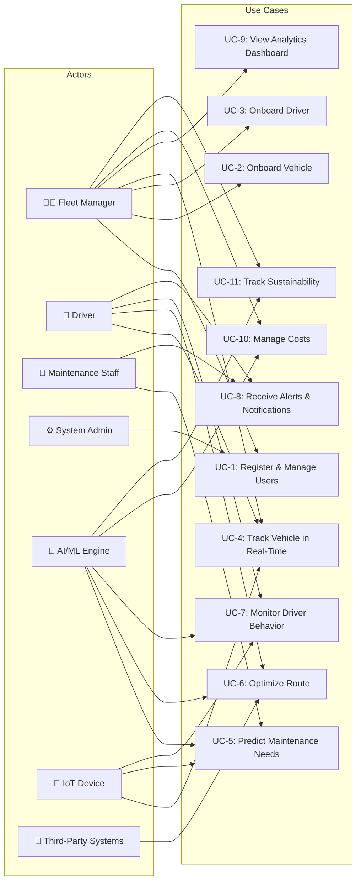

# Actors & Use Cases — AI-Driven Fleet Management Optimization Platform

## Actors

### Primary Actors
1. **Fleet Manager:** Oversees fleet operations, monitors KPIs, manages vehicle/driver assignments, reviews AI recommendations, and makes strategic decisions.
2. **Driver:** Operates assigned vehicles, receives route guidance and driving feedback, reports incidents, and views personal safety scores.
3. **Maintenance Staff:** Executes maintenance work orders, logs repairs, updates vehicle health status, and manages parts inventory.
4. **System Administrator:** Manages platform configuration, user roles, integration settings, AI rule thresholds, and data sources.

### Secondary / Automated Actors
1. **AI/ML Engine:** Runs predictive maintenance models, route optimization algorithms, driver behavior analysis, and generates cost-saving recommendations.
2. **IoT Telematics Device:** Streams real-time GPS, OBD-II diagnostics, accelerometer, and fuel sensor data from vehicles.
3. **Third-Party Systems:** ERP, logistics platforms, fuel card providers, weather APIs, and traffic data services that integrate via the API gateway.

---

## Use Case Diagram

```mermaid
graph LR
    subgraph Actors
        FM["🧑‍💼 Fleet Manager"]
        DR["🚗 Driver"]
        MS["🔧 Maintenance Staff"]
        SA["⚙️ System Admin"]
        AI["🤖 AI/ML Engine"]
        IOT["📡 IoT Device"]
        EXT["🔌 Third-Party Systems"]
    end

    subgraph Use Cases
        UC1["UC-1: Register & Manage Users"]
        UC2["UC-2: Onboard Vehicle"]
        UC3["UC-3: Onboard Driver"]
        UC4["UC-4: Track Vehicle in Real-Time"]
        UC5["UC-5: Predict Maintenance Needs"]
        UC6["UC-6: Optimize Route"]
        UC7["UC-7: Monitor Driver Behavior"]
        UC8["UC-8: Receive Alerts & Notifications"]
        UC9["UC-9: View Analytics Dashboard"]
        UC10["UC-10: Manage Costs"]
        UC11["UC-11: Track Sustainability"]
    end

    FM --> UC1 & UC2 & UC3 & UC4 & UC9 & UC10 & UC11
    DR --> UC4 & UC6 & UC7 & UC8
    MS --> UC5 & UC8
    SA --> UC1
    AI --> UC5 & UC6 & UC7 & UC10 & UC11
    IOT --> UC4 & UC5 & UC7
    EXT --> UC6
```

---

## Use Cases

### UC-1: Register & Manage Users
- **Actor:** System Admin / Fleet Manager
- **Goal:** Create user accounts and assign appropriate roles.
- **Preconditions:** Admin is authenticated.
- **Main Flow:**
    1. Admin navigates to User Management.
    2. Admin creates a new user with email, name, and role (Fleet Manager / Driver / Maintenance Staff).
    3. System sends an invitation email with a secure link.
    4. User completes registration (sets password, uploads profile photo).
    5. System grants role-based access.
- **Alternate Flow (SSO):**
    1. Organization has SSO enabled; user authenticates via corporate IdP.
    2. System auto-provisions the user with a default role.

### UC-2: Onboard Vehicle
- **Actor:** Fleet Manager
- **Goal:** Register a new vehicle in the fleet with its telematics device.
- **Preconditions:** Fleet Manager is authenticated, telematics device is available.
- **Main Flow:**
    1. Fleet Manager enters vehicle details (VIN, make, model, year, license plate, fuel type).
    2. Fleet Manager uploads compliance documents (insurance, registration, emission certificate).
    3. Fleet Manager pairs the telematics device by entering its serial number.
    4. System validates the device handshake and marks the vehicle as "Active."
    5. System begins receiving telematics data from the vehicle.
- **Alternate Flow (Validation Failure):**
    1. Document validation fails (expired insurance).
    2. System displays an error and marks the vehicle as "Pending Compliance."

### UC-3: Onboard Driver
- **Actor:** Fleet Manager
- **Goal:** Register a driver and assign them to a vehicle.
- **Preconditions:** At least one active vehicle exists.
- **Main Flow:**
    1. Fleet Manager enters driver details (name, license number, license expiry, contact info).
    2. Fleet Manager uploads compliance documents (license copy, medical fitness certificate).
    3. Fleet Manager assigns the driver to one or more vehicles with a schedule.
    4. System validates compliance and marks the driver as "Active."
- **Alternate Flow (Schedule Conflict):**
    1. Another driver is already assigned to the vehicle for the selected time.
    2. System prompts to resolve the conflict.

### UC-4: Track Vehicle in Real-Time
- **Actor:** Fleet Manager / Driver / IoT Device
- **Goal:** View live location and status of fleet vehicles.
- **Preconditions:** Vehicle is active and telematics device is transmitting.
- **Main Flow:**
    1. IoT device streams GPS + OBD-II data every 5–15 seconds.
    2. System ingests and processes the telemetry stream.
    3. Fleet Manager opens the Live Map dashboard.
    4. System renders vehicle positions on the map with status icons (In Transit 🟢, Idle 🟡, Maintenance Required 🔴).
    5. Fleet Manager clicks a vehicle to view speed, heading, fuel level, and trip history.
- **Alternate Flow (Geofence Breach):**
    1. Vehicle exits a configured geofence zone.
    2. System triggers a real-time alert to the Fleet Manager.

### UC-5: Predict Maintenance Needs
- **Actor:** AI/ML Engine / IoT Device / Maintenance Staff
- **Goal:** Proactively identify vehicles at risk of breakdown and schedule maintenance.
- **Preconditions:** Vehicle has accumulated sufficient telematics history (>30 days).
- **Main Flow:**
    1. IoT device continuously streams engine diagnostics (oil pressure, tire pressure, battery voltage, engine temp).
    2. AI/ML Engine runs predictive models on the telemetry + historical breakdown data.
    3. AI generates a Risk Score (0–100) per vehicle component bracket.
    4. When a component's Risk Score exceeds the threshold (e.g., 75), the system auto-creates a Maintenance Work Order.
    5. Maintenance Staff receives a notification with details: vehicle, component, urgency, recommended action.
    6. Maintenance Staff completes the work order and logs parts replaced.
    7. System resets the component Risk Score.
- **Alternate Flow (Emergency Breakdown):**
    1. Vehicle reports a critical OBD-II fault code (e.g., P0300 — engine misfire).
    2. System immediately creates an urgent work order and alerts both Maintenance Staff and Fleet Manager.

### UC-6: Optimize Route
- **Actor:** Driver / Fleet Manager / AI Engine / Third-Party Systems
- **Goal:** Find the most efficient route considering traffic, weather, and delivery constraints.
- **Preconditions:** Delivery schedule is defined with pickup/drop-off locations.
- **Main Flow:**
    1. Fleet Manager creates a delivery schedule with multiple stops.
    2. AI Engine fetches real-time traffic and weather data from third-party APIs.
    3. AI Engine calculates the optimal route (minimizing fuel, time, and distance) using constraint-based optimization.
    4. System presents the recommended route with ETA per stop to the Driver's mobile app.
    5. Driver starts the trip; system monitors in real-time.
    6. If traffic conditions change mid-trip, AI dynamically suggests a reroute.
- **Alternate Flow (Driver Deviation):**
    1. Driver deviates from the planned route.
    2. System logs the deviation and alerts the Fleet Manager.

### UC-7: Monitor Driver Behavior
- **Actor:** AI Engine / IoT Device / Driver / Fleet Manager
- **Goal:** Detect unsafe driving patterns and provide actionable feedback.
- **Preconditions:** Vehicle is in transit, telematics device is transmitting accelerometer + GPS data.
- **Main Flow:**
    1. IoT device streams accelerometer and speed data.
    2. AI Engine detects events: Harsh Braking, Rapid Acceleration, Speeding, Sharp Cornering, Excessive Idling.
    3. System logs the event with severity, location, and timestamp.
    4. Driver receives an in-cab alert (audio/vibration) for high-severity events.
    5. At trip end, Driver sees a Trip Safety Score on the mobile app.
    6. Fleet Manager views aggregated Driver Safety Scores on the dashboard.
- **Alternate Flow (Fatigue Detection):**
    1. AI detects patterns consistent with driver fatigue (erratic speed, lane drift indicators).
    2. System sends an urgent alert: "Consider a rest break."

### UC-8: Receive Alerts & Notifications
- **Actor:** Fleet Manager / Driver / Maintenance Staff
- **Goal:** Get real-time notifications for critical fleet events.
- **Preconditions:** User has notification preferences configured.
- **Main Flow:**
    1. A trigger event occurs (maintenance due, route deviation, unsafe driving, geofence breach, SOS).
    2. Notification Service evaluates the event against configured rules and escalation policies.
    3. System sends the alert to the appropriate user(s) via configured channels (Push, SMS, Email).
    4. User acknowledges the alert.
- **Alternate Flow (Escalation):**
    1. Alert is not acknowledged within the configured timeout (e.g., 10 minutes).
    2. System escalates to the next-level contact (e.g., Fleet Manager → Regional Manager).

### UC-9: View Analytics Dashboard
- **Actor:** Fleet Manager
- **Goal:** Gain operational insights through KPIs and AI-driven recommendations.
- **Main Flow:**
    1. Fleet Manager opens the Analytics Dashboard.
    2. System displays KPI cards: Fleet Utilization %, Fuel Cost/km, Avg. Maintenance Cost, Driver Safety Avg., On-Time Delivery %.
    3. Fleet Manager drills down into a specific KPI (e.g., Fuel Cost by vehicle).
    4. AI Engine surfaces insights: "Route A is 18% less fuel-efficient than Route B for the same delivery zone."
    5. Fleet Manager acts on the insight.

### UC-10: Manage Costs
- **Actor:** Fleet Manager / AI Engine
- **Goal:** Track and reduce operational costs.
- **Main Flow:**
    1. System aggregates cost data from fuel cards, maintenance logs, toll records, and insurance.
    2. Fleet Manager views cost breakdown per vehicle, per route, and per driver.
    3. AI Engine identifies cost anomalies and savings opportunities.
    4. System surfaces recommendations: "Consolidating Tuesday and Thursday deliveries to Zone C saves $1,200/month."

### UC-11: Track Sustainability
- **Actor:** Fleet Manager / AI Engine
- **Goal:** Monitor fleet emissions and progress toward green targets.
- **Main Flow:**
    1. System calculates CO₂ emissions per vehicle using fuel consumption and distance data.
    2. Fleet Manager views the Sustainability Dashboard: total emissions, per-vehicle breakdown, trend charts.
    3. AI Engine recommends actions: "Replacing 5 diesel trucks with EVs reduces annual fleet emissions by 22%."
    4. Fleet Manager tracks progress against configured sustainability goals.
