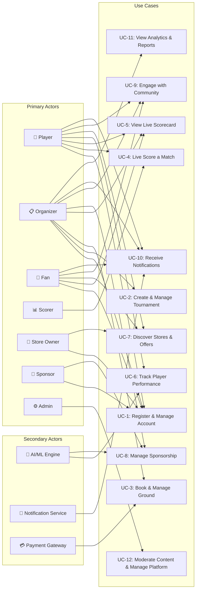

# Actors & Use Cases — CricZone: Local Cricket Community Platform

## Actors

### Primary Actors
1. **Player:** Registered cricket player who participates in matches and tournaments, tracks personal statistics, views performance analytics, and engages with the community feed.
2. **Organizer:** Tournament and match organizer who creates tournaments, schedules matches, manages grounds, assigns umpires, and oversees the full event lifecycle.
3. **Fan:** Casual cricket enthusiast who follows live scores, community posts, and player/team profiles without necessarily playing.
4. **Scorer:** Designated individual responsible for entering ball-by-ball scoring data during a live match.
5. **Store Owner:** Local cricket equipment store operator who lists their store, manages their product catalog, and posts in-app offers.
6. **Sponsor:** Brand or business that sponsors local tournaments and teams for visibility and community engagement.
7. **System Administrator:** Platform admin who manages users, content moderation, platform configuration, and feature flags.

### Secondary / Automated Actors
1. **AI/ML Engine:** Generates Player Performance Scores, auto-commentary, offer recommendations, and sponsorship match suggestions.
2. **Notification Service:** Delivers real-time alerts (push, SMS, WhatsApp, email) triggered by match events, tournament updates, and offer expirations.
3. **Payment Gateway:** Handles ground booking fees and any premium in-app transactions (Razorpay / UPI integration).

---

## Use Case Diagram

```mermaid
graph LR
    subgraph Primary Actors
        PL["🏏 Player"]
        OR["📋 Organizer"]
        FN["👤 Fan"]
        SC["📊 Scorer"]
        SO["🏪 Store Owner"]
        SP["💼 Sponsor"]
        AD["⚙️ Admin"]
    end

    subgraph Secondary Actors
        AI["🤖 AI/ML Engine"]
        NS["🔔 Notification Service"]
        PG["💳 Payment Gateway"]
    end

    subgraph Use Cases
        UC1["UC-1: Register & Manage Account"]
        UC2["UC-2: Create & Manage Tournament"]
        UC3["UC-3: Book & Manage Ground"]
        UC4["UC-4: Live Score a Match"]
        UC5["UC-5: View Live Scorecard"]
        UC6["UC-6: Track Player Performance"]
        UC7["UC-7: Discover Stores & Offers"]
        UC8["UC-8: Manage Sponsorship"]
        UC9["UC-9: Engage with Community"]
        UC10["UC-10: Receive Notifications"]
        UC11["UC-11: View Analytics & Reports"]
        UC12["UC-12: Moderate Content & Manage Platform"]
    end

    PL --> UC1 & UC4 & UC5 & UC6 & UC7 & UC9 & UC10
    OR --> UC1 & UC2 & UC3 & UC5 & UC8 & UC9 & UC10 & UC11
    FN --> UC1 & UC5 & UC7 & UC9 & UC10
    SC --> UC4
    SO --> UC1 & UC7
    SP --> UC1 & UC8
    AD --> UC12
    AI --> UC6 & UC8
    NS --> UC10
    PG --> UC3
```

---

## Use Cases

### UC-1: Register & Manage Account
- **Actor:** Player / Organizer / Fan / Store Owner / Sponsor
- **Goal:** Create a CricZone account and configure profile.
- **Preconditions:** User has a mobile number or Google/Facebook account.
- **Main Flow:**
    1. User opens the app and taps "Register."
    2. User selects role (Player / Organizer / Fan / Store Owner / Sponsor).
    3. User enters mobile number; system sends OTP.
    4. User verifies OTP and completes profile (name, photo, city, preferred format).
    5. System creates account and grants role-based access.
- **Alternate Flow (Social Login):**
    1. User taps "Sign in with Google."
    2. System auto-provisions account with Google profile data.
    3. User selects role and completes cricket-specific profile fields.
- **Alternate Flow (KYC for Store Owner / Sponsor):**
    1. User submits Aadhaar/PAN details for verification.
    2. System validates and activates the business profile.

---

### UC-2: Create & Manage Tournament
- **Actor:** Organizer
- **Goal:** Set up a cricket tournament with teams, matches, and schedules.
- **Preconditions:** Organizer is authenticated with Organizer role.
- **Main Flow:**
    1. Organizer taps "Create Tournament" and enters name, format (T20/ODI/Box Cricket), start date, number of teams.
    2. Organizer sets registration deadline for teams.
    3. Organizer shares tournament registration link with teams.
    4. Teams register and submit squad (players).
    5. Organizer reviews registrations and confirms participating teams.
    6. Organizer uses "Auto-Schedule" or manually creates match fixtures.
    7. Organizer assigns grounds and umpires to each match.
    8. System publishes the fixture list to all registered players and fans.
    9. Organizer updates results and points table progresses automatically.
- **Alternate Flow (Tournament Clone):**
    1. Organizer selects "Clone Previous Tournament."
    2. System pre-fills all settings from the earlier tournament.
    3. Organizer adjusts dates and confirms.

---

### UC-3: Book & Manage Ground
- **Actor:** Organizer / Player
- **Goal:** Reserve a cricket ground for a specific date and time slot.
- **Preconditions:** Ground is listed on the platform with availability calendar.
- **Main Flow:**
    1. User searches for grounds by city/area using map or list view.
    2. User selects a ground, views profile (photos, pitch type, amenities, pricing).
    3. User selects date and time slot from the availability calendar.
    4. System checks slot availability and presents booking summary.
    5. User confirms and pays via UPI / Razorpay.
    6. System sends booking confirmation with QR code.
    7. Ground owner is notified of the confirmed booking.
- **Alternate Flow (Slot Unavailable):**
    1. Selected slot is already booked.
    2. System suggests the next 3 available slots.

---

### UC-4: Live Score a Match
- **Actor:** Scorer
- **Goal:** Enter ball-by-ball scoring data during a live match.
- **Preconditions:** Match exists in the system, Scorer is assigned to the match by the Organizer.
- **Main Flow:**
    1. Scorer opens the match in the app and taps "Start Scoring."
    2. System displays the scoring interface with batting team, bowler, and over count.
    3. Scorer taps the outcome for each ball: runs (0–6), wicket type, extras (wide, no-ball, bye, leg-bye).
    4. System updates live scorecard in real-time (< 3 seconds propagation).
    5. System auto-generates commentary: "Rohit hits a six off the last ball of the over — 58 runs needed off 30!" 
    6. At end of innings, Scorer confirms and system calculates the target.
    7. At match end, Scorer confirms result; system locks scorecard and updates player stats.
- **Alternate Flow (Correction):**
    1. Scorer notices an entry error.
    2. Scorer taps "Undo Last Ball" (up to 5 balls allowed before Organizer confirmation).

---

### UC-5: View Live Scorecard
- **Actor:** Player / Fan / Organizer
- **Goal:** Follow the match in real-time via the live scorecard.
- **Preconditions:** A match is in progress and Scorer has started scoring.
- **Main Flow:**
    1. User opens "Live Matches" from the home screen.
    2. System shows all ongoing matches with current score snippets.
    3. User taps a match to open the live scorecard.
    4. System renders: batting team score, current over, last ball commentary, batting partnerships, bowling figures, fall of wickets.
    5. Scorecard updates are pushed via WebSocket with < 3-second latency.
    6. User can tap a player name to view their in-match stats and career statistics inline.
- **Alternate Flow (Match Ends):**
    1. Match is completed; scorecard transitions to final result view.
    2. System publishes match highlights post to the community feed automatically.

---

### UC-6: Track Player Performance
- **Actor:** Player / Organizer / Fan / AI Engine
- **Goal:** View and analyze a player's cricket statistics across matches and tournaments.
- **Preconditions:** Player has participated in at least one scored match.
- **Main Flow:**
    1. User navigates to a player's profile.
    2. System displays Player Performance Score (PPS: 0–100), calculated by AI Engine.
    3. User views batting, bowling, and fielding stats with filters (All Time / Tournament / Last 10 matches).
    4. System renders form charts: runs trend, strike rate progression.
    5. AI generates insights: "Arjun's strike rate drops by 18% against left-arm spinners — possible weakness."
    6. User taps "Compare" to run head-to-head comparison with another player.
    7. User taps "Share" to generate and share a stat card image.
- **Alternate Flow (Head-to-Head):**
    1. User searches for a second player.
    2. System renders a split-screen comparison of key stats.

---

### UC-7: Discover Stores & Offers
- **Actor:** Player / Fan / Store Owner
- **Goal:** Find nearby cricket equipment stores and avail exclusive offers.
- **Preconditions:** User has granted location permission.
- **Main Flow (Discovery):**
    1. User taps "Stores" from the home screen.
    2. System shows a map with nearby cricket stores within 10 km.
    3. User taps a store pin to view profile: name, products, rating, address, phone, opening hours.
    4. User views active offers listed under the store: "20% off on Kookaburra bats this week."
    5. User taps "Redeem Offer" to generate a QR code.
    6. Store owner scans QR code at the counter to validate the offer.
- **Main Flow (Store Owner — Posting Offers):**
    1. Store Owner logs in and navigates to "My Store > Offers."
    2. Store Owner creates an offer: title, discount %, product, validity, maximum redemptions.
    3. System publishes offer and pushes notification to followers of the store.

---

### UC-8: Manage Sponsorship
- **Actor:** Organizer / Sponsor / AI Engine
- **Goal:** Connect sponsors with local cricket tournaments for mutual visibility.
- **Preconditions:** Organizer has a published tournament; Sponsor has a verified business profile.
- **Main Flow (Organizer Seeks Sponsor):**
    1. Organizer navigates to "Sponsorship" from the tournament management screen.
    2. Organizer sets sponsorship requirements: expected reach, tiers available (Title/Co-Sponsor/Associate), visibility benefits.
    3. AI Engine matches the tournament with relevant sponsors based on location, sport type, and audience demographics.
    4. System notifies matched sponsors with a sponsorship proposal.
- **Main Flow (Sponsor Accepts):**
    1. Sponsor reviews the proposal: tournament details, expected viewers, branding benefits.
    2. Sponsor accepts; system auto-generates a digital sponsorship agreement.
    3. Sponsor logos are displayed on: live scorecards, match banners, community posts, and digital jerseys.
    4. Sponsor views real-time ROI dashboard: match views, offer redemptions, fan reach.
- **Alternate Flow (No Match Found):**
    1. AI Engine finds no matching sponsors in the area.
    2. System suggests posting the requirement in the public Sponsorship Marketplace.

---

### UC-9: Engage with Community
- **Actor:** Player / Organizer / Fan
- **Goal:** Participate in the CricZone community through posts, discussions, and polls.
- **Main Flow:**
    1. User opens the Community Feed.
    2. System shows a personalized feed: match highlights, player achievements, followed team updates, and trending posts.
    3. User creates a post: text, photo, or a 60-second video clip.
    4. User can react (like, applaud), comment, and share posts.
    5. User participates in a fan poll: "Who will win the Metro Championship final?"
    6. Post-match, system auto-posts a match summary card; users comment and discuss.
- **Alternate Flow (Leaderboard):**
    1. User taps "Tournament Leaderboard."
    2. System shows top scorers, top wicket-takers, and most catches ranked within a tournament.

---

### UC-10: Receive Notifications
- **Actor:** Player / Organizer / Fan / Store Owner / Sponsor
- **Goal:** Get timely real-time alerts for events relevant to the user.
- **Preconditions:** User has configured notification preferences.
- **Main Flow:**
    1. A trigger event occurs: wicket, match start, tournament fixture published, new offer, sponsorship interest.
    2. Notification Service evaluates the event and the user's subscription preferences.
    3. System delivers via the configured channel (Push > WhatsApp > SMS).
    4. User taps notification to deep-link into the relevant match, tournament, or offer screen.
- **Alternate Flow (Bulk Notifications):**
    1. Major local final is live; system sends a "Go Live" push to all fans who follow either team.

---

### UC-11: View Analytics & Reports
- **Actor:** Organizer / Sponsor / Media
- **Goal:** Access structured match and tournament statistics for reporting and analysis.
- **Main Flow:**
    1. Organizer opens the analytics section of a completed tournament.
    2. System displays: top performers, team statistics, match results table, average runs per over.
    3. Organizer exports a PDF tournament report for distribution to players and sponsors.
    4. Sports media accesses the public statistics API (JSON) for their match coverage.

---

### UC-12: Moderate Content & Manage Platform
- **Actor:** System Administrator
- **Goal:** Ensure platform health, safety, and correct operation.
- **Main Flow:**
    1. Admin reviews flagged posts or user-reported content.
    2. Admin takes action: remove post, warn user, or ban account.
    3. Admin adjusts feature flags for a new city rollout (e.g., enable "Store Locator" in Pune).
    4. Admin pushes a system announcement: "CricZone is live in Chennai!"
    5. Admin monitors platform health dashboard: active users, live matches, error rates.
