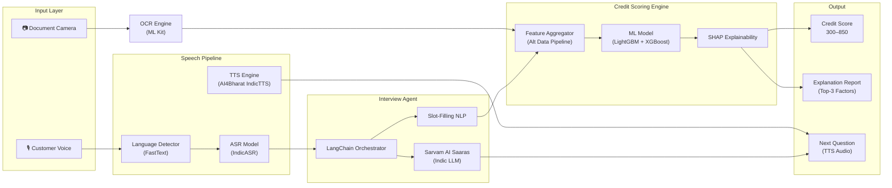
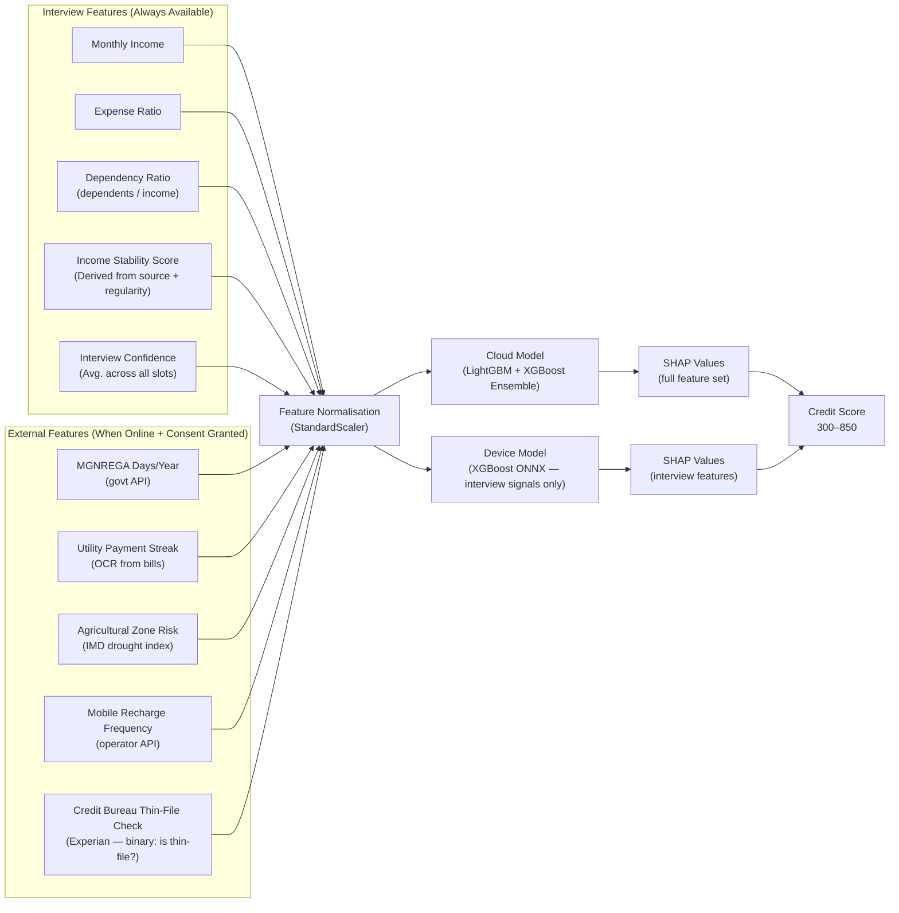

# Mitra Finance — AI Agents & GenAI Design

> **⚠️ Core Requirements**: REQ-3 (Voice Interview), REQ-4 (Alt Credit Scoring), REQ-6 (Multi-Lingual)

## Table of Contents
1. [AI System Overview](#ai-system-overview)
2. [Speech Pipeline — ASR & TTS](#speech-pipeline--asr--tts)
3. [GenAI Credit Interview Agent](#genai-credit-interview-agent)
4. [Alternative Credit Scoring Engine](#alternative-credit-scoring-engine)
5. [LangChain Orchestration](#langchain-orchestration)
6. [On-Device vs. Cloud Inference](#on-device-vs-cloud-inference)
7. [Model Governance & Retraining](#model-governance--retraining)
8. [Bias Detection & Fairness](#bias-detection--fairness)

---

## AI System Overview

Mitra Finance uses **four AI subsystems** working in concert:



---

## Speech Pipeline — ASR & TTS

### Automatic Speech Recognition (ASR)

| Mode | Model | Dialects | Latency | Accuracy (WER) |
|------|-------|---------|---------|----------------|
| **Online (Cloud)** | AI4Bharat IndicASR Full | 22 Indian languages | < 2s | 8–12% WER |
| **Offline (Device)** | IndicASR ONNX INT4 (45MB) | 12 dialects | < 4s | 14–18% WER |

**Dialect Routing Logic**:
```python
# FastText language ID model (1MB, on-device)
dialect, confidence = langid_model.predict(first_utterance)
if confidence < 0.70:
    # Ask Mitra to confirm dialect
    prompt_mitra_dialect_confirm()
else:
    route_to_asr(dialect)
```

**Audio Input Processing**:
- Sample rate: 16kHz mono
- Chunk size: 3-second sliding window with 500ms overlap
- Noise reduction: RNNoise (WebRTC noise suppressor, on-device, 1.4MB ONNX)
- VAD (Voice Activity Detection): Silero VAD (2MB ONNX) — cuts silence, reduces ASR cost

### Text-to-Speech (TTS)

| Component | Model | Languages | Size |
|-----------|-------|-----------|------|
| **Primary** | AI4Bharat Indic TTS (ONNX) | 22 Indian languages | 35MB per language |
| **Pre-generated clips** | Static audio via CDN | 12 standard questions | ~400KB total |

**Optimization**: Standard interview questions are pre-generated and cached on CDN. Only custom follow-up questions require real-time TTS inference.

---

## GenAI Credit Interview Agent

### Interview Schema
The agent collects **8–12 structured data points** through conversational turns:

| Slot | Question (Hindi) | Validation |
|------|-----------------|-----------|
| `monthly_income` | आपकी मासिक आमदनी क्या है? | > 0; anomaly if > ₹1L for rural agricultural |
| `income_sources` | आमदनी का मुख्य जरिया क्या है? | Enum: AGRICULTURE, ANIMAL_HUSBANDRY, WAGE_LABOR, SHOP, REMITTANCE |
| `monthly_expenses` | महीने का खर्चा कितना होता है? | > 0; flag if > income |
| `num_dependents` | आपके परिवार में कितने लोग हैं? | Integer 1–15 |
| `land_ownership` | क्या आपके पास जमीन है? | Boolean + optional acres |
| `livestock_count` | क्या आपके पास जानवर हैं? | Integer; implicit asset signal |
| `existing_loans` | क्या आपने पहले कभी लोन लिया है? | Boolean; if yes → amount, source |
| `loan_purpose` | यह पैसा किस काम के लिए चाहिए? | Open text → classified into enum |

### Agent Orchestration (LangChain)

```python
# Simplified LangChain agent loop
agent = CreditInterviewAgent(
    tools=[ASRTranscribeTool, SlotFillingTool, TTSTool],
    memory=ConversationBufferMemory(max_turns=15),
    llm=SarvamSaarasLLM(dialect="bhojpuri"),
    interview_schema=CREDIT_INTERVIEW_SCHEMA,
    max_turns=12
)

async def run_interview(session_id: str):
    while not agent.all_slots_filled() and agent.turn_count < MAX_TURNS:
        audio = await record_audio(duration=10)
        transcription = await agent.tools.asr.run(audio)
        extracted = await agent.tools.slot_filler.run(transcription)
        agent.update_slots(extracted)
        next_question = await agent.llm.next_question(
            filled_slots=agent.slots,
            conversation_history=agent.memory
        )
        await agent.tools.tts.speak(next_question)
    return agent.get_structured_output()
```

### Confidence Scoring
Each slot has an associated confidence score (0.0–1.0):
- **≥ 0.85**: Auto-accepted, displayed green to Mitra
- **0.60–0.84**: Yellow highlight — Mitra prompted to verify
- **< 0.60**: Red — Mitra must manually enter value; AI value discarded

### Hallucination Guards
1. **Schema Validation**: All extracted values validated against expected types and ranges
2. **Sanity Checks**: Monthly income < ₹1L for agricultural workers (else flag for review)
3. **Contradiction Detection**: If `existing_loans=true` but `loan_amount=0` → re-ask
4. **Confidence Threshold**: Low-confidence fields never auto-submitted

---

## Alternative Credit Scoring Engine

### Feature Pipeline



### Score Calculation
```
Score = 300 + 550 × sigmoid(model_raw_output)
```
- Raw model output ranges: −∞ to +∞
- Sigmoid maps to 0–1
- Final score: 300 (worst) to 850 (best), matching credit bureau convention

### Risk Band Mapping
| Score Range | Risk Band | Auto-Approval? | Max Auto-Approve Amount |
|-------------|-----------|---------------|------------------------|
| 700–850 | LOW | Yes | ₹25,000 |
| 550–699 | MEDIUM | No → L1 Review | ₹2,00,000 (officer decision) |
| 300–549 | HIGH | No → L2 Review | ₹2,00,000 (RM decision) |

### External Data Sources
| Source | API | Consent Required | Fallback |
|--------|-----|-----------------|---------|
| MGNREGA | ministry.gov.in/mgnrega-api | Yes (MGNREGA_DATA) | Feature set to 0 (neutral) |
| Agricultural Zone / IMD | data.imd.gov.in | No (public data) | Last 5-year avg. used |
| Mobile Recharge | Telco API (partner) | Yes (TELECOM_DATA) | Feature excluded |
| Utility Bills | OCR from document | Yes (UTILITY_DATA) | Feature excluded |
| Experian Thin-File | Experian API | Yes (CREDIT_BUREAU) | Feature excluded |

---

## LangChain Orchestration

### Agent Architecture
```
CreditInterviewAgent
├── LLM: SarvamSaarasLLM (cloud) / Phi2OnnxLLM (device fallback)
├── Memory: ConversationBufferMemory (max 15 turns, 4K tokens)
├── Tools:
│   ├── ASRTranscribeTool → IndicASR API / ONNX
│   ├── TTSTool → IndicTTS API / ONNX
│   ├── SlotFillingTool → Custom NER pipeline
│   └── SanityCheckTool → Schema validation + contradiction detection
└── Output Parser: StructuredOutputParser(InterviewSchema)
```

### Prompt Engineering (System Prompt)
```
You are a friendly rural credit counselor for Mitra Finance.
Your role: Conduct a warm, conversational income verification in {dialect}.
Language: Always speak in {dialect}. Use simple words. Avoid financial jargon.
Goal: Fill all required slots: [monthly_income, income_sources, monthly_expenses, ...]
Rules:
- If answer is unclear, rephrase question differently (max 2 attempts per slot)
- Never make the customer feel evaluated or judged
- If customer expresses distress, acknowledge and simplify
- Do NOT ask more than 2 questions per turn
- Complete interview in < 12 turns total
Filled slots so far: {filled_slots_json}
```

---

## On-Device vs. Cloud Inference

| Decision | On-Device | Cloud |
|----------|-----------|-------|
| **When used** | Network unavailable | Network available |
| **Models** | IndicASR ONNX INT4, Phi-2 ONNX, XGBoost ONNX | IndicASR Full, Sarvam Saaras, LightGBM Ensemble |
| **Score quality** | ~78% AUC (interview signals only) | ~86% AUC (full feature vector) |
| **Latency** | ASR: 4s, Scoring: 2s | ASR: 1.5s, Scoring: 8s |
| **Data sent to cloud** | Nothing (fully local) | Audio (transcription only), structured interview data |
| **Post-sync behaviour** | Server re-scores with full features; score updated in DB | — |

### Re-Scoring on Sync
When an offline-scored application syncs:
1. Server runs full cloud scoring with all external signals
2. If new score differs by > 50 points, **Credit Officer notified** of score change
3. New score replaces offline score; old score archived with `is_offline_score=true`

---

## Model Governance & Retraining

### Retraining Schedule
| Model | Trigger | Frequency | Dataset |
|-------|---------|-----------|---------|
| Credit Scoring (LightGBM) | Quarterly or AUC drops > 3% | Q1/Q2/Q3/Q4 | Repayment outcomes (12-month lag) |
| ASR (IndicASR) | WER increases > 5% vs. baseline | Semi-annually | Collected audio + transcriptions (with consent) |
| Dialect Detector (FastText) | New dialect added | On-demand | Labeled audio samples |

### Model Versioning
- All models stored in S3 with semantic versioning (e.g., `lgbm-v2.1-2026Q1`)
- `ml_model_registry` table tracks: version, AUC, training dataset hash, deploy date
- Only one model per type marked `is_active=TRUE` at any time
- **Canary deployment**: New model version tested on 5% of traffic for 2 weeks before full promotion

### Model Audit Trail
Every scoring decision records:
```json
{
  "creditScoreId": "score-uuid",
  "modelId": "ml-model-uuid",
  "modelVersion": "lgbm-v2.1-2026Q1",
  "inputFeatureHash": "sha256-of-input-vector",
  "calculatedAt": "2026-02-20T11:50:00Z"
}
```
This enables **full reproducibility**: any credit decision can be replayed with the exact same model version and input.

---

## Bias Detection & Fairness

### Protected Attributes
The credit scoring model is **explicitly prohibited** from using:
- Gender (not collected)
- Religion (not collected)
- Caste (not collected)
- Geographic district as a primary feature (only drought index)

### Quarterly Bias Audit
1. Run scoring model on stratified test set (gender-balanced, geography-balanced)
2. Check **Disparate Impact Ratio**: approval rate for any subgroup / overall approval rate must be ≥ 0.80
3. Check **Equal Opportunity**: True positive rate (correctly approved creditworthy applicants) must be within 5% across subgroups
4. Any detected bias → model freeze → ML team investigation → retraining with fairness constraints

### Human-in-the-Loop Override
- All HIGH-risk band decisions require human review (no auto-reject)
- Credit Officers can override AI recommendation with mandatory reason code
- Officer overrides are tracked; high override rate triggers model audit

---

**Last Updated**: February 2026
**Version**: 1.0
**Status**: Design Complete
