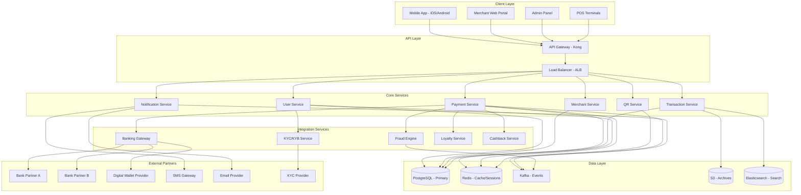
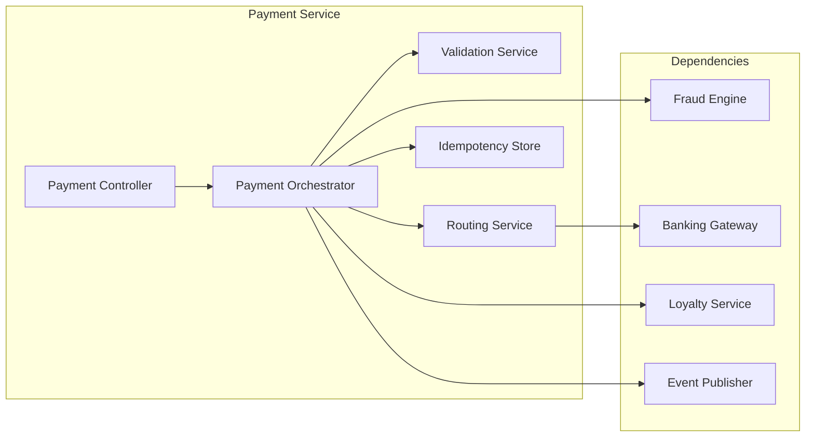
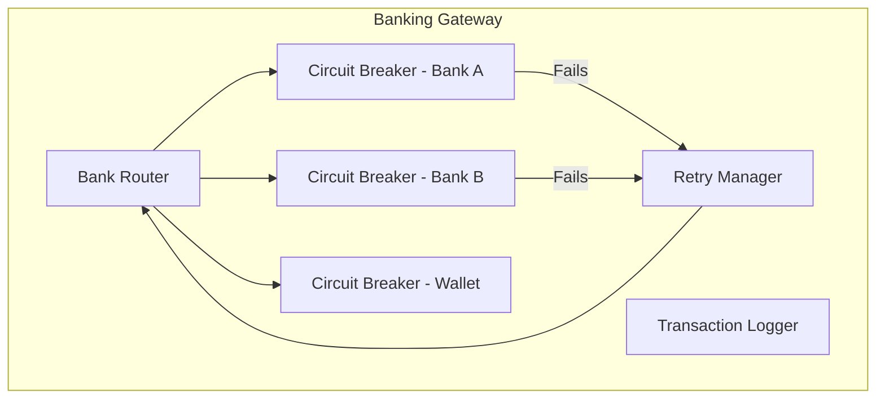
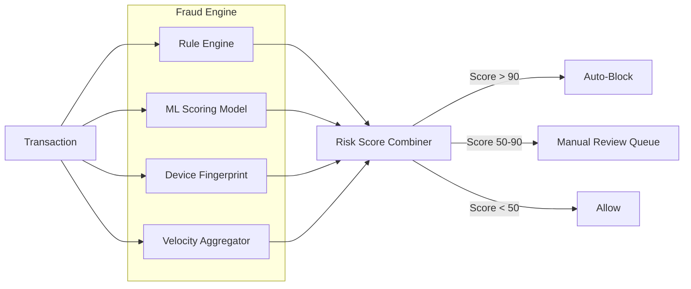

# PayFlow - Architecture

> **⚠️ Core Requirements**: Architecture decisions are driven by [KEY_REQUIREMENTS.md](./KEY_REQUIREMENTS.md).

## Table of Contents
1. [Overview](#overview)
2. [High-Level Architecture](#high-level-architecture)
3. [Low-Level Design](#low-level-design)
4. [Technology Stack](#technology-stack)
5. [Design Patterns](#design-patterns)
6. [Security Architecture](#security-architecture)
7. [Scalability & Performance](#scalability--performance)
8. [Monitoring & Observability](#monitoring--observability)

---

## Overview

PayFlow uses a **cloud-native, event-driven microservices architecture** optimized for:
- **Low Latency**: Sub-3-second payment processing
- **High Availability**: 99.99% uptime target
- **Security First**: PCI-DSS Level 1 compliance
- **Cost Efficiency**: Serverless for non-critical paths

---

## High-Level Architecture



---

## Low-Level Design

### Payment Service (Core)

The Payment Service is the most critical component. It orchestrates the entire payment lifecycle.



**Payment Processing Pipeline**:
1. **Idempotency Check** → Verify request not already processed (Redis lookup by client-generated key)
2. **Validation** → Amount > 0, sender ≠ recipient, IBAN valid, account active
3. **Fraud Scoring** → Real-time risk assessment (< 200ms)
4. **Route Selection** → Choose optimal bank partner based on success rates and fees
5. **Authorization** → Debit sender via banking API
6. **Credit** → Credit recipient via banking API (or internal ledger for P2P)
7. **Event Publication** → `PaymentCompleted` event → Kafka
8. **Response** → Return transaction ID and status

### Banking Gateway (Integration Hub)



**Key Design Decisions**:
- **Circuit Breaker per Bank**: If Bank A is down, route to Bank B automatically
- **Retry with Exponential Backoff**: For transient failures (network timeouts)
- **Idempotent Bank Calls**: Every bank request includes a unique reference to prevent double processing

### Fraud Detection Engine



---

## Technology Stack

### Application Layer
| Component | Technology | Rationale |
|-----------|-----------|-----------|
| Mobile App | React Native | Cross-platform; single codebase for iOS & Android |
| Merchant Portal | React.js | Rich dashboard with real-time updates |
| Admin Panel | React.js + Ant Design | Feature-rich admin components |
| API Gateway | Kong | Rate limiting, auth, routing, observability |

### Backend Services
| Component | Technology | Rationale |
|-----------|-----------|-----------|
| Core Services | Go (Golang) | High performance, low latency, strong concurrency |
| BFF (Backend-for-Frontend) | Node.js | Flexible API aggregation for mobile clients |
| Fraud ML Model | Python (FastAPI) | ML ecosystem (scikit-learn, XGBoost) |
| QR Generation | Node.js | Lightweight, fast QR encoding/decoding |

### Data Layer
| Component | Technology | Rationale |
|-----------|-----------|-----------|
| Primary Database | PostgreSQL 15 | ACID, strong consistency, mature |
| Cache & Sessions | Redis Cluster | Sub-ms latency, pub/sub, rate limiting |
| Event Streaming | Apache Kafka | Durable, ordered event backbone |
| Search | Elasticsearch | Full-text search for transactions |
| Archive Storage | AWS S3 + Parquet | Cost-effective long-term storage |
| Query on Archive | AWS Athena / Trino | Serverless SQL on S3 archives |

### Infrastructure
| Component | Technology | Rationale |
|-----------|-----------|-----------|
| Container Orchestration | Kubernetes (EKS) | Auto-scaling, self-healing |
| CI/CD | GitHub Actions + ArgoCD | GitOps deployment |
| Secrets Management | HashiCorp Vault | Secure API keys, DB credentials |
| CDN | CloudFront | Static assets, QR images |
| Monitoring | Prometheus + Grafana | Metrics and alerting |
| Logging | ELK Stack | Centralized log aggregation |
| Tracing | Jaeger / OpenTelemetry | Distributed tracing |

---

## Design Patterns

### 1. API Gateway Pattern
- **Usage**: Kong as single entry point for all clients
- **Benefits**: Centralized auth, rate limiting, request routing, API versioning
- **Implementation**: Kong with custom plugins for JWT validation and fraud header injection

### 2. Saga Pattern (Choreography-based)
- **Usage**: Payment transaction orchestration across services
- **Benefits**: Manages distributed transactions without 2PC; each service listens for events and reacts
- **Implementation**:
  ```
  PaymentInitiated → FraudChecked → BankDebited → RecipientCredited → NotificationSent
       ↓ (if fails)         ↓ (if fails)        ↓ (if fails)
  PaymentFailed       PaymentRejected      RefundInitiated
  ```

### 3. Circuit Breaker Pattern
- **Usage**: Banking partner API calls
- **Benefits**: Prevents cascading failures when a bank partner is down
- **Implementation**: Resilience4j with states: CLOSED → OPEN → HALF_OPEN
- **Thresholds**: Open after 5 failures in 30 seconds; half-open after 60 seconds

### 4. CQRS (Command Query Responsibility Segregation)
- **Usage**: Transaction history reads vs. payment writes
- **Benefits**: Optimized read models for fast history retrieval; write model optimized for consistency
- **Implementation**: Writes go to PostgreSQL; reads served from Elasticsearch (synced via Kafka CDC)

### 5. Event Sourcing
- **Usage**: Payment audit trail
- **Benefits**: Complete, immutable history of every payment state transition
- **Implementation**: `payment_events` table stores every event; current state is derived from event replay

### 6. Strategy Pattern
- **Usage**: Bank routing selection
- **Benefits**: Swap routing algorithms (cheapest, fastest, round-robin) without code changes
- **Implementation**: `BankRouterStrategy` interface with `CheapestRouteStrategy`, `FastestRouteStrategy`

### 7. Observer Pattern
- **Usage**: Notification dispatch after payment events
- **Benefits**: Decoupled notification logic from payment processing
- **Implementation**: Kafka consumers as observers; each notification channel is a separate consumer group

### 8. Factory Pattern
- **Usage**: QR code generation (Static vs. Dynamic)
- **Benefits**: Uniform interface for different QR types
- **Implementation**: `QRCodeFactory.create(type, data)` → `StaticQR` or `DynamicQR`

### 9. Adapter Pattern
- **Usage**: Banking partner integration
- **Benefits**: Normalize different bank API formats into a unified internal interface
- **Implementation**: `BankAdapter` interface with `BankAAdapter`, `BankBAdapter`, `WalletAdapter`

### 10. Rate Limiter Pattern
- **Usage**: API Gateway and per-user transaction limits
- **Benefits**: Prevent abuse, DDoS protection, and regulatory compliance
- **Implementation**: Token Bucket algorithm in Redis; tiered limits based on KYC level

---

## Security Architecture

### Authentication & Authorization
- **OAuth 2.0 + PKCE** for mobile app authentication
- **JWT tokens** with short-lived access tokens (15 min) and refresh tokens (7 days)
- **RBAC**: Role-based access control (Customer, Merchant, Admin, SuperAdmin)
- **Biometric/PIN** confirmation for all payment actions

### Data Protection
- **Encryption at Rest**: AES-256 for all PII and financial data
- **Encryption in Transit**: TLS 1.3 for all API communication
- **Tokenization**: Card numbers and IBANs stored as tokens; actual values in HSM
- **Data Masking**: Transaction logs show masked IBANs (`SA****1234`)

### PCI-DSS Compliance
- **Network Segmentation**: Payment processing in isolated VPC subnet
- **Key Management**: HSM-backed key rotation every 90 days
- **Penetration Testing**: Quarterly by certified assessor
- **Access Logging**: All database queries logged and monitored

---

## Scalability & Performance

### Horizontal Scaling
- **Kubernetes HPA**: Auto-scale pods based on CPU/memory and custom metrics (RPS)
- **Database**: Read replicas for reporting queries; connection pooling via PgBouncer
- **Kafka**: Partition per payment type for parallel processing

### Caching Strategy
- **L1**: In-memory cache (Go sync.Map) for frequently accessed configs
- **L2**: Redis for session tokens, user preferences, QR codes, rate limits
- **L3**: CDN (CloudFront) for static QR images and app assets

### Performance Targets
| Operation | Target | Strategy |
|-----------|--------|----------|
| Payment Processing | < 3s e2e | Pre-validated cache; async notifications |
| QR Scan → Payment Screen | < 2s | Deep link + cached recipient data |
| Transaction History (100) | < 1s | Elasticsearch + Redis cache |
| API Response (p95) | < 200ms | Go services + connection pooling |

---

## Monitoring & Observability

### The Three Pillars

1. **Metrics** (Prometheus + Grafana)
   - Payment success/failure rates
   - Latency percentiles (p50, p95, p99)
   - Bank partner health per circuit breaker
   - Fraud detection rates and false positives

2. **Logs** (ELK Stack)
   - Structured JSON logs from all services
   - Correlation IDs for request tracing
   - PII redaction in logs

3. **Traces** (Jaeger / OpenTelemetry)
   - End-to-end payment flow tracing
   - Inter-service latency breakdown
   - Bank API call duration

### Alerting Rules
| Alert | Condition | Action |
|-------|-----------|--------|
| Payment Failure Spike | Error rate > 5% for 5 min | Page on-call engineer |
| Bank Partner Down | Circuit breaker OPEN | Route traffic to backup bank |
| Fraud Score Anomaly | Avg risk > 70 for 10 min | Alert fraud team |
| API Latency | p95 > 500ms for 5 min | Scale up pods; investigate |

---

**Last Updated**: February 2026
**Version**: 1.0
**Status**: Design Complete
