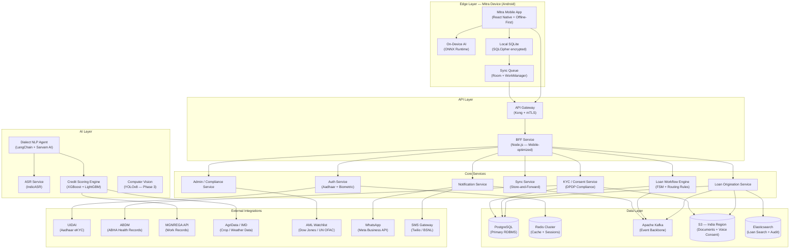
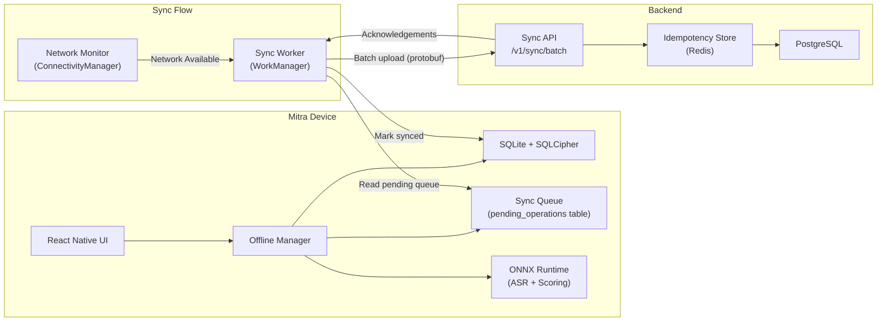
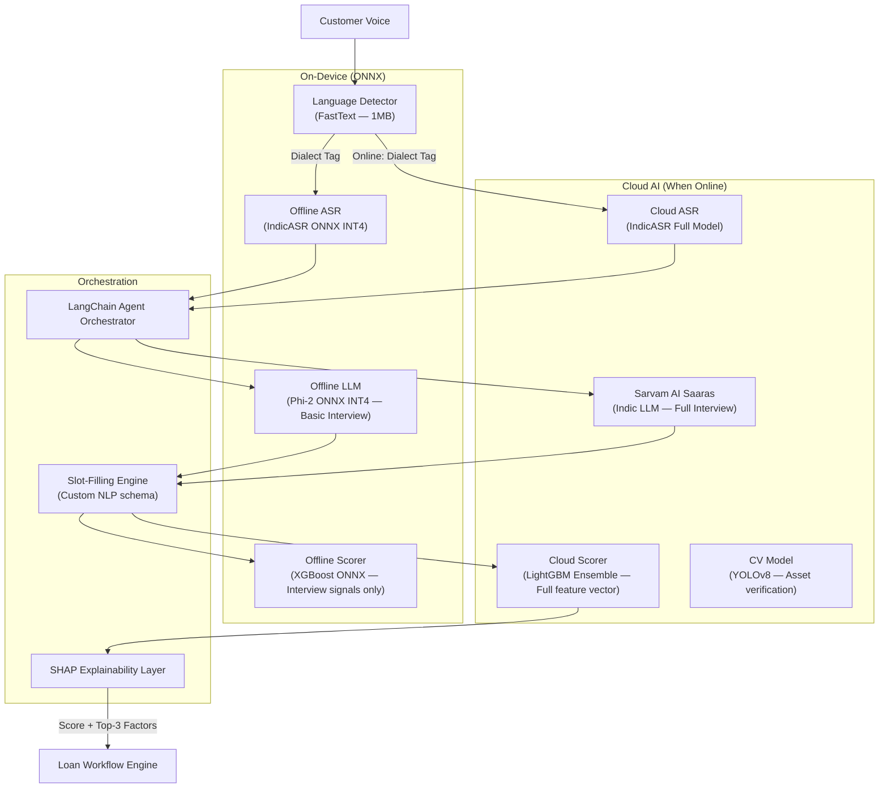
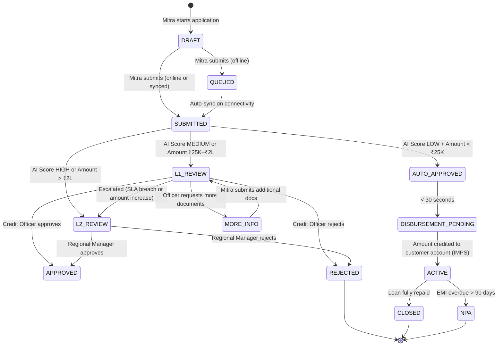

# Mitra Finance — Architecture

> **⚠️ Core Requirements**: Architecture decisions driven by [KEY_REQUIREMENTS.md](./KEY_REQUIREMENTS.md). Offline-first and AI capabilities are first-class concerns.

## Table of Contents
1. [Overview](#overview)
2. [High-Level Architecture](#high-level-architecture)
3. [Offline-First Architecture](#offline-first-architecture)
4. [AI Components Architecture](#ai-components-architecture)
5. [Loan Workflow Engine](#loan-workflow-engine)
6. [Technology Stack](#technology-stack)
7. [Design Patterns](#design-patterns)
8. [Security Architecture](#security-architecture)
9. [Scalability & Performance](#scalability--performance)
10. [Monitoring & Observability](#monitoring--observability)

---

## Overview

Mitra Finance is a **voice-first, offline-capable, AI-assisted rural lending platform** with three architectural pillars:

1. **Offline-First Edge Layer**: Android app with full SQLite-backed local state, on-device AI models, and Store-and-Forward sync queue
2. **Cloud-Native Backend**: Event-driven microservices on Kubernetes with domain-separated services and a Kafka backbone
3. **AI / GenAI Layer**: Multi-modal AI pipeline — ASR → Dialect NLP → LLM Interview → Alt Credit Scoring

---

## High-Level Architecture


```mermaid
graph TB
    subgraph "Edge Layer — Mitra Device (Android)"
        APP["Mitra Mobile App<br/>(React Native + Offline-First)"]
        ONX["On-Device AI<br/>(ONNX Runtime)"]
        SQLT["Local SQLite<br/>(SQLCipher encrypted)"]
        SQ["Sync Queue<br/>(Room + WorkManager)"]
    end

    subgraph "API Layer"
        GW["API Gateway<br/>(Kong + mTLS)"]
        BFF["BFF Service<br/>(Node.js — Mobile-optimized)"]
    end

    subgraph "Core Services"
        AUTH["Auth Service<br/>(Aadhaar + Biometric)"]
        KYC["KYC / Consent Service<br/>(DPDP Compliance)"]
        LOAN["Loan Origination Service"]
        SYNC["Sync Service<br/>(Store-and-Forward)"]
        WORKFLOW["Loan Workflow Engine<br/>(FSM + Routing Rules)"]
        NOTIFY["Notification Service"]
        ADMIN["Admin / Compliance Service"]
    end

    subgraph "AI Layer"
        ASR["ASR Service<br/>(IndicASR)"]
        NLP["Dialect NLP Agent<br/>(LangChain + Sarvam AI)"]
        SCORE["Credit Scoring Engine<br/>(XGBoost + LightGBM)"]
        CV["Computer Vision<br/>(YOLOv8 — Phase 3)"]
    end

    subgraph "Data Layer"
        PG[("PostgreSQL<br/>(Primary RDBMS)")]
        RD[("Redis Cluster<br/>(Cache + Sessions)")]
        KF["Apache Kafka<br/>(Event Backbone)"]
        S3[("S3 — India Region<br/>(Documents + Voice Consent)")]
        ES[("Elasticsearch<br/>(Loan Search + Audit)")]
    end

    subgraph "External Integrations"
        UIDAI["UIDAI<br/>(Aadhaar eKYC)"]
        ABHA["ABDM<br/>(ABHA Health Records)"]
        MGNA["MGNREGA API<br/>(Work Records)"]
        AGRI["AgriData / IMD<br/>(Crop / Weather Data)"]
        AML["AML Watchlist<br/>(Dow Jones / UN OFAC)"]
        WA["WhatsApp<br/>(Meta Business API)"]
        SMS["SMS Gateway<br/>(Twilio / BSNL)"]
    end

    APP --> GW
    APP --> ONX
    APP --> SQLT
    SQLT --> SQ
    SQ --> GW

    GW --> BFF
    BFF --> AUTH
    BFF --> KYC
    BFF --> LOAN
    BFF --> SYNC
    BFF --> WORKFLOW
    BFF --> NOTIFY
    BFF --> ADMIN

    AUTH --> UIDAI
    KYC --> ABHA
    SCORE --> MGNA
    SCORE --> AGRI

    LOAN --> KF
    WORKFLOW --> KF
    NOTIFY --> KF

    NOTIFY --> WA
    NOTIFY --> SMS
    ADMIN --> AML

    LOAN --> PG
    KYC --> PG
    WORKFLOW --> PG
    AUTH --> RD
    LOAN --> S3
    KYC --> S3
    LOAN --> ES

    NLP --> ASR
    NLP --> SCORE
```

---

## Offline-First Architecture

This is the most critical architectural distinction. The Mitra device is the **system of record** when offline, and the cloud is the **system of truth** when synced.


```mermaid
graph LR
    subgraph "Mitra Device"
        UI["React Native UI"]
        OM["Offline Manager"]
        SQLT["SQLite + SQLCipher"]
        SQ["Sync Queue<br/>(pending_operations table)"]
        ONNX["ONNX Runtime<br/>(ASR + Scoring)"]
    end

    subgraph "Sync Flow"
        NM["Network Monitor<br/>(ConnectivityManager)"]
        SW["Sync Worker<br/>(WorkManager)"]
    end

    subgraph "Backend"
        SYNC_API["Sync API<br/>/v1/sync/batch"]
        DEDUP["Idempotency Store<br/>(Redis)"]
        DB["PostgreSQL"]
    end

    UI --> OM
    OM --> SQLT
    OM --> SQ
    OM --> ONNX

    NM --> |"Network Available"| SW
    SW --> |"Read pending queue"| SQ
    SW --> |"Batch upload (protobuf)"| SYNC_API
    SYNC_API --> DEDUP
    DEDUP --> DB
    SYNC_API --> |"Acknowledgements"| SW
    SW --> |"Mark synced"| SQLT
```

### Offline Guarantee
| Scenario | Behavior |
|----------|----------|
| No network | 100% functionality via SQLite + on-device AI |
| Intermittent (2G drops) | Operations queued; auto-retry with exponential backoff |
| Long offline (3+ days) | SQLite WAL journal holds up to 50,000 operations |
| Reconnect | WorkManager triggers sync within 60 seconds |
| Device lost | Remote wipe capability; SQLCipher key stored in backend |

---

## AI Components Architecture


```mermaid
graph TB
    subgraph "On-Device (ONNX)"
        LANG["Language Detector<br/>(FastText — 1MB)"]
        ASR_OD["Offline ASR<br/>(IndicASR ONNX INT4)"]
        LLM_OD["Offline LLM<br/>(Phi-2 ONNX INT4 — Basic Interview)"]
        SCORE_OD["Offline Scorer<br/>(XGBoost ONNX — Interview signals only)"]
    end

    subgraph "Cloud AI (When Online)"
        ASR_C["Cloud ASR<br/>(IndicASR Full Model)"]
        SARVAM["Sarvam AI Saaras<br/>(Indic LLM — Full Interview)"]
        SCORE_C["Cloud Scorer<br/>(LightGBM Ensemble — Full feature vector)"]
        CV_C["CV Model<br/>(YOLOv8 — Asset verification)"]
    end

    subgraph "Orchestration"
        ORCH["LangChain Agent Orchestrator"]
        SLOT["Slot-Filling Engine<br/>(Custom NLP schema)"]
        EXPL["SHAP Explainability Layer"]
    end

    MIC["Customer Voice"] --> LANG
    LANG --> |"Dialect Tag"| ASR_OD
    LANG --> |"Online: Dialect Tag"| ASR_C
    ASR_OD --> ORCH
    ASR_C --> ORCH
    ORCH --> SARVAM
    ORCH --> LLM_OD
    SARVAM --> SLOT
    LLM_OD --> SLOT
    SLOT --> SCORE_C
    SLOT --> SCORE_OD
    SCORE_C --> EXPL
    EXPL --> |"Score + Top-3 Factors"| WORKFLOW["Loan Workflow Engine"]
```

### AI Model Registry
| Model | Purpose | Size | Deployment |
|-------|---------|------|-----------|
| FastText LangID | Dialect detection | 1MB | On-device |
| IndicASR (ONNX INT4) | Offline speech transcription | 45MB | On-device |
| IndicASR (Full) | Cloud ASR (12 dialects) | 2.4GB | Cloud GPU |
| Phi-2 (ONNX INT4) | Offline interview conductor | 1.8GB | On-device (high-RAM) |
| Sarvam Saaras | Full Indic LLM interview | 7B params | Cloud GPU |
| XGBoost (ONNX) | Offline credit scoring | 12MB | On-device |
| LightGBM Ensemble | Cloud credit scoring (full features) | 180MB | Cloud CPU |
| YOLOv8 Livestock | Asset verification (Phase 3) | 25MB | On-device |

---

## Loan Workflow Engine


```mermaid
stateDiagram-v2
    [*] --> DRAFT : Mitra starts application

    DRAFT --> SUBMITTED : Mitra submits (online or synced)
    DRAFT --> QUEUED : Mitra submits (offline)

    QUEUED --> SUBMITTED : Auto-sync on connectivity

    SUBMITTED --> AUTO_APPROVED : AI Score LOW + Amount < ₹25K
    SUBMITTED --> L1_REVIEW : AI Score MEDIUM or Amount ₹25K–₹2L
    SUBMITTED --> L2_REVIEW : AI Score HIGH or Amount > ₹2L

    AUTO_APPROVED --> DISBURSEMENT_PENDING : < 30 seconds

    L1_REVIEW --> APPROVED : Credit Officer approves
    L1_REVIEW --> REJECTED : Credit Officer rejects
    L1_REVIEW --> L2_REVIEW : Escalated (SLA breach or amount increase)
    L1_REVIEW --> MORE_INFO : Officer requests more documents

    L2_REVIEW --> APPROVED : Regional Manager approves
    L2_REVIEW --> REJECTED : Regional Manager rejects

    MORE_INFO --> L1_REVIEW : Mitra submits additional docs

    DISBURSEMENT_PENDING --> ACTIVE : Amount credited to customer account (IMPS)

    ACTIVE --> CLOSED : Loan fully repaid
    ACTIVE --> NPA : EMI overdue > 90 days

    REJECTED --> [*]
    CLOSED --> [*]
    NPA --> [*]
```

---

## Technology Stack

### Application Layer
| Component | Technology | Rationale |
|-----------|-----------|-----------|
| Mitra Mobile App | React Native (Expo Bare) | Cross-platform; large community; Expo modules for camera/biometric |
| Credit Officer Web | React.js + Ant Design | Feature-rich admin components; familiar to enterprise users |
| Admin Panel | React.js + Material UI | Rapid development for compliance dashboards |
| API Gateway | Kong (AWS-hosted) | mTLS for Mitra devices; JWT validation; rate limiting |

### Backend Services
| Component | Technology | Rationale |
|-----------|-----------|-----------|
| Core Services | Go (Golang) | High concurrency, low latency; sync service handles 5K+ simultaneous uploads |
| BFF (Mobile-optimized) | Node.js | Graphql + REST aggregation; easier protobuf integration |
| AI Inference (Cloud) | Python (FastAPI) | Best ML ecosystem; LangChain for agent orchestration |
| Loan Workflow Engine | Go + custom FSM | Deterministic state transitions; auditable |

### Data Layer
| Component | Technology | Rationale |
|-----------|-----------|-----------|
| Primary Database | PostgreSQL 15 | ACID; strong for financial records; audit log via pgaudit |
| Cache & Sessions | Redis Cluster | Idempotency keys; biometric token cache; rate limiting |
| Event Streaming | Apache Kafka | Durable event backbone; sync acknowledgements; notification events |
| Document Storage | AWS S3 (ap-south-1) | India-region data residency; 99.999% durability |
| Search & Audit | Elasticsearch | Full-text search on loan applications; audit log queries |
| On-Device DB | SQLite + SQLCipher | AES-256 encrypted local storage; zero-config, no server needed |

### AI & ML
| Component | Technology | Rationale |
|-----------|-----------|-----------|
| Agent Orchestration | LangChain | Tool-use + memory for multi-turn credit interviews |
| Indic LLM (Cloud) | Sarvam AI Saaras | India-built, best-in-class Indic language understanding |
| Offline LLM | Phi-2 (ONNX INT4) | 1.8GB, runs on 4GB RAM Android, acceptable quality for structured interview |
| ASR (Cloud) | AI4Bharat IndicASR | 22 Indian languages; SOTA WER on rural dialects |
| ASR (Device) | IndicASR ONNX INT4 | 45MB quantized; < 3s transcription latency on mid-range Android |
| Credit Scoring | XGBoost + LightGBM | Interpretable; SHAP explainability; fast inference |
| Face Liveness | Google ML Kit | On-device, privacy preserving, no PII leaves device |

### Infrastructure
| Component | Technology | Rationale |
|-----------|-----------|-----------|
| Container Orchestration | Kubernetes (EKS) | Auto-scaling for sync storms (10K Mitras re-connecting simultaneously) |
| CI/CD | GitHub Actions + ArgoCD | GitOps; separate pipelines for AI model updates |
| Secrets Management | HashiCorp Vault | Aadhaar API keys, DB credentials, ML model signing keys |
| CDN | CloudFront (India POPs) | App bundles, TTS audio clips served from edge |
| Monitoring | Prometheus + Grafana | Sync queue depth, AI model latency, loan workflow SLAs |
| Logging | ELK Stack | PII-redacted structured logs |
| Tracing | OpenTelemetry + Jaeger | Cross-service tracing for loan application lifecycle |

---

## Design Patterns

### 1. Offline-First Pattern
- **Usage**: All Mitra app operations
- **Implementation**: Local SQLite as primary state; cloud as eventual sync target
- **Key**: Every write creates a local record first; sync is async and idempotent

### 2. Store-and-Forward Pattern
- **Usage**: KYC submissions, loan applications, document uploads
- **Implementation**: `pending_operations` SQLite table → Android WorkManager → batch sync API
- **Error Handling**: Exponential backoff (1min → 2min → 4min → max 30min)

### 3. Saga Pattern (Distributed Transactions)
- **Usage**: Loan approval → disbursement → account credit
- **Implementation**:
  ```
  LoanApproved → DisbursementInitiated → IMPSCredited → NotificationSent
       ↓ (fails)                              ↓ (fails)
  LoanReverted                          ManualInterventionQueue
  ```

### 4. Circuit Breaker
- **Usage**: UIDAI API, ABHA API, MGNREGA API calls
- **Implementation**: Resilience4j; OPEN after 3 failures in 60s; fallback to cached/manual mode

### 5. CQRS
- **Usage**: Loan applications (write) vs. portfolio reports (read)
- **Implementation**: Writes to PostgreSQL; read views synced to Elasticsearch via Kafka CDC

### 6. Event Sourcing
- **Usage**: Loan lifecycle audit trail
- **Implementation**: `loan_events` table stores every state transition; current state derived from replay

### 7. Strategy Pattern
- **Usage**: Credit scoring strategy selection
- **Implementation**: `CreditScoringStrategy` interface → `OnlineScoringStrategy` (full features) / `OfflineScoringStrategy` (interview only)

### 8. Template Method Pattern
- **Usage**: Loan approval workflow (fixed skeleton, configurable steps)
- **Implementation**: `LoanWorkflow.process()` fixed orchestration; routing rules injected as configuration

### 9. Adapter Pattern
- **Usage**: External APIs (UIDAI, ABHA, MGNREGA, credit bureaus)
- **Implementation**: Uniform `ExternalDataProvider` interface; each integration is a concrete adapter

### 10. Decorator Pattern (Consent Layer)
- **Usage**: DPDP Act compliance
- **Implementation**: Every data service call wrapped with a `ConsentDecorator` that checks and logs consent before processing

---

## Security Architecture

### Authentication & Authorization
- **Bank Mitra**: Device certificate (mTLS) + TOTP (Google Authenticator) for app login
- **Aadhaar OTP + Biometric**: Customer-facing, per RBI BC guidelines
- **RBAC**: Mitra → Credit Officer → Regional Manager → Compliance → Admin (least-privilege enforced at API gateway level)
- **Token**: Short-lived JWT (15 min); device-level refresh token (30 days); revocable

### Data Protection
| Data | At Rest | In Transit |
|------|---------|-----------|
| SQLite (device) | SQLCipher AES-256 | — |
| PostgreSQL (cloud) | AES-256 (column-level for PII) | TLS 1.3 |
| S3 Documents | SSE-S3 AES-256 | TLS 1.3 |
| Voice Consent | AES-256 | TLS 1.3 |
| Aadhaar VID | Not stored (only VID token) | UIDAI PKI |

### Biometric Fallback Chain
```
Level 1: Fingerprint (device sensor / USB scanner)
    ↓ Fails (3 attempts)
Level 2: Face Liveness Check (Google ML Kit, on-device)
    ↓ Fails (environment too dark / face obscured)
Level 3: Aadhaar OTP only (lower trust level, limits loan amount to ₹5K)
    ↓ Customer has no Aadhaar-linked mobile
Level 4: Physical document + Mitra supervisor co-sign (manual KYC flag)
```

### DPDP Act 2023 Compliance
- No data collected without explicit, purpose-bound consent
- Consent voice-recorded and stored immutably
- Data processor agreements with all third parties
- Data Fiduciary designation; DPO (Data Protection Officer) appointed
- Breach notification within 72 hours to DPBI (Data Protection Board of India)

---

## Scalability & Performance

### Sync Storm Handling
10,000 Mitras reconnecting after a regional power outage → potential 10K simultaneous sync requests:
- **Solution**: SQS-backed async sync queue; sync requests placed in queue, processed by autoscaling worker pool
- **Rate**: Workers scale to 500 concurrent; each processes ~20 syncs/second = 10K Mitras cleared in < 60 seconds

### Performance Targets
| Operation | Target | Strategy |
|-----------|--------|---------|
| App load on 3G | < 5 seconds | Code splitting; on-device AI pre-loaded; CDN for assets |
| Sync (50 operations) | < 30 seconds | Protobuf serialization; batch API; parallel uploads |
| Credit Score (online) | < 10 seconds | Pre-fetched MGNREGA data; async feature assembly |
| ASR per utterance | < 3 seconds | On-device ONNX inference; cloud fallback only for clarity |

---

## Monitoring & Observability

### Key Dashboards (Grafana)
1. **Sync Health**: Queue depth per Mitra region; average sync latency; failure rate
2. **AI Performance**: ASR WER per dialect; credit score distribution; loan approval rate per risk band
3. **Workflow SLAs**: Applications pending L1/L2 review vs. SLA; escalation rates
4. **Security**: Failed biometric attempts; device certificate violations; AML flags

### Alerting Rules
| Alert | Condition | Action |
|-------|-----------|--------|
| Sync Failure Spike | > 5% sync failures in 5 min | Page on-call + auto-retry policy activation |
| UIDAI API Down | Circuit breaker OPEN | Switch to offline KYC fallback mode |
| AI Model Drift | Approval rate drops > 15% vs. 7-day avg | Alert ML team; freeze model; switch to previous version |
| Loan SLA Breach | L1 SLA > 4h for any application | Escalate to L2; alert Regional Manager |

---

**Last Updated**: February 2026
**Version**: 1.0
**Status**: Design Complete
