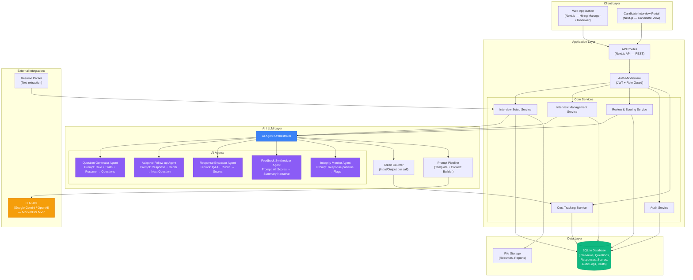
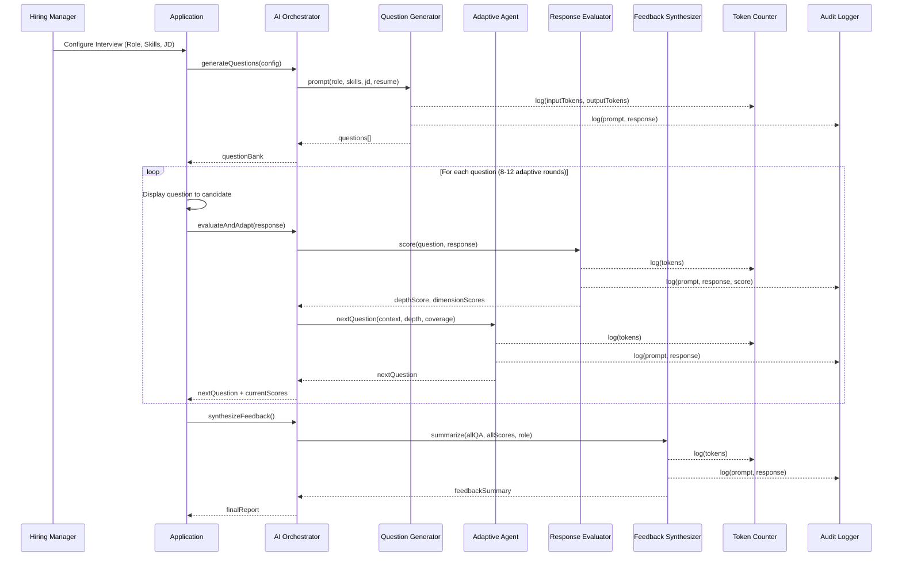
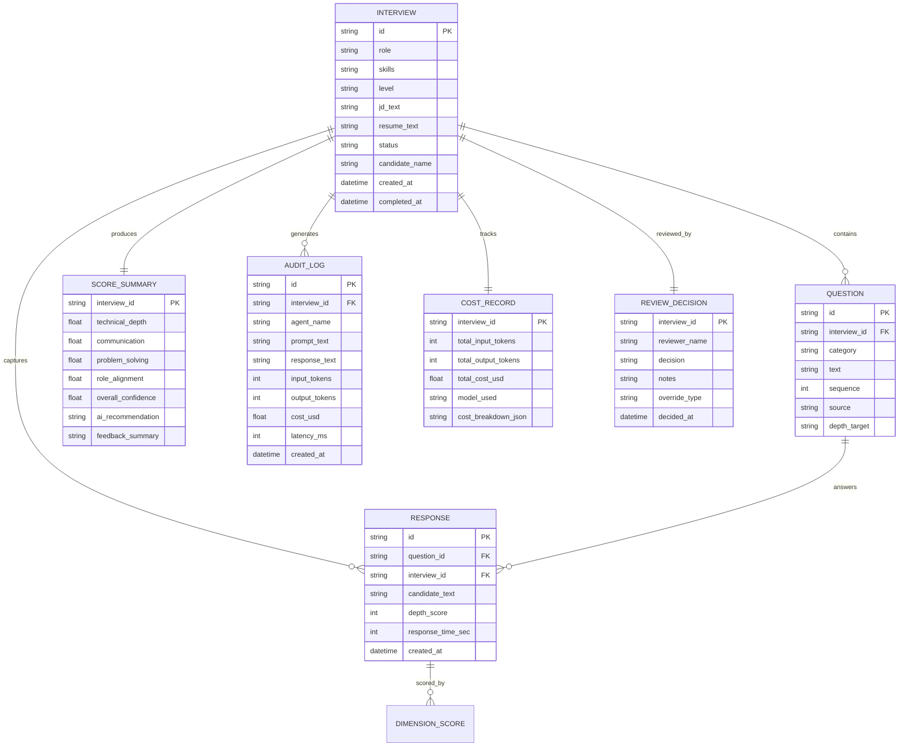

# Architecture — AI-Assisted Interview Screening

## 1. High-Level Target Architecture

We use a **Modular Monolith with AI Agent Orchestration** pattern — optimized for MVP delivery, clear separation of concerns, and easy extraction to microservices when scaling is needed.


```mermaid
graph TB
    subgraph Client Layer
        WEB["Web Application<br/>(Next.js — Hiring Manager / Reviewer)"]
        CAND["Candidate Interview Portal<br/>(Next.js — Candidate View)"]
    end

    subgraph Application Layer
        API["API Routes<br/>(Next.js API — REST)"]
        AUTH_MW["Auth Middleware<br/>(JWT + Role Guard)"]

        subgraph Core Services
            IS["Interview Setup Service"]
            IM["Interview Management Service"]
            RS["Review & Scoring Service"]
            AS["Audit Service"]
            CT["Cost Tracking Service"]
        end
    end

    subgraph AI / LLM Layer
        ORCH["AI Agent Orchestrator"]

        subgraph AI Agents
            QG["Question Generator Agent<br/>Prompt: Role + Skills + Resume → Questions"]
            AF["Adaptive Follow-up Agent<br/>Prompt: Response + Depth → Next Question"]
            RE["Response Evaluator Agent<br/>Prompt: Q&A + Rubric → Scores"]
            FS["Feedback Synthesizer Agent<br/>Prompt: All Scores → Summary Narrative"]
            IM_AGENT["Integrity Monitor Agent<br/>Prompt: Response patterns → Flags"]
        end

        TC["Token Counter<br/>(Input/Output per call)"]
        PP["Prompt Pipeline<br/>(Template + Context Builder)"]
    end

    subgraph Data Layer
        DB[("SQLite Database<br/>(Interviews, Questions,<br/>Responses, Scores,<br/>Audit Logs, Costs)")]
        FS_STORE["File Storage<br/>(Resumes, Reports)"]
    end

    subgraph External Integrations
        LLM["LLM API<br/>(Google Gemini / OpenAI)<br/>— Mocked for MVP"]
        RESUME["Resume Parser<br/>(Text extraction)"]
    end

    WEB & CAND --> API
    API --> AUTH_MW
    AUTH_MW --> IS & IM & RS & AS & CT
    IS --> ORCH
    IM --> ORCH
    RS --> ORCH
    ORCH --> QG & AF & RE & FS & IM_AGENT
    ORCH --> TC
    ORCH --> PP
    PP --> LLM
    TC --> CT
    IS & IM & RS & AS & CT --> DB
    IS --> FS_STORE
    RESUME --> IS

    style ORCH fill:#3b82f6,stroke:#1d4ed8,color:#fff
    style QG fill:#8b5cf6,stroke:#6d28d9,color:#fff
    style AF fill:#8b5cf6,stroke:#6d28d9,color:#fff
    style RE fill:#8b5cf6,stroke:#6d28d9,color:#fff
    style FS fill:#8b5cf6,stroke:#6d28d9,color:#fff
    style IM_AGENT fill:#8b5cf6,stroke:#6d28d9,color:#fff
    style DB fill:#10b981,stroke:#059669,color:#fff
    style LLM fill:#f59e0b,stroke:#d97706,color:#fff
```

---

## 2. Technology Stack

| Layer | Technology | Rationale |
|-------|-----------|-----------|
| **Frontend** | Next.js 15 (App Router) | Modern React with SSR, file-based routing, API routes — single deployment unit |
| **Styling** | Vanilla CSS (Custom Design System) | Premium glassmorphism dark mode; full control without framework overhead |
| **AI/LLM** | Google Gemini API (Mocked) | Adaptive questioning and scoring; mocked with realistic latency for demo |
| **Database** | SQLite (in-process) | Zero-config, file-based; perfect for prototype; schema mirrors production PostgreSQL |
| **Auth** | Mock JWT (session-based) | Demonstrates RBAC pattern without infrastructure overhead |
| **Charts** | CSS + SVG (custom) | Lightweight cost visualization without heavy chart library |
| **State Management** | React Context + useReducer | Interview session state, cost accumulation — no external deps |

---

## 3. AI Agent Architecture

The AI layer uses an **Agent Orchestrator** pattern where each agent has a single responsibility, its own prompt template, and tracked token budget.

### Agent Specifications

| Agent | Input | Output | Prompt Technique | Avg Tokens |
|-------|-------|--------|-----------------|------------|
| **Question Generator** | Role, Skills, Level, JD, Resume | Structured question array with categories | Few-shot + Structured Output | ~1,200 |
| **Adaptive Follow-up** | Previous Q&A, Response depth score, Topic coverage | Next question + reasoning | Chain-of-Thought (CoT) | ~800 |
| **Response Evaluator** | Question, Response, Rubric definition | Scores per dimension + rationale | Rubric-grounded + CoT | ~600 |
| **Feedback Synthesizer** | All Q&A pairs, All scores, Role context | Narrative summary with strengths/gaps | Structured Output + Summarization | ~1,000 |
| **Integrity Monitor** | Response patterns, Timing data | Integrity flags (if suspicious) | Pattern matching + Rule-based | ~400 |

### Agent Orchestration Flow


```mermaid
sequenceDiagram
    participant HM as Hiring Manager
    participant APP as Application
    participant ORCH as AI Orchestrator
    participant QG as Question Generator
    participant AF as Adaptive Agent
    participant RE as Response Evaluator
    participant FS as Feedback Synthesizer
    participant TC as Token Counter
    participant AL as Audit Logger

    HM->>APP: Configure Interview (Role, Skills, JD)
    APP->>ORCH: generateQuestions(config)
    ORCH->>QG: prompt(role, skills, jd, resume)
    QG-->>TC: log(inputTokens, outputTokens)
    QG-->>AL: log(prompt, response)
    QG-->>ORCH: questions[]
    ORCH-->>APP: questionBank

    loop For each question (8-12 adaptive rounds)
        APP->>APP: Display question to candidate
        APP->>ORCH: evaluateAndAdapt(response)
        ORCH->>RE: score(question, response)
        RE-->>TC: log(tokens)
        RE-->>AL: log(prompt, response, score)
        RE-->>ORCH: depthScore, dimensionScores
        ORCH->>AF: nextQuestion(context, depth, coverage)
        AF-->>TC: log(tokens)
        AF-->>AL: log(prompt, response)
        AF-->>ORCH: nextQuestion
        ORCH-->>APP: nextQuestion + currentScores
    end

    APP->>ORCH: synthesizeFeedback()
    ORCH->>FS: summarize(allQA, allScores, role)
    FS-->>TC: log(tokens)
    FS-->>AL: log(prompt, response)
    FS-->>ORCH: feedbackSummary
    ORCH-->>APP: finalReport
```

---

## 4. Data Layer Design

### Core Entities


```mermaid
erDiagram
    INTERVIEW ||--o{ QUESTION : contains
    INTERVIEW ||--o{ RESPONSE : captures
    INTERVIEW ||--|| SCORE_SUMMARY : produces
    INTERVIEW ||--o{ AUDIT_LOG : generates
    INTERVIEW ||--|| COST_RECORD : tracks
    QUESTION ||--o{ RESPONSE : answers
    RESPONSE ||--o{ DIMENSION_SCORE : scored_by
    INTERVIEW ||--|| REVIEW_DECISION : reviewed_by

    INTERVIEW {
        string id PK
        string role
        string skills
        string level
        string jd_text
        string resume_text
        string status
        string candidate_name
        datetime created_at
        datetime completed_at
    }

    QUESTION {
        string id PK
        string interview_id FK
        string category
        string text
        int sequence
        string source
        string depth_target
    }

    RESPONSE {
        string id PK
        string question_id FK
        string interview_id FK
        string candidate_text
        int depth_score
        int response_time_sec
        datetime created_at
    }

    SCORE_SUMMARY {
        string interview_id PK
        float technical_depth
        float communication
        float problem_solving
        float role_alignment
        float overall_confidence
        string ai_recommendation
        string feedback_summary
    }

    REVIEW_DECISION {
        string interview_id PK
        string reviewer_name
        string decision
        string notes
        string override_type
        datetime decided_at
    }

    COST_RECORD {
        string interview_id PK
        int total_input_tokens
        int total_output_tokens
        float total_cost_usd
        string model_used
        string cost_breakdown_json
    }

    AUDIT_LOG {
        string id PK
        string interview_id FK
        string agent_name
        string prompt_text
        string response_text
        int input_tokens
        int output_tokens
        float cost_usd
        int latency_ms
        datetime created_at
    }
```

---

## 5. Communication Patterns

| Pattern | Usage | Example |
|---------|-------|---------|
| **Synchronous (REST API)** | All user-initiated actions | `POST /api/interviews` → creates interview session |
| **In-Process (Function Call)** | AI agent orchestration | `orchestrator.generateQuestions(config)` → calls Question Generator |
| **Event-Driven (In-Memory)** | Cross-cutting concerns | Every AI call → emits `AI_CALL_COMPLETED` → consumed by CostTracker + AuditLogger |
| **Client-Side State** | Interview session progression | React Context manages current Q&A, scores, progress |

---

## 6. Design Patterns Applied

### A. Strategy Pattern (AI Agents)
- **Why:** Each AI agent (Question Generator, Scorer, Adapter) has different prompt templates and processing logic but shares the same interface: `execute(input) → output`.
- **Benefit:** New agents (e.g., Integrity Monitor) are added without modifying the orchestrator. Agents can be swapped (e.g., mock → real LLM) via configuration.

### B. Observer Pattern (Audit + Cost Tracking)
- **Why:** Every AI operation must be logged for audit and cost tracking — but the AI agents shouldn't know about logging.
- **Benefit:** The Orchestrator publishes events after each AI call. AuditLogger and CostTracker subscribe independently — adding a new observer (e.g., AnalyticsDashboard) requires zero changes to existing agents.

### C. Chain of Responsibility (Adaptive Questioning)
- **Why:** The adaptive flow involves sequential decisions: evaluate depth → check coverage → decide next action (follow-up / new topic / conclude).
- **Benefit:** Each handler in the chain can be tested and modified independently. Easy to insert new handlers (e.g., time-limit check, integrity check).

### D. Builder Pattern (Prompt Construction)
- **Why:** AI prompts are assembled from multiple context pieces: role definition, skills, resume excerpts, previous Q&A history, rubric definitions.
- **Benefit:** PromptBuilder constructs complex prompts step-by-step, ensuring consistent structure. Templates can be versioned and A/B tested.

### E. Repository Pattern (Data Access)
- **Why:** Prototype uses in-memory storage, but production would use PostgreSQL. Data access should be abstracted.
- **Benefit:** InterviewRepository, AuditRepository, CostRepository hide storage implementation. Switching from in-memory to SQLite/PostgreSQL requires changing only the repository implementation.

---

## 7. Security & Privacy Considerations (MVP Scope)

| Concern | MVP Approach | Production Approach |
|---------|-------------|-------------------|
| **Authentication** | Mock session-based login | OAuth 2.0 + JWT with identity provider |
| **Authorization** | Role-based UI routing | RBAC middleware on all API routes |
| **Data Privacy** | Resume text stored in-memory only | Encrypted at rest (AES-256), PII anonymization pipeline |
| **AI Safety** | Prompt injection guardrails in templates | Input sanitization + output filtering + content moderation API |
| **Audit Compliance** | Full prompt/response logging | Immutable audit log (append-only), retention policies |

---

## 8. Scalability Path (Post-MVP)

```
MVP (Monolith)              →    Phase 2 (Modular)           →    Phase 3 (Microservices)
├── Next.js App             →    ├── Interview Service       →    ├── K8s Deployment
├── In-Memory Store         →    ├── PostgreSQL              →    ├── Event-Driven (Kafka)
├── Mock AI                 →    ├── Real LLM (Gemini)       →    ├── Multi-Model Router
├── Single User             →    ├── Multi-Tenant             →    ├── ATS Integrations
└── File-based              →    └── S3 + CDN                →    └── Analytics Pipeline
```
