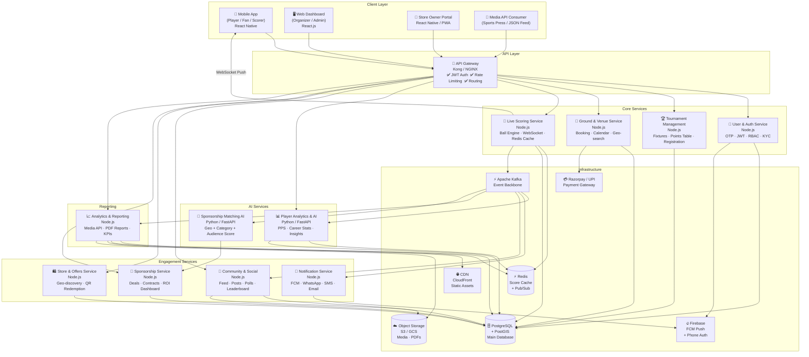
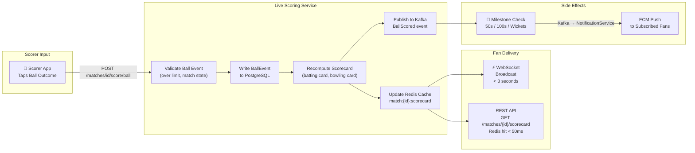
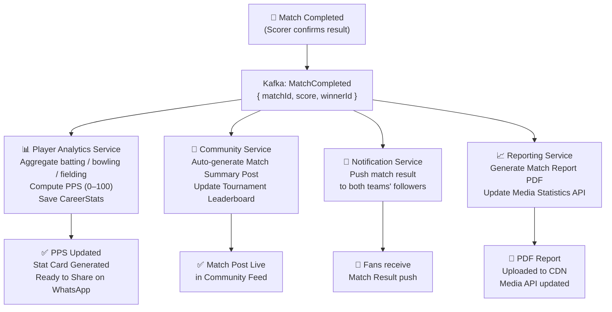
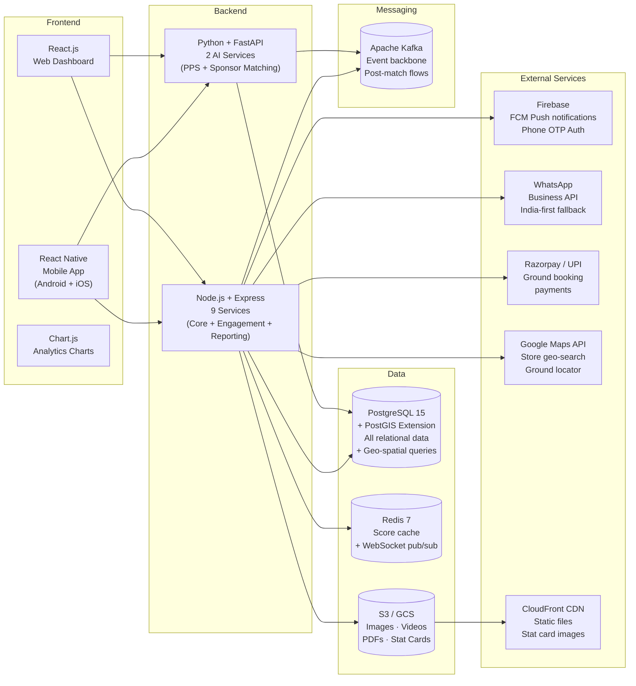

# Architecture Diagram — CricZone: Local Cricket Community Platform

---

## 1. System Architecture Overview



---

## 2. Live Scoring Real-Time Data Flow



---

## 3. Post-Match Event Flow



---

## 4. Technology Stack Diagram



---

## 5. Deployment Architecture (Cloud — Cost-Optimised MVP)

```mermaid
graph TB
    subgraph Internet
        USERS["🌍 Users\n(Players, Fans, Organizers)"]
    end

    subgraph Edge
        CF["Cloudflare / CloudFront CDN\nStatic Assets · DDoS Protection"]
    end

    subgraph Cloud Region — ap-south-1 Mumbai
        ALB["Application Load Balancer\n(AWS ALB / GCP Load Balancer)"]

        subgraph ECS / GKE — Auto-scaled
            GW_POD["API Gateway Pods\n(Kong + NGINX)"]
            SCORING_POD["Live Scoring Pods\n⚡ High-priority, auto-scaled"]
            TOUR_POD["Tournament Service Pods"]
            OTHER_PODS["Other Service Pods\n(Auth, Analytics, Store, etc.)"]
        end

        subgraph Managed Data Services
            RDS["AWS RDS / Cloud SQL\nPostgreSQL + PostGIS\nMulti-AZ Failover"]
            ELASTICACHE["AWS ElastiCache / Memorystore\nRedis Cluster"]
            MSK["AWS MSK / Confluent Cloud\nKafka (Managed)"]
            S3_CLOUD["S3 / GCS Bucket\nObject Storage"]
        end

        subgraph Firebase
            FCM_CLOUD["FCM\nPush Notifications"]
            AUTH_CLOUD["Firebase Auth\nPhone OTP"]
        end
    end

    USERS --> CF
    CF --> ALB
    ALB --> GW_POD
    GW_POD --> SCORING_POD & TOUR_POD & OTHER_PODS
    SCORING_POD --> RDS & ELASTICACHE & MSK
    TOUR_POD --> RDS & MSK
    OTHER_PODS --> RDS & MSK & S3_CLOUD
    OTHER_PODS --> FCM_CLOUD & AUTH_CLOUD
```
