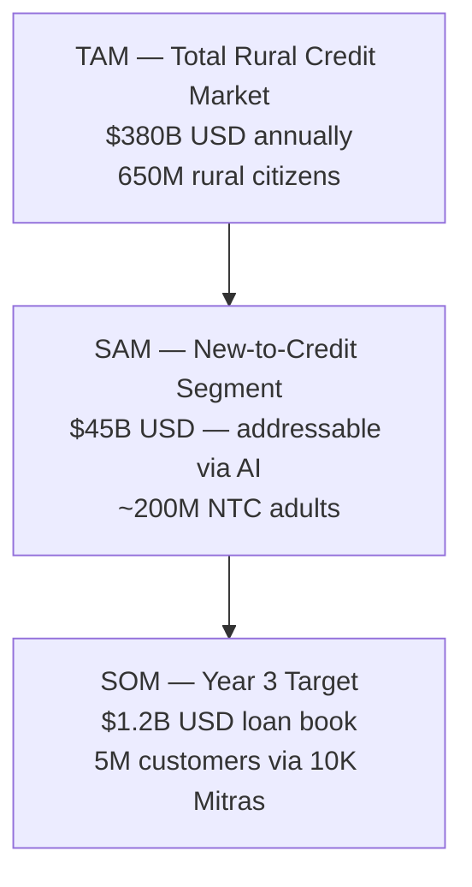

# Mitra Finance — Business Perspective

> **⚠️ Context**: Mitra Finance targets India's 650M+ rural citizens — the world's largest financially underserved population — through an AI-powered, agent-assisted digital lending platform.

## Table of Contents
1. [Business Objectives](#business-objectives)
2. [Market Context & Opportunity](#market-context--opportunity)
3. [Real-World Analogues](#real-world-analogues)
4. [Revenue Model](#revenue-model)
5. [Business Model Differentiation](#business-model-differentiation)
6. [Go-to-Market Strategy](#go-to-market-strategy)
7. [Risk & Mitigation](#risk--mitigation)

---

## Business Objectives

| Objective | Metric | Target |
|-----------|--------|--------|
| Bridge the Credit Gap | New-to-Credit customers served | 1M in Year 1 |
| Empower Bank Mitras | Mitras onboarded & active | 10,000 in Year 1 |
| Linguistic Inclusion | Indian dialects supported | 12 at launch, 22 by Year 2 |
| Reduce NPA (Non-Performing Assets) | NPA rate via AI scoring | < 4% (vs. 9% industry avg.) |
| Operational Cost | Cost per loan disbursed | < ₹200 (vs. ₹800 for branch banking) |

---

## Market Context & Opportunity

### The Problem Scale
- **650 million** rural Indians with no or limited access to formal credit
- **570 million+** Jan Dhan accounts opened — the bank accounts exist, but credit access is missing
- **Only 22%** of India's landmass has a bank branch within 5km
- **90% of rural credit** still comes from informal moneylenders at 24–48% annual interest

### JAM Trinity Foundation
India's **Jan Dhan + Aadhaar + Mobile** infrastructure is the backbone Mitra Finance builds upon:
- **Jan Dhan**: 570M+ accounts → ready-to-receive disbursement rails
- **Aadhaar**: 1.3B+ registered → frictionless eKYC
- **Mobile**: 850M+ users → distribution channel for Mitra apps

### TAM / SAM / SOM

---

## Real-World Analogues

| Company | Model | What We Learn |
|---------|-------|--------------|
| **Eko India** | BC Agent network (150K+ retailers), AePS, domestic remittance | Agent-first distribution; real-time bank connectivity via APIs; retailer-as-bank-branch model |
| **FINO Payments Bank** | 700K+ Fino Points; offline POS for rural payments | Offline POS terminal design; hybrid connectivity; rural cash management |
| **KreditBee / Moneyview** | Digital lending with alternative credit scoring | Thin-file borrower analysis; cash flow-based scoring; mobile-first loan origination |
| **NPCI FiMI** | Payments-native sovereign AI for India | Localized AI models; Indian language NLP for financial workflows |
| **Shriram Finance** | Cloud-native "Shriram One" multi-lingual platform | Multi-site cloud, multi-language UX, trust-building in Tier 2/3 cities |
| **Dvara E-Registry** | e-Patta rural land title verification | Using land records as collateral signal for rural credit |

### Key Lessons Applied to Mitra Finance
1. **From Eko**: Agent trust > app trust. Mitra is the face. Platform must empower Mitra, not replace them.
2. **From FINO**: Design for intermittent connectivity. Offline-first is not optional — it's survival.
3. **From KreditBee**: Alternative data works. Utility bills + behavioral signals can predict creditworthiness as well as CIBIL for rural borrowers.
4. **From NPCI FiMI**: India needs India-built AI. Western LLMs fail on Bhojpuri and Maithili — use IndicBERT/Sarvam AI family.

---

## Revenue Model

| Revenue Stream | Mechanism | Year 1 Forecast | Share |
|----------------|-----------|----------------|-------|
| **Interest Spread** | Lending at 14–18% APR; cost of funds 7–9% | ₹480 Cr | 65% |
| **Origination Fee** | 0.5–1% of loan amount, charged to borrower | ₹95 Cr | 13% |
| **B2B SaaS (Bank Licensing)** | Monthly fee per bank using Mitra platform | ₹65 Cr | 9% |
| **Data & Analytics** | Anonymized rural economic insights to agri-insurers, fintechs | ₹45 Cr | 6% |
| **WhatsApp/EMI Reminders** | Pay-per-use API for partner banks | ₹35 Cr | 5% |
| **CBDC Transaction Fees** (Phase 2) | Micro-fee on digital rupee transactions | ₹15 Cr | 2% |

**Break-Even**: Month 20 | **Year 3 Loan Book**: ₹3,500 Cr projected

---

## Business Model Differentiation

| Competitor | Weakness | Mitra Finance Advantage |
|-----------|----------|------------------------|
| Traditional Branch Banking | No rural coverage, high cost, literacy required | Agent-led, voice-first, village-level coverage |
| Informal Moneylenders | 24–48% APR, no regulation | 12–18% formal credit, RBI-regulated |
| KreditBee / CASHe | Urban-focused, CIBIL-dependent, no offline | Rural-first, Alt-scoring, 100% offline capable |
| MicroFinance Institutions | Group-loan only, manual process, weekly collection | Individual loans, AI-scored, digital collection |

---

## Go-to-Market Strategy

### Phase 1 — Seed (Months 1–6)
- Partner with 3 Regional Rural Banks (RRBs) as lending partners
- Onboard 500 Bank Mitras in 2 states (UP, Bihar — highest credit demand)
- Offer: Agriculture loans (₹10K–₹50K) and MSME micro-loans

### Phase 2 — Scale (Months 7–18)
- Expand to 5 states; 3,000 Mitras
- Launch livestock/crop Computer Vision assessment for collateral
- Integrate ABHA health records for urban-rural migrant borrowers

### Phase 3 — Growth (Months 19–36)
- Nationwide rollout: 10,000 Mitras, 22 states
- CBDC integration for instant rural disbursement
- License platform to 5 additional banks as white-label SaaS

---

## Risk & Mitigation

| Risk | Likelihood | Impact | Mitigation |
|------|-----------|--------|-----------|
| Aadhaar API downtime | Medium | High | Offline biometric token (8h cache) + face liveness fallback |
| High NPA in rural segment | Medium | High | AI alt-scoring + dynamic credit limits + co-borrower support |
| Mitra misconduct (fraud) | Low | High | GPS-stamped sessions, supervisor sign-off for high-value loans, daily activity audit |
| Regulatory change (RBI) | Low | Very High | Pluggable compliance module; dedicated regulatory tracking |
| Device loss / data theft | Low | Very High | Device-level encryption, remote wipe, biometric lock on app |
| AI model bias against specific communities | Medium | High | Quarterly bias audits; explainability mandated; human-in-loop for flagged cases |

---

**Last Updated**: February 2026
**Version**: 1.0
**Status**: Design Complete
