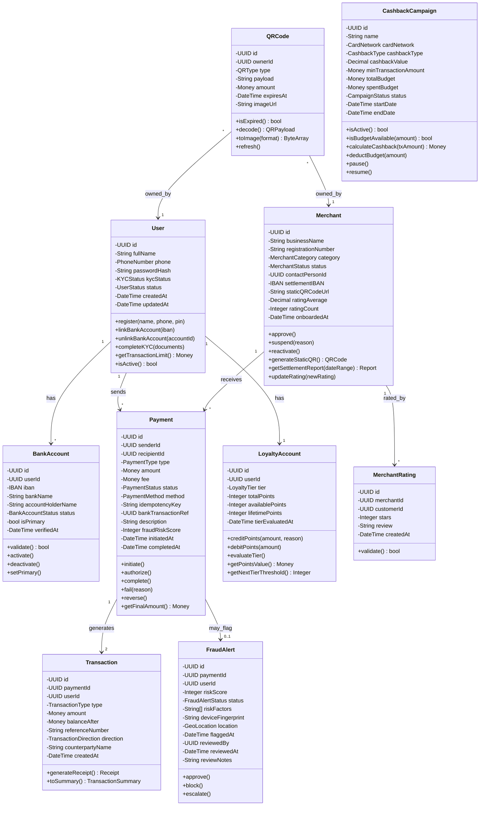
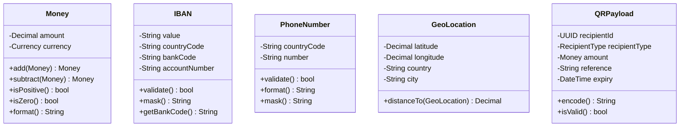
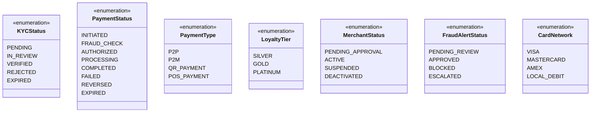
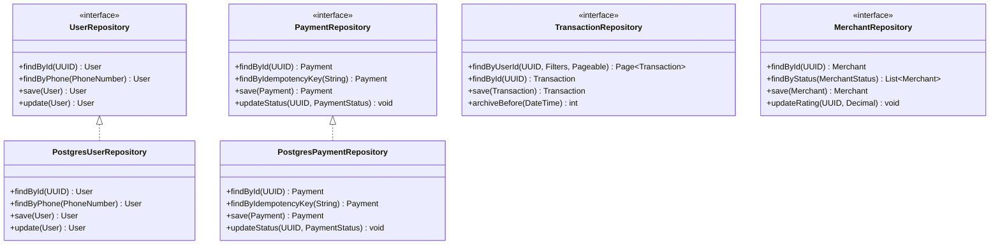
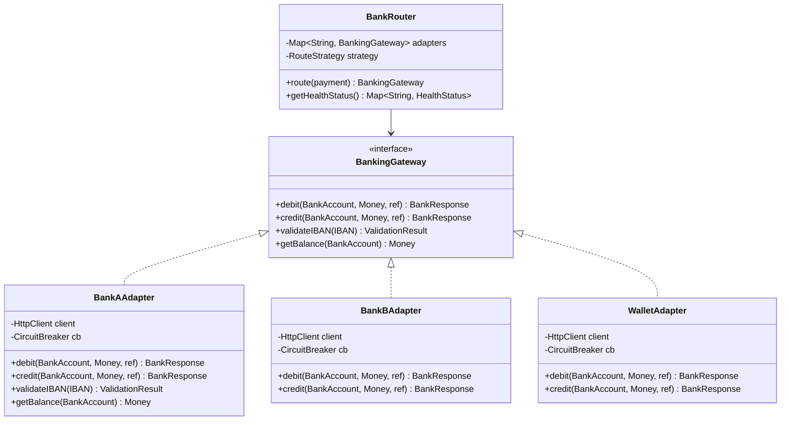

# PayFlow - Class Diagram

> **⚠️ Core Requirements**: Domain model supports the core requirements defined in [KEY_REQUIREMENTS.md](./KEY_REQUIREMENTS.md).

## Table of Contents
1. [Overview](#overview)
2. [Domain Layer](#domain-layer)
3. [Service Layer](#service-layer)
4. [Infrastructure Layer](#infrastructure-layer)
5. [Relationship Details](#relationship-details)

---

## Overview

The class diagram is organized into three layers following **Clean Architecture**:
1. **Domain Layer** — Pure business entities and value objects
2. **Service Layer** — Application and domain services
3. **Infrastructure Layer** — External integrations and persistence

---

## Domain Layer

### Core Entities

### Value Objects

### Enumerations

---

## Service Layer

### Application Services

```mermaid
classDiagram

    class UserService {
        -UserRepository userRepo
        -OTPService otpService
        -KYCProvider kycProvider
        +register(RegisterRequest) User
        +verifyOTP(phone, otp) bool
        +linkBankAccount(userId, iban) BankAccount
        +completeKYC(userId, documents) KYCResult
        +getProfile(userId) UserProfile
        +updateProfile(userId, data) User
    }

    class MerchantService {
        -MerchantRepository merchantRepo
        -QRCodeService qrService
        -KYBProvider kybProvider
        +onboardMerchant(MerchantRequest) Merchant
        +approveMerchant(merchantId) Merchant
        +suspendMerchant(merchantId, reason) Merchant
        +rateMerchant(merchantId, customerId, rating) MerchantRating
        +getSettlementReport(merchantId, dateRange) Report
    }

    class PaymentService {
        -PaymentRepository paymentRepo
        -FraudEngine fraudEngine
        -BankingGateway bankGateway
        -LoyaltyService loyaltyService
        -EventPublisher eventPublisher
        +initiatePayment(PaymentRequest) Payment
        +processPayment(paymentId) Payment
        +reversePayment(paymentId, reason) Payment
        +getPaymentStatus(paymentId) PaymentStatus
    }

    class PaymentOrchestrator {
        -PaymentService paymentService
        -FraudEngine fraudEngine
        -BankingGateway bankGateway
        -NotificationService notifier
        +executePaymentSaga(PaymentRequest) PaymentResult
        -validatePayment(request) ValidationResult
        -checkFraud(payment) FraudResult
        -routeToBank(payment) BankResponse
        -handleFailure(payment, error) void
    }

    class TransactionService {
        -TransactionRepository txRepo
        -ArchiveService archiveService
        -ReceiptService receiptService
        +getHistory(userId, filters) Page~Transaction~
        +getTransactionDetail(txId) TransactionDetail
        +generateReceipt(txId) Receipt
        +emailReceipt(txId, email) void
        +archiveOldTransactions() void
    }

    class QRCodeService {
        -QRCodeFactory qrFactory
        -QRCodeRepository qrRepo
        -CDNService cdn
        +generateStaticQR(ownerId) QRCode
        +generateDynamicQR(ownerId, amount) QRCode
        +decodeQR(payload) QRPayload
        +downloadQR(qrId, format) ByteArray
    }

    class NotificationService {
        -PushProvider pushProvider
        -SMSProvider smsProvider
        -EmailProvider emailProvider
        -PreferenceStore preferences
        +sendPaymentConfirmation(payment) void
        +sendFraudAlert(alert) void
        +sendReceipt(txId, email) void
        +getUserPreferences(userId) NotificationPrefs
        +updatePreferences(userId, prefs) void
    }

    class FraudEngine {
        -RuleEngine ruleEngine
        -MLScoringService mlService
        -DeviceFingerprintService deviceService
        -VelocityAggregator velocity
        +scoreTransaction(payment) FraudResult
        +getAlertQueue() List~FraudAlert~
        +reviewAlert(alertId, decision) FraudAlert
    }

    class LoyaltyService {
        -LoyaltyRepository loyaltyRepo
        -PointsCalculator calculator
        +creditPoints(userId, txAmount) void
        +debitPoints(userId, points) void
        +getStatus(userId) LoyaltyAccount
        +evaluateTiers() void
        +calculateRedemptionValue(points) Money
    }

    class CashbackService {
        -CampaignRepository campaignRepo
        -BudgetTracker budgetTracker
        +createCampaign(CampaignRequest) CashbackCampaign
        +checkEligibility(cardBIN, amount) CashbackOffer
        +applyCashback(paymentId) Money
        +getCampaignStats(campaignId) CampaignStats
    }

    PaymentOrchestrator --> PaymentService
    PaymentOrchestrator --> FraudEngine
    PaymentOrchestrator --> NotificationService
    PaymentService --> LoyaltyService
    PaymentService --> CashbackService
```

---

## Infrastructure Layer

### Repositories

### External Adapters

---

## Relationship Details

### Entity Relationships

| Source | Target | Type | Description |
|--------|--------|------|-------------|
| User | BankAccount | 1:N | User can link multiple bank accounts |
| User | Payment (sender) | 1:N | User sends multiple payments |
| User | Transaction | 1:N | User has many transactions |
| User | LoyaltyAccount | 1:1 | Auto-enrolled on registration |
| User | QRCode | 1:N | User can have multiple QR codes |
| Merchant | Payment (recipient) | 1:N | Merchant receives many payments |
| Merchant | MerchantRating | 1:N | Merchant has many ratings |
| Merchant | QRCode | 1:1 | Merchant has one static QR |
| Payment | Transaction | 1:2 | Each payment creates 2 transactions (debit + credit) |
| Payment | FraudAlert | 1:0..1 | Payment may trigger a fraud alert |
| CashbackCampaign | Payment | 1:N | Campaign applies to eligible payments |

### Aggregates

| Aggregate Root | Entities | Value Objects |
|---------------|----------|---------------|
| User | BankAccount | PhoneNumber, IBAN |
| Merchant | MerchantRating | GeoLocation |
| Payment | Transaction, FraudAlert | Money, QRPayload |
| LoyaltyAccount | — | LoyaltyTier |
| CashbackCampaign | — | CardNetwork, Money |

---

**Last Updated**: February 2026
**Version**: 1.0
**Status**: Design Complete
