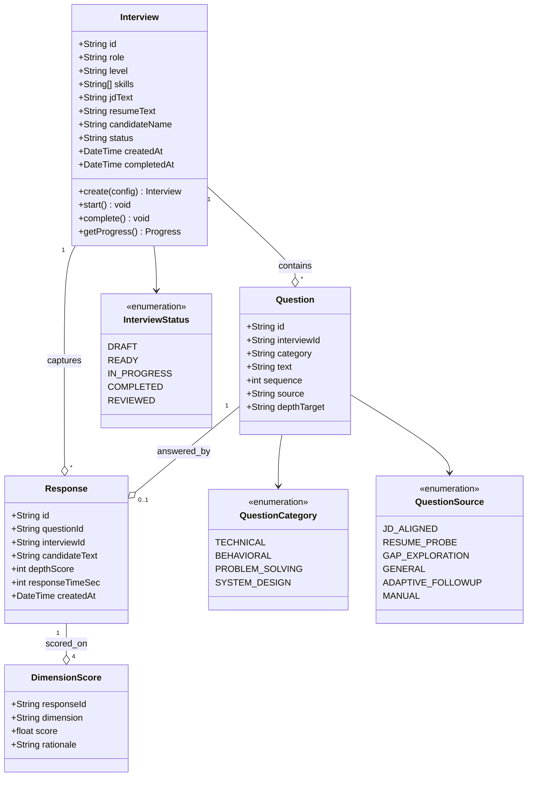
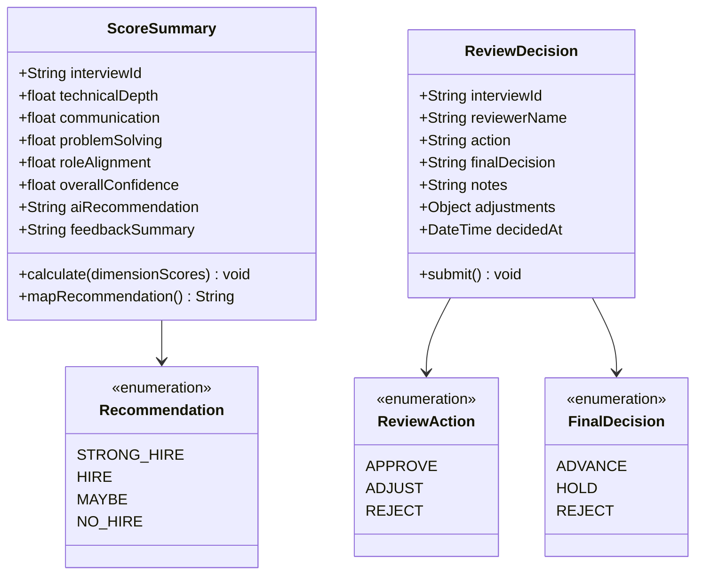
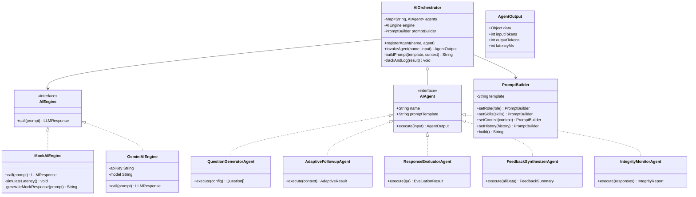
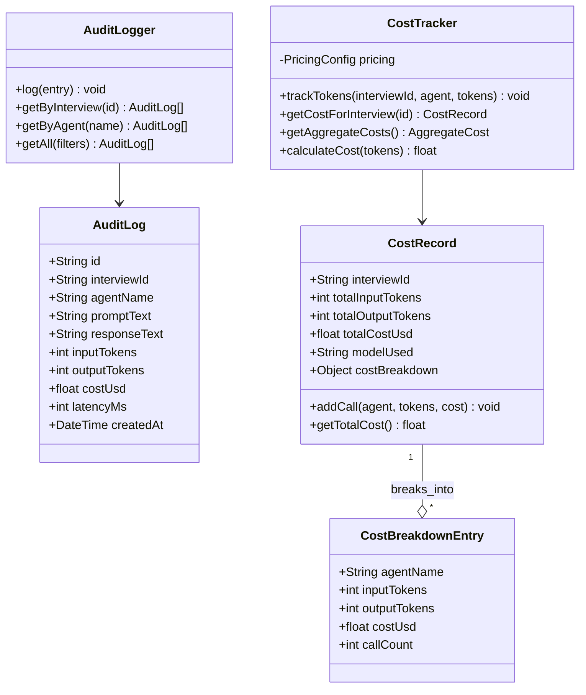
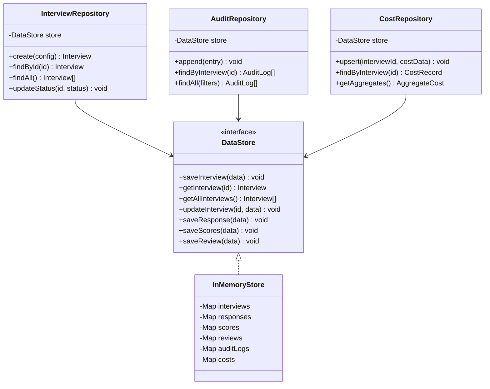

# Class Diagram — AI-Assisted Interview Screening

---

## 1. Core Domain — Interview Management

```mermaid
classDiagram
    class Interview {
        +String id
        +String role
        +String level
        +String[] skills
        +String jdText
        +String resumeText
        +String candidateName
        +String status
        +DateTime createdAt
        +DateTime completedAt
        +create(config) Interview
        +start() void
        +complete() void
        +getProgress() Progress
    }

    class Question {
        +String id
        +String interviewId
        +String category
        +String text
        +int sequence
        +String source
        +String depthTarget
    }

    class Response {
        +String id
        +String questionId
        +String interviewId
        +String candidateText
        +int depthScore
        +int responseTimeSec
        +DateTime createdAt
    }

    class DimensionScore {
        +String responseId
        +String dimension
        +float score
        +String rationale
    }

    Interview "1" --o "*" Question : contains
    Interview "1" --o "*" Response : captures
    Question "1" --o "0..1" Response : answered_by
    Response "1" --o "4" DimensionScore : scored_on

    class InterviewStatus {
        <<enumeration>>
        DRAFT
        READY
        IN_PROGRESS
        COMPLETED
        REVIEWED
    }

    class QuestionCategory {
        <<enumeration>>
        TECHNICAL
        BEHAVIORAL
        PROBLEM_SOLVING
        SYSTEM_DESIGN
    }

    class QuestionSource {
        <<enumeration>>
        JD_ALIGNED
        RESUME_PROBE
        GAP_EXPLORATION
        GENERAL
        ADAPTIVE_FOLLOWUP
        MANUAL
    }

    Interview --> InterviewStatus
    Question --> QuestionCategory
    Question --> QuestionSource
```

---

## 2. Scoring & Review Domain

```mermaid
classDiagram
    class ScoreSummary {
        +String interviewId
        +float technicalDepth
        +float communication
        +float problemSolving
        +float roleAlignment
        +float overallConfidence
        +String aiRecommendation
        +String feedbackSummary
        +calculate(dimensionScores) void
        +mapRecommendation() String
    }

    class ReviewDecision {
        +String interviewId
        +String reviewerName
        +String action
        +String finalDecision
        +String notes
        +Object adjustments
        +DateTime decidedAt
        +submit() void
    }

    class Recommendation {
        <<enumeration>>
        STRONG_HIRE
        HIRE
        MAYBE
        NO_HIRE
    }

    class ReviewAction {
        <<enumeration>>
        APPROVE
        ADJUST
        REJECT
    }

    class FinalDecision {
        <<enumeration>>
        ADVANCE
        HOLD
        REJECT
    }

    ScoreSummary --> Recommendation
    ReviewDecision --> ReviewAction
    ReviewDecision --> FinalDecision
```

---

## 3. AI Agent Domain

```mermaid
classDiagram
    class AIAgent {
        <<interface>>
        +String name
        +String promptTemplate
        +execute(input) AgentOutput
    }

    class QuestionGeneratorAgent {
        +execute(config) Question[]
    }

    class AdaptiveFollowupAgent {
        +execute(context) AdaptiveResult
    }

    class ResponseEvaluatorAgent {
        +execute(qa) EvaluationResult
    }

    class FeedbackSynthesizerAgent {
        +execute(allData) FeedbackSummary
    }

    class IntegrityMonitorAgent {
        +execute(responses) IntegrityReport
    }

    AIAgent <|.. QuestionGeneratorAgent
    AIAgent <|.. AdaptiveFollowupAgent
    AIAgent <|.. ResponseEvaluatorAgent
    AIAgent <|.. FeedbackSynthesizerAgent
    AIAgent <|.. IntegrityMonitorAgent

    class AIOrchestrator {
        -Map~String, AIAgent~ agents
        -AIEngine engine
        -PromptBuilder promptBuilder
        +registerAgent(name, agent)
        +invokeAgent(name, input) AgentOutput
        -buildPrompt(template, context) String
        -trackAndLog(result) void
    }

    class AIEngine {
        <<interface>>
        +call(prompt) LLMResponse
    }

    class MockAIEngine {
        +call(prompt) LLMResponse
        -simulateLatency() void
        -generateMockResponse(prompt) String
    }

    class GeminiAIEngine {
        -apiKey String
        -model String
        +call(prompt) LLMResponse
    }

    AIEngine <|.. MockAIEngine
    AIEngine <|.. GeminiAIEngine
    AIOrchestrator --> AIEngine
    AIOrchestrator o-- AIAgent

    class AgentOutput {
        +Object data
        +int inputTokens
        +int outputTokens
        +int latencyMs
    }

    class PromptBuilder {
        -String template
        +setRole(role) PromptBuilder
        +setSkills(skills) PromptBuilder
        +setContext(context) PromptBuilder
        +setHistory(history) PromptBuilder
        +build() String
    }

    AIOrchestrator --> PromptBuilder
```

---

## 4. Audit & Cost Domain

```mermaid
classDiagram
    class AuditLog {
        +String id
        +String interviewId
        +String agentName
        +String promptText
        +String responseText
        +int inputTokens
        +int outputTokens
        +float costUsd
        +int latencyMs
        +DateTime createdAt
    }

    class CostRecord {
        +String interviewId
        +int totalInputTokens
        +int totalOutputTokens
        +float totalCostUsd
        +String modelUsed
        +Object costBreakdown
        +addCall(agent, tokens, cost) void
        +getTotalCost() float
    }

    class CostBreakdownEntry {
        +String agentName
        +int inputTokens
        +int outputTokens
        +float costUsd
        +int callCount
    }

    CostRecord "1" --o "*" CostBreakdownEntry : breaks_into

    class AuditLogger {
        +log(entry) void
        +getByInterview(id) AuditLog[]
        +getByAgent(name) AuditLog[]
        +getAll(filters) AuditLog[]
    }

    class CostTracker {
        -PricingConfig pricing
        +trackTokens(interviewId, agent, tokens) void
        +getCostForInterview(id) CostRecord
        +getAggregateCosts() AggregateCost
        +calculateCost(tokens) float
    }

    AuditLogger --> AuditLog
    CostTracker --> CostRecord
```

---

## 5. Data Store Domain

```mermaid
classDiagram
    class DataStore {
        <<interface>>
        +saveInterview(data) void
        +getInterview(id) Interview
        +getAllInterviews() Interview[]
        +updateInterview(id, data) void
        +saveResponse(data) void
        +saveScores(data) void
        +saveReview(data) void
    }

    class InMemoryStore {
        -Map interviews
        -Map responses
        -Map scores
        -Map reviews
        -Map auditLogs
        -Map costs
    }

    DataStore <|.. InMemoryStore

    class InterviewRepository {
        -DataStore store
        +create(config) Interview
        +findById(id) Interview
        +findAll() Interview[]
        +updateStatus(id, status) void
    }

    class AuditRepository {
        -DataStore store
        +append(entry) void
        +findByInterview(id) AuditLog[]
        +findAll(filters) AuditLog[]
    }

    class CostRepository {
        -DataStore store
        +upsert(interviewId, costData) void
        +findByInterview(id) CostRecord
        +getAggregates() AggregateCost
    }

    InterviewRepository --> DataStore
    AuditRepository --> DataStore
    CostRepository --> DataStore
```
