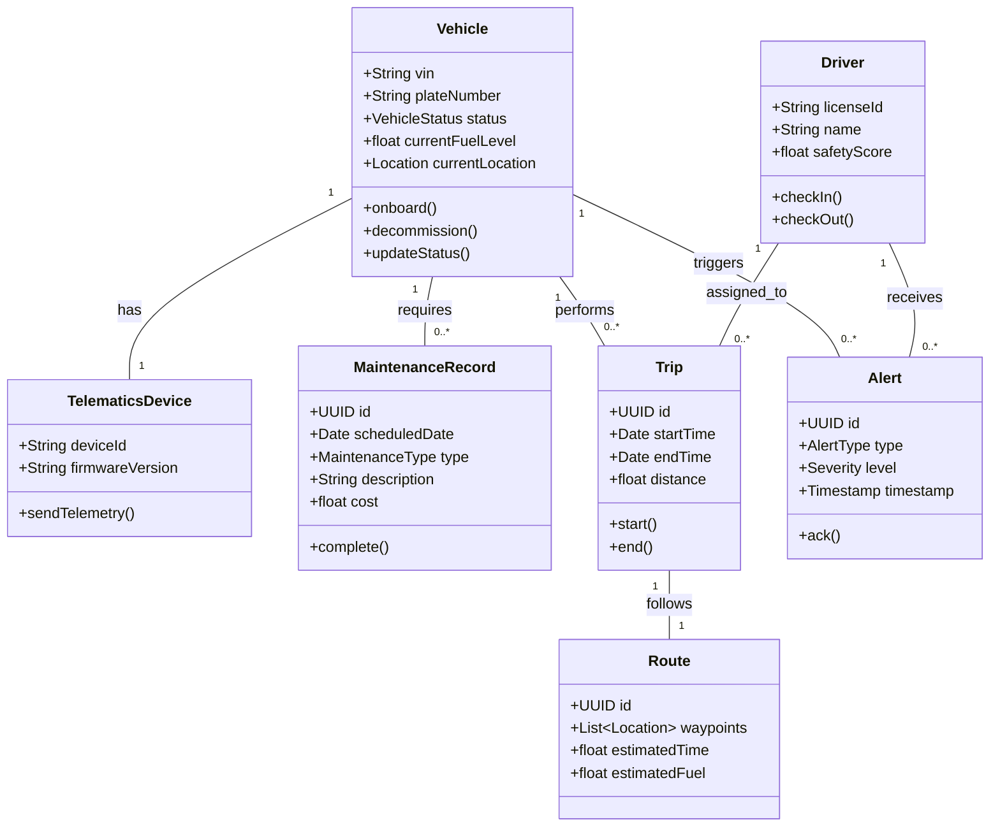

# Class Diagram

The following class diagram represents the core domain model of the Fleet Management System.

```mermaid
classDiagram
    class Vehicle {
        +String vin
        +String plateNumber
        +VehicleStatus status
        +float currentFuelLevel
        +Location currentLocation
        +onboard()
        +decommission()
        +updateStatus()
    }

    class TelematicsDevice {
        +String deviceId
        +String firmwareVersion
        +sendTelemetry()
    }

    class Driver {
        +String licenseId
        +String name
        +float safetyScore
        +checkIn()
        +checkOut()
    }

    class MaintenanceRecord {
        +UUID id
        +Date scheduledDate
        +MaintenanceType type
        +String description
        +float cost
        +complete()
    }

    class Trip {
        +UUID id
        +Date startTime
        +Date endTime
        +float distance
        +start()
        +end()
    }

    class Route {
        +UUID id
        +List~Location~ waypoints
        +float estimatedTime
        +float estimatedFuel
    }

    class Alert {
        +UUID id
        +AlertType type
        +Severity level
        +Timestamp timestamp
        +ack()
    }

    Vehicle "1" -- "1" TelematicsDevice : has
    Vehicle "1" -- "0..*" MaintenanceRecord : requires
    Vehicle "1" -- "0..*" Trip : performs
    Driver "1" -- "0..*" Trip : assigned_to
    Trip "1" -- "1" Route : follows
    Vehicle "1" -- "0..*" Alert : triggers
    Driver "1" -- "0..*" Alert : receives
```
