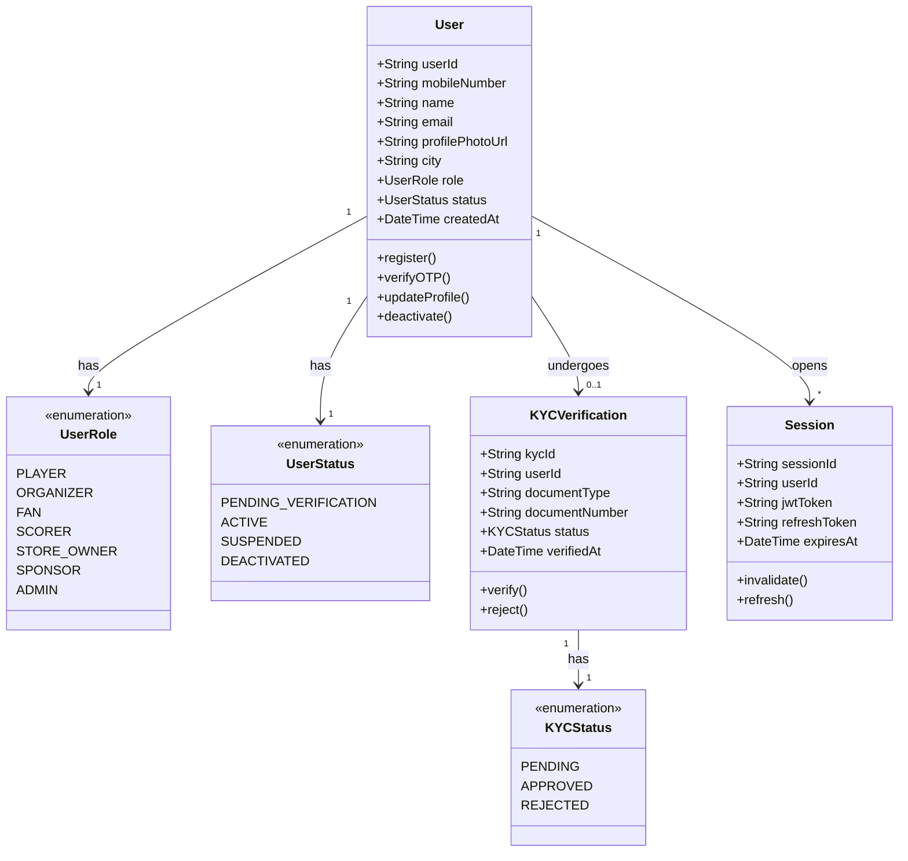
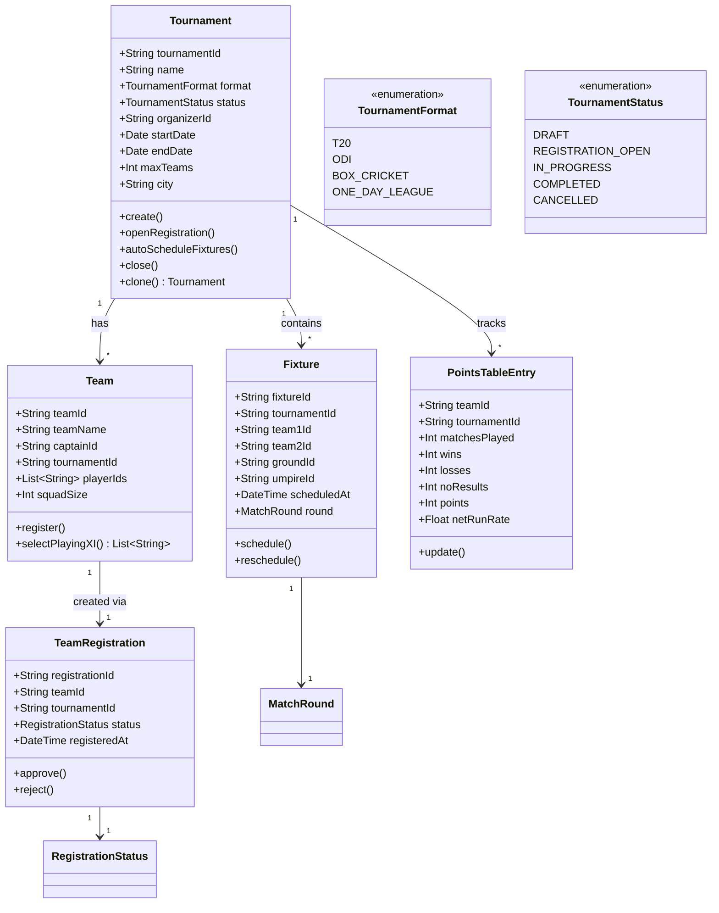
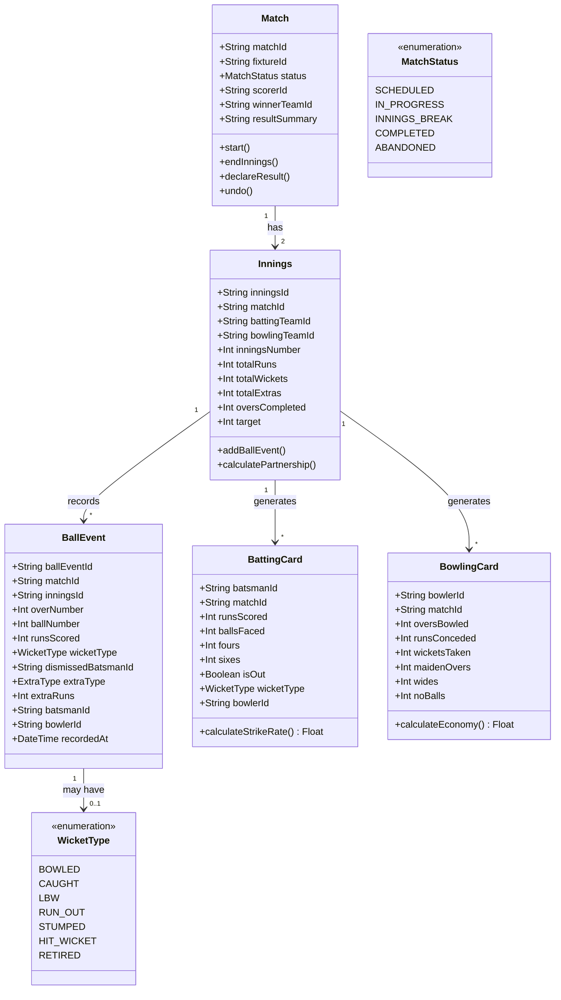
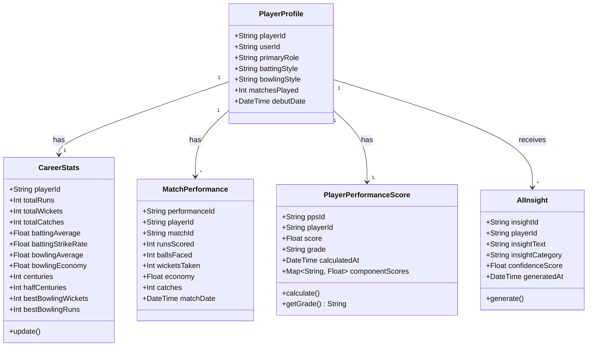
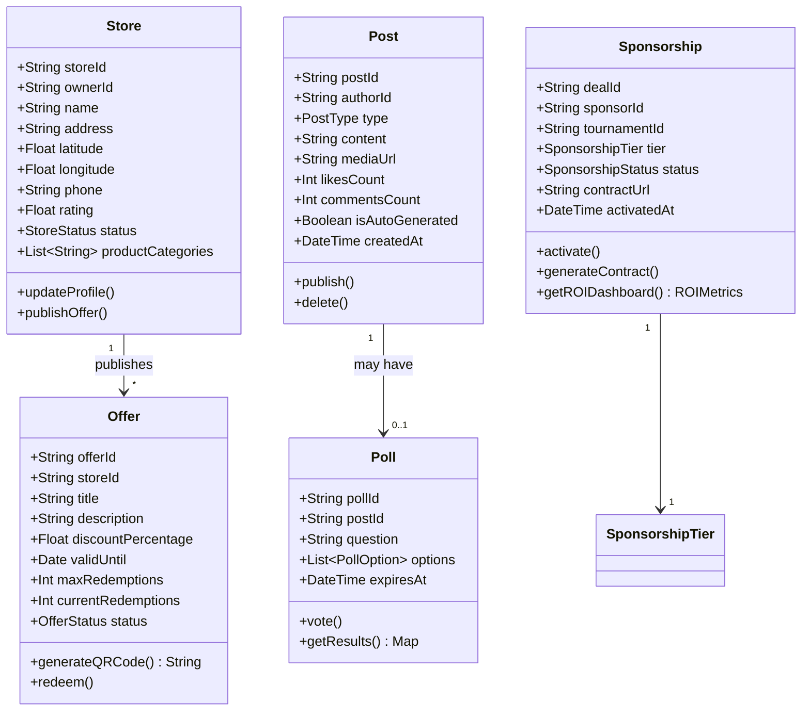

# Class Diagram — CricZone: Local Cricket Community Platform

> Class diagrams are organized by **bounded context** (DDD). Relationships (association, composition, dependency) are shown across contexts where coupling exists.

---

## 1. Identity & Access Management

```mermaid
classDiagram
    class User {
        +String userId
        +String mobileNumber
        +String name
        +String email
        +String profilePhotoUrl
        +String city
        +UserRole role
        +UserStatus status
        +DateTime createdAt
        +register()
        +verifyOTP()
        +updateProfile()
        +deactivate()
    }

    class UserRole {
        <<enumeration>>
        PLAYER
        ORGANIZER
        FAN
        SCORER
        STORE_OWNER
        SPONSOR
        ADMIN
    }

    class UserStatus {
        <<enumeration>>
        PENDING_VERIFICATION
        ACTIVE
        SUSPENDED
        DEACTIVATED
    }

    class KYCVerification {
        +String kycId
        +String userId
        +String documentType
        +String documentNumber
        +KYCStatus status
        +DateTime verifiedAt
        +verify()
        +reject()
    }

    class KYCStatus {
        <<enumeration>>
        PENDING
        APPROVED
        REJECTED
    }

    class Session {
        +String sessionId
        +String userId
        +String jwtToken
        +String refreshToken
        +DateTime expiresAt
        +invalidate()
        +refresh()
    }

    User "1" --> "1" UserRole : has
    User "1" --> "1" UserStatus : has
    User "1" --> "0..1" KYCVerification : undergoes
    KYCVerification "1" --> "1" KYCStatus : has
    User "1" --> "*" Session : opens
```

---

## 2. Tournament & Competition Management

```mermaid
classDiagram
    class Tournament {
        +String tournamentId
        +String name
        +TournamentFormat format
        +TournamentStatus status
        +String organizerId
        +Date startDate
        +Date endDate
        +Int maxTeams
        +String city
        +create()
        +openRegistration()
        +autoScheduleFixtures()
        +close()
        +clone() Tournament
    }

    class TournamentFormat {
        <<enumeration>>
        T20
        ODI
        BOX_CRICKET
        ONE_DAY_LEAGUE
    }

    class TournamentStatus {
        <<enumeration>>
        DRAFT
        REGISTRATION_OPEN
        IN_PROGRESS
        COMPLETED
        CANCELLED
    }

    class Team {
        +String teamId
        +String teamName
        +String captainId
        +String tournamentId
        +List~String~ playerIds
        +Int squadSize
        +register()
        +selectPlayingXI() List~String~
    }

    class TeamRegistration {
        +String registrationId
        +String teamId
        +String tournamentId
        +RegistrationStatus status
        +DateTime registeredAt
        +approve()
        +reject()
    }

    class Fixture {
        +String fixtureId
        +String tournamentId
        +String team1Id
        +String team2Id
        +String groundId
        +String umpireId
        +DateTime scheduledAt
        +MatchRound round
        +schedule()
        +reschedule()
    }

    class PointsTableEntry {
        +String teamId
        +String tournamentId
        +Int matchesPlayed
        +Int wins
        +Int losses
        +Int noResults
        +Int points
        +Float netRunRate
        +update()
    }

    Tournament "1" --> "*" Team : has
    Tournament "1" --> "*" Fixture : contains
    Tournament "1" --> "*" PointsTableEntry : tracks
    Team "1" --> "1" TeamRegistration : created via
    TeamRegistration "1" --> "1" RegistrationStatus
    Fixture "1" --> "1" MatchRound
```

---

## 3. Live Match & Scoring

```mermaid
classDiagram
    class Match {
        +String matchId
        +String fixtureId
        +MatchStatus status
        +String scorerId
        +String winnerTeamId
        +String resultSummary
        +start()
        +endInnings()
        +declareResult()
        +undo()
    }

    class MatchStatus {
        <<enumeration>>
        SCHEDULED
        IN_PROGRESS
        INNINGS_BREAK
        COMPLETED
        ABANDONED
    }

    class Innings {
        +String inningsId
        +String matchId
        +String battingTeamId
        +String bowlingTeamId
        +Int inningsNumber
        +Int totalRuns
        +Int totalWickets
        +Int totalExtras
        +Int oversCompleted
        +Int target
        +addBallEvent()
        +calculatePartnership()
    }

    class BallEvent {
        +String ballEventId
        +String matchId
        +String inningsId
        +Int overNumber
        +Int ballNumber
        +Int runsScored
        +WicketType wicketType
        +String dismissedBatsmanId
        +ExtraType extraType
        +Int extraRuns
        +String batsmanId
        +String bowlerId
        +DateTime recordedAt
    }

    class BattingCard {
        +String batsmanId
        +String matchId
        +Int runsScored
        +Int ballsFaced
        +Int fours
        +Int sixes
        +Boolean isOut
        +WicketType wicketType
        +String bowlerId
        +calculateStrikeRate() Float
    }

    class BowlingCard {
        +String bowlerId
        +String matchId
        +Int oversBowled
        +Int runsConceded
        +Int wicketsTaken
        +Int maidenOvers
        +Int wides
        +Int noBalls
        +calculateEconomy() Float
    }

    class WicketType {
        <<enumeration>>
        BOWLED
        CAUGHT
        LBW
        RUN_OUT
        STUMPED
        HIT_WICKET
        RETIRED
    }

    Match "1" --> "2" Innings : has
    Innings "1" --> "*" BallEvent : records
    Innings "1" --> "*" BattingCard : generates
    Innings "1" --> "*" BowlingCard : generates
    BallEvent "1" --> "0..1" WicketType : may have
```

---

## 4. Player Analytics & AI

```mermaid
classDiagram
    class PlayerProfile {
        +String playerId
        +String userId
        +String primaryRole
        +String battingStyle
        +String bowlingStyle
        +Int matchesPlayed
        +DateTime debutDate
    }

    class CareerStats {
        +String playerId
        +Int totalRuns
        +Int totalWickets
        +Int totalCatches
        +Float battingAverage
        +Float battingStrikeRate
        +Float bowlingAverage
        +Float bowlingEconomy
        +Int centuries
        +Int halfCenturies
        +Int bestBowlingWickets
        +Int bestBowlingRuns
        +update()
    }

    class MatchPerformance {
        +String performanceId
        +String playerId
        +String matchId
        +Int runsScored
        +Int ballsFaced
        +Int wicketsTaken
        +Float economy
        +Int catches
        +DateTime matchDate
    }

    class PlayerPerformanceScore {
        +String ppsId
        +String playerId
        +Float score
        +String grade
        +DateTime calculatedAt
        +Map~String, Float~ componentScores
        +calculate()
        +getGrade() String
    }

    class AIInsight {
        +String insightId
        +String playerId
        +String insightText
        +String insightCategory
        +Float confidenceScore
        +DateTime generatedAt
        +generate()
    }

    PlayerProfile "1" --> "1" CareerStats : has
    PlayerProfile "1" --> "*" MatchPerformance : has
    PlayerProfile "1" --> "1" PlayerPerformanceScore : has
    PlayerProfile "1" --> "*" AIInsight : receives
```

---

## 5. Commerce & Social

```mermaid
classDiagram
    class Store {
        +String storeId
        +String ownerId
        +String name
        +String address
        +Float latitude
        +Float longitude
        +String phone
        +Float rating
        +StoreStatus status
        +List~String~ productCategories
        +updateProfile()
        +publishOffer()
    }

    class Offer {
        +String offerId
        +String storeId
        +String title
        +String description
        +Float discountPercentage
        +Date validUntil
        +Int maxRedemptions
        +Int currentRedemptions
        +OfferStatus status
        +generateQRCode() String
        +redeem()
    }

    class Post {
        +String postId
        +String authorId
        +PostType type
        +String content
        +String mediaUrl
        +Int likesCount
        +Int commentsCount
        +Boolean isAutoGenerated
        +DateTime createdAt
        +publish()
        +delete()
    }

    class Poll {
        +String pollId
        +String postId
        +String question
        +List~PollOption~ options
        +DateTime expiresAt
        +vote()
        +getResults() Map
    }

    class Sponsorship {
        +String dealId
        +String sponsorId
        +String tournamentId
        +SponsorshipTier tier
        +SponsorshipStatus status
        +String contractUrl
        +DateTime activatedAt
        +activate()
        +generateContract()
        +getROIDashboard() ROIMetrics
    }

    Store "1" --> "*" Offer : publishes
    Post "1" --> "0..1" Poll : may have
    Sponsorship "1" --> "1" SponsorshipTier
```
