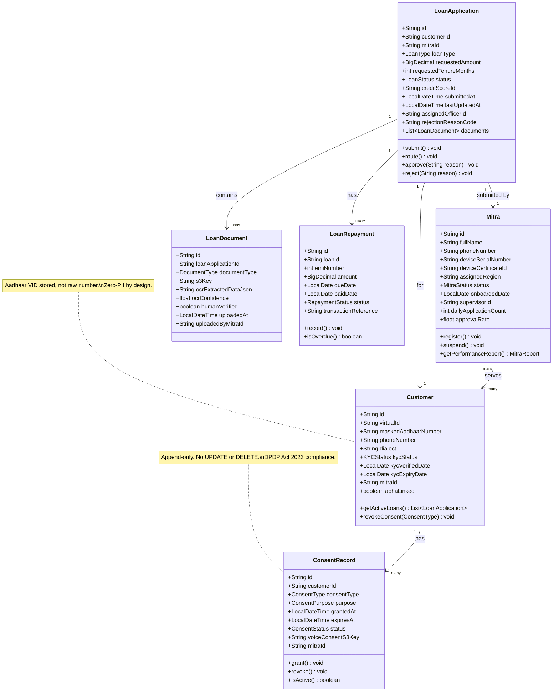
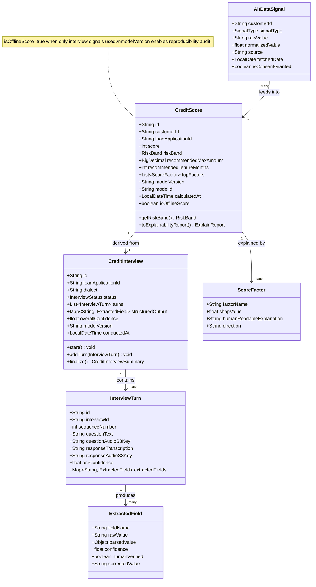
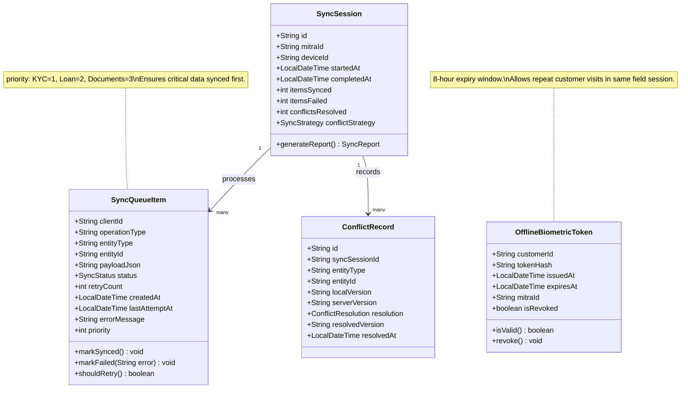
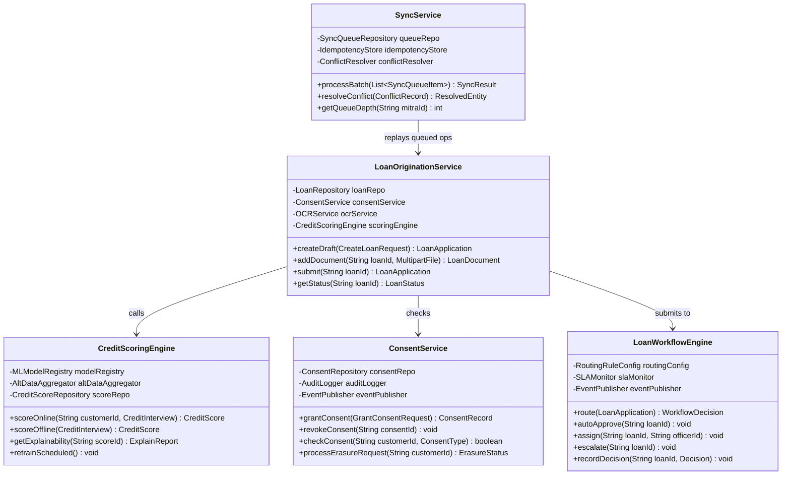
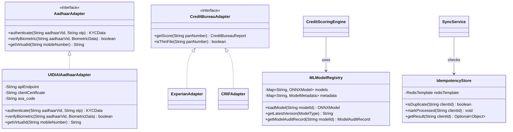

# Mitra Finance — Class Diagram

> **⚠️ Core Requirements**: Classes are organized by bounded context and map to [ARCHITECTURE.md](./ARCHITECTURE.md) service boundaries.

## Table of Contents
1. [Domain Layer — Core Entities](#domain-layer--core-entities)
2. [AI & Scoring Domain](#ai--scoring-domain)
3. [Offline & Sync Domain](#offline--sync-domain)
4. [Service Layer](#service-layer)
5. [Infrastructure / Adapter Layer](#infrastructure--adapter-layer)

---

## Domain Layer — Core Entities

```mermaid
classDiagram
    class Mitra {
        +String id
        +String fullName
        +String phoneNumber
        +String deviceSerialNumber
        +String deviceCertificateId
        +String assignedRegion
        +MitraStatus status
        +LocalDate onboardedDate
        +String supervisorId
        +int dailyApplicationCount
        +float approvalRate
        +register() void
        +suspend() void
        +getPerformanceReport() MitraReport
    }

    class Customer {
        +String id
        +String virtualId
        +String maskedAadhaarNumber
        +String phoneNumber
        +String dialect
        +KYCStatus kycStatus
        +LocalDate kycVerifiedDate
        +LocalDate kycExpiryDate
        +String mitraId
        +boolean abhaLinked
        +getActiveLoans() List~LoanApplication~
        +revokeConsent(ConsentType) void
    }

    class LoanApplication {
        +String id
        +String customerId
        +String mitraId
        +LoanType loanType
        +BigDecimal requestedAmount
        +int requestedTenureMonths
        +LoanStatus status
        +String creditScoreId
        +LocalDateTime submittedAt
        +LocalDateTime lastUpdatedAt
        +String assignedOfficerId
        +String rejectionReasonCode
        +List~LoanDocument~ documents
        +submit() void
        +route() void
        +approve(String reason) void
        +reject(String reason) void
    }

    class LoanDocument {
        +String id
        +String loanApplicationId
        +DocumentType documentType
        +String s3Key
        +String ocrExtractedDataJson
        +float ocrConfidence
        +boolean humanVerified
        +LocalDateTime uploadedAt
        +String uploadedByMitraId
    }

    class ConsentRecord {
        +String id
        +String customerId
        +ConsentType consentType
        +ConsentPurpose purpose
        +LocalDateTime grantedAt
        +LocalDateTime expiresAt
        +ConsentStatus status
        +String voiceConsentS3Key
        +String mitraId
        +grant() void
        +revoke() void
        +isActive() boolean
    }

    class LoanRepayment {
        +String id
        +String loanId
        +int emiNumber
        +BigDecimal amount
        +LocalDate dueDate
        +LocalDate paidDate
        +RepaymentStatus status
        +String transactionReference
        +record() void
        +isOverdue() boolean
    }

    LoanApplication "1" --> "many" LoanDocument : contains
    LoanApplication "1" --> "1" Customer : for
    LoanApplication "1" --> "1" Mitra : submitted by
    LoanApplication "1" --> "many" LoanRepayment : has
    Customer "1" --> "many" ConsentRecord : has
    Mitra "many" --> "many" Customer : serves

    note for ConsentRecord "Append-only. No UPDATE or DELETE.\nDPDP Act 2023 compliance."
    note for Customer "Aadhaar VID stored, not raw number.\nZero-PII by design."
```

---

## AI & Scoring Domain

```mermaid
classDiagram
    class CreditInterview {
        +String id
        +String loanApplicationId
        +String dialect
        +InterviewStatus status
        +List~InterviewTurn~ turns
        +Map~String, ExtractedField~ structuredOutput
        +float overallConfidence
        +String modelVersion
        +LocalDateTime conductedAt
        +start() void
        +addTurn(InterviewTurn) void
        +finalize() CreditInterviewSummary
    }

    class InterviewTurn {
        +String id
        +String interviewId
        +int sequenceNumber
        +String questionText
        +String questionAudioS3Key
        +String responseTranscription
        +String responseAudioS3Key
        +float asrConfidence
        +Map~String, ExtractedField~ extractedFields
    }

    class ExtractedField {
        +String fieldName
        +String rawValue
        +Object parsedValue
        +float confidence
        +boolean humanVerified
        +String correctedValue
    }

    class CreditScore {
        +String id
        +String customerId
        +String loanApplicationId
        +int score
        +RiskBand riskBand
        +BigDecimal recommendedMaxAmount
        +int recommendedTenureMonths
        +List~ScoreFactor~ topFactors
        +String modelVersion
        +String modelId
        +LocalDateTime calculatedAt
        +boolean isOfflineScore
        +getRiskBand() RiskBand
        +toExplainabilityReport() ExplainReport
    }

    class ScoreFactor {
        +String factorName
        +float shapValue
        +String humanReadableExplanation
        +String direction
    }

    class AltDataSignal {
        +String customerId
        +SignalType signalType
        +String rawValue
        +float normalizedValue
        +String source
        +LocalDate fetchedDate
        +boolean isConsentGranted
    }

    CreditInterview "1" --> "many" InterviewTurn : contains
    InterviewTurn "1" --> "many" ExtractedField : produces
    CreditScore "1" --> "many" ScoreFactor : explained by
    CreditScore "1" --> "1" CreditInterview : derived from
    AltDataSignal "many" --> "1" CreditScore : feeds into

    note for CreditScore "isOfflineScore=true when only interview signals used.\nmodelVersion enables reproducibility audit."
```

---

## Offline & Sync Domain

```mermaid
classDiagram
    class SyncQueueItem {
        +String clientId
        +String operationType
        +String entityType
        +String entityId
        +String payloadJson
        +SyncStatus status
        +int retryCount
        +LocalDateTime createdAt
        +LocalDateTime lastAttemptAt
        +String errorMessage
        +int priority
        +markSynced() void
        +markFailed(String error) void
        +shouldRetry() boolean
    }

    class SyncSession {
        +String id
        +String mitraId
        +String deviceId
        +LocalDateTime startedAt
        +LocalDateTime completedAt
        +int itemsSynced
        +int itemsFailed
        +int conflictsResolved
        +SyncStrategy conflictStrategy
        +generateReport() SyncReport
    }

    class ConflictRecord {
        +String id
        +String syncSessionId
        +String entityType
        +String entityId
        +String localVersion
        +String serverVersion
        +ConflictResolution resolution
        +String resolvedVersion
        +LocalDateTime resolvedAt
    }

    class OfflineBiometricToken {
        +String customerId
        +String tokenHash
        +LocalDateTime issuedAt
        +LocalDateTime expiresAt
        +String mitraId
        +boolean isRevoked
        +isValid() boolean
        +revoke() void
    }

    SyncSession "1" --> "many" SyncQueueItem : processes
    SyncSession "1" --> "many" ConflictRecord : records
    
    note for SyncQueueItem "priority: KYC=1, Loan=2, Documents=3\nEnsures critical data synced first."
    note for OfflineBiometricToken "8-hour expiry window.\nAllows repeat customer visits in same field session."
```

---

## Service Layer

```mermaid
classDiagram
    class LoanOriginationService {
        -LoanRepository loanRepo
        -ConsentService consentService
        -OCRService ocrService
        -CreditScoringEngine scoringEngine
        +createDraft(CreateLoanRequest) LoanApplication
        +addDocument(String loanId, MultipartFile) LoanDocument
        +submit(String loanId) LoanApplication
        +getStatus(String loanId) LoanStatus
    }

    class CreditScoringEngine {
        -MLModelRegistry modelRegistry
        -AltDataAggregator altDataAggregator
        -CreditScoreRepository scoreRepo
        +scoreOnline(String customerId, CreditInterview) CreditScore
        +scoreOffline(CreditInterview) CreditScore
        +getExplainability(String scoreId) ExplainReport
        +retrainScheduled() void
    }

    class SyncService {
        -SyncQueueRepository queueRepo
        -IdempotencyStore idempotencyStore
        -ConflictResolver conflictResolver
        +processBatch(List~SyncQueueItem~) SyncResult
        +resolveConflict(ConflictRecord) ResolvedEntity
        +getQueueDepth(String mitraId) int
    }

    class ConsentService {
        -ConsentRepository consentRepo
        -AuditLogger auditLogger
        -EventPublisher eventPublisher
        +grantConsent(GrantConsentRequest) ConsentRecord
        +revokeConsent(String consentId) void
        +checkConsent(String customerId, ConsentType) boolean
        +processErasureRequest(String customerId) ErasureStatus
    }

    class LoanWorkflowEngine {
        -RoutingRuleConfig routingConfig
        -SLAMonitor slaMonitor
        -EventPublisher eventPublisher
        +route(LoanApplication) WorkflowDecision
        +autoApprove(String loanId) void
        +assign(String loanId, String officerId) void
        +escalate(String loanId) void
        +recordDecision(String loanId, Decision) void
    }

    LoanOriginationService --> CreditScoringEngine : calls
    LoanOriginationService --> ConsentService : checks
    LoanOriginationService --> LoanWorkflowEngine : submits to
    SyncService --> LoanOriginationService : replays queued ops
```

---

## Infrastructure / Adapter Layer

```mermaid
classDiagram
    class AadhaarAdapter {
        <<interface>>
        +authenticate(String aadhaarVid, String otp) KYCData
        +verifyBiometric(String aadhaarVid, BiometricData) boolean
        +getVirtualId(String mobileNumber) String
    }

    class UIDIAIAadhaarAdapter {
        -String apiEndpoint
        -String clientCertificate
        -String asa_code
        +authenticate(String aadhaarVid, String otp) KYCData
        +verifyBiometric(String aadhaarVid, BiometricData) boolean
        +getVirtualId(String mobileNumber) String
    }

    class CreditBureauAdapter {
        <<interface>>
        +getScore(String panNumber) CreditBureauReport
        +isThinFile(String panNumber) boolean
    }

    class MLModelRegistry {
        -Map~String, ONNXModel~ models
        -Map~String, ModelMetadata~ metadata
        +loadModel(String modelId) ONNXModel
        +getLatestVersion(ModelType) String
        +getModelAuditRecord(String modelId) ModelAuditRecord
    }

    class IdempotencyStore {
        -RedisTemplate redisTemplate
        +isDuplicate(String clientId) boolean
        +markProcessed(String clientId) void
        +getResult(String clientId) Optional~Object~
    }

    AadhaarAdapter <|.. UIDIAIAadhaarAdapter
    CreditBureauAdapter <|.. ExperianAdapter
    CreditBureauAdapter <|.. CRIFAdapter
    CreditScoringEngine --> MLModelRegistry : uses
    SyncService --> IdempotencyStore : checks
```

---

**Last Updated**: February 2026
**Version**: 1.0
**Status**: Design Complete
