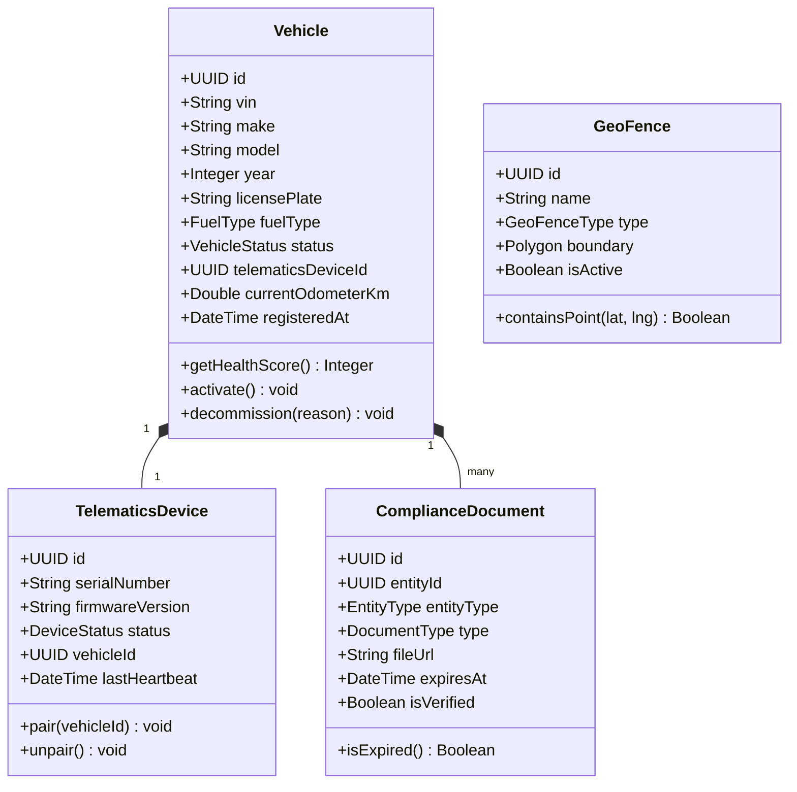
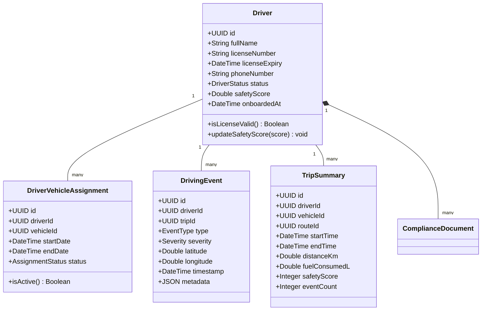
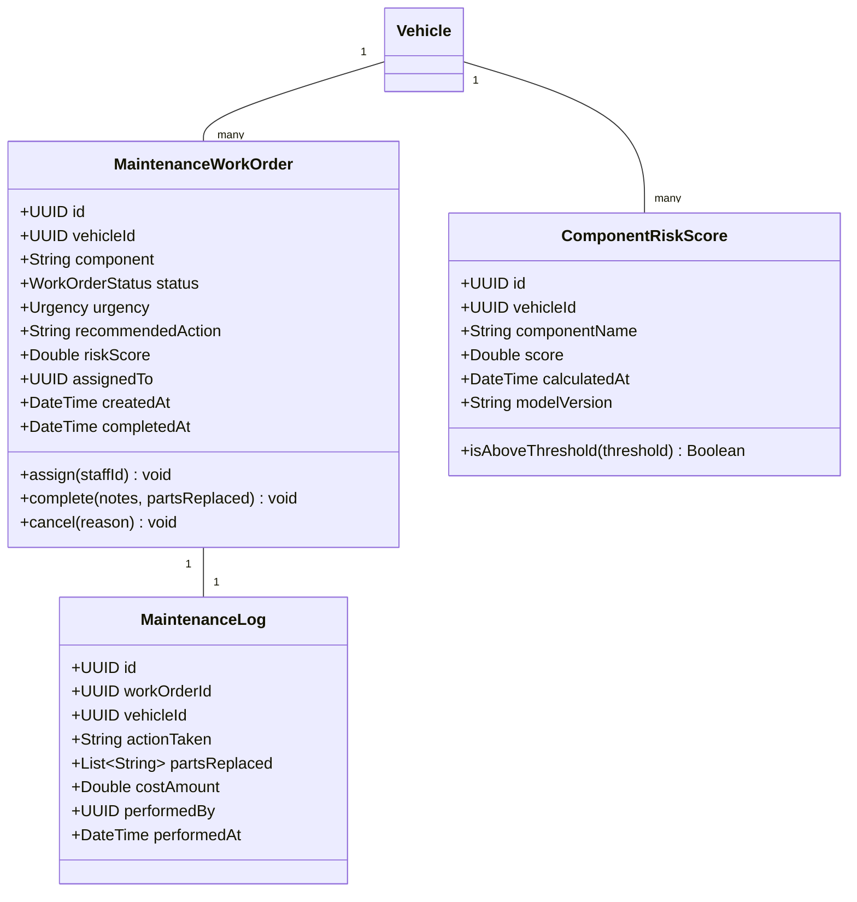
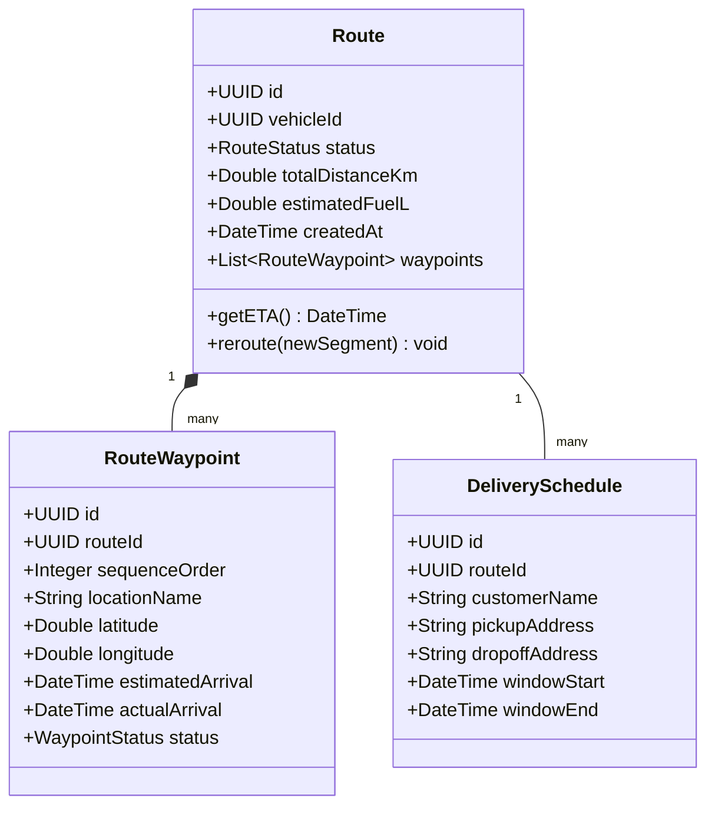
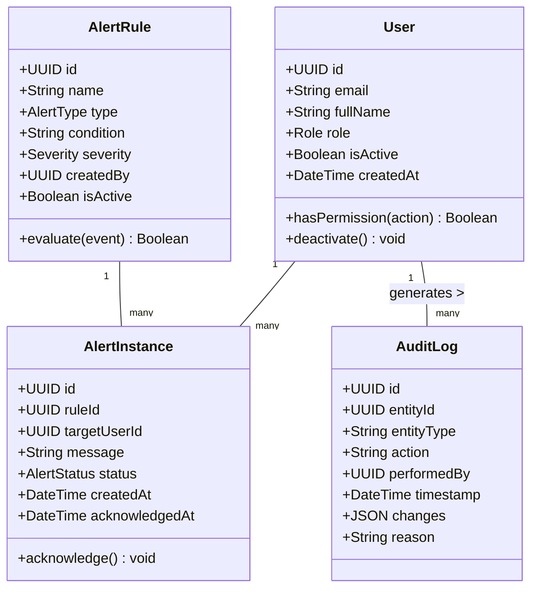
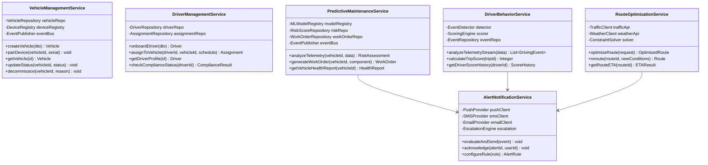
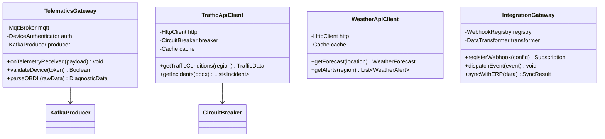
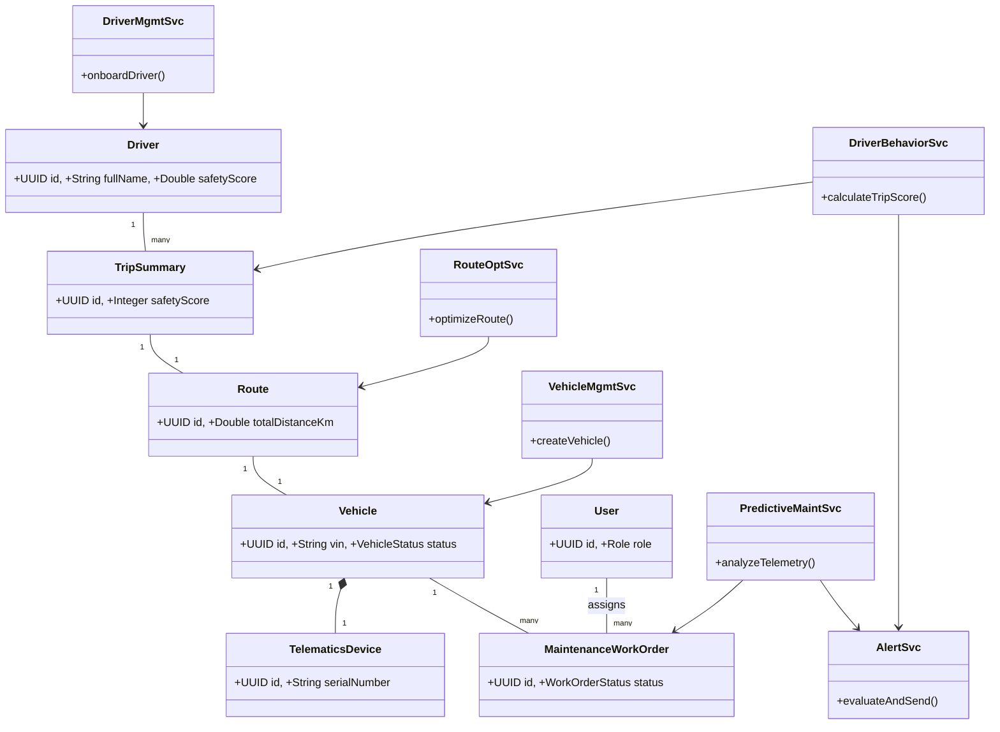

# Class Diagram — AI-Driven Fleet Management Optimization Platform

> **⚠️ Core Requirements**: Classes are designed around the functional requirements in [FUNCTIONAL_REQUIREMENTS.md](./FUNCTIONAL_REQUIREMENTS.md) and the microservices in [MICROSERVICES.md](./MICROSERVICES.md).

## Table of Contents
1. [Overview](#overview)
2. [Domain Layer Classes](#domain-layer-classes)
3. [Service Layer Classes](#service-layer-classes)
4. [Infrastructure Layer Classes](#infrastructure-layer-classes)
5. [Complete Class Diagram](#complete-class-diagram)
6. [Class Relationships](#class-relationships)

---

## Overview

The Fleet Management platform follows an **Event-Driven Microservices Architecture**:

- **Domain Layer**: Core business entities (Vehicle, Driver, Route, MaintenanceOrder).
- **Service Layer**: Business logic (Predictive Maintenance, Route Optimization, Driver Analytics).
- **Infrastructure Layer**: IoT ingestion, external integrations, and data persistence.

---

## Domain Layer Classes

### Fleet Asset Domain

```mermaid
classDiagram
    class Vehicle {
        +UUID id
        +String vin
        +String make
        +String model
        +Integer year
        +String licensePlate
        +FuelType fuelType
        +VehicleStatus status
        +UUID telematicsDeviceId
        +Double currentOdometerKm
        +DateTime registeredAt
        +getHealthScore() Integer
        +activate() void
        +decommission(reason) void
    }

    class TelematicsDevice {
        +UUID id
        +String serialNumber
        +String firmwareVersion
        +DeviceStatus status
        +UUID vehicleId
        +DateTime lastHeartbeat
        +pair(vehicleId) void
        +unpair() void
    }

    class ComplianceDocument {
        +UUID id
        +UUID entityId
        +EntityType entityType
        +DocumentType type
        +String fileUrl
        +DateTime expiresAt
        +Boolean isVerified
        +isExpired() Boolean
    }

    class GeoFence {
        +UUID id
        +String name
        +GeoFenceType type
        +Polygon boundary
        +Boolean isActive
        +containsPoint(lat, lng) Boolean
    }

    Vehicle "1" *-- "1" TelematicsDevice
    Vehicle "1" *-- "many" ComplianceDocument
```

### Driver & Workforce Domain

```mermaid
classDiagram
    class Driver {
        +UUID id
        +String fullName
        +String licenseNumber
        +DateTime licenseExpiry
        +String phoneNumber
        +DriverStatus status
        +Double safetyScore
        +DateTime onboardedAt
        +isLicenseValid() Boolean
        +updateSafetyScore(score) void
    }

    class DriverVehicleAssignment {
        +UUID id
        +UUID driverId
        +UUID vehicleId
        +DateTime startDate
        +DateTime endDate
        +AssignmentStatus status
        +isActive() Boolean
    }

    class DrivingEvent {
        +UUID id
        +UUID driverId
        +UUID tripId
        +EventType type
        +Severity severity
        +Double latitude
        +Double longitude
        +DateTime timestamp
        +JSON metadata
    }

    class TripSummary {
        +UUID id
        +UUID driverId
        +UUID vehicleId
        +UUID routeId
        +DateTime startTime
        +DateTime endTime
        +Double distanceKm
        +Double fuelConsumedL
        +Integer safetyScore
        +Integer eventCount
    }

    Driver "1" -- "many" DriverVehicleAssignment
    Driver "1" -- "many" DrivingEvent
    Driver "1" -- "many" TripSummary
    Driver "1" *-- "many" ComplianceDocument
```

### Maintenance Domain

```mermaid
classDiagram
    class MaintenanceWorkOrder {
        +UUID id
        +UUID vehicleId
        +String component
        +WorkOrderStatus status
        +Urgency urgency
        +String recommendedAction
        +Double riskScore
        +UUID assignedTo
        +DateTime createdAt
        +DateTime completedAt
        +assign(staffId) void
        +complete(notes, partsReplaced) void
        +cancel(reason) void
    }

    class ComponentRiskScore {
        +UUID id
        +UUID vehicleId
        +String componentName
        +Double score
        +DateTime calculatedAt
        +String modelVersion
        +isAboveThreshold(threshold) Boolean
    }

    class MaintenanceLog {
        +UUID id
        +UUID workOrderId
        +UUID vehicleId
        +String actionTaken
        +List~String~ partsReplaced
        +Double costAmount
        +UUID performedBy
        +DateTime performedAt
    }

    MaintenanceWorkOrder "1" -- "1" MaintenanceLog
    Vehicle "1" -- "many" MaintenanceWorkOrder
    Vehicle "1" -- "many" ComponentRiskScore
```

### Route & Logistics Domain

```mermaid
classDiagram
    class Route {
        +UUID id
        +UUID vehicleId
        +RouteStatus status
        +Double totalDistanceKm
        +Double estimatedFuelL
        +DateTime createdAt
        +List~RouteWaypoint~ waypoints
        +getETA() DateTime
        +reroute(newSegment) void
    }

    class RouteWaypoint {
        +UUID id
        +UUID routeId
        +Integer sequenceOrder
        +String locationName
        +Double latitude
        +Double longitude
        +DateTime estimatedArrival
        +DateTime actualArrival
        +WaypointStatus status
    }

    class DeliverySchedule {
        +UUID id
        +UUID routeId
        +String customerName
        +String pickupAddress
        +String dropoffAddress
        +DateTime windowStart
        +DateTime windowEnd
    }

    Route "1" *-- "many" RouteWaypoint
    Route "1" -- "many" DeliverySchedule
```

### User & Access Control Domain

```mermaid
classDiagram
    class User {
        +UUID id
        +String email
        +String fullName
        +Role role
        +Boolean isActive
        +DateTime createdAt
        +hasPermission(action) Boolean
        +deactivate() void
    }

    class AlertRule {
        +UUID id
        +String name
        +AlertType type
        +String condition
        +Severity severity
        +UUID createdBy
        +Boolean isActive
        +evaluate(event) Boolean
    }

    class AlertInstance {
        +UUID id
        +UUID ruleId
        +UUID targetUserId
        +String message
        +AlertStatus status
        +DateTime createdAt
        +DateTime acknowledgedAt
        +acknowledge() void
    }

    class AuditLog {
        +UUID id
        +UUID entityId
        +String entityType
        +String action
        +UUID performedBy
        +DateTime timestamp
        +JSON changes
        +String reason
    }

    User "1" -- "many" AlertInstance
    User "1" -- "many" AuditLog : generates >
    AlertRule "1" -- "many" AlertInstance
```

---

## Service Layer Classes

### Core Business Services

```mermaid
classDiagram
    class VehicleManagementService {
        -VehicleRepository vehicleRepo
        -DeviceRegistry deviceRegistry
        -EventPublisher eventBus
        +createVehicle(dto) Vehicle
        +pairDevice(vehicleId, serial) void
        +getVehicle(id) Vehicle
        +updateStatus(vehicleId, status) void
        +decommission(vehicleId, reason) void
    }

    class DriverManagementService {
        -DriverRepository driverRepo
        -AssignmentRepository assignmentRepo
        +onboardDriver(dto) Driver
        +assignToVehicle(driverId, vehicleId, schedule) Assignment
        +getDriverProfile(id) Driver
        +checkComplianceStatus(driverId) ComplianceResult
    }

    class PredictiveMaintenanceService {
        -MLModelRegistry modelRegistry
        -RiskScoreRepository riskRepo
        -WorkOrderRepository workOrderRepo
        -EventPublisher eventBus
        +analyzeTelemetry(vehicleId, data) RiskAssessment
        +generateWorkOrder(vehicleId, component) WorkOrder
        +getVehicleHealthReport(vehicleId) HealthReport
    }

    class RouteOptimizationService {
        -TrafficClient trafficApi
        -WeatherClient weatherApi
        -ConstraintSolver solver
        +optimizeRoute(request) OptimizedRoute
        +reroute(routeId, newConditions) Route
        +getRouteETA(routeId) ETAResult
    }

    class DriverBehaviorService {
        -EventDetector detector
        -ScoringEngine scorer
        -EventRepository eventRepo
        +analyzeTelemetryStream(data) List~DrivingEvent~
        +calculateTripScore(tripId) Integer
        +getDriverScoreHistory(driverId) ScoreHistory
    }

    class AlertNotificationService {
        -PushProvider pushClient
        -SMSProvider smsClient
        -EmailProvider emailClient
        -EscalationEngine escalation
        +evaluateAndSend(event) void
        +acknowledge(alertId, userId) void
        +configureRule(rule) AlertRule
    }

    PredictiveMaintenanceService --> AlertNotificationService
    DriverBehaviorService --> AlertNotificationService
    RouteOptimizationService --> AlertNotificationService
```

---

## Infrastructure Layer Classes

```mermaid
classDiagram
    class TelematicsGateway {
        -MqttBroker mqtt
        -DeviceAuthenticator auth
        -KafkaProducer producer
        +onTelemetryReceived(payload) void
        +validateDevice(token) Boolean
        +parseOBDII(rawData) DiagnosticData
    }

    class TrafficApiClient {
        -HttpClient http
        -CircuitBreaker breaker
        -Cache cache
        +getTrafficConditions(region) TrafficData
        +getIncidents(bbox) List~Incident~
    }

    class WeatherApiClient {
        -HttpClient http
        -Cache cache
        +getForecast(location) WeatherForecast
        +getAlerts(region) List~WeatherAlert~
    }

    class IntegrationGateway {
        -WebhookRegistry registry
        -DataTransformer transformer
        +registerWebhook(config) Subscription
        +dispatchEvent(event) void
        +syncWithERP(data) SyncResult
    }

    TelematicsGateway --> KafkaProducer
    TrafficApiClient --> CircuitBreaker
```

---

## Complete Class Diagram

```mermaid
classDiagram
    %% Core Domain Entities
    class Vehicle { +UUID id, +String vin, +VehicleStatus status }
    class Driver { +UUID id, +String fullName, +Double safetyScore }
    class Route { +UUID id, +Double totalDistanceKm }
    class MaintenanceWorkOrder { +UUID id, +WorkOrderStatus status }
    class TripSummary { +UUID id, +Integer safetyScore }
    class User { +UUID id, +Role role }
    class TelematicsDevice { +UUID id, +String serialNumber }

    %% Services
    class VehicleMgmtSvc { +createVehicle() }
    class DriverMgmtSvc { +onboardDriver() }
    class PredictiveMaintSvc { +analyzeTelemetry() }
    class RouteOptSvc { +optimizeRoute() }
    class DriverBehaviorSvc { +calculateTripScore() }
    class AlertSvc { +evaluateAndSend() }

    %% Relationships
    Vehicle "1" *-- "1" TelematicsDevice
    Vehicle "1" -- "many" MaintenanceWorkOrder
    Driver "1" -- "many" TripSummary
    Route "1" -- "1" Vehicle
    TripSummary "1" -- "1" Route
    User "1" -- "many" MaintenanceWorkOrder : assigns

    VehicleMgmtSvc --> Vehicle
    DriverMgmtSvc --> Driver
    PredictiveMaintSvc --> MaintenanceWorkOrder
    RouteOptSvc --> Route
    DriverBehaviorSvc --> TripSummary
    PredictiveMaintSvc --> AlertSvc
    DriverBehaviorSvc --> AlertSvc
```

---

## Class Relationships

### Key Relationships

| Relationship | Description | Example |
|--------------|-------------|---------|
| **Composition** | Strong ownership (lifecycle-dependent) | Vehicle → TelematicsDevice |
| **Association** | Operational link | Driver → DriverVehicleAssignment → Vehicle |
| **Dependency** | Service usage | PredictiveMaintenanceService → AlertNotificationService |
| **Aggregation** | Grouping (independent lifecycle) | Route → RouteWaypoint |

1. **Vehicle → TelematicsDevice**: One device per vehicle. Device lifecycle is tied to the vehicle.
2. **Driver → DriverVehicleAssignment → Vehicle**: Many-to-many via assignment table. A driver can be assigned to multiple vehicles over time.
3. **Vehicle → MaintenanceWorkOrder**: A vehicle accumulates work orders over its lifecycle.
4. **Driver → TripSummary → Route**: Each trip is linked to a driver, a vehicle, and the route taken.
5. **PredictiveMaintenanceService → AlertNotificationService**: Maintenance alerts are routed through the central notification service.
