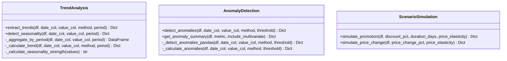

# Class Diagram - TrendMart BI Dashboard

> **⚠️ Core Requirements**: Classes are designed around the core requirements defined in [KEY_REQUIREMENTS.md](./KEY_REQUIREMENTS.md).

## Table of Contents
1. [Overview](#overview)
2. [Data Layer Classes](#data-layer-classes)
3. [Business Logic Layer Classes](#business-logic-layer-classes)
4. [Presentation Layer Classes](#presentation-layer-classes)
5. [Analytics Tools Classes](#analytics-tools-classes)
6. [Complete Class Diagram](#complete-class-diagram)

---

## Overview

The TrendMart BI Dashboard follows a **Modular Python Architecture**:

- **Data Layer**: Data loading and ETL operations (DataLoader)
- **Business Logic Layer**: Authentication, AI integration, query processing
- **Presentation Layer**: Streamlit UI components
- **Analytics Tools**: Modular analysis tools

---

## Data Layer Classes

---

## Business Logic Layer Classes

### Authentication & Authorization

### AI Integration

---

## Analytics Tools Classes

---

## Complete Class Diagram

---

## Class Relationships

### Key Relationships

| Relationship | Description | Example |
|--------------|-------------|---------|
| **Composition** | Strong ownership | DataLoader → Unified DataFrame |
| **Association** | Usage dependency | BIAgent → DataLoader |
| **Dependency** | Tool usage | BIAgent → TrendAnalysis |
| **Aggregation** | Collection | DataLoader → Multiple DataFrames |

1. **DataLoader → Unified DataFrame**: Creates and maintains unified data model
2. **BIAgent → Analytics Tools**: Dynamically selects and uses appropriate tools
3. **AuthManager → User Sessions**: Manages authentication state
4. **AIInsightsGenerator → Hugging Face API**: External service integration
