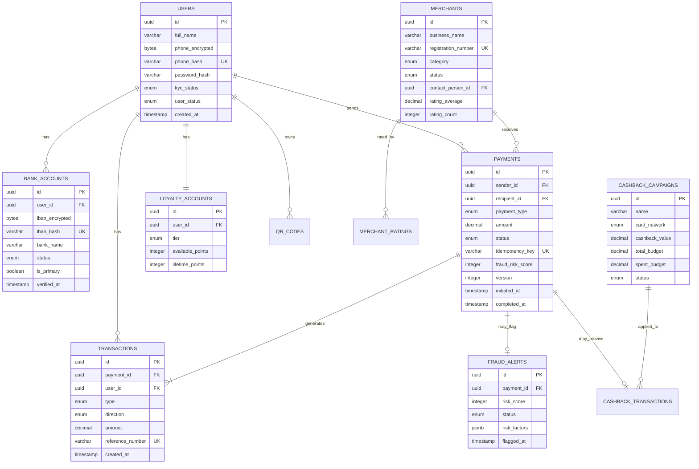

# PayFlow - Database Schema

> **⚠️ Core Requirements**: Database design supports [KEY_REQUIREMENTS.md](./KEY_REQUIREMENTS.md).

## Table of Contents
1. [Overview](#overview)
2. [Entity Relationship Diagram](#entity-relationship-diagram)
3. [Table Definitions](#table-definitions)
4. [Indexes](#indexes)
5. [Relationships](#relationships)

---

## Overview

- **PostgreSQL**: Primary relational data (users, payments, merchants, transactions)
- **Redis**: Caching, sessions, rate limiting, idempotency keys
- **Elasticsearch**: Transaction search
- **S3 + Parquet**: Long-term archival (3-5 years)

### Principles
1. 3NF for transactional tables
2. Soft deletes via `deleted_at`
3. Audit timestamps on all tables
4. UUIDs for primary keys
5. Transactions table partitioned by month
6. PII encrypted via pgcrypto

---

## Entity Relationship Diagram



---

## Table Definitions

### Users & Authentication

```sql
CREATE TYPE user_status AS ENUM ('active', 'suspended', 'deactivated', 'pending_verification');
CREATE TYPE kyc_status AS ENUM ('pending', 'in_review', 'verified', 'rejected', 'expired');

CREATE TABLE users (
    id UUID PRIMARY KEY DEFAULT gen_random_uuid(),
    full_name VARCHAR(200) NOT NULL,
    phone_encrypted BYTEA NOT NULL,
    phone_hash VARCHAR(64) NOT NULL UNIQUE,
    password_hash VARCHAR(255) NOT NULL,
    kyc_status kyc_status NOT NULL DEFAULT 'pending',
    user_status user_status NOT NULL DEFAULT 'pending_verification',
    kyc_document_urls JSONB,
    last_login_at TIMESTAMP,
    created_at TIMESTAMP NOT NULL DEFAULT NOW(),
    updated_at TIMESTAMP NOT NULL DEFAULT NOW(),
    deleted_at TIMESTAMP
);

CREATE TYPE bank_account_status AS ENUM ('pending_verification', 'active', 'inactive');

CREATE TABLE bank_accounts (
    id UUID PRIMARY KEY DEFAULT gen_random_uuid(),
    user_id UUID NOT NULL REFERENCES users(id),
    iban_encrypted BYTEA NOT NULL,
    iban_hash VARCHAR(64) NOT NULL UNIQUE,
    bank_name VARCHAR(100) NOT NULL,
    account_holder_name VARCHAR(200),
    status bank_account_status NOT NULL DEFAULT 'pending_verification',
    is_primary BOOLEAN NOT NULL DEFAULT false,
    verified_at TIMESTAMP,
    created_at TIMESTAMP NOT NULL DEFAULT NOW(),
    updated_at TIMESTAMP NOT NULL DEFAULT NOW()
);
```

### Merchants

```sql
CREATE TYPE merchant_category AS ENUM (
    'retail', 'food_beverage', 'grocery', 'health_pharmacy',
    'transportation', 'entertainment', 'education', 'services', 'other'
);
CREATE TYPE merchant_status AS ENUM ('pending_approval', 'active', 'suspended', 'deactivated');

CREATE TABLE merchants (
    id UUID PRIMARY KEY DEFAULT gen_random_uuid(),
    business_name VARCHAR(300) NOT NULL,
    registration_number VARCHAR(100) NOT NULL UNIQUE,
    category merchant_category NOT NULL,
    status merchant_status NOT NULL DEFAULT 'pending_approval',
    contact_person_id UUID NOT NULL REFERENCES users(id),
    settlement_iban_encrypted BYTEA NOT NULL,
    static_qr_url VARCHAR(500),
    rating_average DECIMAL(3, 2) DEFAULT 0.00,
    rating_count INTEGER DEFAULT 0,
    onboarded_at TIMESTAMP,
    onboarded_by UUID REFERENCES users(id),
    created_at TIMESTAMP NOT NULL DEFAULT NOW(),
    updated_at TIMESTAMP NOT NULL DEFAULT NOW(),
    deleted_at TIMESTAMP
);

CREATE TABLE merchant_ratings (
    id UUID PRIMARY KEY DEFAULT gen_random_uuid(),
    merchant_id UUID NOT NULL REFERENCES merchants(id),
    customer_id UUID NOT NULL REFERENCES users(id),
    stars INTEGER NOT NULL CHECK (stars >= 1 AND stars <= 5),
    review TEXT,
    created_at TIMESTAMP NOT NULL DEFAULT NOW(),
    UNIQUE(merchant_id, customer_id)
);
```

### Payments & Transactions

```sql
CREATE TYPE payment_type AS ENUM ('p2p', 'p2m', 'qr_payment', 'pos_payment');
CREATE TYPE payment_status AS ENUM ('initiated', 'fraud_check', 'authorized', 'processing', 'completed', 'failed', 'reversed', 'expired');
CREATE TYPE payment_method AS ENUM ('bank_transfer', 'wallet', 'qr_code', 'pos');

CREATE TABLE payments (
    id UUID PRIMARY KEY DEFAULT gen_random_uuid(),
    sender_id UUID NOT NULL REFERENCES users(id),
    recipient_id UUID NOT NULL,
    recipient_type VARCHAR(20) NOT NULL DEFAULT 'user',
    payment_type payment_type NOT NULL,
    amount DECIMAL(15, 2) NOT NULL CHECK (amount > 0),
    currency VARCHAR(3) NOT NULL DEFAULT 'SAR',
    fee DECIMAL(10, 2) NOT NULL DEFAULT 0.00,
    status payment_status NOT NULL DEFAULT 'initiated',
    method payment_method NOT NULL,
    source_bank_account_id UUID REFERENCES bank_accounts(id),
    idempotency_key VARCHAR(100) NOT NULL UNIQUE,
    bank_transaction_ref UUID,
    description VARCHAR(500),
    fraud_risk_score INTEGER DEFAULT 0,
    loyalty_points_used INTEGER DEFAULT 0,
    cashback_amount DECIMAL(10, 2) DEFAULT 0.00,
    version INTEGER NOT NULL DEFAULT 1,
    initiated_at TIMESTAMP NOT NULL DEFAULT NOW(),
    completed_at TIMESTAMP,
    created_at TIMESTAMP NOT NULL DEFAULT NOW()
);

CREATE TYPE transaction_type AS ENUM ('payment', 'refund', 'cashback', 'loyalty_redemption', 'fee');
CREATE TYPE transaction_direction AS ENUM ('debit', 'credit');

-- Partitioned by month for performance
CREATE TABLE transactions (
    id UUID NOT NULL DEFAULT gen_random_uuid(),
    payment_id UUID NOT NULL REFERENCES payments(id),
    user_id UUID NOT NULL REFERENCES users(id),
    type transaction_type NOT NULL,
    direction transaction_direction NOT NULL,
    amount DECIMAL(15, 2) NOT NULL,
    reference_number VARCHAR(50) NOT NULL,
    counterparty_name VARCHAR(200),
    metadata JSONB,
    created_at TIMESTAMP NOT NULL DEFAULT NOW(),
    PRIMARY KEY (id, created_at)
) PARTITION BY RANGE (created_at);

-- Event Sourcing for payment audit trail
CREATE TABLE payment_events (
    id UUID PRIMARY KEY DEFAULT gen_random_uuid(),
    payment_id UUID NOT NULL REFERENCES payments(id),
    event_type VARCHAR(50) NOT NULL,
    event_data JSONB NOT NULL,
    sequence_number INTEGER NOT NULL,
    created_at TIMESTAMP NOT NULL DEFAULT NOW(),
    UNIQUE(payment_id, sequence_number)
);
```

### Fraud, Loyalty, Cashback & Notifications

```sql
CREATE TYPE fraud_alert_status AS ENUM ('pending_review', 'approved', 'blocked', 'escalated');

CREATE TABLE fraud_alerts (
    id UUID PRIMARY KEY DEFAULT gen_random_uuid(),
    payment_id UUID NOT NULL REFERENCES payments(id),
    user_id UUID NOT NULL REFERENCES users(id),
    risk_score INTEGER NOT NULL CHECK (risk_score BETWEEN 0 AND 100),
    status fraud_alert_status NOT NULL DEFAULT 'pending_review',
    risk_factors JSONB NOT NULL,
    device_fingerprint VARCHAR(255),
    reviewed_by UUID REFERENCES users(id),
    review_notes TEXT,
    flagged_at TIMESTAMP NOT NULL DEFAULT NOW(),
    reviewed_at TIMESTAMP
);

CREATE TYPE loyalty_tier AS ENUM ('silver', 'gold', 'platinum');

CREATE TABLE loyalty_accounts (
    id UUID PRIMARY KEY DEFAULT gen_random_uuid(),
    user_id UUID NOT NULL REFERENCES users(id) UNIQUE,
    tier loyalty_tier NOT NULL DEFAULT 'silver',
    total_points INTEGER NOT NULL DEFAULT 0,
    available_points INTEGER NOT NULL DEFAULT 0,
    lifetime_points INTEGER NOT NULL DEFAULT 0,
    tier_evaluated_at TIMESTAMP NOT NULL DEFAULT NOW(),
    created_at TIMESTAMP NOT NULL DEFAULT NOW(),
    updated_at TIMESTAMP NOT NULL DEFAULT NOW()
);

CREATE TYPE card_network AS ENUM ('visa', 'mastercard', 'amex', 'local_debit');
CREATE TYPE campaign_status AS ENUM ('draft', 'active', 'paused', 'completed', 'expired');

CREATE TABLE cashback_campaigns (
    id UUID PRIMARY KEY DEFAULT gen_random_uuid(),
    name VARCHAR(200) NOT NULL,
    card_network card_network NOT NULL,
    cashback_value DECIMAL(10, 2) NOT NULL,
    min_transaction_amount DECIMAL(10, 2) DEFAULT 0.00,
    total_budget DECIMAL(15, 2) NOT NULL,
    spent_budget DECIMAL(15, 2) NOT NULL DEFAULT 0.00,
    status campaign_status NOT NULL DEFAULT 'draft',
    start_date TIMESTAMP NOT NULL,
    end_date TIMESTAMP NOT NULL,
    created_by UUID NOT NULL REFERENCES users(id),
    created_at TIMESTAMP NOT NULL DEFAULT NOW()
);

CREATE TABLE notification_preferences (
    id UUID PRIMARY KEY DEFAULT gen_random_uuid(),
    user_id UUID NOT NULL REFERENCES users(id),
    category VARCHAR(50) NOT NULL,
    push_enabled BOOLEAN NOT NULL DEFAULT true,
    sms_enabled BOOLEAN NOT NULL DEFAULT true,
    email_enabled BOOLEAN NOT NULL DEFAULT true,
    UNIQUE(user_id, category)
);

CREATE TABLE audit_logs (
    id UUID PRIMARY KEY DEFAULT gen_random_uuid(),
    actor_id UUID REFERENCES users(id),
    actor_type VARCHAR(20) NOT NULL,
    action VARCHAR(100) NOT NULL,
    entity_type VARCHAR(50) NOT NULL,
    entity_id UUID NOT NULL,
    old_value JSONB,
    new_value JSONB,
    ip_address INET,
    created_at TIMESTAMP NOT NULL DEFAULT NOW()
);
```

---

## Indexes

```sql
-- Users
CREATE INDEX idx_users_phone_hash ON users(phone_hash);
CREATE INDEX idx_users_status ON users(user_status);

-- Bank Accounts
CREATE INDEX idx_bank_accounts_user ON bank_accounts(user_id);

-- Merchants
CREATE INDEX idx_merchants_status ON merchants(status);
CREATE INDEX idx_merchants_category ON merchants(category);

-- Payments
CREATE INDEX idx_payments_sender ON payments(sender_id);
CREATE INDEX idx_payments_recipient ON payments(recipient_id, recipient_type);
CREATE INDEX idx_payments_status ON payments(status);
CREATE INDEX idx_payments_idempotency ON payments(idempotency_key);

-- Transactions (per partition)
CREATE INDEX idx_transactions_user_date ON transactions(user_id, created_at DESC);
CREATE INDEX idx_transactions_payment ON transactions(payment_id);

-- Fraud Alerts
CREATE INDEX idx_fraud_alerts_status ON fraud_alerts(status);
CREATE INDEX idx_fraud_alerts_score ON fraud_alerts(risk_score DESC);

-- Audit Logs
CREATE INDEX idx_audit_entity ON audit_logs(entity_type, entity_id);
CREATE INDEX idx_audit_actor ON audit_logs(actor_id, created_at DESC);
```

---

## Relationships

| Parent Table | Child Table | Relationship | Cascade |
|--------------|-------------|--------------|---------|
| users | bank_accounts | One-to-Many | CASCADE |
| users | payments (sender) | One-to-Many | RESTRICT |
| users | transactions | One-to-Many | RESTRICT |
| users | loyalty_accounts | One-to-One | CASCADE |
| merchants | payments (recipient) | One-to-Many | RESTRICT |
| merchants | merchant_ratings | One-to-Many | CASCADE |
| payments | transactions | One-to-Many | CASCADE |
| payments | fraud_alerts | One-to-One | CASCADE |
| payments | payment_events | One-to-Many | CASCADE |
| cashback_campaigns | cashback_transactions | One-to-Many | RESTRICT |

---

**Last Updated**: February 2026
**Version**: 1.0
**Status**: Design Complete
