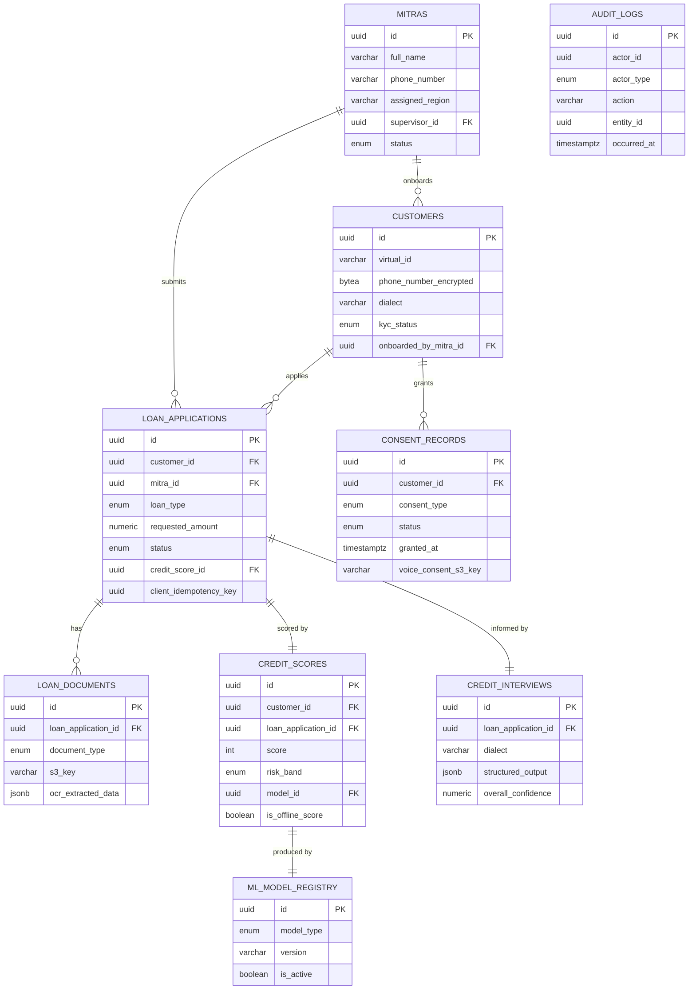

# Mitra Finance — Database Schema

> **⚠️ Core Requirements**: Schema designed for [KEY_REQUIREMENTS.md](./KEY_REQUIREMENTS.md). Includes cloud PostgreSQL schema AND on-device SQLite schema for offline-first operations.

## Table of Contents
1. [Cloud Schema (PostgreSQL)](#cloud-schema-postgresql)
2. [On-Device Schema (SQLite)](#on-device-schema-sqlite)
3. [Entity Relationship Diagram](#entity-relationship-diagram)
4. [Indexes & Performance](#indexes--performance)
5. [Data Partitioning Strategy](#data-partitioning-strategy)

---

## Cloud Schema (PostgreSQL)

### `mitras`
| Column | Type | Constraints | Description |
|--------|------|-------------|-------------|
| `id` | UUID | PK | Mitra unique identifier |
| `full_name` | VARCHAR(200) | NOT NULL | Mitra full name |
| `phone_number` | VARCHAR(15) | UNIQUE, NOT NULL | Registered phone |
| `device_serial` | VARCHAR(100) | UNIQUE | Physical device serial |
| `device_certificate_id` | VARCHAR(255) | UNIQUE | mTLS certificate reference |
| `assigned_region` | VARCHAR(100) | NOT NULL | e.g., "UP-East", "Bihar-North" |
| `supervisor_id` | UUID | FK → mitras.id | Reporting supervisor |
| `status` | ENUM('ACTIVE','SUSPENDED','PENDING') | NOT NULL DEFAULT 'PENDING' | |
| `onboarded_at` | TIMESTAMPTZ | NOT NULL | |
| `created_at` | TIMESTAMPTZ | DEFAULT NOW() | |

### `customers`
| Column | Type | Constraints | Description |
|--------|------|-------------|-------------|
| `id` | UUID | PK | Customer identifier |
| `virtual_id` | VARCHAR(255) | UNIQUE, NOT NULL | Aadhaar Virtual ID (VID) — not raw Aadhaar |
| `masked_aadhaar` | VARCHAR(20) | | Last 4 digits only (XXXX-XXXX-1234) |
| `phone_number_encrypted` | BYTEA | | AES-256 encrypted phone |
| `dialect` | VARCHAR(50) | | Detected dialect for TTS/ASR |
| `kyc_status` | ENUM('PENDING','VERIFIED','EXPIRED','REJECTED') | NOT NULL DEFAULT 'PENDING' | |
| `kyc_verified_at` | TIMESTAMPTZ | | |
| `kyc_expires_at` | TIMESTAMPTZ | | |
| `onboarded_by_mitra_id` | UUID | FK → mitras.id | |
| `abha_linked` | BOOLEAN | DEFAULT FALSE | ABHA health record linked |
| `created_at` | TIMESTAMPTZ | DEFAULT NOW() | |

> **Privacy Note**: No raw Aadhaar number stored. VID used as per UIDAI API spec.

### `loan_applications`
| Column | Type | Constraints | Description |
|--------|------|-------------|-------------|
| `id` | UUID | PK | |
| `customer_id` | UUID | NOT NULL, FK → customers.id | |
| `mitra_id` | UUID | NOT NULL, FK → mitras.id | |
| `loan_type` | ENUM('AGRICULTURE','MSME','PERSONAL') | NOT NULL | |
| `requested_amount` | NUMERIC(12,2) | NOT NULL, CHECK > 0 | In INR |
| `approved_amount` | NUMERIC(12,2) | | Filled on approval |
| `tenure_months` | INT | NOT NULL | |
| `status` | ENUM('DRAFT','QUEUED','SUBMITTED','UNDER_REVIEW','AUTO_APPROVED','APPROVED','REJECTED','DISBURSED','ACTIVE','CLOSED','NPA') | NOT NULL DEFAULT 'DRAFT' | |
| `credit_score_id` | UUID | FK → credit_scores.id | |
| `assigned_officer_id` | UUID | FK → users.id | Credit officer / RM |
| `rejection_reason_code` | VARCHAR(20) | | e.g., 'HIGH_RISK', 'INCOMPLETE_DOCS' |
| `submitted_at` | TIMESTAMPTZ | | |
| `approved_at` | TIMESTAMPTZ | | |
| `disbursed_at` | TIMESTAMPTZ | | |
| `client_idempotency_key` | UUID | UNIQUE | Prevents duplicate submissions from sync |
| `created_at` | TIMESTAMPTZ | DEFAULT NOW() | |

### `loan_documents`
| Column | Type | Constraints | Description |
|--------|------|-------------|-------------|
| `id` | UUID | PK | |
| `loan_application_id` | UUID | NOT NULL, FK → loan_applications.id | |
| `document_type` | ENUM('AADHAAR','PAN','UTILITY_BILL','LAND_RECORD','SHOP_LICENSE','MGNREGA_CARD','OTHER') | NOT NULL | |
| `s3_key` | VARCHAR(1024) | NOT NULL | S3 object key (ap-south-1) |
| `ocr_extracted_data` | JSONB | | Extracted fields + confidence per field |
| `ocr_confidence` | NUMERIC(4,3) | | 0.000–1.000 |
| `human_verified` | BOOLEAN | DEFAULT FALSE | |
| `uploaded_by_mitra_id` | UUID | FK → mitras.id | |
| `uploaded_at` | TIMESTAMPTZ | NOT NULL | |

### `consent_records`
| Column | Type | Constraints | Description |
|--------|------|-------------|-------------|
| `id` | UUID | PK | |
| `customer_id` | UUID | NOT NULL, FK → customers.id | |
| `consent_type` | ENUM('AADHAAR_EKYC','BIOMETRIC','CREDIT_BUREAU','UTILITY_DATA','MGNREGA_DATA','AGRI_DATA','ABHA_HEALTH','VOICE_INTERVIEW') | NOT NULL | |
| `purpose` | TEXT | NOT NULL | Human-readable purpose statement (in customer's dialect) |
| `status` | ENUM('GRANTED','REVOKED','EXPIRED') | NOT NULL DEFAULT 'GRANTED' | |
| `granted_at` | TIMESTAMPTZ | NOT NULL | |
| `expires_at` | TIMESTAMPTZ | NOT NULL | |
| `revoked_at` | TIMESTAMPTZ | | |
| `voice_consent_s3_key` | VARCHAR(1024) | | WAV recording of customer confirmation |
| `mitra_id` | UUID | NOT NULL, FK → mitras.id | |
| `ip_address` | INET | | Device IP at time of consent |

> **DPDP Compliance**: This table is **APPEND ONLY**. No UPDATE or DELETE statements permitted. Application-level guard + DB trigger enforces this.

### `credit_scores`
| Column | Type | Constraints | Description |
|--------|------|-------------|-------------|
| `id` | UUID | PK | |
| `customer_id` | UUID | NOT NULL, FK → customers.id | |
| `loan_application_id` | UUID | NOT NULL, FK → loan_applications.id | |
| `score` | INT | NOT NULL, CHECK BETWEEN 300 AND 850 | |
| `risk_band` | ENUM('LOW','MEDIUM','HIGH') | NOT NULL | |
| `recommended_max_amount` | NUMERIC(12,2) | | |
| `recommended_tenure_months` | INT | | |
| `top_factors` | JSONB | NOT NULL | Array of {factor, shap_value, explanation, direction} |
| `model_id` | UUID | NOT NULL, FK → ml_model_registry.id | |
| `model_version` | VARCHAR(50) | NOT NULL | e.g., "xgb-v3.2-2026Q1" |
| `is_offline_score` | BOOLEAN | DEFAULT FALSE | True if scored without external data |
| `input_feature_hash` | VARCHAR(64) | | SHA-256 of input vector (reproducibility) |
| `calculated_at` | TIMESTAMPTZ | NOT NULL | |

### `credit_interviews`
| Column | Type | Constraints | Description |
|--------|------|-------------|-------------|
| `id` | UUID | PK | |
| `loan_application_id` | UUID | NOT NULL, FK → loan_applications.id | |
| `dialect` | VARCHAR(50) | NOT NULL | e.g., "bhojpuri", "maithili" |
| `status` | ENUM('IN_PROGRESS','COMPLETED','ABANDONED') | NOT NULL | |
| `structured_output` | JSONB | | Extracted financial data |
| `overall_confidence` | NUMERIC(4,3) | | Average confidence across all fields |
| `model_version` | VARCHAR(50) | | ASR + LLM versions used |
| `conducted_at` | TIMESTAMPTZ | NOT NULL | |
| `completed_at` | TIMESTAMPTZ | | |

### `sync_queue` (Cloud — Received Sync Items)
| Column | Type | Constraints | Description |
|--------|------|-------------|-------------|
| `id` | UUID | PK | |
| `client_idempotency_key` | UUID | UNIQUE | Prevents re-processing |
| `mitra_id` | UUID | NOT NULL, FK → mitras.id | |
| `operation_type` | ENUM('CREATE','UPDATE') | NOT NULL | |
| `entity_type` | VARCHAR(100) | NOT NULL | e.g., 'LoanApplication', 'Customer' |
| `entity_id` | UUID | | |
| `payload` | BYTEA | NOT NULL | Compressed protobuf payload |
| `status` | ENUM('RECEIVED','PROCESSED','FAILED','CONFLICT') | DEFAULT 'RECEIVED' | |
| `received_at` | TIMESTAMPTZ | NOT NULL | |
| `processed_at` | TIMESTAMPTZ | | |
| `error_message` | TEXT | | |

### `audit_logs`
| Column | Type | Constraints | Description |
|--------|------|-------------|-------------|
| `id` | UUID | PK | |
| `actor_id` | UUID | NOT NULL | Mitra / Officer / System |
| `actor_type` | ENUM('MITRA','CREDIT_OFFICER','ADMIN','AI_ENGINE','SYSTEM') | NOT NULL | |
| `action` | VARCHAR(200) | NOT NULL | e.g., 'LOAN_SUBMITTED', 'CONSENT_REVOKED' |
| `entity_type` | VARCHAR(100) | | |
| `entity_id` | UUID | | |
| `metadata` | JSONB | | Additional context (IP, device, model version) |
| `occurred_at` | TIMESTAMPTZ | NOT NULL | |

> **Immutability**: Table has `NO UPDATE, NO DELETE` rule enforced via PG Row Security Policy.

### `ml_model_registry`
| Column | Type | Constraints | Description |
|--------|------|-------------|-------------|
| `id` | UUID | PK | |
| `model_type` | ENUM('CREDIT_SCORING','ASR','DIALECT_DETECTION','FACE_LIVENESS') | NOT NULL | |
| `version` | VARCHAR(50) | NOT NULL | Semantic version |
| `s3_artifact_key` | VARCHAR(1024) | | ONNX model artifact location |
| `training_dataset_hash` | VARCHAR(64) | | SHA-256 of training data (reproducibility) |
| `auc_score` | NUMERIC(6,4) | | Validation AUC (for scoring models) |
| `is_active` | BOOLEAN | DEFAULT FALSE | Only one per type can be active |
| `deployed_at` | TIMESTAMPTZ | | |
| `deprecated_at` | TIMESTAMPTZ | | |

---

## On-Device Schema (SQLite + SQLCipher)

The Mitra device maintains a mirror of relevant data with an additional `pending_sync` state column and a local sync queue.

### Key Tables (On-Device)

```sql
-- Local customer records
CREATE TABLE local_customers (
    id TEXT PRIMARY KEY,
    virtual_id TEXT UNIQUE NOT NULL,
    phone_number_encrypted BLOB NOT NULL,
    dialect TEXT,
    kyc_status TEXT NOT NULL DEFAULT 'PENDING',
    sync_status TEXT NOT NULL DEFAULT 'PENDING',  -- PENDING | SYNCED | CONFLICT
    last_modified_at INTEGER NOT NULL,             -- Unix timestamp (ms)
    server_version INTEGER DEFAULT 0              -- Optimistic concurrency
);

-- Local loan applications
CREATE TABLE local_loan_applications (
    id TEXT PRIMARY KEY,
    client_idempotency_key TEXT UNIQUE NOT NULL,
    customer_id TEXT NOT NULL,
    loan_type TEXT NOT NULL,
    requested_amount REAL NOT NULL,
    status TEXT NOT NULL DEFAULT 'DRAFT',
    form_data_json TEXT,                           -- Full form state
    sync_status TEXT NOT NULL DEFAULT 'PENDING',
    created_at INTEGER NOT NULL,
    last_modified_at INTEGER NOT NULL,
    FOREIGN KEY (customer_id) REFERENCES local_customers(id)
);

-- Sync queue (operations waiting to be sent to server)
CREATE TABLE pending_operations (
    id TEXT PRIMARY KEY,
    client_idempotency_key TEXT UNIQUE NOT NULL,
    operation_type TEXT NOT NULL,                  -- CREATE | UPDATE
    entity_type TEXT NOT NULL,
    entity_id TEXT,
    payload BLOB NOT NULL,                         -- Compressed protobuf
    priority INTEGER NOT NULL DEFAULT 5,           -- 1=KYC, 2=Loan, 3=Document
    retry_count INTEGER DEFAULT 0,
    last_attempt_at INTEGER,
    status TEXT NOT NULL DEFAULT 'PENDING',        -- PENDING | SYNCED | FAILED
    created_at INTEGER NOT NULL
);

-- Offline biometric tokens
CREATE TABLE offline_biometric_tokens (
    customer_id TEXT PRIMARY KEY,
    token_hash TEXT NOT NULL,
    mitra_id TEXT NOT NULL,
    issued_at INTEGER NOT NULL,
    expires_at INTEGER NOT NULL,
    is_revoked INTEGER DEFAULT 0
);

-- Local document cache (metadata only; images stored in encrypted file directory)
CREATE TABLE local_documents (
    id TEXT PRIMARY KEY,
    loan_application_id TEXT NOT NULL,
    document_type TEXT NOT NULL,
    local_file_path TEXT NOT NULL,
    ocr_extracted_json TEXT,
    sync_status TEXT DEFAULT 'PENDING',
    created_at INTEGER NOT NULL,
    FOREIGN KEY (loan_application_id) REFERENCES local_loan_applications(id)
);
```

---

## Entity Relationship Diagram


```mermaid
erDiagram
    MITRAS {
        uuid id PK
        varchar full_name
        varchar phone_number
        varchar assigned_region
        uuid supervisor_id FK
        enum status
    }

    CUSTOMERS {
        uuid id PK
        varchar virtual_id
        bytea phone_number_encrypted
        varchar dialect
        enum kyc_status
        uuid onboarded_by_mitra_id FK
    }

    LOAN_APPLICATIONS {
        uuid id PK
        uuid customer_id FK
        uuid mitra_id FK
        enum loan_type
        numeric requested_amount
        enum status
        uuid credit_score_id FK
        uuid client_idempotency_key
    }

    LOAN_DOCUMENTS {
        uuid id PK
        uuid loan_application_id FK
        enum document_type
        varchar s3_key
        jsonb ocr_extracted_data
    }

    CONSENT_RECORDS {
        uuid id PK
        uuid customer_id FK
        enum consent_type
        enum status
        timestamptz granted_at
        varchar voice_consent_s3_key
    }

    CREDIT_SCORES {
        uuid id PK
        uuid customer_id FK
        uuid loan_application_id FK
        int score
        enum risk_band
        uuid model_id FK
        boolean is_offline_score
    }

    CREDIT_INTERVIEWS {
        uuid id PK
        uuid loan_application_id FK
        varchar dialect
        jsonb structured_output
        numeric overall_confidence
    }

    ML_MODEL_REGISTRY {
        uuid id PK
        enum model_type
        varchar version
        boolean is_active
    }

    AUDIT_LOGS {
        uuid id PK
        uuid actor_id
        enum actor_type
        varchar action
        uuid entity_id
        timestamptz occurred_at
    }

    MITRAS ||--o{ CUSTOMERS : "onboards"
    CUSTOMERS ||--o{ LOAN_APPLICATIONS : "applies"
    CUSTOMERS ||--o{ CONSENT_RECORDS : "grants"
    LOAN_APPLICATIONS ||--o{ LOAN_DOCUMENTS : "has"
    LOAN_APPLICATIONS ||--|| CREDIT_SCORES : "scored by"
    LOAN_APPLICATIONS ||--|| CREDIT_INTERVIEWS : "informed by"
    CREDIT_SCORES ||--|| ML_MODEL_REGISTRY : "produced by"
    MITRAS ||--o{ LOAN_APPLICATIONS : "submits"
```

---

## Indexes & Performance

```sql
-- Loan application lookups by Mitra + status
CREATE INDEX idx_loans_mitra_status ON loan_applications(mitra_id, status);
-- Customer search by phone (encrypted prefix search not possible; use VID)
CREATE UNIQUE INDEX idx_customers_vid ON customers(virtual_id);
-- Consent lookup for real-time check
CREATE INDEX idx_consent_customer_type ON consent_records(customer_id, consent_type, status);
-- Sync queue processing
CREATE INDEX idx_sync_queue_status_received ON sync_queue(status, received_at);
-- Audit log queries by entity
CREATE INDEX idx_audit_entity ON audit_logs(entity_type, entity_id, occurred_at DESC);
-- Credit score by application
CREATE UNIQUE INDEX idx_score_application ON credit_scores(loan_application_id);
-- Model registry active lookup
CREATE UNIQUE INDEX idx_model_active ON ml_model_registry(model_type) WHERE is_active = TRUE;
-- Idempotency fast lookup
CREATE UNIQUE INDEX idx_idempotency ON loan_applications(client_idempotency_key);
```

---

## Data Partitioning Strategy

| Table | Partition Strategy | Rationale |
|-------|-------------------|-----------|
| `audit_logs` | RANGE by `occurred_at` (monthly) | High write volume; old partitions archived to S3 |
| `loan_applications` | RANGE by `created_at` (quarterly) | Portfolio queries are always time-bounded |
| `credit_interviews` | RANGE by `conducted_at` (quarterly) | Interview audio purged after 2 years (DPDP) |
| `sync_queue` | RANGE by `received_at` (daily) | PROCESSED rows dropped daily; keeps table lean |

---

**Last Updated**: February 2026
**Version**: 1.0
**Status**: Design Complete
