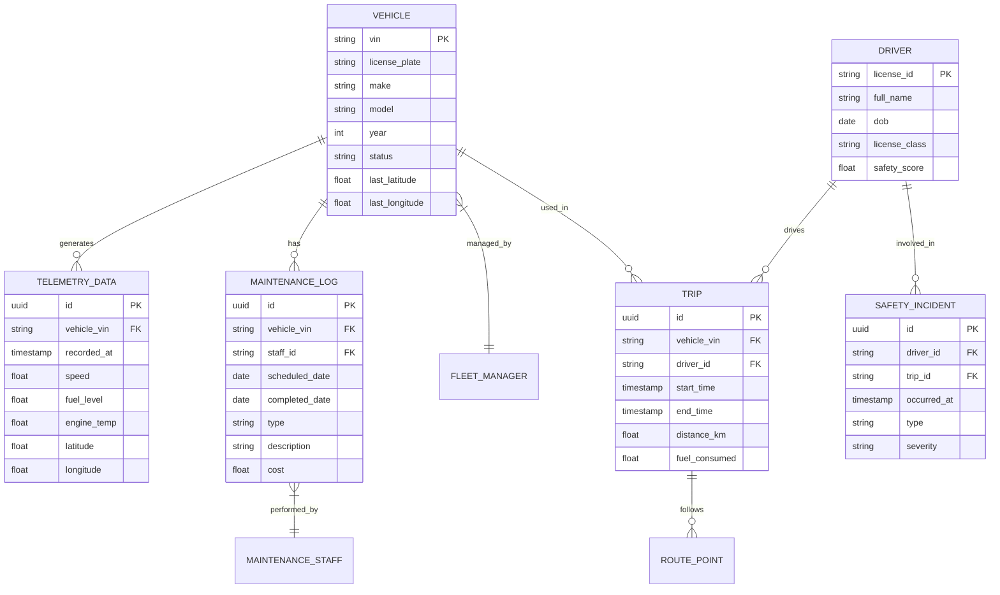

# Database Schema

## Entity Relationship Diagram (ERD)

```mermaid
erDiagram
    VEHICLE ||--o{ TELEMETRY_DATA : generates
    VEHICLE ||--o{ MAINTENANCE_LOG : has
    VEHICLE }|--|| FLEET_MANAGER : managed_by
    DRIVER ||--o{ TRIP : drives
    VEHICLE ||--o{ TRIP : used_in
    DRIVER ||--o{ SAFETY_INCIDENT : involved_in
    TRIP ||--o{ ROUTE_POINT : follows
    MAINTENANCE_LOG }|--|| MAINTENANCE_STAFF : performed_by

    VEHICLE {
        string vin PK
        string license_plate
        string make
        string model
        int year
        string status
        float last_latitude
        float last_longitude
    }

    DRIVER {
        string license_id PK
        string full_name
        date dob
        string license_class
        float safety_score
    }

    TELEMETRY_DATA {
        uuid id PK
        string vehicle_vin FK
        timestamp recorded_at
        float speed
        float fuel_level
        float engine_temp
        float latitude
        float longitude
    }

    MAINTENANCE_LOG {
        uuid id PK
        string vehicle_vin FK
        string staff_id FK
        date scheduled_date
        date completed_date
        string type
        string description
        float cost
    }

    TRIP {
        uuid id PK
        string vehicle_vin FK
        string driver_id FK
        timestamp start_time
        timestamp end_time
        float distance_km
        float fuel_consumed
    }

    SAFETY_INCIDENT {
        uuid id PK
        string driver_id FK
        string trip_id FK
        timestamp occurred_at
        string type
        string severity
    }
```

## Schema Description

### Core Entities
1. **Vehicles**: Stores static and dynamic state of fleet assets.
2. **Drivers**: Stores personnel data and compliance info.
3. **Telemetry**: High-volume time-series data storage (likely specialized TSDB).
4. **Maintenance**: Records of past and future service events.
5. **Trips**: Logical grouping of vehicle movement assigned to a driver.
6. **Incidents**: Safety events keyed to trips and drivers for scoring.
