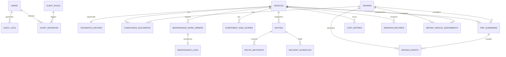

# ER Diagram — AI-Driven Fleet Management Optimization Platform

## Entity Relationship Diagram

We use **PostgreSQL** for transactional/relational data and **TimescaleDB** for high-frequency telemetry time-series data, ensuring ACID compliance for operational records and efficient time-windowed queries for analytics.

### Full ER Diagram

---

## Table Definitions

### `users`
| Column | Type | Constraints | Description |
|--------|------|-------------|-------------|
| `id` | UUID | PK | User ID |
| `email` | VARCHAR(255) | UNIQUE, NOT NULL | Login email |
| `full_name` | VARCHAR(150) | NOT NULL | Display name |
| `password_hash` | VARCHAR(255) | NOT NULL | Bcrypt hash |
| `role` | ENUM | NOT NULL | 'FLEET_MANAGER', 'DRIVER', 'MAINTENANCE_STAFF', 'ADMIN' |
| `is_active` | BOOLEAN | DEFAULT true | Account status |
| `created_at` | TIMESTAMPTZ | DEFAULT NOW() | Registration timestamp |

### `vehicles`
| Column | Type | Constraints | Description |
|--------|------|-------------|-------------|
| `id` | UUID | PK | Vehicle ID |
| `vin` | VARCHAR(17) | UNIQUE, NOT NULL | Vehicle Identification Number |
| `make` | VARCHAR(50) | NOT NULL | e.g., "Volvo" |
| `model` | VARCHAR(50) | NOT NULL | e.g., "FH16" |
| `year` | INT | NOT NULL | Manufacturing year |
| `license_plate` | VARCHAR(20) | UNIQUE | Registration plate |
| `fuel_type` | ENUM | | 'DIESEL', 'PETROL', 'ELECTRIC', 'HYBRID', 'CNG' |
| `status` | ENUM | DEFAULT 'PENDING' | 'PENDING', 'ACTIVE', 'IN_MAINTENANCE', 'DECOMMISSIONED' |
| `current_odometer_km` | DECIMAL(12,2) | | Latest odometer reading |
| `device_id` | UUID | FK, NULLABLE | Linked telematics device |
| `registered_at` | TIMESTAMPTZ | DEFAULT NOW() | |

### `telematics_devices`
| Column | Type | Constraints | Description |
|--------|------|-------------|-------------|
| `id` | UUID | PK | Device ID |
| `serial_number` | VARCHAR(50) | UNIQUE, NOT NULL | Hardware serial |
| `firmware_version` | VARCHAR(20) | | Current firmware |
| `status` | ENUM | | 'ACTIVE', 'OFFLINE', 'DECOMMISSIONED' |
| `vehicle_id` | UUID | FK, NULLABLE | Paired vehicle |
| `last_heartbeat` | TIMESTAMPTZ | | Last ping time |

### `drivers`
| Column | Type | Constraints | Description |
|--------|------|-------------|-------------|
| `id` | UUID | PK | Driver ID |
| `full_name` | VARCHAR(150) | NOT NULL | |
| `license_number` | VARCHAR(50) | UNIQUE, NOT NULL | Driving license number |
| `license_expiry` | DATE | NOT NULL | License expiry date |
| `phone` | VARCHAR(20) | | Contact number |
| `status` | ENUM | | 'ACTIVE', 'INACTIVE', 'SUSPENDED' |
| `safety_score` | DECIMAL(5,2) | DEFAULT 100.00 | Rolling 30-day avg (0-100) |
| `onboarded_at` | TIMESTAMPTZ | DEFAULT NOW() | |

### `driver_vehicle_assignments`
| Column | Type | Constraints | Description |
|--------|------|-------------|-------------|
| `id` | UUID | PK | |
| `driver_id` | UUID | FK | |
| `vehicle_id` | UUID | FK | |
| `start_date` | DATE | NOT NULL | Assignment start |
| `end_date` | DATE | NULLABLE | Null = ongoing |
| `status` | ENUM | | 'ACTIVE', 'COMPLETED', 'CANCELLED' |

### `compliance_documents`
| Column | Type | Constraints | Description |
|--------|------|-------------|-------------|
| `id` | UUID | PK | |
| `entity_id` | UUID | NOT NULL | Vehicle ID or Driver ID |
| `entity_type` | ENUM | | 'VEHICLE', 'DRIVER' |
| `doc_type` | ENUM | | 'INSURANCE', 'REGISTRATION', 'EMISSION_CERT', 'LICENSE', 'MEDICAL_FITNESS' |
| `file_url` | VARCHAR(500) | | S3/blob storage URL |
| `expires_at` | DATE | | Expiry date for renewal tracking |
| `is_verified` | BOOLEAN | DEFAULT false | Admin verification status |
| `uploaded_at` | TIMESTAMPTZ | DEFAULT NOW() | |

### `telemetry_raw` (TimescaleDB Hypertable)
| Column | Type | Constraints | Description |
|--------|------|-------------|-------------|
| `time` | TIMESTAMPTZ | NOT NULL | Measurement timestamp |
| `device_id` | UUID | NOT NULL | |
| `vehicle_id` | UUID | NOT NULL | |
| `latitude` | DECIMAL(9,6) | | GPS latitude |
| `longitude` | DECIMAL(9,6) | | GPS longitude |
| `speed_kmh` | DECIMAL(6,2) | | Vehicle speed |
| `heading` | DECIMAL(5,2) | | Compass heading (0-360) |
| `oil_pressure_psi` | DECIMAL(6,2) | | Engine oil pressure |
| `tire_pressure_fl` | DECIMAL(5,2) | | Front-left tire (psi) |
| `tire_pressure_fr` | DECIMAL(5,2) | | Front-right tire (psi) |
| `battery_voltage` | DECIMAL(5,2) | | Battery voltage |
| `engine_temp_c` | DECIMAL(5,1) | | Engine temperature |
| `fuel_level_pct` | DECIMAL(5,2) | | Fuel tank level % |
| `accel_x` | DECIMAL(6,3) | | Accelerometer X (g) |
| `accel_y` | DECIMAL(6,3) | | Accelerometer Y (g) |
| `rpm` | INT | | Engine RPM |

> **Note:** Partitioned by `time` (weekly). Retention policy: raw data for 90 days, downsampled aggregates for 2 years.

### `maintenance_work_orders`
| Column | Type | Constraints | Description |
|--------|------|-------------|-------------|
| `id` | UUID | PK | Work Order ID |
| `vehicle_id` | UUID | FK | |
| `component` | VARCHAR(50) | | e.g., 'BRAKES', 'BATTERY', 'ENGINE' |
| `status` | ENUM | | 'OPEN', 'ASSIGNED', 'IN_PROGRESS', 'COMPLETED', 'CANCELLED' |
| `urgency` | ENUM | | 'LOW', 'MEDIUM', 'HIGH', 'CRITICAL' |
| `risk_score` | DECIMAL(5,2) | | AI-generated risk score |
| `recommended_action` | TEXT | | AI recommendation |
| `assigned_to` | UUID | FK, NULLABLE | Maintenance staff user |
| `created_at` | TIMESTAMPTZ | DEFAULT NOW() | |
| `completed_at` | TIMESTAMPTZ | NULLABLE | |

### `maintenance_logs`
| Column | Type | Constraints | Description |
|--------|------|-------------|-------------|
| `id` | UUID | PK | |
| `work_order_id` | UUID | FK, UNIQUE | One log per work order |
| `vehicle_id` | UUID | FK | |
| `action_taken` | TEXT | | Description of work done |
| `parts_replaced` | JSONB | | e.g., `["Brake Pad Set", "Rotor"]` |
| `cost_amount` | DECIMAL(10,2) | | Repair cost |
| `performed_by` | UUID | FK | Maintenance staff |
| `performed_at` | TIMESTAMPTZ | | |

### `component_risk_scores`
| Column | Type | Constraints | Description |
|--------|------|-------------|-------------|
| `id` | UUID | PK | |
| `vehicle_id` | UUID | FK | |
| `component_name` | VARCHAR(50) | | |
| `score` | DECIMAL(5,2) | | Risk score 0.00–1.00 |
| `model_version` | VARCHAR(20) | | ML model version |
| `calculated_at` | TIMESTAMPTZ | | |

### `routes`
| Column | Type | Constraints | Description |
|--------|------|-------------|-------------|
| `id` | UUID | PK | |
| `vehicle_id` | UUID | FK | |
| `status` | ENUM | | 'PLANNED', 'IN_PROGRESS', 'COMPLETED', 'CANCELLED' |
| `total_distance_km` | DECIMAL(8,2) | | |
| `estimated_fuel_l` | DECIMAL(8,2) | | |
| `created_at` | TIMESTAMPTZ | | |
| `started_at` | TIMESTAMPTZ | NULLABLE | |
| `completed_at` | TIMESTAMPTZ | NULLABLE | |

### `route_waypoints`
| Column | Type | Constraints | Description |
|--------|------|-------------|-------------|
| `id` | UUID | PK | |
| `route_id` | UUID | FK | |
| `sequence_order` | INT | NOT NULL | Stop sequence |
| `location_name` | VARCHAR(200) | | |
| `latitude` | DECIMAL(9,6) | | |
| `longitude` | DECIMAL(9,6) | | |
| `estimated_arrival` | TIMESTAMPTZ | | |
| `actual_arrival` | TIMESTAMPTZ | NULLABLE | |
| `status` | ENUM | | 'PENDING', 'ARRIVED', 'SKIPPED' |

### `driving_events`
| Column | Type | Constraints | Description |
|--------|------|-------------|-------------|
| `id` | UUID | PK | |
| `driver_id` | UUID | FK | |
| `trip_id` | UUID | FK | |
| `type` | ENUM | | 'HARSH_BRAKE', 'RAPID_ACCEL', 'SPEEDING', 'SHARP_CORNER', 'EXCESSIVE_IDLE' |
| `severity` | ENUM | | 'LOW', 'MEDIUM', 'HIGH', 'CRITICAL' |
| `latitude` | DECIMAL(9,6) | | |
| `longitude` | DECIMAL(9,6) | | |
| `timestamp` | TIMESTAMPTZ | | |
| `metadata` | JSONB | | e.g., `{"speed": 92, "limit": 60}` |

### `trip_summaries`
| Column | Type | Constraints | Description |
|--------|------|-------------|-------------|
| `id` | UUID | PK | |
| `driver_id` | UUID | FK | |
| `vehicle_id` | UUID | FK | |
| `route_id` | UUID | FK, NULLABLE | |
| `start_time` | TIMESTAMPTZ | | |
| `end_time` | TIMESTAMPTZ | | |
| `distance_km` | DECIMAL(8,2) | | |
| `fuel_consumed_l` | DECIMAL(8,2) | | |
| `safety_score` | INT | | Per-trip score (0-100) |
| `event_count` | INT | DEFAULT 0 | Number of driving events |

### `cost_entries`
| Column | Type | Constraints | Description |
|--------|------|-------------|-------------|
| `id` | UUID | PK | |
| `vehicle_id` | UUID | FK | |
| `category` | ENUM | | 'FUEL', 'MAINTENANCE', 'TOLL', 'INSURANCE', 'OTHER' |
| `amount` | DECIMAL(10,2) | | Cost amount |
| `currency` | VARCHAR(3) | DEFAULT 'USD' | |
| `description` | TEXT | | |
| `recorded_at` | TIMESTAMPTZ | | |

### `emission_records`
| Column | Type | Constraints | Description |
|--------|------|-------------|-------------|
| `id` | UUID | PK | |
| `vehicle_id` | UUID | FK | |
| `period_start` | DATE | | Calculation period start |
| `period_end` | DATE | | Calculation period end |
| `co2_kg` | DECIMAL(10,2) | | CO₂ emissions in kg |
| `distance_km` | DECIMAL(8,2) | | Distance in period |
| `fuel_consumed_l` | DECIMAL(8,2) | | Fuel consumed in period |

### `alert_rules`
| Column | Type | Constraints | Description |
|--------|------|-------------|-------------|
| `id` | UUID | PK | |
| `name` | VARCHAR(100) | | Rule name |
| `type` | ENUM | | 'MAINTENANCE', 'DRIVER_BEHAVIOR', 'GEOFENCE', 'ROUTE', 'SOS' |
| `condition_expr` | JSONB | | Rule expression |
| `severity` | ENUM | | 'INFO', 'WARNING', 'CRITICAL' |
| `is_active` | BOOLEAN | DEFAULT true | |
| `created_by` | UUID | FK | |

### `alert_instances`
| Column | Type | Constraints | Description |
|--------|------|-------------|-------------|
| `id` | UUID | PK | |
| `rule_id` | UUID | FK | |
| `target_user_id` | UUID | FK | |
| `message` | TEXT | | |
| `status` | ENUM | | 'PENDING', 'SENT', 'ACKNOWLEDGED', 'ESCALATED' |
| `channel` | ENUM | | 'PUSH', 'SMS', 'EMAIL' |
| `created_at` | TIMESTAMPTZ | | |
| `acknowledged_at` | TIMESTAMPTZ | NULLABLE | |

### `audit_logs`
| Column | Type | Constraints | Description |
|--------|------|-------------|-------------|
| `id` | UUID | PK | |
| `entity_type` | VARCHAR(50) | | 'VEHICLE', 'DRIVER', 'WORK_ORDER', etc. |
| `entity_id` | UUID | | |
| `action` | VARCHAR(50) | | 'CREATED', 'UPDATED', 'DELETED', 'STATUS_CHANGE' |
| `performed_by` | UUID | | User ID |
| `timestamp` | TIMESTAMPTZ | DEFAULT NOW() | |
| `changes` | JSONB | | Old vs New values |

---

## Indexes

| Index Name | Table | Columns/Expression | Purpose |
|------------|-------|-------------------|---------|
| `vehicles_status_idx` | `vehicles` | `(status)` | Fast lookup of active/maintenance vehicles |
| `vehicles_vin_idx` | `vehicles` | `(vin)` | VIN search |
| `drivers_license_exp_idx` | `drivers` | `(license_expiry)` | Find drivers with expiring licenses |
| `assignments_active_idx` | `driver_vehicle_assignments` | `(driver_id) WHERE end_date IS NULL` | Current assignment lookup |
| `work_orders_open_idx` | `maintenance_work_orders` | `(vehicle_id, status) WHERE status != 'COMPLETED'` | Find open work orders for a vehicle |
| `driving_events_trip_idx` | `driving_events` | `(trip_id, type)` | Trip event analysis |
| `telemetry_vehicle_time_idx` | `telemetry_raw` | `(vehicle_id, time DESC)` | TimescaleDB automatic index on hypertable |
| `cost_entries_vehicle_idx` | `cost_entries` | `(vehicle_id, category, recorded_at)` | Cost breakdown queries |
| `alert_instances_user_idx` | `alert_instances` | `(target_user_id, status)` | Unread alerts per user |
