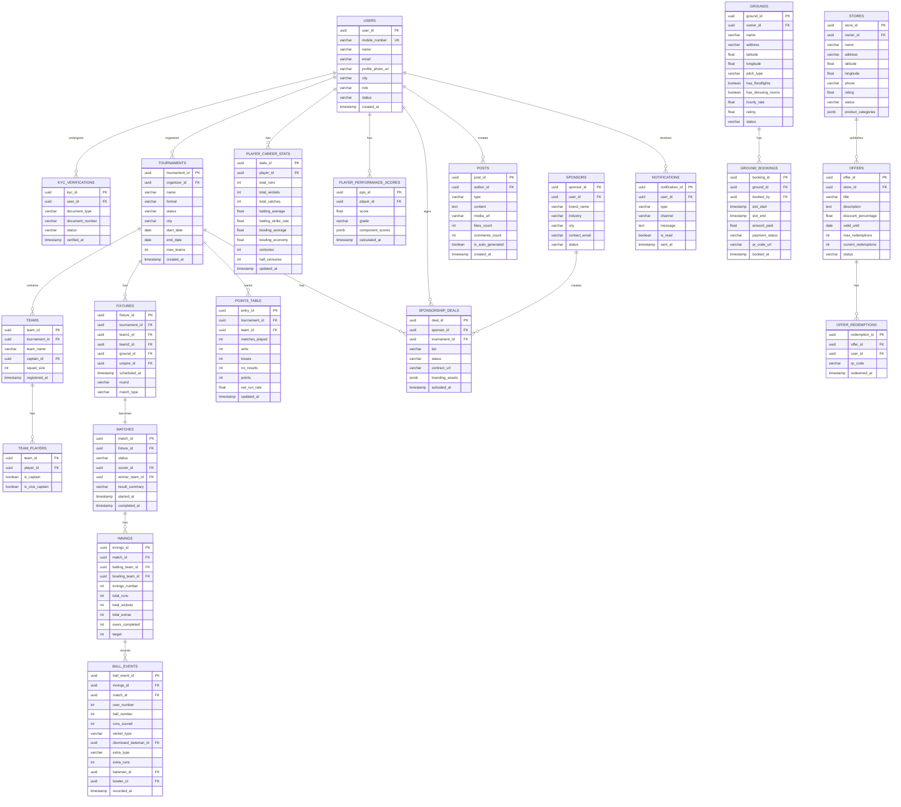

# ER Diagram — CricZone: Local Cricket Community Platform

> Full Entity-Relationship Diagram with table definitions, column types, relationships, and strategic indexes. Database: **PostgreSQL**.

---

## Full ERD

---

## Table Definitions & Strategic Indexes

### `users`
| Column | Type | Notes |
|--------|------|-------|
| `user_id` | UUID | PK, default gen_random_uuid() |
| `mobile_number` | VARCHAR(15) | UNIQUE, NOT NULL |
| `name` | VARCHAR(100) | NOT NULL |
| `email` | VARCHAR(150) | NULLABLE (optional) |
| `city` | VARCHAR(100) | NOT NULL |
| `role` | VARCHAR(20) | CHECK IN ('PLAYER','ORGANIZER','FAN','SCORER','STORE_OWNER','SPONSOR','ADMIN') |
| `status` | VARCHAR(20) | DEFAULT 'PENDING_VERIFICATION' |
| `created_at` | TIMESTAMP | DEFAULT NOW() |

**Indexes:** `idx_users_mobile` (mobile_number), `idx_users_role_city` (role, city)

---

### `ball_events` *(High-write, scoring-critical)*
| Column | Type | Notes |
|--------|------|-------|
| `ball_event_id` | UUID | PK |
| `innings_id` | UUID | FK → innings.innings_id |
| `match_id` | UUID | FK → matches.match_id |
| `over_number` | INT | NOT NULL |
| `ball_number` | INT | NOT NULL 1–8 (incl. extras) |
| `runs_scored` | INT | DEFAULT 0 |
| `wicket_type` | VARCHAR(20) | NULLABLE |
| `extra_type` | VARCHAR(15) | NULLABLE (WIDE/NO_BALL/BYE/LEG_BYE) |
| `recorded_at` | TIMESTAMP | DEFAULT NOW() |

**Indexes:** `idx_ball_events_match_innings` (match_id, innings_id), `idx_ball_events_time` (recorded_at DESC)

---

### `player_career_stats` *(Read-heavy, updated post-match)*
| Column | Type | Notes |
|--------|------|-------|
| `player_id` | UUID | PK (1:1 with users) |
| `total_runs` | INT | DEFAULT 0 |
| `batting_average` | FLOAT | COMPUTED |
| `batting_strike_rate` | FLOAT | COMPUTED |
| `bowling_economy` | FLOAT | COMPUTED |
| `updated_at` | TIMESTAMP | DEFAULT NOW() |

**Indexes:** `idx_player_stats_total_runs` (total_runs DESC), `idx_player_stats_wickets` (total_wickets DESC)

---

### `grounds` *(Geo-spatial queries)*
| Column | Type | Notes |
|--------|------|-------|
| `ground_id` | UUID | PK |
| `latitude` | FLOAT(8,6) | NOT NULL |
| `longitude` | FLOAT(9,6) | NOT NULL |
| `status` | VARCHAR(20) | CHECK IN ('ACTIVE','INACTIVE','UNDER_RENOVATION') |

**Indexes:** `idx_grounds_location` (PostGIS `geography` column for radius queries), `idx_grounds_status` (status)

---

### `sponsorship_deals`
| Column | Type | Notes |
|--------|------|-------|
| `deal_id` | UUID | PK |
| `tier` | VARCHAR(20) | CHECK IN ('TITLE','CO_SPONSOR','ASSOCIATE') |
| `status` | VARCHAR(20) | CHECK IN ('PENDING','ACTIVE','EXPIRED','CANCELLED') |
| `branding_assets` | JSONB | {logoUrl, bannerUrl, colorPalette} |

**Indexes:** `idx_deals_tournament` (tournament_id), `idx_deals_sponsor_status` (sponsor_id, status)
