# ER Diagram — AI-Assisted Interview Screening

---

## Full Entity-Relationship Diagram

```mermaid
erDiagram
    interviews ||--o{ questions : "has"
    interviews ||--o{ responses : "captures"
    interviews ||--|| score_summaries : "produces"
    interviews ||--o{ audit_logs : "generates"
    interviews ||--|| cost_records : "tracks"
    interviews ||--o| review_decisions : "reviewed_by"
    questions ||--o| responses : "answered_by"
    responses ||--o{ dimension_scores : "scored_on"
    cost_records ||--o{ cost_breakdown_entries : "details"

    interviews {
        TEXT id PK "UUID — e.g., INT-20260605-1234"
        TEXT role "e.g., Senior Backend Engineer"
        TEXT level "JUNIOR | MID | SENIOR | LEAD"
        TEXT skills "JSON array — e.g., [Java, Spring Boot]"
        TEXT jd_text "Full job description text"
        TEXT resume_text "Candidate resume (plain text)"
        TEXT candidate_name "Candidate display name"
        TEXT candidate_email "Candidate email (optional)"
        TEXT status "DRAFT|READY|IN_PROGRESS|COMPLETED|REVIEWED"
        TEXT created_by "Hiring manager who created"
        INTEGER question_count "Total questions generated"
        INTEGER response_count "Total responses received"
        REAL progress_pct "Interview progress 0-100"
        TEXT coverage_map "JSON — category coverage percentages"
        TIMESTAMP created_at "Interview creation time"
        TIMESTAMP started_at "Interview start time"
        TIMESTAMP completed_at "Interview completion time"
    }

    questions {
        TEXT id PK "UUID — e.g., Q-001"
        TEXT interview_id FK "References interviews.id"
        TEXT category "TECHNICAL|BEHAVIORAL|PROBLEM_SOLVING|SYSTEM_DESIGN"
        TEXT text "Full question text"
        INTEGER sequence "Display order (1-based)"
        TEXT source "JD_ALIGNED|RESUME_PROBE|GAP_EXPLORATION|GENERAL|ADAPTIVE|MANUAL"
        TEXT depth_target "FOUNDATIONAL|APPLIED|DEEP"
        TEXT skill_tags "JSON array of related skills"
        INTEGER is_active "1=active, 0=removed by manager"
        TIMESTAMP created_at "Question generation time"
    }

    responses {
        TEXT id PK "UUID — e.g., R-001"
        TEXT question_id FK "References questions.id"
        TEXT interview_id FK "References interviews.id"
        TEXT candidate_text "Full candidate response"
        INTEGER depth_score "AI-evaluated depth 1-5"
        INTEGER response_time_sec "Time taken to respond"
        INTEGER word_count "Response word count"
        TEXT adaptive_action "Action taken: FOLLOW_UP_EASIER|FOLLOW_UP_DEEPER|NEW_TOPIC|CONCLUDE"
        TEXT adaptive_reasoning "AI reasoning for next action"
        TIMESTAMP created_at "Response submission time"
    }

    dimension_scores {
        TEXT id PK "UUID"
        TEXT response_id FK "References responses.id"
        TEXT dimension "technical_depth|communication|problem_solving|role_alignment"
        REAL score "0.0 - 10.0"
        TEXT rationale "AI explanation for score"
    }

    score_summaries {
        TEXT interview_id PK "References interviews.id"
        REAL technical_depth_avg "Average technical depth score"
        REAL communication_avg "Average communication score"
        REAL problem_solving_avg "Average problem solving score"
        REAL role_alignment_avg "Average role alignment score"
        REAL overall_confidence "Weighted overall 0-100"
        TEXT ai_recommendation "STRONG_HIRE|HIRE|MAYBE|NO_HIRE"
        TEXT feedback_summary "JSON — structured feedback object"
        TEXT strengths "JSON array of top strengths"
        TEXT concerns "JSON array of top concerns"
        TEXT notable_quotes "JSON array of candidate quotes"
        TIMESTAMP calculated_at "Score calculation time"
    }

    review_decisions {
        TEXT interview_id PK "References interviews.id"
        TEXT reviewer_name "Name of human reviewer"
        TEXT action "APPROVE|ADJUST|REJECT"
        TEXT final_decision "ADVANCE|HOLD|REJECT"
        TEXT notes "Reviewer notes (required for ADJUST/REJECT)"
        TEXT adjusted_scores "JSON — modified dimension scores (if ADJUST)"
        TEXT original_recommendation "AI recommendation before override"
        TEXT final_recommendation "Final recommendation after review"
        REAL usefulness_rating "1-5 star rating of AI helpfulness"
        TEXT usefulness_feedback "Optional text feedback on AI quality"
        TIMESTAMP decided_at "Decision timestamp"
    }

    audit_logs {
        TEXT id PK "UUID — auto-generated"
        TEXT interview_id FK "References interviews.id"
        TEXT agent_name "question_generator|adaptive|evaluator|synthesizer|integrity|review"
        TEXT operation "GENERATE_QUESTIONS|EVALUATE_RESPONSE|ADAPT_QUESTION|SYNTHESIZE_FEEDBACK|REVIEW_DECISION"
        TEXT prompt_text "Full prompt sent to LLM"
        TEXT response_text "Full response from LLM"
        INTEGER input_tokens "Input token count"
        INTEGER output_tokens "Output token count"
        REAL cost_usd "Cost for this specific call"
        INTEGER latency_ms "Response time in milliseconds"
        TEXT model_used "e.g., gemini-2.0-flash"
        TEXT metadata "JSON — additional context"
        TIMESTAMP created_at "Log entry creation time"
    }

    cost_records {
        TEXT interview_id PK "References interviews.id"
        INTEGER total_input_tokens "Sum of all input tokens"
        INTEGER total_output_tokens "Sum of all output tokens"
        REAL total_cost_usd "Total cost in USD"
        TEXT model_used "Primary model used"
        INTEGER total_api_calls "Number of LLM API calls"
        REAL avg_latency_ms "Average response latency"
        TIMESTAMP last_updated "Last cost update time"
    }

    cost_breakdown_entries {
        TEXT id PK "UUID"
        TEXT interview_id FK "References cost_records.interview_id"
        TEXT agent_name "Agent that incurred cost"
        INTEGER input_tokens "Input tokens for this agent"
        INTEGER output_tokens "Output tokens for this agent"
        REAL cost_usd "Cost for this agent"
        INTEGER call_count "Number of calls by this agent"
    }
```

---

## Table Definitions

### 1. `interviews` — Core interview session
- **Primary Key:** `id` (text UUID)
- **Indexes:** `status`, `created_by`, `created_at DESC`
- **Constraints:** `status` must be valid enum value

### 2. `questions` — Generated and custom questions
- **Primary Key:** `id`
- **Foreign Key:** `interview_id → interviews.id`
- **Indexes:** `interview_id`, `category`, `sequence`
- **Constraints:** `sequence` unique per `interview_id`

### 3. `responses` — Candidate answers
- **Primary Key:** `id`
- **Foreign Keys:** `question_id → questions.id`, `interview_id → interviews.id`
- **Indexes:** `interview_id`, `question_id`
- **Constraints:** One response per question per interview

### 4. `dimension_scores` — Per-response scoring
- **Primary Key:** `id`
- **Foreign Key:** `response_id → responses.id`
- **Indexes:** `response_id`, `dimension`
- **Constraints:** `score` between 0.0 and 10.0; 4 entries per response

### 5. `score_summaries` — Aggregate interview scores
- **Primary Key:** `interview_id`
- **Foreign Key:** `interview_id → interviews.id`
- **Constraints:** One summary per interview; `overall_confidence` between 0 and 100

### 6. `review_decisions` — Human reviewer actions
- **Primary Key:** `interview_id`
- **Foreign Key:** `interview_id → interviews.id`
- **Constraints:** `notes` required when `action` is ADJUST or REJECT

### 7. `audit_logs` — Immutable AI operation log
- **Primary Key:** `id` (auto-generated UUID)
- **Foreign Key:** `interview_id → interviews.id`
- **Indexes:** `interview_id`, `agent_name`, `created_at DESC`
- **Constraints:** INSERT only — no UPDATE or DELETE operations

### 8. `cost_records` — Per-interview cost summary
- **Primary Key:** `interview_id`
- **Foreign Key:** `interview_id → interviews.id`

### 9. `cost_breakdown_entries` — Per-agent cost detail
- **Primary Key:** `id`
- **Foreign Key:** `interview_id → cost_records.interview_id`
- **Indexes:** `interview_id`, `agent_name`

---

## Data Volume Estimates (Per Interview)

| Table | Records per Interview | Avg Row Size |
|-------|----------------------|-------------|
| `interviews` | 1 | ~2 KB |
| `questions` | 12 | ~500 B each |
| `responses` | 10 | ~1 KB each |
| `dimension_scores` | 40 (4 per response) | ~200 B each |
| `score_summaries` | 1 | ~2 KB |
| `review_decisions` | 1 | ~500 B |
| `audit_logs` | ~25 (all AI calls) | ~3 KB each |
| `cost_records` | 1 | ~300 B |
| `cost_breakdown_entries` | 4 | ~200 B each |
| **Total per interview** | **~95 records** | **~95 KB** |

**At scale:** 10,000 interviews = ~950K records, ~950 MB — manageable in PostgreSQL.
