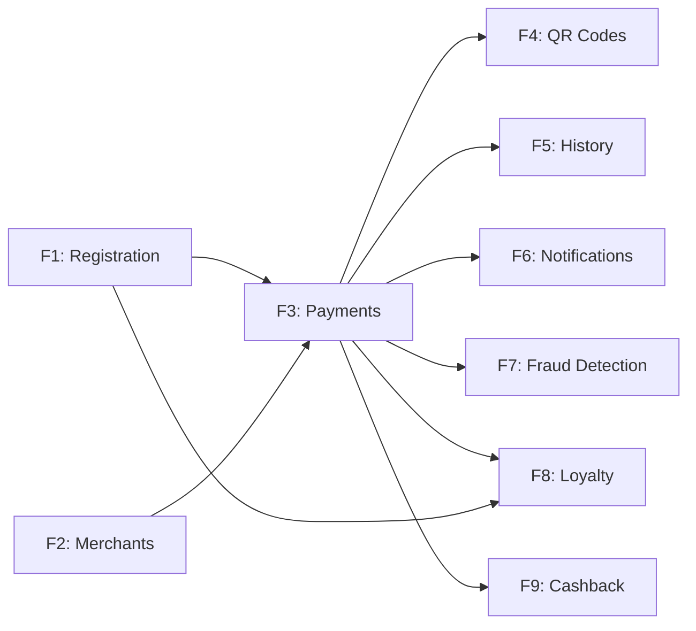

# PayFlow - Features

> **⚠️ Core Requirements**: Each feature is mapped to the core requirements defined in [KEY_REQUIREMENTS.md](./KEY_REQUIREMENTS.md).

## Table of Contents
1. [Feature Overview](#feature-overview)
2. [Feature Details](#feature-details)
3. [Feature Dependencies](#feature-dependencies)
4. [Implementation Roadmap](#implementation-roadmap)

---

## Feature Overview

| ID | Feature | Priority | Requirement | Phase |
|----|---------|----------|-------------|-------|
| F1 | Customer Registration & Onboarding | P0 | REQ-1 | 1 |
| F2 | Merchant Management | P0 | REQ-2 | 1 |
| F3 | Payment Processing Engine | P0 | REQ-3 | 1 |
| F4 | QR Code Management | P0 | REQ-4 | 1 |
| F5 | Transaction History & Receipts | P0 | REQ-5 | 1 |
| F6 | Omnichannel Notifications | P0 | REQ-6 | 2 |
| F7 | Fraud Detection & Prevention | P0 | REQ-7 | 1 |
| F8 | Loyalty Program | P2 | REQ-8 | 2 |
| F9 | Cashback Management | P2 | REQ-9 | 3 |

---

## Feature Details

### F1: Customer Registration & Onboarding

**Requirement**: REQ-1
**Priority**: P0 (Critical Path)

**User Stories**:
- As a new user, I want to register with my phone number so I can start using the app quickly
- As a customer, I want to link my bank account via IBAN so I can send and receive payments
- As a customer, I want to complete KYC once to unlock full transaction limits

**Acceptance Criteria**:
- [ ] Registration completes in under 3 minutes
- [ ] OTP is delivered within 10 seconds
- [ ] IBAN format validated instantly (client-side regex + server-side bank validation)
- [ ] KYC results returned within 24 hours
- [ ] Multiple bank accounts can be linked
- [ ] User profile data encrypted at rest

**Technical Specifications**:
- **OTP Provider**: Twilio / local SMS gateway
- **KYC Provider**: Onfido / Jumio integration
- **IBAN Validation**: BBAN structure check + bank partner API call
- **Data Storage**: Encrypted PII fields in PostgreSQL with column-level AES-256

---

### F2: Merchant Management

**Requirement**: REQ-2
**Priority**: P0

**User Stories**:
- As an admin, I want to onboard merchants with full business verification so only legitimate businesses are on the platform
- As a customer, I want to rate merchants so I can share my experience

**Acceptance Criteria**:
- [ ] Only authorized admin can create/modify merchant accounts
- [ ] KYB verification integrated
- [ ] Merchant gets auto-generated static QR code
- [ ] Service rating aggregated per merchant (1-5 stars)
- [ ] Merchant can view their settlement reports

**Technical Specifications**:
- **KYB**: Business registration number lookup via government API
- **QR Generation**: Static QR with merchant UUID encoded (Base58)
- **Rating System**: Weighted average with minimum 5 ratings before publishing
- **Settlement**: T+1 daily batch settlement via banking partner

---

### F3: Payment Processing Engine

**Requirement**: REQ-3
**Priority**: P0 (Core Feature)

**User Stories**:
- As a customer, I want to send money to anyone via phone number
- As a customer, I want to pay merchants online or in-store
- As a customer, I want payment to complete in under 3 seconds

**Acceptance Criteria**:
- [ ] P2P transfers complete in < 3 seconds
- [ ] P2M payments integrate with banking APIs in real-time
- [ ] Multi-bank routing with automatic failover
- [ ] Idempotency keys prevent double charges
- [ ] Payment status: INITIATED → PROCESSING → COMPLETED / FAILED / REVERSED
- [ ] 99.99% payment success rate

**Technical Specifications**:
- **Payment Orchestrator**: Saga-based distributed transaction
- **Bank Integration**: REST APIs with circuit breaker per bank partner
- **Idempotency**: Client-generated UUID stored in Redis with 24h TTL
- **Concurrency**: Optimistic locking on wallet balances
- **Timeout**: 10-second hard timeout; async retry for bank timeouts

---

### F4: QR Code Management

**Requirement**: REQ-4
**Priority**: P0

**User Stories**:
- As a merchant, I want a permanent QR code for my store
- As a customer, I want to scan a QR to pay instantly
- As a customer, I want to generate a QR code with a specific amount for receiving money

**Acceptance Criteria**:
- [ ] QR scan → payment screen in < 2 seconds
- [ ] Static QR: Permanent unique URL/code per user/merchant
- [ ] Dynamic QR: Embeds amount and expiry; valid for 15 minutes
- [ ] QR downloadable as PNG and SVG
- [ ] Deep link support: QR scan opens PayFlow app directly

**Technical Specifications**:
- **QR Format**: Custom URI scheme `payflow://pay/{recipientId}?amount={amt}&ref={ref}`
- **Static QR**: Generated once, stored in CDN
- **Dynamic QR**: Generated on-demand, cached in Redis with TTL
- **Library**: `qrcode` (Node.js) or `zxing` (mobile)

---

### F5: Transaction History & Receipts

**Requirement**: REQ-5
**Priority**: P0

**User Stories**:
- As a customer, I want to see my last 5 years of transactions
- As a customer, I want to download or email a receipt for any transaction

**Acceptance Criteria**:
- [ ] Recent 100 transactions load in < 1 second
- [ ] 5-year history searchable by date, amount, recipient
- [ ] Receipt generated as PDF on demand
- [ ] Receipt can be emailed to user or arbitrary email address

**Technical Specifications**:
- **Hot Store**: PostgreSQL for last 12 months (indexed by user + date)
- **Warm Store**: Partitioned PostgreSQL tables for 1-3 years
- **Cold Store**: S3-backed Parquet files for 3-5 years (queried via Athena/Trino)
- **Receipt PDF**: Puppeteer-based HTML→PDF microservice
- **Email**: SES / SendGrid with PDF attachment

---

### F6: Omnichannel Notifications

**Requirement**: REQ-6
**Priority**: P0

**User Stories**:
- As a customer, I want to be notified instantly about payment status
- As a customer, I want to choose which channels I receive notifications on

**Acceptance Criteria**:
- [ ] Notification delivered within 5 seconds of event
- [ ] Supports Push, SMS, Email channels
- [ ] User can configure preferences per category
- [ ] Delivery receipts tracked per channel

**Technical Specifications**:
- **Push**: Firebase Cloud Messaging (FCM) / APNs
- **SMS**: Twilio / local telecom gateway
- **Email**: AWS SES with DKIM/SPF
- **Event Bus**: Kafka topics per notification type
- **Preference Store**: Redis-backed preference cache

---

### F7: Fraud Detection & Prevention

**Requirement**: REQ-7
**Priority**: P0

**User Stories**:
- As a platform, I want to automatically block suspicious transactions
- As an admin, I want to review flagged transactions with full context

**Acceptance Criteria**:
- [ ] Risk scoring latency < 200ms
- [ ] False positive rate < 2%
- [ ] Automated blocking for risk score > 90
- [ ] Admin review queue with full transaction context
- [ ] Transaction velocity limits enforced per user

**Technical Specifications**:
- **Rule Engine**: Drools / custom rule DSL for velocity checks
- **ML Model**: Gradient Boosted Trees (XGBoost) for anomaly scoring
- **Features**: Amount deviation, geo distance, device fingerprint, time patterns
- **Real-Time**: Kafka Streams for sliding window aggregations
- **Device Fingerprinting**: FingerprintJS Pro

---

### F8: Loyalty Program

**Requirement**: REQ-8
**Priority**: P2 (Nice-to-Have)

**User Stories**:
- As a customer, I want to earn points with every transaction
- As a customer, I want to use my points to reduce payment amounts

**Acceptance Criteria**:
- [ ] Auto-enrollment on registration
- [ ] Points credited within 30 seconds of transaction
- [ ] Three tiers: Silver (0-999), Gold (1000-4999), Platinum (5000+)
- [ ] Points redeemable during payment flow

**Technical Specifications**:
- **Points Engine**: Event-driven (TransactionCompleted → CreditPoints)
- **Tier Evaluation**: Nightly batch job checking cumulative points
- **Redemption**: Deduct from ledger atomically with payment transaction

---

### F9: Cashback Management

**Requirement**: REQ-9
**Priority**: P2 (Nice-to-Have)

**User Stories**:
- As an admin, I want to create cashback campaigns tied to specific bank cards
- As a customer, I want cashback applied automatically when eligible

**Acceptance Criteria**:
- [ ] Admin can CRUD campaigns with card network, percentage, dates, budget
- [ ] Cashback applied automatically during payment
- [ ] Campaign auto-deactivates when budget is exhausted
- [ ] Cashback credited to user's in-app wallet

**Technical Specifications**:
- **Campaign Store**: PostgreSQL with start/end dates and budget tracking
- **Eligibility Check**: During payment, check card BIN → matching campaign
- **Budget Tracking**: Atomic counter (Redis INCRBY) to prevent budget overrun

---

## Feature Dependencies

---

## Implementation Roadmap

### Phase 1: MVP (Months 1-3)
- F1: Registration + Bank Linking
- F2: Merchant Onboarding (Admin flow)
- F3: Payment Processing (P2P + P2M)
- F4: QR Code (Scan + Generate)
- F7: Fraud Detection (Rule-based)

### Phase 2: Growth (Months 4-6)
- F5: Transaction History (Hot store only)
- F6: Notifications (Push + SMS)
- F8: Loyalty Program (Earn + Redeem)
- F7: Fraud Detection (ML model added)

### Phase 3: Maturity (Months 7-12)
- F5: 5-year archival (Cold store)
- F6: Email + receipt generation
- F9: Cashback Campaigns
- Help Chat Integration

---

**Last Updated**: February 2026
**Version**: 1.0
**Status**: Design Complete
