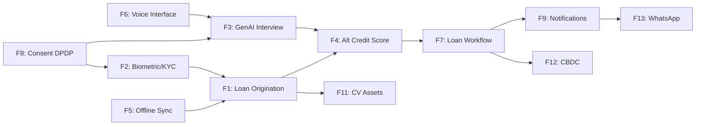

# Mitra Finance — Features

> **⚠️ Core Requirements**: Each feature maps to requirements in [KEY_REQUIREMENTS.md](./KEY_REQUIREMENTS.md).

## Table of Contents
1. [Feature Overview](#feature-overview)
2. [Feature Details](#feature-details)
3. [Feature Dependencies](#feature-dependencies)
4. [Implementation Roadmap](#implementation-roadmap)

---

## Feature Overview

| ID | Feature | Priority | Requirement | Phase |
|----|---------|----------|-------------|-------|
| F1 | Assisted Loan Origination (OCR + Low-BW) | P0 | REQ-1 | 1 |
| F2 | Biometric Authentication & eKYC | P0 | REQ-2 | 1 |
| F3 | GenAI Voice Credit Interview | P0 | REQ-3 | 1 |
| F4 | Alternative Credit Risk Scoring | P0 | REQ-4 | 1 |
| F5 | Offline-First Operations & Auto-Sync | P0 | REQ-5 | 1 |
| F6 | Multi-Lingual Voice Interface (12+ Dialects) | P0 | REQ-6 | 1 |
| F7 | Loan Workflow Engine & Approval Routing | P0 | REQ-7 | 2 |
| F8 | DPDP Consent Management | P0 | REQ-8 | 1 |
| F9 | Alert & EMI Notification System | P1 | REQ-9 | 2 |
| F10 | Admin & Compliance Reporting | P1 | REQ-10 | 2 |
| F11 | Computer Vision — Asset Verification | P2 (Nice-to-Have) | — | 3 |
| F12 | CBDC Integration (Digital Rupee) | P2 (Nice-to-Have) | — | 3 |
| F13 | WhatsApp Voice EMI Reminders | P2 (Nice-to-Have) | — | 2 |

---

## Feature Details

### F1: Assisted Loan Origination

**Requirement**: REQ-1 | **Priority**: P0

**User Stories**:
- As a Bank Mitra, I want to capture a customer's loan application on my phone so I can serve them even in areas with no internet
- As a Mitra, I want OCR to automatically fill loan forms from Aadhaar and utility bills so the process is fast and error-free

**Acceptance Criteria**:
- [ ] Complete loan application in < 15 minutes on 3G
- [ ] OCR extracts name, address, DOB from Aadhaar with ≥ 95% field accuracy
- [ ] Application auto-saves locally every 60 seconds
- [ ] Offline queue displays count of pending submissions
- [ ] Document images compressed to < 500KB before upload

**Technical Specifications**:
- **OCR Engine**: Google ML Kit (on-device) for Aadhaar; Tesseract for printed bills
- **Image Compression**: libjpeg-turbo with adaptive quality (target: 500KB)
- **Local Storage**: SQLite via Room (Android) with WAL journaling
- **Offline Queue**: Priority queue (FIFO per customer, priority by urgency)

---

### F2: Biometric Authentication & eKYC

**Requirement**: REQ-2 | **Priority**: P0

**User Stories**:
- As a Bank Mitra, I want to verify my customer's identity using Aadhaar so I comply with RBI KYC norms
- As a Customer, I want to verify with my fingerprint so I don't need to remember passwords

**Acceptance Criteria**:
- [ ] Primary flow (Aadhaar OTP + fingerprint) completes in < 60 seconds
- [ ] 3 fallback levels: Aadhaar OTP only → Face liveness → Supervisor sign-off
- [ ] Biometric auth token cached 8 hours for offline use
- [ ] Zero Aadhaar data stored; only Virtual ID (VID) retained
- [ ] ABHA linkage offered as optional post-KYC step

**Technical Specifications**:
- **UIDAI API**: C-KYC + AadhaarAuth APIs (HTTPS + PKI)
- **Biometric SDK**: Mantra MFS100 (external USB scanner) + Android BiometricPrompt API
- **Face Liveness**: Google ML Kit Face Detection (purely on-device, no network)
- **Token**: JWT with 8h expiry, stored in Android Keystore (hardware-backed)

---

### F3: GenAI Voice Credit Interview

**Requirement**: REQ-3 | **Priority**: P0

**User Stories**:
- As a Customer, I want to speak about my livelihood in my own dialect rather than filling a form
- As a Bank Mitra, I want AI to interview the customer and extract structured information automatically

**Acceptance Criteria**:
- [ ] Supports 12 dialects at launch (listed in REQ-6)
- [ ] Dialect auto-detected from first utterance
- [ ] 8–12 question interview covering income, assets, expenses, livelihood
- [ ] Field confidence scores shown; Mitra can correct any field
- [ ] Entire interview runs offline (on-device ONNX models)
- [ ] Response latency < 3 seconds per question on 3G

**Technical Specifications**:
- **ASR**: IndicASR (AI4Bharat) fine-tuned on rural dialects; ONNX quantized for mobile
- **Dialect Detection**: FastText language ID model (< 1MB, on-device)
- **LLM**: Sarvam AI Saaras (India-first, fine-tuned on financial dialogs) — cloud
- **On-Device Fallback**: Phi-2 ONNX (quantized INT4) for basic interview when offline
- **Structured Extraction**: NER + slot-filling pipeline (spaCy + custom financial schema)

---

### F4: Alternative Credit Risk Scoring

**Requirement**: REQ-4 | **Priority**: P0

**User Stories**:
- As a Credit Officer, I want an AI-generated credit score for rural customers without CIBIL histories
- As a Credit Officer, I want to understand the top 3 factors driving the score

**Acceptance Criteria**:
- [ ] Score generated in < 10 seconds
- [ ] Score on 300–850 scale with risk band (LOW/MEDIUM/HIGH)
- [ ] Recommended loan amount and tenure generated
- [ ] Top 3 explainability factors shown (e.g., "12 consecutive utility bill payments")
- [ ] Online scoring uses external signals; offline uses interview data only
- [ ] Model version tagged on each score record

**Technical Specifications**:
- **ML Model**: Gradient Boosted Trees (XGBoost) + Light GBM ensemble
- **Features**: Utility bill regularity, MGNREGA days/year, agri-zone drought index, self-declared income, interview confidence score, mobile recharge frequency
- **Explainability**: SHAP values (top-3 features)
- **On-Device Model**: Compressed ONNX model (interview signals only, < 15MB)
- **Cloud Model**: Full feature vector model — used when online

---

### F5: Offline-First Operations & Auto-Sync

**Requirement**: REQ-5 | **Priority**: P0

**User Stories**:
- As a Bank Mitra in a village, I want to complete full customer onboarding even with no internet
- As a Mitra, I want my device to automatically upload pending data when I get connectivity

**Acceptance Criteria**:
- [ ] 100% core feature availability with zero network
- [ ] Auto-sync within 60 seconds of connectivity restoration
- [ ] Idempotent sync — no duplicate records on server
- [ ] Conflict resolution visible to Mitra (shows what changed)
- [ ] Sync status always visible in app header
- [ ] SQLite database encrypted (SQLCipher)

**Technical Specifications**:
- **Local DB**: SQLite + SQLCipher (256-bit AES) via Room
- **Sync Protocol**: Delta sync (only CHANGED records since last sync marker)
- **Idempotency**: Every queued item has a client-generated UUID; server deduplicates
- **Conflict Strategy**: Server-wins for financial records; Last-Write-Wins for customer metadata
- **Serialization**: Protocol Buffers (protobuf) for bandwidth efficiency (~ 5× smaller than JSON)

---

### F6: Multi-Lingual Voice Interface

**Requirement**: REQ-6 | **Priority**: P0

**User Stories**:
- As a Bank Mitra in Tamil Nadu, I want the app to speak instructions in Tamil
- As a Customer, I want to answer loan questions in Bhojpuri, my native dialect

**Acceptance Criteria**:
- [ ] 12 dialects at launch: Hindi, Bengali, Telugu, Marathi, Tamil, Kannada, Gujarati, Odia, Punjabi, Assamese, Maithili, Bhojpuri
- [ ] Dialect switch < 2 seconds
- [ ] All UI instructions available as TTS audio
- [ ] Voice commands for navigation ("अगला", "पिछला", "जमा करें")
- [ ] Low-literacy mode: icon-led UI with voice labels

**Technical Specifications**:
- **TTS**: AI4Bharat Indic TTS (open-weight, on-device ONNX)
- **Voice Commands**: On-device keyword spotting (Picovoice Rhino — Indian language patterns)
- **UI Mode**: Low-literacy icon grid (React Native) with voice-over accessibility

---

### F7: Loan Workflow Engine & Approval Routing

**Requirement**: REQ-7 | **Priority**: P0

**User Stories**:
- As a Credit Officer, I want to review only the loans that match my responsibility level
- As a Regional Manager, I want escalated loans surfaced automatically with full context

**Acceptance Criteria**:
- [ ] Auto-approval in < 30 seconds for LOW risk + amount < ₹25K
- [ ] L1 Review SLA: 4 hours (with escalation alert at 3h)
- [ ] L2 Review SLA: 24 hours (with escalation at 20h)
- [ ] Approval/rejection requires mandatory reason code
- [ ] Full AI score explanation shown in review UI

**Technical Specifications**:
- **Workflow Engine**: Custom FSM (State Machine) with configurable thresholds
- **Routing Rules**: Stored as JSON config (hot-reloadable without deployment)
- **SLA Monitoring**: Background job checks every 15 minutes; triggers Kafka event on breach
- **Notification**: WebSocket push to Credit Officer dashboard; SMS fallback

---

### F8: DPDP Consent Management

**Requirement**: REQ-8 | **Priority**: P0

**User Stories**:
- As a Customer, I want to know exactly what data is being collected and why
- As a Compliance Officer, I want a full immutable record of all consent events

**Acceptance Criteria**:
- [ ] Consent captured before any data collection
- [ ] Voice consent recorded and stored as WAV artifact
- [ ] Consent record shows: data type, purpose, duration, timestamp
- [ ] Customer can revoke any consent at any time
- [ ] Right to Erasure request processed within 72 hours

**Technical Specifications**:
- **Consent Store**: Append-only PostgreSQL table (no UPDATE/DELETE on consent rows)
- **Voice Consent**: 15-second WAV stored encrypted in S3 (India region)
- **Revocation**: Soft-delete + cascade to active processing pipelines via Kafka event
- **Audit Trail**: Every consent event emitted to immutable event log (EventStore / Kafka + compacted topic)

---

### F9: Alert & EMI Notification System

**Requirement**: REQ-9 | **Priority**: P1

**User Stories**:
- As a Customer, I want a WhatsApp voice reminder about my EMI due date in Marathi
- As a Bank Mitra, I want to know immediately when a loan application is approved or rejected

**Technical Specifications**:
- **Channels**: Push (FCM), SMS (SMSGW via Twilio/BSNL gateway), WhatsApp (Meta Business API)
- **WhatsApp Voice**: Pre-generated TTS audio clips per dialect per message template
- **Delivery**: Kafka event → Notification Service → Channel routing with fallback chain

---

### F10: Admin & Compliance Reporting

**Requirement**: REQ-10 | **Priority**: P1

**Technical Specifications**:
- **Reports Engine**: Apache Superset for dashboards; custom export for RBI format
- **AML Screening**: UN/OFAC/RBI watchlist check via third-party API (Dow Jones Risk & Compliance)
- **AI Audit Trail**: PostgreSQL `model_invocations` table tagging model version + input hash per score

---

### F11: Computer Vision — Asset Verification (Nice-to-Have)

**Requirement**: Nice-to-Have | **Priority**: P2

**Description**: Mitra photographs livestock (cattle, goat) or crops; AI model assesses health/quantity and provides a collateral valuation estimate.

**Technical Specifications**:
- **Model**: Fine-tuned YOLOv8 for livestock detection; ResNet for crop health classification
- **On-Device**: ONNX model for basic count; cloud model for full valuation
- **Collateral Value**: ₹/head lookup table maintained by credit team

---

### F12: CBDC Integration (Nice-to-Have)

**Requirement**: Nice-to-Have | **Priority**: P2

**Description**: Enable loan disbursement and EMI collection via RBI's Digital Rupee (e-₹) for villages with poor banking connectivity.

**Technical Specifications**: RBI CBDC API (Retail e-₹ wallet); NFC-based offline transfer between Mitra device and customer's CBDC wallet.

---

### F13: WhatsApp Voice EMI Reminders (Nice-to-Have)

**Requirement**: Nice-to-Have | **Priority**: P2

**Description**: Automated WhatsApp voice messages in customer's dialect 3 days, 1 day, and day-of EMI due date. Debt counselor FAQ bot via WhatsApp text.

---

## Feature Dependencies

```mermaid
graph LR
    F2[F2: Biometric/KYC] --> F1[F1: Loan Origination]
    F6[F6: Voice Interface] --> F3[F3: GenAI Interview]
    F3 --> F4[F4: Alt Credit Score]
    F1 --> F4
    F4 --> F7[F7: Loan Workflow]
    F5[F5: Offline Sync] --> F1
    F8[F8: Consent DPDP] --> F2
    F8 --> F3
    F7 --> F9[F9: Notifications]
    F1 --> F11[F11: CV Assets]
    F7 --> F12[F12: CBDC]
    F9 --> F13[F13: WhatsApp]
```

---

## Implementation Roadmap

### Phase 1 — MVP: Offline-First Lending (Months 1–4)
- F1: Loan Origination (OCR + offline queue)
- F2: Biometric KYC (Aadhaar + fingerprint + face fallback)
- F3: GenAI Voice Interview (basic 8-question flow, 4 dialects)
- F4: Credit Scoring (interview-only, on-device)
- F5: Offline Sync (SQLite + Store-and-Forward)
- F6: Voice Interface (4 initial dialects: Hindi, Bengali, Tamil, Telugu)
- F8: Consent Management (DPDP compliance — mandatory Day 1)

### Phase 2 — Growth: Full Workflow (Months 5–9)
- F3: Expand to 12 dialects; add external signal integration
- F4: Cloud scoring with full feature vector (MGNREGA, weather, telecom)
- F6: Full 12-dialect support
- F7: Loan Workflow Engine (auto-approval + L1/L2 routing)
- F9: Alert & Notification System
- F10: Admin Dashboard + Compliance Reports
- F13: WhatsApp EMI Reminders

### Phase 3 — Innovation (Months 10–18)
- F11: Computer Vision Asset Verification
- F12: CBDC Integration
- Expand to 22 dialects (all Scheduled languages of India)

---

**Last Updated**: February 2026
**Version**: 1.0
**Status**: Design Complete
