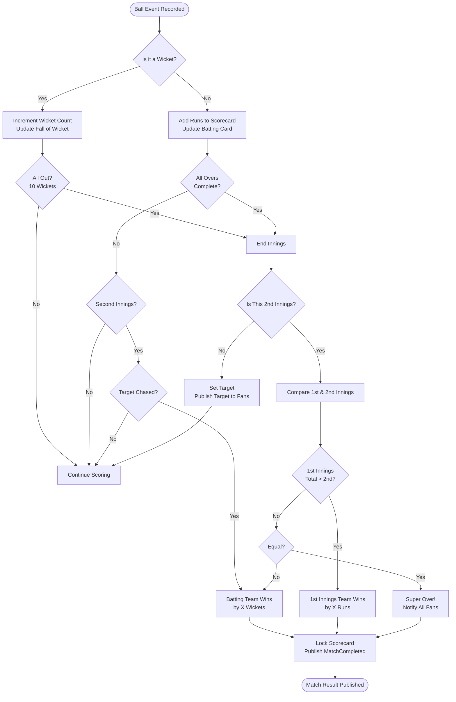
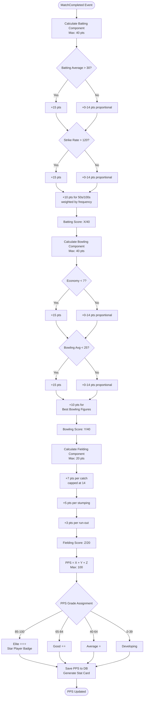
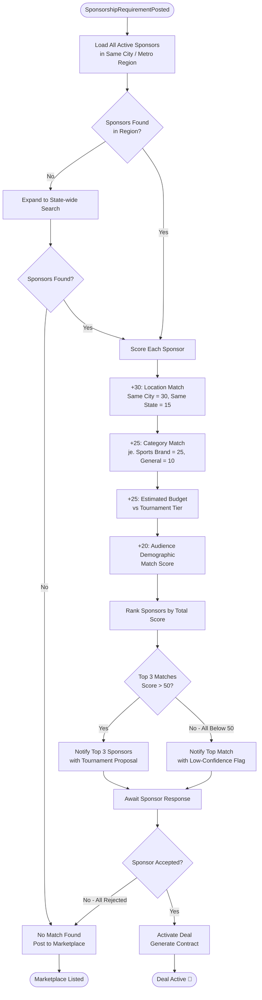
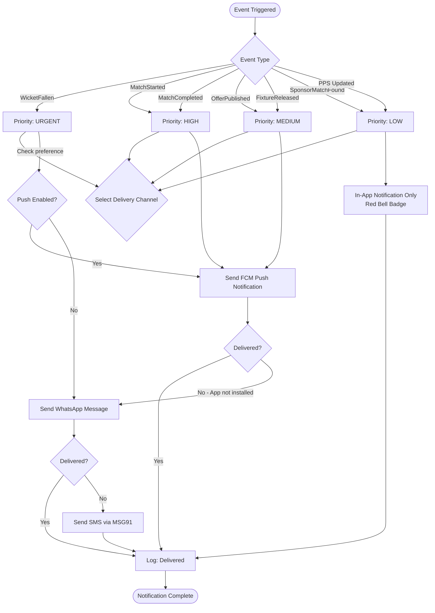

# Flowcharts — CricZone: Local Cricket Community Platform

> Four decision flowcharts covering the most critical automated decision engines in CricZone.

---

## FC-1: Match Result Decision Engine

---

## FC-2: Player Performance Score (PPS) Calculation

---

## FC-3: Sponsor Matching Decision Logic

---

## FC-4: Notification Routing Decision

