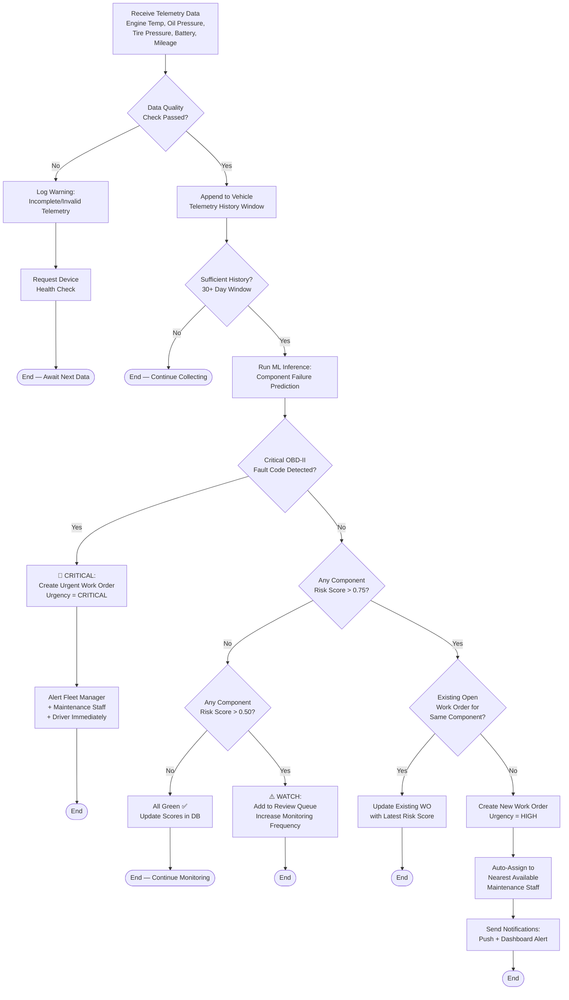
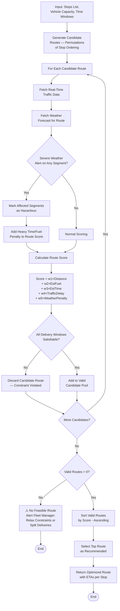
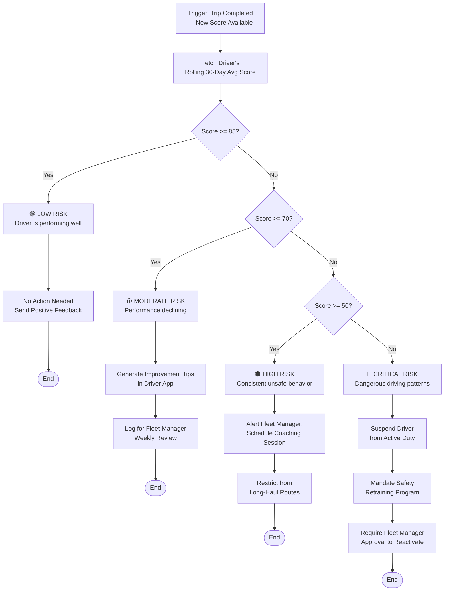
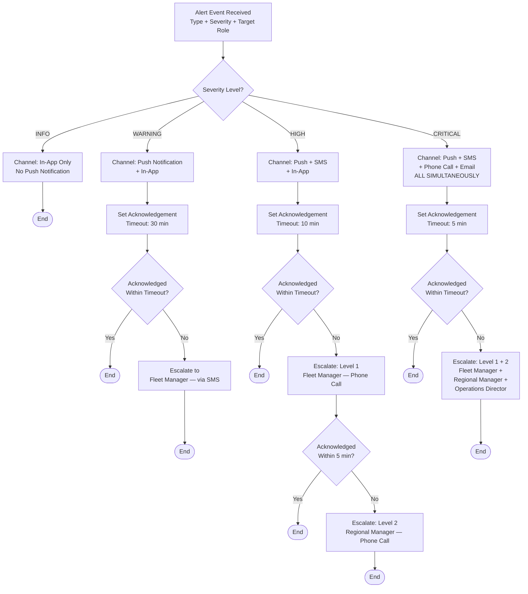

# Flowcharts — AI-Driven Fleet Management Optimization Platform

> **⚠️ Core Requirements**: Decision flowcharts model the AI-driven logic for key platform capabilities.

## Table of Contents
1. [Maintenance Decision Engine](#maintenance-decision-engine)
2. [Route Selection Decision Flow](#route-selection-decision-flow)
3. [Driver Risk Assessment Flow](#driver-risk-assessment-flow)
4. [Alert Escalation Decision Flow](#alert-escalation-decision-flow)

---

## Maintenance Decision Engine

This flowchart models how the AI decides whether to create a maintenance work order based on telematics data.

---

## Route Selection Decision Flow

This flowchart models how the AI selects the optimal route from candidate paths.

---

## Driver Risk Assessment Flow

This flowchart models how the system evaluates a driver's overall risk level and determines corrective actions.

---

## Alert Escalation Decision Flow

This flowchart models how the notification system determines the delivery channel and escalation path.

---

**Last Updated**: February 2026
**Version**: 1.0
