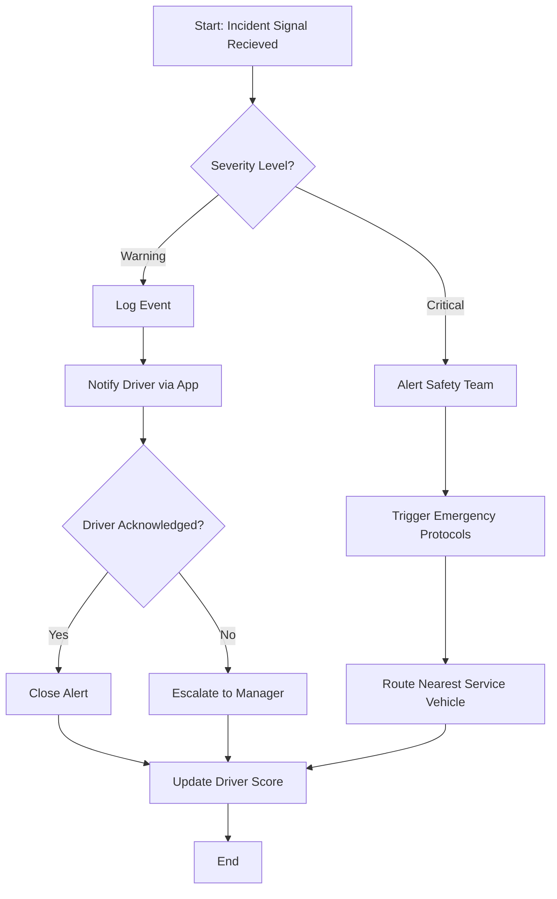

# System Flowcharts

## Incident Response Flowchart

This flowchart details the decision process when a safety incident is detected.

```mermaid
flowchart TD
    A[Start: Incident Signal Recieved] --> B{Severity Level?}
    B -- Critical --> C[Alert Safety Team]
    B -- Warning --> D[Log Event]
    C --> E[Trigger Emergency Protocols]
    E --> F[Route Nearest Service Vehicle]
    D --> G[Notify Driver via App]
    G --> H{Driver Acknowledged?}
    H -- Yes --> I[Close Alert]
    H -- No --> J[Escalate to Manager]
    I --> K[Update Driver Score]
    J --> K
    F --> K
    K --> L[End]
```
