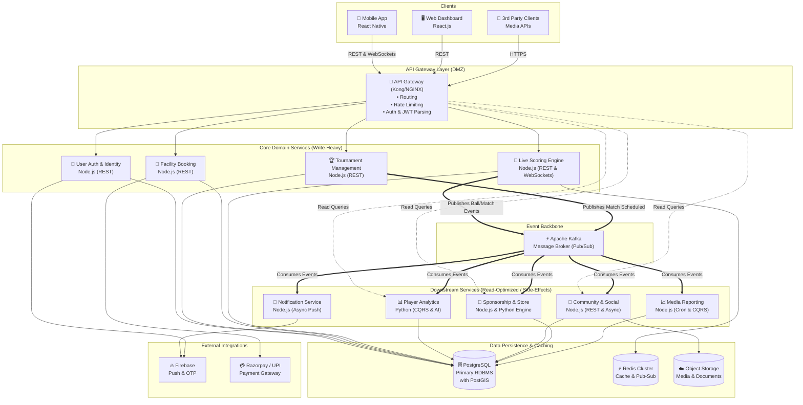

# HLD Diagram — CricZone: Local Cricket Community Platform

---

## 1. High-Level Design (HLD) Architecture

```mermaid
graph TB
    subgraph Clients
        MOB["📱 Mobile App\nReact Native"]
        WEB["🖥️ Web Dashboard\nReact.js"]
        3RD["📡 3rd Party Clients\nMedia APIs"]
    end

    subgraph "API Gateway Layer (DMZ)"
        GW["🔀 API Gateway (Kong/NGINX)\n• Routing\n• Rate Limiting\n• Auth & JWT Parsing"]
    end

    subgraph "Core Domain Services (Write-Heavy)"
        AUTH["🔐 User Auth & Identity\nNode.js (REST)"]
        TOUR["🏆 Tournament Management\nNode.js (REST)"]
        GROUND["📍 Facility Booking\nNode.js (REST)"]
        SCORING["🏏 Live Scoring Engine\nNode.js (REST & WebSockets)"]
    end

    subgraph "Event Backbone"
        KAFKA["⚡ Apache Kafka\nMessage Broker (Pub/Sub)"]
    end

    subgraph "Downstream Services (Read-Optimized / Side-Effects)"
        ANALYTICS["📊 Player Analytics\nPython (CQRS & AI)"]
        NOTIFY["🔔 Notification Service\nNode.js (Async Push)"]
        COMMUNITY["👥 Community & Social\nNode.js (REST & Async)"]
        SPONSOR["🤝 Sponsorship & Store\nNode.js & Python Engine"]
        REPORT["📈 Media Reporting\nNode.js (Cron & CQRS)"]
    end

    subgraph "Data Persistence & Caching"
        POSTGRES[("🗄️ PostgreSQL\nPrimary RDBMS\nwith PostGIS")]
        REDIS[("⚡ Redis Cluster\nCache & Pub-Sub")]
        S3[("☁️ Object Storage\nMedia & Documents")]
    end

    subgraph "External Integrations"
        FIREBASE["🔥 Firebase\nPush & OTP"]
        PAYMENT["💳 Razorpay / UPI\nPayment Gateway"]
    end

    %% Client to Gateway
    MOB -->|REST & WebSockets| GW
    WEB -->|REST| GW
    3RD -->|HTTPS| GW

    %% Gateway to Core
    GW --> AUTH
    GW --> TOUR
    GW --> GROUND
    GW --> SCORING

    %% Gateway to Downstream Reads (CQRS)
    GW -.->|Read Queries| ANALYTICS
    GW -.->|Read Queries| COMMUNITY
    GW -.->|Read Queries| SPONSOR

    %% Core to Data
    AUTH --> POSTGRES
    TOUR --> POSTGRES
    GROUND --> POSTGRES
    SCORING --> POSTGRES
    SCORING --> REDIS

    %% Event Sourcing Flow
    SCORING ==>|Publishes Ball/Match Events| KAFKA
    TOUR ==>|Publishes Match Scheduled| KAFKA

    %% Downstream Consuming Flow
    KAFKA ==>|Consumes Events| ANALYTICS
    KAFKA ==>|Consumes Events| NOTIFY
    KAFKA ==>|Consumes Events| COMMUNITY
    KAFKA ==>|Consumes Events| SPONSOR
    KAFKA ==>|Consumes Events| REPORT

    %% Downstream Data & External
    ANALYTICS --> POSTGRES
    COMMUNITY --> POSTGRES
    COMMUNITY --> S3
    SPONSOR --> POSTGRES
    REPORT --> POSTGRES
    NOTIFY --> FIREBASE
    GROUND --> PAYMENT
    AUTH --> FIREBASE
```
