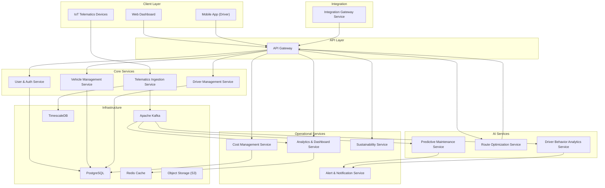

# Microservices — AI-Driven Fleet Management Optimization Platform

> **Service Identification Approach:** Services are decomposed using **Domain-Driven Design (DDD)** bounded contexts, the **Single Responsibility Principle**, and **team ownership boundaries**. Each service owns its data, communicates asynchronously via events, and can be deployed independently.

## Table of Contents
1. [Service Overview](#service-overview)
2. [Service Details](#service-details)
3. [Service Identification Rationale](#service-identification-rationale)
4. [Inter-Service Communication](#inter-service-communication)

---

## Service Overview



---

## Service Details

### 1. User & Auth Service
- **Responsibility:** User registration, authentication (JWT/OAuth 2.0), role management (RBAC), session management.
- **Owns Data:** `users`, `roles`, `permissions`, `sessions` tables.
- **Key APIs:** `POST /auth/login`, `POST /auth/register`, `GET /users`, `PUT /users/{id}/role`.
- **Bounded Context:** Identity & Access Management.

### 2. Vehicle Management Service
- **Responsibility:** Vehicle CRUD, telematics device pairing, compliance document management, vehicle lifecycle (Active → Maintenance → Decommissioned).
- **Owns Data:** `vehicles`, `telematics_devices`, `compliance_documents` tables.
- **Key APIs:** `POST /vehicles`, `GET /vehicles/{id}`, `POST /vehicles/{id}/pair-device`.
- **Bounded Context:** Fleet Asset Management.

### 3. Driver Management Service
- **Responsibility:** Driver CRUD, license/compliance tracking, driver-vehicle assignment, scheduling.
- **Owns Data:** `drivers`, `driver_documents`, `driver_vehicle_assignments` tables.
- **Key APIs:** `POST /drivers`, `GET /drivers/{id}`, `POST /drivers/{id}/assign`.
- **Bounded Context:** Workforce Management.

### 4. Telematics Ingestion Service
- **Responsibility:** Ingest high-frequency telematics data (GPS, OBD-II, accelerometer) from IoT devices. Parse, validate, and publish to Kafka topics.
- **Owns Data:** `telemetry_raw` (TimescaleDB hypertable — time-series).
- **Key Protocols:** MQTT (inbound), Kafka (outbound).
- **Bounded Context:** IoT Data Pipeline.
- **Scale Consideration:** Stateless, horizontally scaled. Must handle 10,000+ concurrent streams.

### 5. Predictive Maintenance Service
- **Responsibility:** Consume telematics data, run ML inference for component failure prediction, generate Risk Scores, and auto-create maintenance work orders.
- **Owns Data:** `maintenance_work_orders`, `component_risk_scores`, `ml_model_versions` tables.
- **Key Events Consumed:** `TelemetryReceived`, `VehicleDiagnosticAlert`.
- **Key Events Published:** `MaintenanceWorkOrderCreated`, `RiskScoreUpdated`.
- **Bounded Context:** Predictive Analytics — Maintenance.

### 6. Route Optimization Service
- **Responsibility:** Calculate optimal routes using traffic, weather, vehicle capacity, and delivery constraints. Support dynamic rerouting.
- **Owns Data:** `routes`, `route_waypoints`, `delivery_schedules` tables.
- **Key APIs:** `POST /routes/optimize`, `GET /routes/{id}`, `POST /routes/{id}/reroute`.
- **External Dependencies:** Google Maps / HERE API (traffic), OpenWeatherMap (weather).
- **Bounded Context:** Logistics Optimization.

### 7. Driver Behavior Analytics Service
- **Responsibility:** Analyze accelerometer + GPS streams to detect driving events (harsh braking, speeding, cornering). Calculate Driver Safety Scores.
- **Owns Data:** `driving_events`, `driver_scores`, `trip_summaries` tables.
- **Key Events Consumed:** `TelemetryReceived`.
- **Key Events Published:** `DrivingEventDetected`, `DriverScoreUpdated`.
- **Bounded Context:** Safety & Compliance Analytics.

### 8. Alert & Notification Service
- **Responsibility:** Evaluate alert rules, manage escalation policies, and deliver notifications via Push, SMS, Email, and Webhook.
- **Owns Data:** `alert_rules`, `alert_instances`, `notification_logs`, `escalation_policies` tables.
- **Key Events Consumed:** `MaintenanceWorkOrderCreated`, `DrivingEventDetected`, `GeofenceBreach`, `RouteDeviation`.
- **Bounded Context:** Communication & Escalation.

### 9. Analytics & Dashboard Service
- **Responsibility:** Aggregate fleet-wide KPIs, generate reports, and serve dashboard data. Caches computed metrics in Redis.
- **Owns Data:** `kpi_snapshots`, `reports` tables + Redis cache.
- **Key APIs:** `GET /analytics/kpis`, `GET /analytics/reports/{type}`, `GET /analytics/insights`.
- **Bounded Context:** Business Intelligence.

### 10. Cost Management Service
- **Responsibility:** Track operational costs (fuel, maintenance, tolls, insurance). Identify cost anomalies. Generate savings recommendations.
- **Owns Data:** `cost_entries`, `cost_budgets`, `cost_recommendations` tables.
- **Key APIs:** `GET /costs/summary`, `GET /costs/breakdown`, `GET /costs/recommendations`.
- **Bounded Context:** Financial Operations.

### 11. Sustainability Service
- **Responsibility:** Calculate CO₂ emissions per vehicle/route/fleet. Track sustainability targets. Recommend green alternatives.
- **Owns Data:** `emission_records`, `sustainability_targets`, `green_recommendations` tables.
- **Key APIs:** `GET /sustainability/emissions`, `GET /sustainability/targets`, `GET /sustainability/recommendations`.
- **Bounded Context:** Environmental Compliance.

### 12. Integration Gateway Service
- **Responsibility:** Manage third-party integrations (ERP, TMS, fuel card, compliance). Provide webhook management and data transformation.
- **Owns Data:** `integration_configs`, `webhook_subscriptions`, `integration_logs` tables.
- **Key APIs:** `POST /integrations`, `GET /integrations/{id}/status`, `POST /webhooks`.
- **Bounded Context:** External System Interoperability.

---

## Service Identification Rationale

| # | Service | Identification Method | Rationale |
|---|---------|----------------------|-----------|
| 1 | User & Auth | Bounded Context | Identity is a cross-cutting concern with its own lifecycle. Separating it allows centralized security policy enforcement. |
| 2 | Vehicle Management | Domain Entity | Vehicle is a core domain aggregate with its own lifecycle (onboarding → active → decommissioned). |
| 3 | Driver Management | Domain Entity | Driver has distinct compliance requirements, scheduling, and lifecycle from vehicles. |
| 4 | Telematics Ingestion | Technical Capability | High-throughput data pipeline has fundamentally different scaling needs (stateless, I/O bound) from business services. |
| 5 | Predictive Maintenance | Bounded Context + AI | ML inference has specialized compute needs (GPU/CPU-intensive). Isolating it allows independent model versioning and scaling. |
| 6 | Route Optimization | Bounded Context + AI | Route computation is CPU-intensive with external API dependencies. Independent scaling + circuit-breaking needed. |
| 7 | Driver Behavior Analytics | Bounded Context + AI | Stream processing with distinct ML models. Separate deployment allows independent model updates. |
| 8 | Alert & Notification | Cross-Cutting Concern | Notifications span all domains. Centralizing prevents duplicate alert logic and provides consistent escalation. |
| 9 | Analytics & Dashboard | Read-Optimized View | Read-heavy service with caching needs; CQRS pattern separates it from write-heavy operational services. |
| 10 | Cost Management | Bounded Context | Financial data has distinct audit, reporting, and access control requirements. |
| 11 | Sustainability | Bounded Context | Emissions tracking is a growing regulatory concern with its own reporting standards (GHG Protocol). |
| 12 | Integration Gateway | Technical Capability | Isolates third-party integration complexity — retry logic, data transformation, rate limiting — from core services. |

---

## Inter-Service Communication

| Pattern | Usage | Example |
|---------|-------|---------|
| **Synchronous (REST/gRPC)** | User-initiated actions requiring immediate response | `POST /routes/optimize` → Route Optimization Service |
| **Asynchronous (Kafka Events)** | Decoupled side-effects and data pipelines | `TelemetryReceived` → consumed by Predictive Maintenance, Driver Behavior Analytics |
| **WebSocket** | Real-time UI updates | Vehicle location updates pushed to Dashboard |
| **MQTT** | IoT device communication | Telematics devices → Telematics Ingestion Service |

### Key Event Flows
```
IoT Device → (MQTT) → Telematics Ingestion → (Kafka: TelemetryReceived)
    ├──→ Predictive Maintenance Service → (Kafka: MaintenanceWorkOrderCreated) → Alert Service
    ├──→ Driver Behavior Analytics → (Kafka: DrivingEventDetected) → Alert Service
    └──→ Analytics & Dashboard Service (aggregate KPIs)
```
