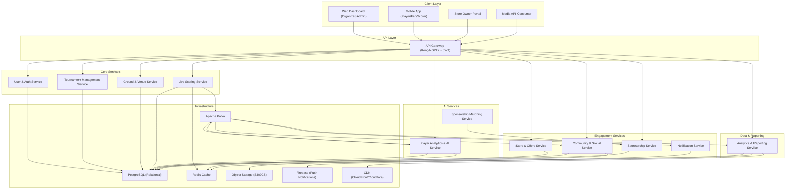

# Microservices — CricZone: Local Cricket Community Platform

> **Service Identification Approach:** Services are decomposed using **Domain-Driven Design (DDD)** bounded contexts, the **Single Responsibility Principle**, and **team ownership boundaries**. Each service owns its own data store, communicates asynchronously via events, and can be independently deployed and scaled.

## Table of Contents
1. [Service Overview](#service-overview)
2. [Service Details](#service-details)
3. [Service Identification Rationale](#service-identification-rationale)
4. [Inter-Service Communication](#inter-service-communication)

---

## Service Overview



---

## Service Details

### 1. User & Auth Service
- **Responsibility:** User registration (OTP + Social Login), authentication (JWT), role management (RBAC — Player, Organizer, Fan, Scorer, Store Owner, Sponsor, Admin), KYC verification for business accounts.
- **Owns Data:** `users`, `roles`, `permissions`, `kyc_verifications`, `sessions` tables.
- **Key APIs:** `POST /auth/login`, `POST /auth/otp/send`, `POST /auth/otp/verify`, `GET /users/{id}`, `PUT /users/{id}/role`.
- **Bounded Context:** Identity & Access Management.

---

### 2. Tournament Management Service
- **Responsibility:** Full tournament lifecycle — creation, team registration, fixture scheduling (manual + auto), match assignment, points table computation, bracket progression, tournament cloning.
- **Owns Data:** `tournaments`, `teams`, `team_registrations`, `matches`, `fixtures`, `points_table`, `umpires` tables.
- **Key APIs:** `POST /tournaments`, `GET /tournaments/{id}`, `POST /tournaments/{id}/register-team`, `POST /tournaments/{id}/schedule`, `GET /tournaments/{id}/points-table`.
- **Key Events Published:** `MatchScheduled`, `TournamentStarted`, `MatchResultUpdated`.
- **Bounded Context:** Tournament & Competition Management.

---

### 3. Ground & Venue Service
- **Responsibility:** Ground profiles, availability calendar management, real-time slot booking with conflict prevention, payment integration for booking fees, rating and review of venues.
- **Owns Data:** `grounds`, `ground_slots`, `bookings`, `ground_reviews` tables.
- **Key APIs:** `GET /grounds`, `GET /grounds/{id}/availability`, `POST /grounds/{id}/book`, `POST /grounds/{id}/reviews`.
- **External Dependencies:** Razorpay / UPI (payment), Google Maps (geocoding).
- **Bounded Context:** Venue & Ground Management.

---

### 4. Live Scoring Service
- **Responsibility:** Ball-by-ball scoring interface and engine, real-time scorecard computation (runs, wickets, extras, partnerships, bowling figures), AI auto-commentary generation, scorecard state management (Innings, Target, Result).
- **Owns Data:** `live_matches`, `ball_events`, `innings_scorecards`, `batting_cards`, `bowling_cards` tables.
- **Key APIs:** `POST /matches/{id}/score/ball`, `GET /matches/{id}/scorecard`, `POST /matches/{id}/undo`, `POST /matches/{id}/end-innings`.
- **Key Events Published:** `BallScored`, `WicketFallen`, `MatchCompleted`, `MatchStarted`.
- **Bounded Context:** Live Match & Scoring — Core Domain.
- **Scale Consideration:** Stateless scoring engine; Redis for in-play scorecard cache; WebSocket push to fans.

---

### 5. Player Analytics & AI Service
- **Responsibility:** Aggregate player statistics (batting, bowling, fielding) from match data events; compute Player Performance Score (PPS — AI composite 0–100); generate form trends, head-to-head comparisons, AI insights, and shareable stat cards.
- **Owns Data:** `player_career_stats`, `player_match_stats`, `player_performance_scores`, `ai_insights` tables.
- **Key APIs:** `GET /players/{id}/stats`, `GET /players/{id}/pps`, `GET /players/compare`, `GET /players/{id}/insights`.
- **Key Events Consumed:** `MatchCompleted` → updates `player_career_stats`.
- **Key Events Published:** `PlayerPPSUpdated`.
- **Bounded Context:** Player Analytics & Performance Intelligence.

---

### 6. Sponsorship Matching Service (AI)
- **Responsibility:** AI-driven matching of tournament sponsorship requirements with registered sponsors based on geography, audience demographics, tournament reach, and sponsorship tier. Generate match scores and order recommendations.
- **Owns Data:** Uses read access to `tournaments`, `sponsors`, `sponsorship_deals` (owned by Sponsorship Service).
- **Key Events Consumed:** `SponsorshipRequirementPosted`.
- **Key Events Published:** `SponsorMatchFound`.
- **Bounded Context:** AI — Sponsorship Intelligence.
- **Note:** Monetization out of scope; this service enables matchmaking only.

---

### 7. Notification Service
- **Responsibility:** Event-driven, multi-channel notifications — Push (Firebase FCM), WhatsApp Business API, SMS (Twilio/MSG91), and Email. Rule evaluation, escalation, and delivery tracking.
- **Owns Data:** `notification_templates`, `notification_logs`, `user_notification_preferences` tables.
- **Key Events Consumed:** `BallScored` (milestone), `WicketFallen`, `MatchStarted`, `MatchCompleted`, `OfferPublished`, `SponsorMatchFound`, `MatchScheduled`.
- **Bounded Context:** Communication & Engagement — Cross-Cutting.

---

### 8. Community & Social Service
- **Responsibility:** Community feed management, post creation (text/photo/video), reactions, comments, player/team follow system, polls, tournament leaderboards, post moderation queue, auto-generated match summary posts.
- **Owns Data:** `posts`, `comments`, `reactions`, `follows`, `polls`, `poll_votes`, `leaderboards` tables; video/images → S3.
- **Key APIs:** `GET /feed`, `POST /posts`, `POST /posts/{id}/react`, `GET /tournaments/{id}/leaderboard`.
- **Key Events Consumed:** `MatchCompleted` → auto-generates match summary post.
- **Bounded Context:** Community & Social Engagement.

---

### 9. Store & Offers Service
- **Responsibility:** Store profile management (Store Owner self-service), product catalog, geo-indexed store discovery, offer creation (discount codes, QR-based redemption), offer lifecycle management, customer reviews.
- **Owns Data:** `stores`, `store_products`, `offers`, `offer_redemptions`, `store_reviews` tables.
- **Key APIs:** `GET /stores/nearby`, `GET /stores/{id}`, `GET /stores/{id}/offers`, `POST /offers/{id}/redeem`.
- **Key Events Published:** `OfferPublished`, `OfferRedeemed`.
- **Bounded Context:** Commerce & Local Merchant Network.

---

### 10. Sponsorship Service
- **Responsibility:** Sponsor onboarding and profile management, sponsorship deal creation and contract management, branding asset management (logos, overlay display rules), Sponsor ROI analytics dashboard.
- **Owns Data:** `sponsors`, `sponsorship_deals`, `sponsorship_contracts`, `branding_assets`, `sponsor_roi_metrics` tables.
- **Key APIs:** `POST /sponsors`, `POST /sponsorships`, `GET /sponsorships/{id}/roi`, `GET /sponsors/{id}/deals`.
- **Key Events Published:** `SponsorshipRequirementPosted`, `SponsorshipDealActivated`.
- **Bounded Context:** Sponsorship & Brand Partnership.

---

### 11. Analytics & Reporting Service
- **Responsibility:** Aggregate match and tournament statistics, generate post-match and tournament reports (PDF/CSV), serve public statistics API for media, maintain historical stats archive, provide Organizer analytics dashboard.
- **Owns Data:** `tournament_reports`, `match_summaries`, `public_statistics` (read views + cache); PDF/CSV → S3/CDN.
- **Key APIs:** `GET /analytics/tournament/{id}/report`, `GET /analytics/player/{id}/history`, `GET /media/stats/feed`.
- **Key Events Consumed:** `MatchCompleted`, `TournamentStarted`, `PlayerPPSUpdated`.
- **Bounded Context:** Business Intelligence & Media Reporting.

---

## Service Identification Rationale

| # | Service | Identification Method | Rationale |
|---|---------|----------------------|-----------|
| 1 | User & Auth | Bounded Context | Identity is cross-cutting; central auth prevents security fragmentation across 7 roles. |
| 2 | Tournament Management | Core Domain Entity | Tournament orchestrates teams, schedules, and results — the central cricket organizer workflow. |
| 3 | Ground & Venue | Domain Entity | Venue has distinct booking, payment, and calendar state separate from match and tournament logic. |
| 4 | Live Scoring | Core Domain — Technical Isolation | Scoring engine is the most latency-sensitive and writes-heavy component. Isolated for independent horizontal scaling and WebSocket push. |
| 5 | Player Analytics & AI | AI + Bounded Context | ML inference for PPS has specialized compute needs. Post-match aggregation separated from in-match scoring for read/write isolation. |
| 6 | Sponsorship Matching (AI) | Technical Capability + AI | Recommendation engine has distinct compute pattern from CRUD sponsorship management. Separation allows async matching without blocking deal creation. |
| 7 | Notification Service | Cross-Cutting Concern | Centralized multi-channel delivery (Push/WhatsApp/SMS/Email) prevents duplicate notification logic across all domains. |
| 8 | Community & Social | Bounded Context | Feed, posts, and social graph are distinct from cricket data. Write-heavy (video uploads) with different scaling needs (CDN, S3). |
| 9 | Store & Offers | Bounded Context | Merchant-side commerce has separate actors, data, and lifecycle from player/tournament data. |
| 10 | Sponsorship | Bounded Context | Business partnership management (contracts, branding, deals) is distinct from AI matching and general tournament management. |
| 11 | Analytics & Reporting | Read-Optimized View | Read-heavy, report generation is cache-friendly (CQRS pattern). Isolated to prevent analytics queries from degrading live scoring write performance. |

---

## Inter-Service Communication

| Pattern | Usage | Example |
|---------|-------|---------|
| **Synchronous (REST)** | User-initiated actions requiring immediate response | `POST /matches/{id}/score/ball` → Live Scoring Service |
| **Asynchronous (Kafka Events)** | Decoupled side effects and data pipelines | `MatchCompleted` → consumed by Player Analytics, Community, Reporting |
| **WebSocket** | Real-time UI updates | Live scorecard pushed to all fans watching a match |
| **FCM/WhatsApp/SMS Push** | Notification delivery | Notification Service → Firebase → Player's phone |

### Key Event Flows
```
Scorer → (REST) → Live Scoring Service → (Kafka: BallScored)
    ├──→ Notification Service → fans watching the match
    └──→ Analytics & Reporting Service (aggregate)

Live Scoring Service → (Kafka: MatchCompleted)
    ├──→ Player Analytics & AI Service → compute PPS + career stats
    ├──→ Community Service → auto-generate match summary post
    ├──→ Notification Service → push "Match Result" to followers
    └──→ Analytics & Reporting Service → generate match report

Store & Offers Service → (Kafka: OfferPublished)
    └──→ Notification Service → push to store followers
```
