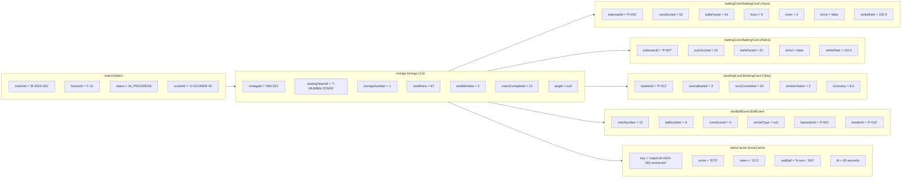
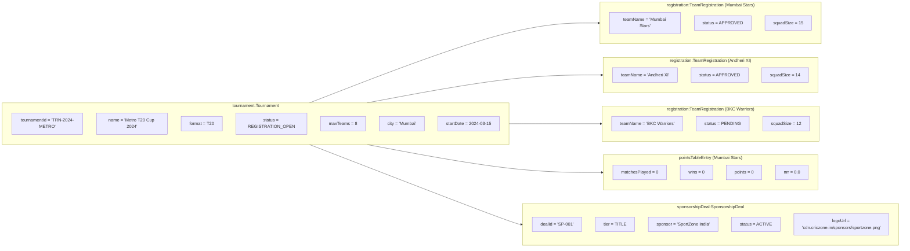

# Object Diagrams — CricZone: Local Cricket Community Platform

> Three runtime object snapshots capturing real in-memory state during key moments in a CricZone operation.

---

## OD-1: Live Match in Progress (Mid-Innings Snapshot)

---

## OD-2: Tournament Registration Snapshot (7 of 8 Teams Confirmed)

---

## OD-3: Offer Redemption in Progress (Store & Fan Snapshot)

```mermaid
flowchart LR
    subgraph store_obj ["store:Store"]
        s1["storeId = 'STR-001'"]
        s2["name = 'Sachin Sports Hub'"]
        s3["city = 'Pune'"]
        s4["rating = 4.7"]
        s5["latitude = 18.5204"]
        s6["longitude = 73.8567"]
    end

    subgraph offer_obj ["offer:Offer"]
        o1["offerId = 'OFF-202'"]
        o2["title = '20% off Kookaburra bats'"]
        o3["discountPercentage = 20.0"]
        o4["validUntil = 2024-03-31"]
        o5["maxRedemptions = 100"]
        o6["currentRedemptions = 37"]
        o7["status = ACTIVE"]
    end

    subgraph user_obj ["user:User (Fan)"]
        u1["userId = 'U-FAN-087'"]
        u2["name = 'Sneha Joshi'"]
        u3["city = 'Pune'"]
        u4["role = FAN"]
    end

    subgraph redemption_obj ["redemption:OfferRedemption"]
        r1["redemptionId = 'RDM-8821'"]
        r2["status = IN_PROGRESS"]
        r3["qrCode = 'CZ-RDM-OFF202-U087-8821'"]
        r4["redeemedAt = null (pending scan)"]
    end

    subgraph notif ["notification:Notification (sent)"]
        n1["type = OFFER_ALERT"]
        n2["channel = FCM_PUSH"]
        n3["message = '🏏 New offer at Sachin Sports Hub near you!'"]
        n4["isRead = true"]
    end

    store_obj --> offer_obj
    user_obj --> redemption_obj
    offer_obj --> redemption_obj
    user_obj --> notif
```

