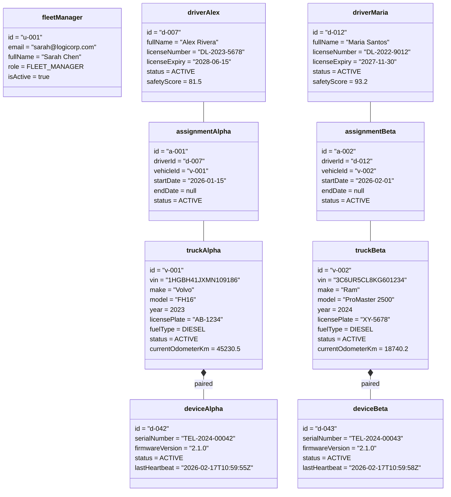
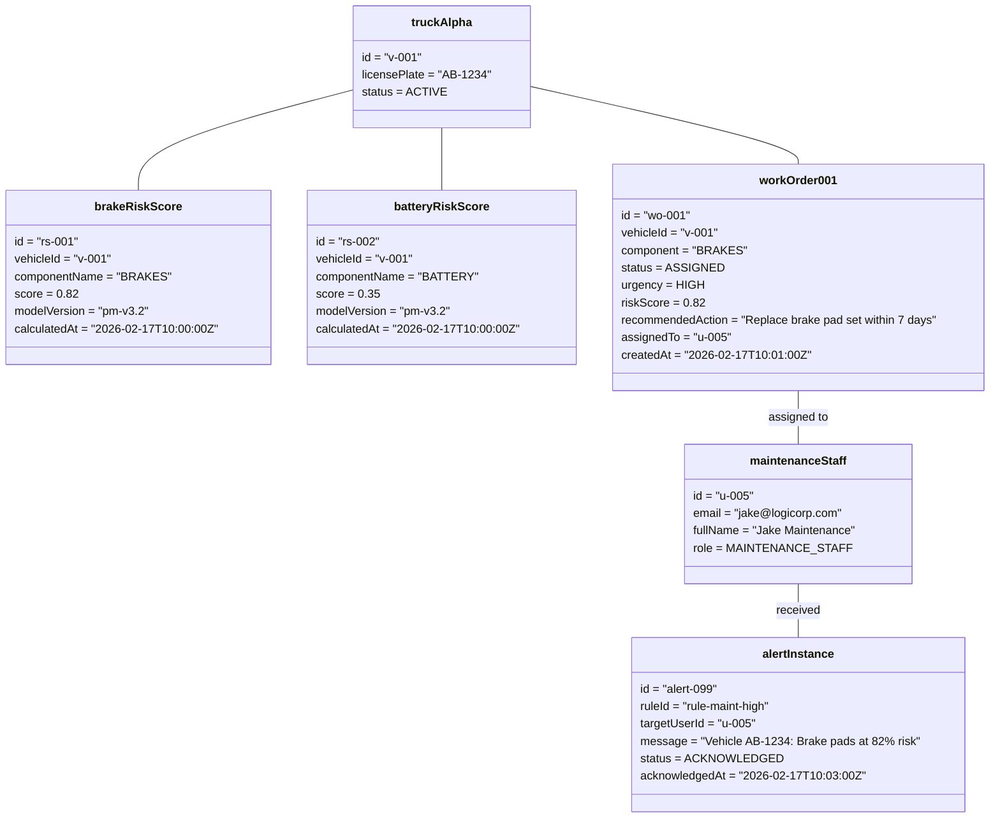
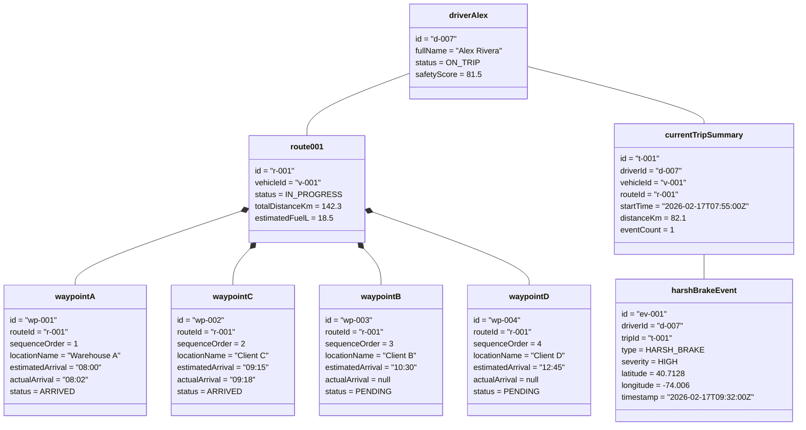

# Object Diagram — AI-Driven Fleet Management Optimization Platform

> **⚠️ Context**: Object diagrams show **runtime snapshots** of actual object instances at specific points in time, illustrating how the classes from [CLASS_DIAGRAM.md](./CLASS_DIAGRAM.md) are instantiated during real-world scenarios.

## Table of Contents
1. [Scenario 1: Active Fleet — Normal Operations](#scenario-1-active-fleet--normal-operations)
2. [Scenario 2: Predictive Maintenance Triggered](#scenario-2-predictive-maintenance-triggered)
3. [Scenario 3: Route In Progress with Driver Monitoring](#scenario-3-route-in-progress-with-driver-monitoring)

---

## Scenario 1: Active Fleet — Normal Operations

**Snapshot**: A fleet manager has 2 vehicles active, each with a paired telematics device, and 2 drivers assigned. The fleet is operating normally.

---

## Scenario 2: Predictive Maintenance Triggered

**Snapshot**: The AI has detected that Truck Alpha's brakes are at high risk. A work order has been created and assigned to maintenance staff.

---

## Scenario 3: Route In Progress with Driver Monitoring

**Snapshot**: Driver Alex is mid-route delivering to 4 stops. The AI detected a harsh braking event. The route has been dynamically rerouted due to a traffic incident.

---

**Last Updated**: February 2026
**Version**: 1.0
