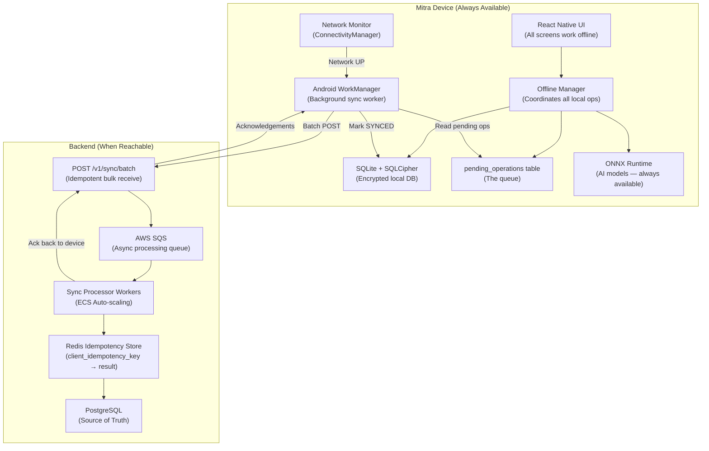
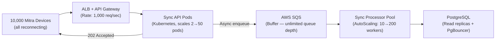

# Mitra Finance — Offline Sync Strategy

> **⚠️ Core Requirements**: REQ-5 (Offline-First Operations) | Pattern: Store-and-Forward

## Table of Contents
1. [Problem Context](#problem-context)
2. [Architecture Overview](#architecture-overview)
3. [Store-and-Forward Queue Design](#store-and-forward-queue-design)
4. [Sync Protocol](#sync-protocol)
5. [Conflict Resolution Strategy](#conflict-resolution-strategy)
6. [Bandwidth Optimization](#bandwidth-optimization)
7. [Priority & Ordering Guarantees](#priority--ordering-guarantees)
8. [Sync Storm Handling (10K Mitras)](#sync-storm-handling-10k-mitras)
9. [Error Handling & Retry Strategy](#error-handling--retry-strategy)
10. [Offline AI Model Strategy](#offline-ai-model-strategy)

---

## Problem Context

Mitra Finance serves rural areas where connectivity is:
- **Absent**: Tribal/hilly regions — 0 bars, entire session offline
- **Intermittent**: Village areas — signal drops mid-session during document upload
- **Slow-then-fast**: Mitra travels from village (2G) to town (4G) during the day

**Core Guarantee**: A Bank Mitra MUST be able to:
1. Create a new customer profile
2. Conduct an AI voice credit interview (fully on-device)
3. Fill and submit a loan application
4. Capture and OCR supporting documents

…with **zero network connectivity**, and have all data safely flushed to the server when connectivity restores — **without any data loss or duplication**.

---

## Architecture Overview



---

## Store-and-Forward Queue Design

### Queue Item Structure (SQLite)
```sql
CREATE TABLE pending_operations (
    id                      TEXT PRIMARY KEY,       -- Local UUID
    client_idempotency_key  TEXT UNIQUE NOT NULL,   -- Server deduplication key
    operation_type          TEXT NOT NULL,          -- CREATE | UPDATE
    entity_type             TEXT NOT NULL,          -- LoanApplication | Customer | Document | ConsentRecord
    entity_id               TEXT,                   -- Local entity ID
    payload                 BLOB NOT NULL,          -- Protobuf-serialized entity (compressed)
    priority                INTEGER NOT NULL DEFAULT 5, -- 1=KYC, 2=Loan, 3=Document, 4=Consent, 5=Other
    status                  TEXT NOT NULL DEFAULT 'PENDING',  -- PENDING | SYNCING | SYNCED | FAILED
    retry_count             INTEGER DEFAULT 0,
    last_attempt_at         INTEGER,                -- Unix ms
    error_message           TEXT,
    created_at              INTEGER NOT NULL        -- Unix ms
);
```

### Priority Levels
| Priority | Entity Type | Rationale |
|----------|------------|-----------|
| 1 | KYC / Customer record | Identity is foundational; without this, loan data is orphaned |
| 2 | Loan Application | Core business record; SLA timers start on server receipt |
| 3 | Loan Documents | Large payloads; can arrive after application |
| 4 | Consent Records | Critical for compliance but application already exists |
| 5 | Audit Events, Notifications | Informational; can tolerate delay |

---

## Sync Protocol

### Step-by-Step Sync Flow

1. **Trigger**: `ConnectivityManager` fires `CONNECTIVITY_ACTION`; WorkManager enqueues `SyncWorker`
2. **Read Queue**: `SELECT * FROM pending_operations WHERE status='PENDING' ORDER BY priority, created_at LIMIT 50`
3. **Serialize**: For each item, pack into `SyncBatchRequest` protobuf message
4. **Upload**: `POST /v1/sync/batch` with `Content-Type: application/x-protobuf`
5. **Server receives**: Validates each item; checks idempotency key; enqueues to SQS
6. **Server processes**: SQS worker processes each item atomically; writes to PostgreSQL
7. **Acknowledgement**: Server returns array of `{clientIdempotencyKey, status, serverId}`
8. **Mark synced**: Device marks each acknowledged item as `SYNCED` in SQLite
9. **Re-scoring**: For offline-scored loans, server triggers re-score with full feature vector
10. **Pull updates**: Device fetches any server-side status changes (loan approvals, etc.)

### Sync Latency Targets
| Scenario | Target |
|----------|--------|
| 10 operations (KYC + loan + docs) | < 15 seconds on 3G |
| 50 operations (batch day) | < 60 seconds on 3G |
| Full re-sync from scratch (new device) | < 5 minutes |

---

## Conflict Resolution Strategy

### Conflict Sources
1. Mitra edits a loan locally while Credit Officer edits it on web dashboard
2. Two Mitras (incorrectly) sync the same customer record
3. Network interruption mid-sync causes partial upload

### Resolution Rules

| Entity Type | Conflict Strategy | Rationale |
|------------|-----------------|-----------|
| `LoanApplication` (status field) | **Server-wins** | Financial state machine must be authoritative |
| `Customer` (dialect, contact) | **Last-Write-Wins** (by timestamp) | Non-financial; Mitra's fresh update usually correct |
| `ConsentRecord` | **Append-only** — no conflicts possible | New row always inserted; no updates |
| `LoanDocument` | **Server-wins** | Verified document takes precedence |
| `pending_operations` with duplicate idempotency key | **Server response used** | Redis returns cached result from first successful processing |

### Conflict Notification
When conflict detected (same entity modified on both ends):
- `ConflictRecord` row inserted in `sync_queue` table
- Mitra's app displays: _"Application updated by Credit Officer. Your local changes were not saved."_
- Credit Officer receives notification of the conflict resolution

---

## Bandwidth Optimization

### Techniques Applied
| Technique | Saving | Implementation |
|-----------|--------|---------------|
| **Protocol Buffers** | ~5× smaller than JSON | Custom `.proto` schema for all sync entities |
| **gzip compression** | Additional 30–60% on text-heavy payloads | Brotli for HTTP, gzip for Kafka |
| **Image compression** | Documents reduced from ~3MB → < 500KB | libjpeg-turbo with adaptive quality |
| **Delta sync** | Only changed fields sent | Each entity has a `last_modified_at`; client sends only records modified after last sync marker |
| **Sync marker** | Avoids re-sending synced data | `GET /sync/marker?mitraId={id}` → server returns timestamp of last successful sync |
| **Batching** | Reduces HTTP round trips | Up to 50 operations per batch POST |

### Payload Size Estimates
| Item | JSON | Protobuf + gzip |
|------|------|----------------|
| Customer record | 1.2 KB | 210 bytes |
| Loan application | 8 KB | 1.4 KB |
| Document metadata | 800 bytes | 90 bytes |
| Document image | 3.5 MB | 480 KB (JPEG compression) |

---

## Priority & Ordering Guarantees

### Within-Queue Ordering
- Items with same priority processed **FIFO** (by `created_at`)
- KYC always synced before loan (priority 1 before priority 2)
- Parent entity always synced before child (Customer before LoanApplication, LoanApplication before Document)

### Out-of-Order Detection
Server detects if LoanApplication arrives before its Customer:
- Response: `{ status: "DEFERRED", reason: "PARENT_NOT_FOUND", retryAfter: 5 }`
- Device requeues the Loan item with a 5-second delay

---

## Sync Storm Handling (10K Mitras)

**Scenario**: Regional power cut → 10,000 Mitras reconnect simultaneously with 2–5 days of offline data.

### Solution Architecture


- **Sync API is async**: Returns `202 Accepted` immediately; processing happens in SQS queue
- **Decoupled by SQS**: Device doesn't wait for DB write; SQS absorbs the storm
- **Kubernetes HPA**: Sync API pods scale from 5 → 50 based on incoming RPS
- **Processor auto-scaling**: ECS workers scale from 10 → 200 based on SQS queue depth
- **PgBouncer**: Connection pooling prevents 200 workers from opening 200 DB connections

### Estimated Capacity
- Each sync worker: processes ~20 operations/second
- 200 workers × 20 ops/s = 4,000 ops/second
- 10,000 Mitras × avg 50 ops each = 500,000 total ops
- **Estimated clearance time**: 500,000 / 4,000 = **~125 seconds** (< 3 minutes)

---

## Error Handling & Retry Strategy

### Retry Policy (Exponential Backoff)
```
Attempt 1: Immediate (network just restored)
Attempt 2: 1 minute
Attempt 3: 2 minutes
Attempt 4: 4 minutes
Attempt 5: 8 minutes
Attempt 6: 16 minutes
...
Max attempts: 12
Max wait: 30 minutes between attempts
After 12 failures: Status → FAILED; Mitra alerted; Compliance team notified
```

### Non-Retryable Errors
| HTTP Status | Error Code | Action |
|-------------|-----------|--------|
| 400 | `BAD_PAYLOAD` | Log + skip (data corruption; cannot fix by retry) |
| 401 | `TOKEN_EXPIRED` | Refresh token → retry |
| 409 | `DUPLICATE` | Mark SYNCED (server already has it from earlier attempt) |
| 422 | `BUSINESS_RULE_VIOLATION` | Alert Mitra; manual intervention needed |

---

## Offline AI Model Strategy

| Model Component | On-Device Version | Update Strategy |
|----------------|------------------|----------------|
| FastText LangID | v1.0 (1MB) | Bundled in APK; updated via app update |
| IndicASR ONNX | INT4 quantized | OTA download on WiFi only; A/B tested before force-update |
| Phi-2 ONNX | INT4, 1.8GB | OTA download on WiFi; user prompted ("Download for offline") |
| XGBoost Credit Scorer | ONNX, 12MB | OTA pushed on next WiFi sync after quarterly retraining |
| IndicTTS | Per-dialect, 35MB | User downloads their dialect pack; others on-demand |

### Model OTA Update Flow
1. Server pushes `model_update_available` event to device via FCM
2. App checks: is device on WiFi? Is battery > 20%?
3. If yes → background download from S3 (signed URL); atomic swap on completion
4. Model version reported in next sync batch (for audit trail)

---

**Last Updated**: February 2026
**Version**: 1.0
**Status**: Design Complete
