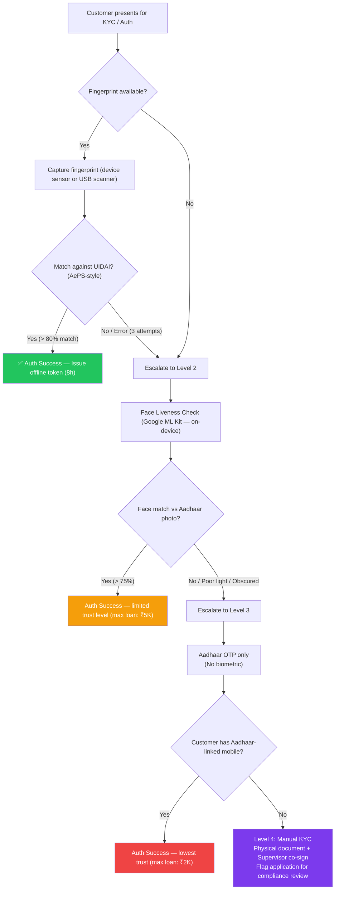
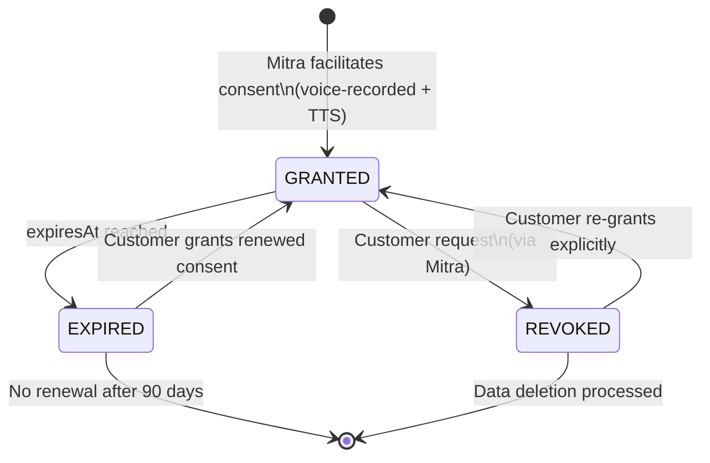
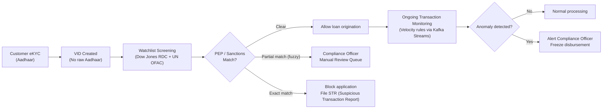

# Mitra Finance — Security Design

> **⚠️ Core Requirements**: REQ-2, REQ-8 | Compliance: DPDP Act 2023, RBI BC Guidelines, KYC Master Directions, AML/CFT

## Table of Contents
1. [Authentication Architecture](#authentication-architecture)
2. [Biometric Fallback Chain](#biometric-fallback-chain)
3. [DPDP Act 2023 Compliance Strategy](#dpdp-act-2023-compliance-strategy)
4. [Consent Design](#consent-design)
5. [Data Encryption](#data-encryption)
6. [Network Security](#network-security)
7. [KYC / AML Workflow](#kyc--aml-workflow)
8. [Device Security](#device-security)
9. [Role-Based Access Control (RBAC)](#role-based-access-control-rbac)

---

## Authentication Architecture

### Mitra Authentication (Multi-Layer)
```
Layer 1: Device Certificate (mTLS)
  ↓ Proves this is an authorized Mitra device
Layer 2: TOTP (Google Authenticator or Aadhaar-linked OTP)
  ↓ Proves this is the registered Mitra
Layer 3: Biometric (device fingerprint / face)
  ↓ Proves physical possession
Result: Short-lived JWT (15 min) + Device-bound Refresh Token (30 days)
```

### Token Lifecycle
| Token | TTL | Storage | Revocation |
|-------|-----|---------|-----------|
| Access JWT | 15 min | In-memory only | Implicit (expiry) |
| Refresh Token | 30 days | Android Keystore (hardware-backed) | Server-side blocklist (Redis) |
| Offline Biometric Token | 8 hours | Encrypted SQLite | Remote revocation via sync |
| Device Certificate | 1 year | Embedded in APK signing + UIDAI PKI | CRL check on login |

---

## Biometric Fallback Chain



### Trust Levels & Loan Limits
| Auth Level | Method | Max Loan Amount | Notes |
|-----------|--------|-----------------|-------|
| Level 1 | Fingerprint + Aadhaar OTP | No limit (workflow-defined) | Full trust |
| Level 2 | Face liveness only | ₹5,000 | Reduced trust |
| Level 3 | Aadhaar OTP only | ₹2,000 | Minimum trust |
| Level 4 | Manual + supervisor sign-off | ₹1,000 | Compliance flag raised |

---

## DPDP Act 2023 Compliance Strategy

### Key Obligations & Implementation

| DPDP Obligation | Implementation |
|-----------------|---------------|
| **Purpose Limitation** | Consent records specify exact purpose; systems enforce purpose boundary via API middleware |
| **Data Minimisation** | Zero raw Aadhaar storage; only VID. No credit bureau score stored for NTC customers without consent. |
| **Storage Limitation** | Auto-purge schedules: voice consents after 2 years; audit logs retained 7 years per RBI |
| **Right to Access** | `GET /consent/{customerId}` returns all data types held |
| **Right to Erasure** | Erasure request processed in < 72 hours; cascades to S3 document deletion, PostgreSQL soft-delete, Kafka tombstone |
| **Data Fiduciary** | Mitra Finance designated as Data Fiduciary; Partner banks as Data Processors (DPA signed) |
| **Breach Notification** | DPBI notification within 72 hours; Mitra + customer notified within 24 hours |
| **Children's Data** | Loan origination blocked if DOB < 18 years; checked against Aadhaar eKYC DOB |

### Data Fiduciary Register
```
Mitra Finance (Data Fiduciary)
├── UIDAI (Sub-processor — identity verification only)
├── S3 / AWS India (Sub-processor — document storage)
├── Sarvam AI (Sub-processor — interview processing; India-hosted)
├── Twilio / SMS GW (Sub-processor — notifications only)
└── AML Watchlist Provider (Sub-processor — screening only)
```

---

## Consent Design

### Consent Lifecycle Diagram


### Consent Record Guarantees
1. **Append-Only**: PostgreSQL trigger prevents UPDATE/DELETE on `consent_records`
2. **Voice-Backed**: Every consent event has a 15-second WAV recording (customer's own voice)
3. **Multi-Lingual**: TTS reads consent terms in customer's detected dialect
4. **Time-Bounded**: All consents have a mandatory expiry (max 2 years)
5. **Granular**: Each data type (biometric, utility, MGNREGA, ABHA) has a separate consent record
6. **Audit-Linked**: Every data access event references consent ID in `audit_logs`

---

## Data Encryption

### Encryption Map
| Data Layer | Encryption | Key Management |
|-----------|-----------|---------------|
| SQLite (device) | SQLCipher AES-256-CBC | Key derived from Mitra's biometric hash + device serial; stored in Android Keystore |
| Document Storage (S3) | SSE-S3 (AES-256) | AWS-managed KMS key (India region) |
| Voice Consent (S3) | SSE-KMS (Customer-managed key) | Rotated annually; Compliance team controls |
| PostgreSQL PII columns | Column-level AES-256 | Application-level encryption; keys in HashiCorp Vault |
| In-transit (App ↔ Server) | TLS 1.3 | HPKP-pinned; certificate pinning in APK |
| Kafka messages | TLS 1.3 + at-rest encryption | Broker-managed per-topic encryption |
| Redis (session tokens) | AES-256 at rest | Provisioned via Vault; rotated every 30 days |

### Fields NEVER Stored
- Raw Aadhaar number (only VID / masked last 4)
- Full bank account number (only masked)
- Raw biometric templates (only match result returned by UIDAI)
- Unmasked phone numbers (only encrypted BYTEA)

---

## Network Security

### Defense-in-Depth Architecture
```
Internet → CloudFront (DDoS + WAF) → ALB → Kong API Gateway (mTLS + JWT) → Internal services (VPC)
```

- **Certificate Pinning**: Android app pins the API Gateway certificate; rejects any other certificate
- **mTLS**: Every Mitra device has a unique client certificate signed by Mitra Finance CA; rotated annually
- **Rate Limiting**: Kong: 100 req/min per device (general); 10 req/min for KYC endpoints
- **VPC Isolation**: Core services in private subnet; no direct internet access; NAT Gateway for outbound
- **WAF Rules**: OWASP Core Rule Set; Indian IP-only allowlist for admin panel

---

## KYC / AML Workflow



### AML Thresholds
| Scenario | Action |
|----------|--------|
| Single loan > ₹2 lakh (cash-adjacent collateral) | Auto-flag for enhanced due diligence |
| Multiple applications from same device, different customers, < 1 hour | Device suspension, Compliance alert |
| Same customer 3 loans in 30 days | Block additional applications; review existing |
| Mitra submitting applications > 3 standard deviations above peer average | Peer anomaly alert |

---

## Device Security

| Control | Implementation |
|---------|---------------|
| App Tampering Detection | Root/jailbreak detection (SafetyNet Attestation / Play Integrity API) |
| Remote Wipe | MDM-commanded SQLCipher key rotation → renders SQLite unreadable |
| Screen Lock | App auto-locks after 3 minutes inactivity; requires biometric to re-enter |
| Obfuscation | ProGuard + R8 code obfuscation; ONNX model files encrypted in APK assets |
| Certificate Pinning | HPKP headers + Android Network Security Config |

---

## Role-Based Access Control (RBAC)

| Role | Permissions |
|------|-------------|
| **Bank Mitra** | Create customer, create loan, upload documents, sync, view own applications |
| **Credit Officer (L1)** | View assigned loans, approve/reject (up to ₹2L), request more info |
| **Regional Manager (L2)** | View all regional loans, approve/reject any amount, view Mitra performance |
| **Compliance Officer** | View all consents, audit logs, AML reports; cannot view PII directly |
| **Platform Admin** | All above + manage Mitras, configure routing rules, deploy model versions |
| **AI Engine (Service Account)** | Read customer interview data (with consent), write credit scores |

RBAC enforced at:
1. **API Gateway (Kong)**: Route-level JWT claims check
2. **Service Layer**: Method-level `@RequiresRole` annotation
3. **Database**: Row Security Policies (e.g., Mitra can only SELECT own customers)

---

**Last Updated**: February 2026
**Version**: 1.0
**Status**: Design Complete
