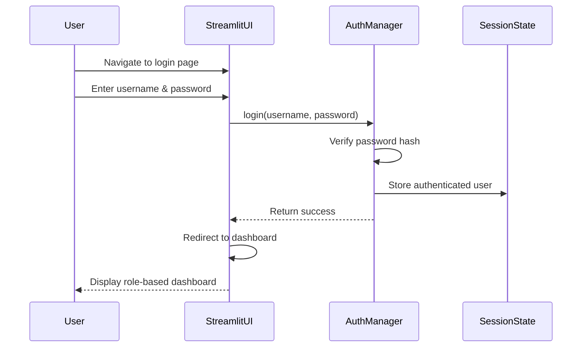
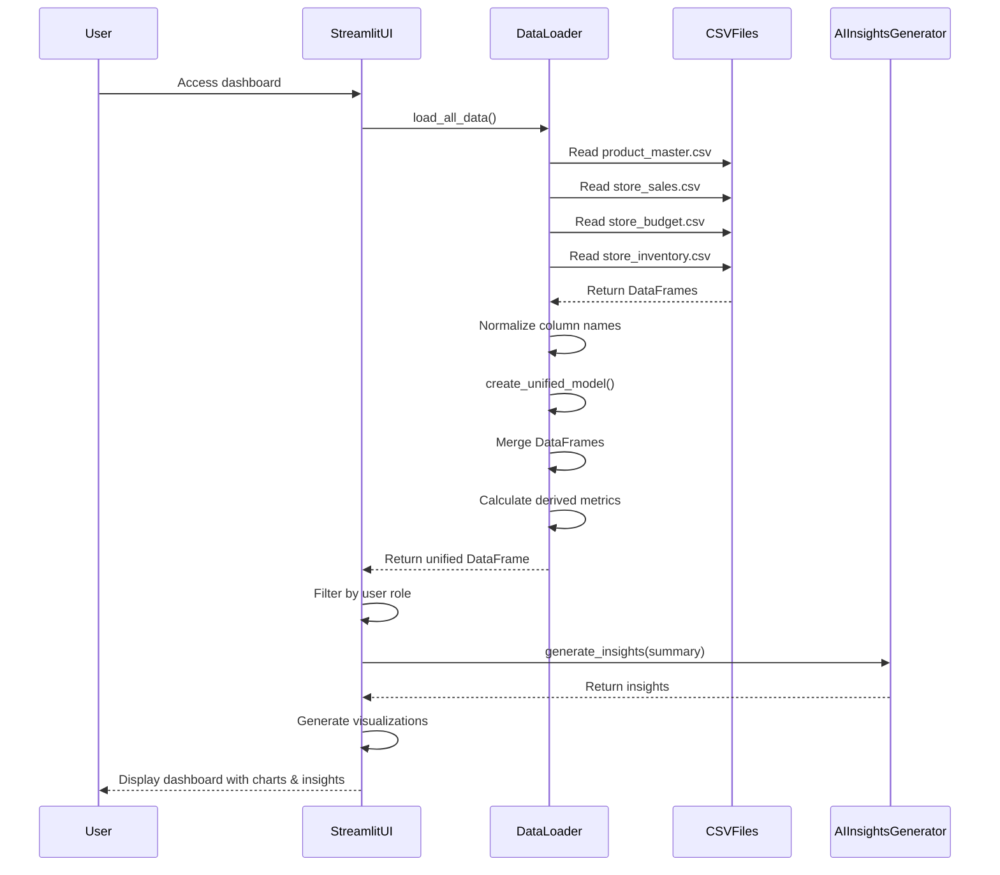
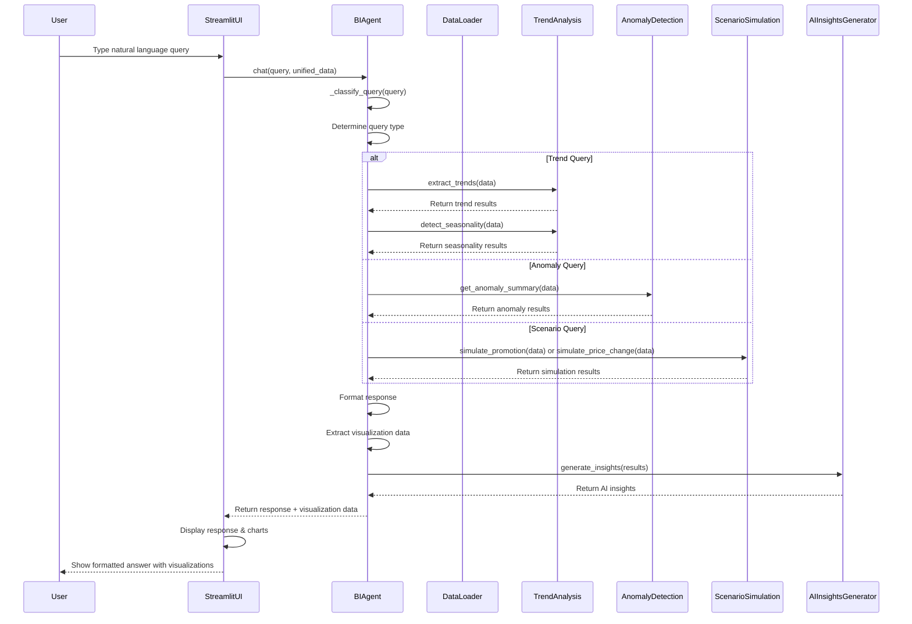
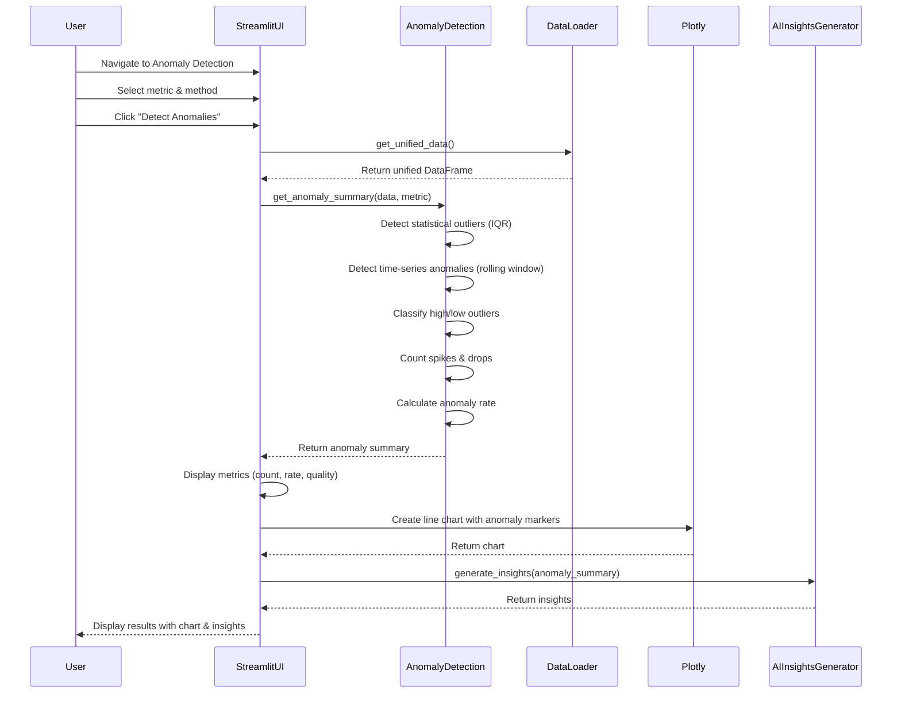
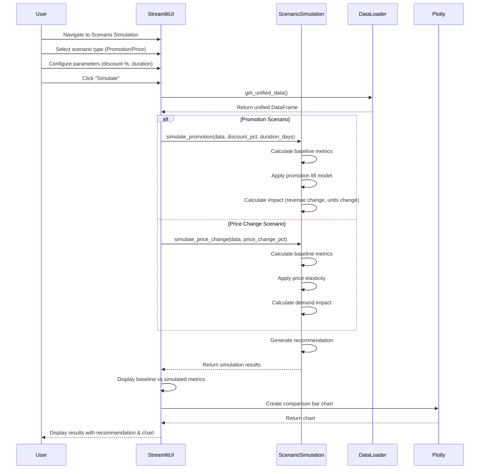
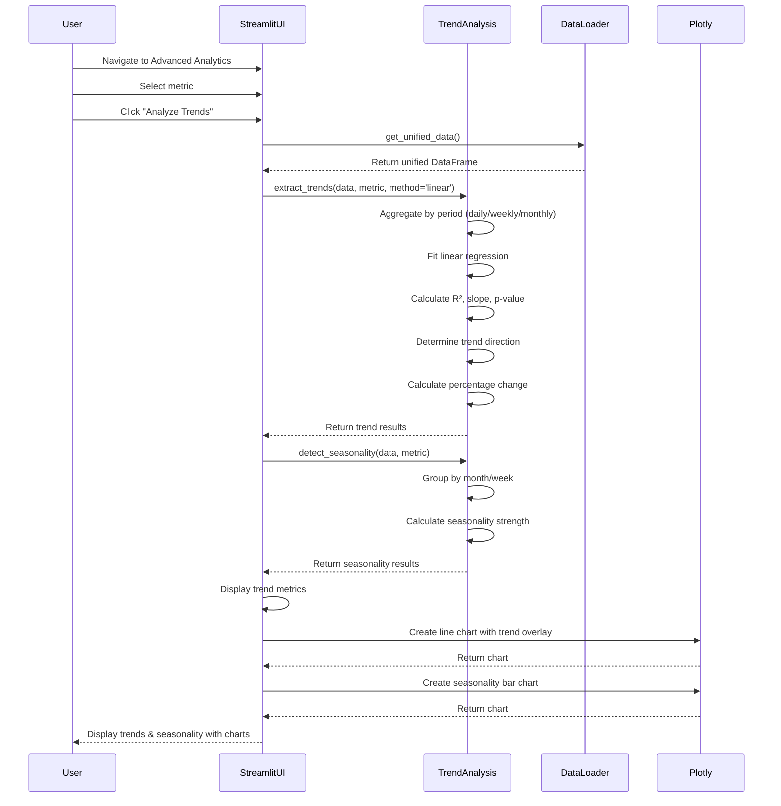
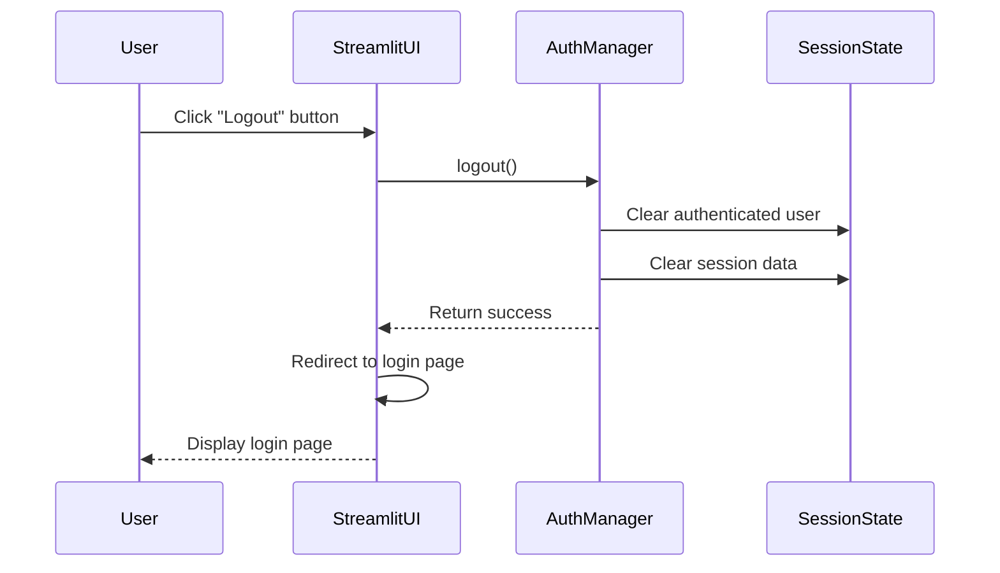

# Sequence Diagrams - TrendMart BI Dashboard

## 1. User Login & Authentication Flow

## 2. Data Loading & Dashboard Display Flow

## 3. Natural Language Query Processing Flow

## 4. Anomaly Detection Flow

## 5. Scenario Simulation Flow

## 6. Trend Analysis Flow

## 7. Logout Flow

