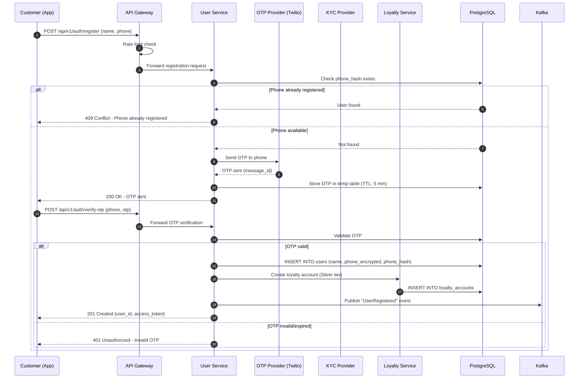
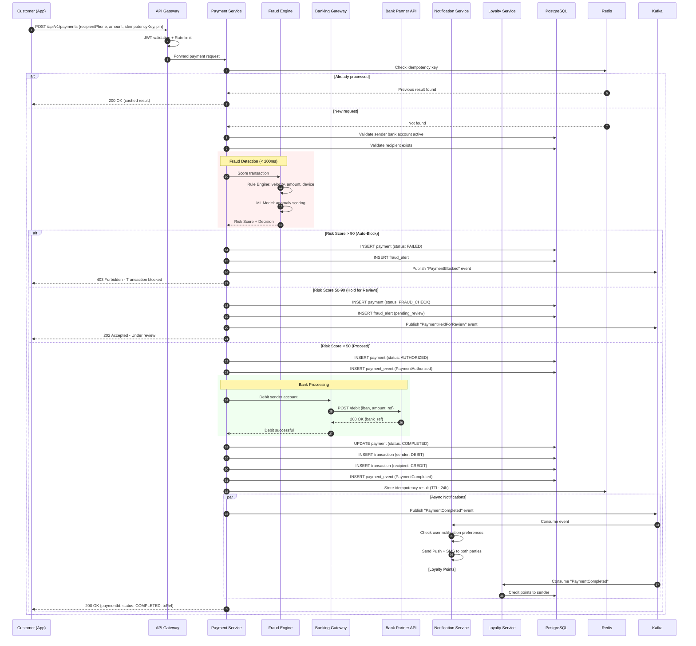
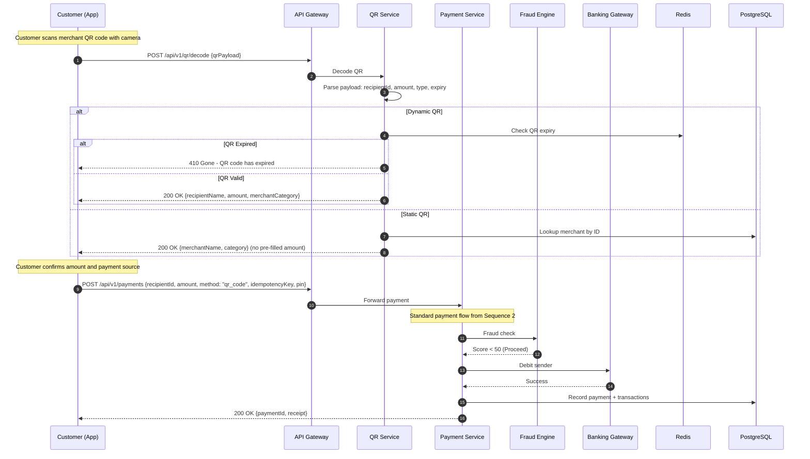
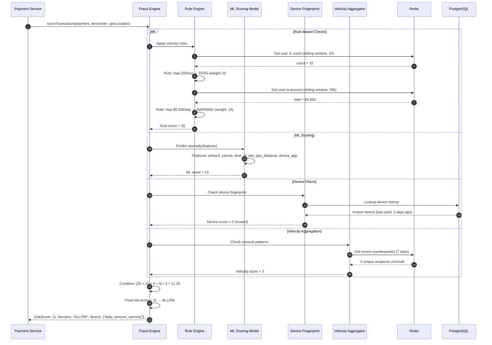
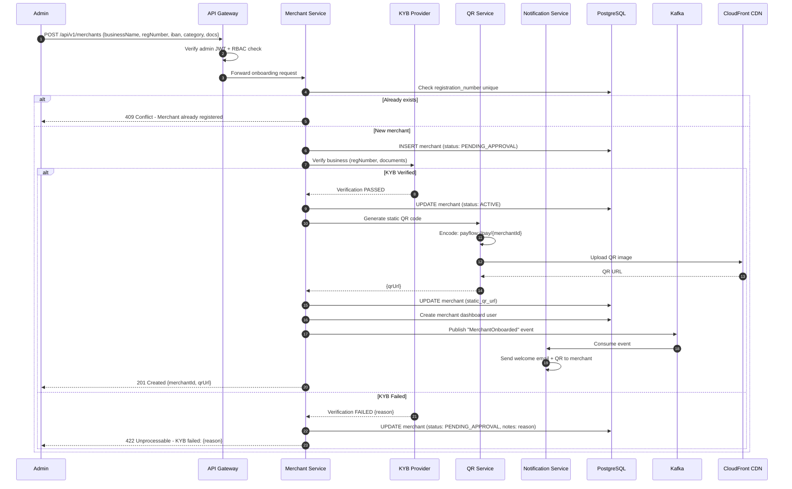
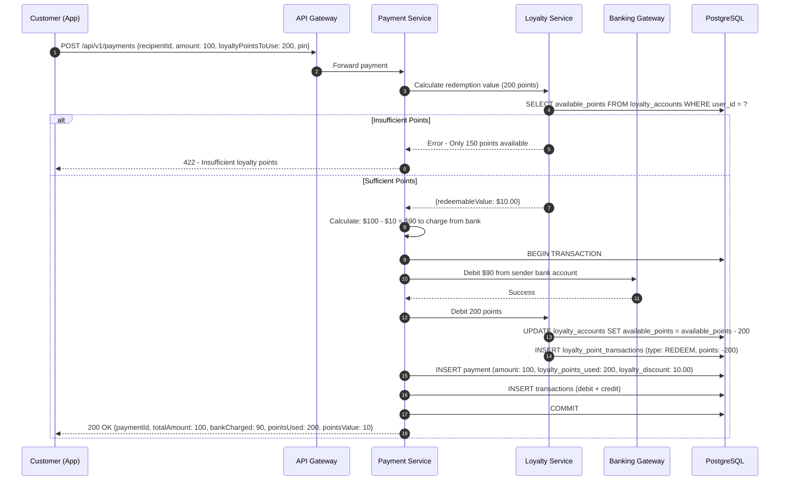

# PayFlow - Sequence Diagrams

> **⚠️ Core Requirements**: Flows support the core requirements defined in [KEY_REQUIREMENTS.md](./KEY_REQUIREMENTS.md).

## Table of Contents
1. [Customer Registration Flow](#1-customer-registration-flow)
2. [Payment Processing Flow (P2P)](#2-payment-processing-flow-p2p)
3. [QR Code Payment Flow](#3-qr-code-payment-flow)
4. [Fraud Detection Flow](#4-fraud-detection-flow)
5. [Merchant Onboarding Flow](#5-merchant-onboarding-flow)
6. [Loyalty Points Redemption Flow](#6-loyalty-points-redemption-flow)

---

## 1. Customer Registration Flow

---

## 2. Payment Processing Flow (P2P)

---

## 3. QR Code Payment Flow

---

## 4. Fraud Detection Flow

---

## 5. Merchant Onboarding Flow

---

## 6. Loyalty Points Redemption Flow

---

**Last Updated**: February 2026
**Version**: 1.0
**Status**: Design Complete
