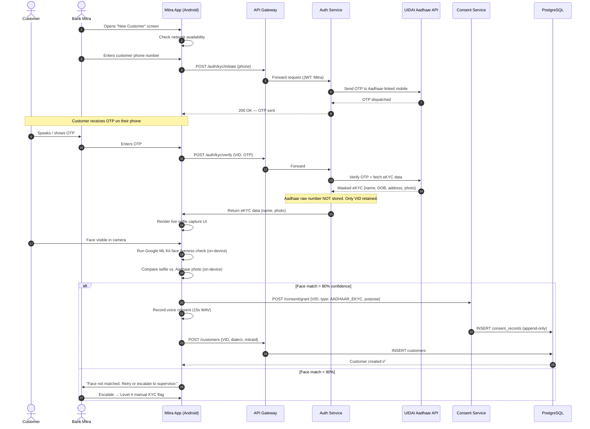
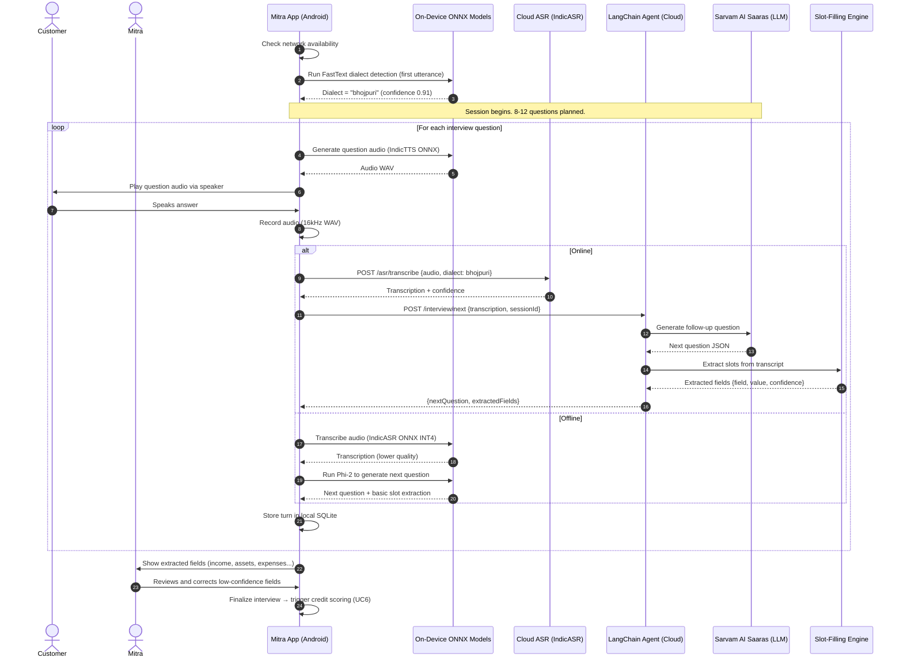
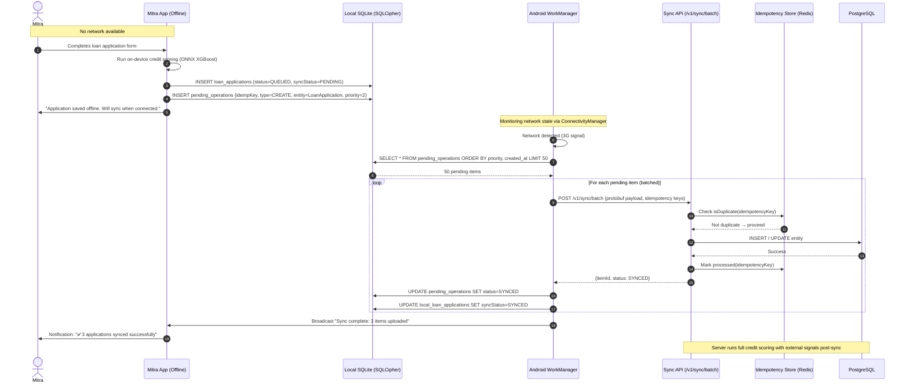
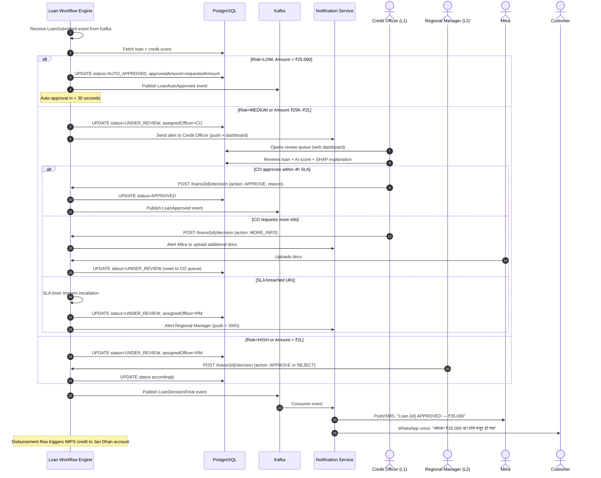

# Mitra Finance — Sequence Diagrams

> **⚠️ Core Requirements**: Each sequence diagram maps to use cases in [ACTORS_AND_USE_CASES.md](./ACTORS_AND_USE_CASES.md) and requirements in [KEY_REQUIREMENTS.md](./KEY_REQUIREMENTS.md).

## Table of Contents
1. [Customer KYC & Registration](#1-customer-kyc--registration)
2. [GenAI Voice Credit Interview](#2-genai-voice-credit-interview)
3. [Loan Application with Alt Credit Scoring](#3-loan-application-with-alt-credit-scoring)
4. [Offline Loan Origination & Background Sync](#4-offline-loan-origination--background-sync)
5. [Loan Approval Routing Workflow](#5-loan-approval-routing-workflow)
6. [DPDP Consent Revocation](#6-dpdp-consent-revocation)

---

## 1. Customer KYC & Registration

**Mapped to**: UC1, UC2 | **Requirement**: REQ-2

```mermaid
sequenceDiagram
    autonumber
    actor Customer
    actor Mitra as Bank Mitra
    participant App as Mitra App (Android)
    participant GW as API Gateway
    participant Auth as Auth Service
    participant UIDAI as UIDAI Aadhaar API
    participant Consent as Consent Service
    participant DB as PostgreSQL

    Mitra->>App: Opens "New Customer" screen
    App->>App: Check network availability
    Mitra->>App: Enters customer phone number
    App->>GW: POST /auth/kyc/initiate {phone}
    GW->>Auth: Forward request (JWT: Mitra)
    Auth->>UIDAI: Send OTP to Aadhaar-linked mobile
    UIDAI-->>Auth: OTP dispatched
    Auth-->>App: 200 OK — OTP sent

    Note over Customer,App: Customer receives OTP on their phone

    Customer->>Mitra: Speaks / shows OTP
    Mitra->>App: Enters OTP
    App->>GW: POST /auth/kyc/verify {VID, OTP}
    GW->>Auth: Forward
    Auth->>UIDAI: Verify OTP + fetch eKYC data
    UIDAI-->>Auth: Masked eKYC {name, DOB, address, photo}

    Note over Auth: Aadhaar raw number NOT stored. Only VID retained.

    Auth->>App: Return eKYC data (name, photo)
    App->>App: Render live selfie capture UI
    Customer->>App: Face visible in camera
    App->>App: Run Google ML Kit face liveness check (on-device)
    App->>App: Compare selfie vs. Aadhaar photo (on-device)

    alt Face match > 80% confidence
        App->>Consent: POST /consent/grant {VID, type: AADHAAR_EKYC, purpose}
        App->>App: Record voice consent (15s WAV)
        Consent->>DB: INSERT consent_records (append-only)
        App->>GW: POST /customers {VID, dialect, mitraId}
        GW->>DB: INSERT customers
        DB-->>App: Customer created ✅
    else Face match < 80%
        App->>Mitra: "Face not matched. Retry or escalate to supervisor."
        Mitra->>App: Escalate → Level 4 manual KYC flag
    end
```

---

## 2. GenAI Voice Credit Interview

**Mapped to**: UC5 | **Requirement**: REQ-3, REQ-6

```mermaid
sequenceDiagram
    autonumber
    actor Customer
    actor Mitra
    participant App as Mitra App (Android)
    participant ONNX as On-Device ONNX Models
    participant ASR_C as Cloud ASR (IndicASR)
    participant Agent as LangChain Agent (Cloud)
    participant Sarvam as Sarvam AI Saaras (LLM)
    participant NLP as Slot-Filling Engine

    App->>App: Check network availability
    App->>ONNX: Run FastText dialect detection (first utterance)
    ONNX-->>App: Dialect = "bhojpuri" (confidence 0.91)

    Note over App,Sarvam: Session begins. 8-12 questions planned.

    loop For each interview question
        App->>ONNX: Generate question audio (IndicTTS ONNX)
        ONNX-->>App: Audio WAV
        App->>Customer: Play question audio via speaker
        Customer->>App: Speaks answer
        App->>App: Record audio (16kHz WAV)

        alt Online
            App->>ASR_C: POST /asr/transcribe {audio, dialect: bhojpuri}
            ASR_C-->>App: Transcription + confidence
            App->>Agent: POST /interview/next {transcription, sessionId}
            Agent->>Sarvam: Generate follow-up question
            Sarvam-->>Agent: Next question JSON
            Agent->>NLP: Extract slots from transcript
            NLP-->>Agent: Extracted fields {field, value, confidence}
            Agent-->>App: {nextQuestion, extractedFields}
        else Offline
            App->>ONNX: Transcribe audio (IndicASR ONNX INT4)
            ONNX-->>App: Transcription (lower quality)
            App->>ONNX: Run Phi-2 to generate next question
            ONNX-->>App: Next question + basic slot extraction
        end

        App->>App: Store turn in local SQLite
    end

    App->>Mitra: Show extracted fields (income, assets, expenses...)
    Mitra->>App: Reviews and corrects low-confidence fields
    App->>App: Finalize interview → trigger credit scoring (UC6)
```

---

## 3. Loan Application with Alt Credit Scoring

**Mapped to**: UC3, UC6 | **Requirement**: REQ-1, REQ-4

```mermaid
sequenceDiagram
    autonumber
    actor Mitra
    participant App as Mitra App
    participant GW as API Gateway
    participant Loan as Loan Origination Service
    participant Score as Credit Scoring Engine
    participant MGNA as MGNREGA API
    participant Agri as AgriData / IMD API
    participant Workflow as Loan Workflow Engine
    participant DB as PostgreSQL

    Mitra->>App: Starts loan application (customer already KYC'd)
    App->>App: Load KYC data from local SQLite
    App->>App: Trigger GenAI interview (see Diagram 2)
    App-->>App: Interview complete; structured output ready

    App->>GW: POST /loans {customerId, loanType, amount, tenure, interviewId}
    GW->>Loan: Forward
    Loan->>DB: INSERT loan_applications (status=SUBMITTED)
    Loan->>Score: scoreLoan(customerId, interviewId)

    par Fetch Alt Data Signals (if online)
        Score->>MGNA: GET /mgnrega/workdays {customerId, aadhaarVID}
        MGNA-->>Score: 145 days/year registered
        Score->>Agri: GET /agrizone/drought-index {district, lat, lng}
        Agri-->>Score: Drought risk: LOW (0.12), past 24 months
    end

    Score->>Score: Assemble feature vector
    Score->>Score: Run LightGBM Ensemble inference
    Score->>Score: Calculate SHAP values (top-3 factors)
    Score->>DB: INSERT credit_scores {score: 672, band: MEDIUM, modelVersion: lgbm-v2.1}
    Score-->>Loan: CreditScore {id, score: 672, band: MEDIUM, recAmount: ₹35,000}

    Loan->>Workflow: routeLoan(loanId, score: 672, amount: ₹35,000)
    Workflow->>Workflow: Evaluate routing rules
    Note over Workflow: MEDIUM band + ₹35K → L1 Credit Officer
    Workflow->>DB: UPDATE loan_applications (status=UNDER_REVIEW, assignedOfficer)
    Workflow->>Loan: Routed to L1 Review
    Loan-->>GW: LoanApplication (status=UNDER_REVIEW, scoreId)
    GW-->>App: 201 Created — Loan submitted, under review
    App->>Mitra: "Loan submitted. Credit Officer review: up to 4 hours."
```

---

## 4. Offline Loan Origination & Background Sync

**Mapped to**: UC7 | **Requirement**: REQ-5

```mermaid
sequenceDiagram
    autonumber
    actor Mitra
    participant App as Mitra App (Offline)
    participant SQLite as Local SQLite (SQLCipher)
    participant WorkMgr as Android WorkManager
    participant SyncAPI as Sync API (/v1/sync/batch)
    participant Dedup as Idempotency Store (Redis)
    participant DB as PostgreSQL

    Note over Mitra,App: No network available

    Mitra->>App: Completes loan application form
    App->>App: Run on-device credit scoring (ONNX XGBoost)
    App->>SQLite: INSERT loan_applications (status=QUEUED, syncStatus=PENDING)
    App->>SQLite: INSERT pending_operations {idempKey, type=CREATE, entity=LoanApplication, priority=2}
    App->>Mitra: "Application saved offline. Will sync when connected."

    Note over WorkMgr: Monitoring network state via ConnectivityManager

    WorkMgr->>WorkMgr: Network detected (3G signal)
    WorkMgr->>SQLite: SELECT * FROM pending_operations ORDER BY priority, created_at LIMIT 50
    SQLite-->>WorkMgr: 50 pending items

    loop For each pending item (batched)
        WorkMgr->>SyncAPI: POST /v1/sync/batch (protobuf payload, idempotency keys)
        SyncAPI->>Dedup: Check isDuplicate(idempotencyKey)
        Dedup-->>SyncAPI: Not duplicate → proceed
        SyncAPI->>DB: INSERT / UPDATE entity
        DB-->>SyncAPI: Success
        SyncAPI->>Dedup: Mark processed(idempotencyKey)
        SyncAPI-->>WorkMgr: {itemId, status: SYNCED}
        WorkMgr->>SQLite: UPDATE pending_operations SET status=SYNCED
        WorkMgr->>SQLite: UPDATE local_loan_applications SET syncStatus=SYNCED
    end

    WorkMgr->>App: Broadcast "Sync complete: 3 items uploaded"
    App->>Mitra: Notification: "✅ 3 applications synced successfully"

    Note over SyncAPI,DB: Server runs full credit scoring with external signals post-sync
```

---

## 5. Loan Approval Routing Workflow

**Mapped to**: UC8 | **Requirement**: REQ-7

```mermaid
sequenceDiagram
    autonumber
    participant Workflow as Loan Workflow Engine
    participant DB as PostgreSQL
    participant KF as Kafka
    participant Notify as Notification Service
    actor CO as Credit Officer (L1)
    actor RM as Regional Manager (L2)
    actor Mitra
    actor Customer

    Workflow->>Workflow: Receive LoanSubmitted event from Kafka
    Workflow->>DB: Fetch loan + credit score

    alt Risk=LOW, Amount < ₹25,000
        Workflow->>DB: UPDATE status=AUTO_APPROVED, approvedAmount=requestedAmount
        Workflow->>KF: Publish LoanAutoApproved event
        Note over Workflow: Auto-approval in < 30 seconds
    else Risk=MEDIUM or Amount ₹25K–₹2L
        Workflow->>DB: UPDATE status=UNDER_REVIEW, assignedOfficer=CO
        Workflow->>Notify: Send alert to Credit Officer (push + dashboard)
        CO->>DB: Opens review queue (web dashboard)
        CO->>DB: Reviews loan + AI score + SHAP explanation

        alt CO approves within 4h SLA
            CO->>Workflow: POST /loans/{id}/decision {action: APPROVE, reason}
            Workflow->>DB: UPDATE status=APPROVED
            Workflow->>KF: Publish LoanApproved event
        else CO requests more info
            CO->>Workflow: POST /loans/{id}/decision {action: MORE_INFO}
            Workflow->>Notify: Alert Mitra to upload additional docs
            Mitra->>Workflow: Uploads docs
            Workflow->>DB: UPDATE status=UNDER_REVIEW (reset to CO queue)
        else SLA breached (4h)
            Workflow->>Workflow: SLA timer triggers escalation
            Workflow->>DB: UPDATE status=UNDER_REVIEW, assignedOfficer=RM
            Workflow->>Notify: Alert Regional Manager (push + SMS)
        end
    else Risk=HIGH or Amount > ₹2L
        Workflow->>DB: UPDATE status=UNDER_REVIEW, assignedOfficer=RM
        RM->>Workflow: POST /loans/{id}/decision {action: APPROVE or REJECT}
        Workflow->>DB: UPDATE status accordingly
    end

    Workflow->>KF: Publish LoanDecisionFinal event
    KF->>Notify: Consume event
    Notify->>Mitra: Push/SMS: "Loan {id} APPROVED — ₹35,000"
    Notify->>Customer: WhatsApp voice: "आपका ₹35,000 का लोन मंजूर हो गया"

    Note over Workflow: Disbursement flow triggers IMPS credit to Jan Dhan account
```

---

## 6. DPDP Consent Revocation

**Mapped to**: UC9 | **Requirement**: REQ-8

```mermaid
sequenceDiagram
    autonumber
    actor Customer
    actor Mitra
    participant App as Mitra App
    participant GW as API Gateway
    participant Consent as Consent Service
    participant KF as Kafka
    participant Score as Credit Scoring Engine
    participant DB as PostgreSQL
    participant S3 as AWS S3

    Customer->>Mitra: "I want to stop sharing my electricity bill data"
    Mitra->>App: Opens "Manage Consent" → Customer profile

    App->>GW: GET /consent/{customerId} 
    GW->>Consent: Fetch all active consents
    Consent->>DB: SELECT consent_records WHERE customer_id AND status=GRANTED
    DB-->>App: [{type: UTILITY_DATA, grantedAt: ..., expiresAt: ...}]

    App->>App: Render consent list in customer's dialect (IndicTTS)
    Customer->>Mitra: Points to "Electricity Bill" consent
    Mitra->>App: Taps "Revoke"
    App->>App: TTS: "Do you want to stop Mitra Finance from using your electricity bill? Say YES"
    Customer->>App: "हाँ" (voice recorded)
    App->>App: Save 15s WAV to encrypted local storage

    App->>GW: PUT /consent/{consentId}/revoke {voiceConsentKey}
    GW->>Consent: revokeConsent(consentId, voiceKey)
    Consent->>DB: INSERT consent_records {type: UTILITY_DATA, status: REVOKED, revokedAt: NOW()}
    Note over DB: Append-only: old GRANTED record unchanged; new REVOKED row inserted
    Consent->>S3: Upload voice consent WAV (AES-256, ap-south-1)
    Consent->>KF: Publish ConsentRevoked {customerId, type: UTILITY_DATA}
    
    KF->>Score: Consume ConsentRevoked event
    Score->>Score: Remove UTILITY_DATA signal from active feature pipeline for this customer
    Score-->>KF: Acknowledged

    Consent->>DB: INSERT audit_logs {actor: MITRA, action: CONSENT_REVOKED, ...}
    Consent-->>App: 200 OK — Consent revoked
    App->>Mitra: "Consent revoked. Electricity bill data will no longer be used."
    App->>Customer: TTS: "आपकी अनुमति रद्द कर दी गई है।"

    Note over Consent: Full revocation processed in < 72 hours per DPDP Act
```

---

**Last Updated**: February 2026
**Version**: 1.0
**Status**: Design Complete
