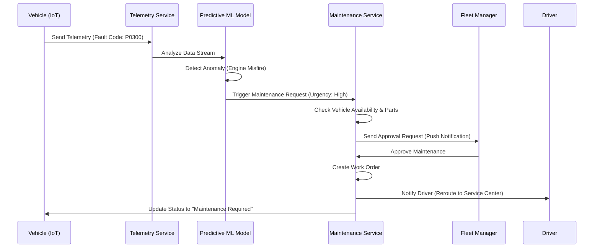
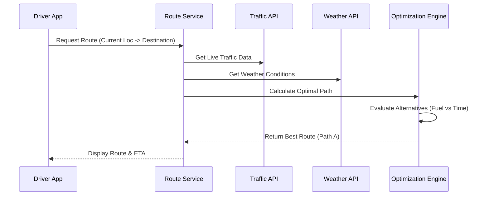
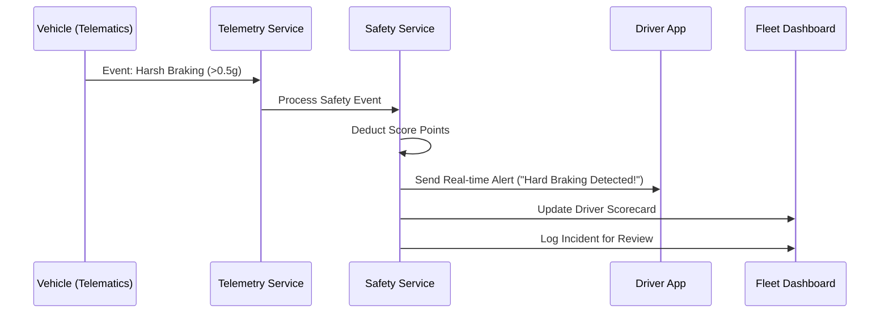

# Sequence Diagrams

## 1. AI-Driven Maintenance Trigger

This sequence shows how an engine fault code triggers an automated maintenance schedule workflow.

```mermaid
sequenceDiagram
    participant V as Vehicle (IoT)
    participant T as Telemetry Service
    participant AI as Predictive ML Model
    participant M as Maintenance Service
    participant FM as Fleet Manager
    participant D as Driver

    V->>T: Send Telemetry (Fault Code: P0300)
    T->>AI: Analyze Data Stream
    AI->>AI: Detect Anomaly (Engine Misfire)
    AI->>M: Trigger Maintenance Request (Urgency: High)
    M->>M: Check Vehicle Availability & Parts
    M->>FM: Send Approval Request (Push Notification)
    FM->>M: Approve Maintenance
    M->>M: Create Work Order
    M->>D: Notify Driver (Reroute to Service Center)
    M->>V: Update Status to "Maintenance Required"
```

## 2. Route Optimization Request

This sequence shows how a driver requests a route and receives an AI-optimized path.

```mermaid
sequenceDiagram
    participant D as Driver App
    participant R as Route Service
    participant T as Traffic API
    participant W as Weather API
    participant AI as Optimization Engine

    D->>R: Request Route (Current Loc -> Destination)
    R->>T: Get Live Traffic Data
    R->>W: Get Weather Conditions
    R->>AI: Calculate Optimal Path
    AI->>AI: Evaluate Alternatives (Fuel vs Time)
    AI-->>R: Return Best Route (Path A)
    R-->>D: Display Route & ETA
```

## 3. Driver Safety Incident

This sequence depicts how unsafe driving behavior is captured and logged.

```mermaid
sequenceDiagram
    participant V as Vehicle (Telematics)
    participant T as Telemetry Service
    participant S as Safety Service
    participant D as Driver App
    participant FM as Fleet Dashboard

    V->>T: Event: Harsh Braking (>0.5g)
    T->>S: Process Safety Event
    S->>S: Deduct Score Points
    S->>D: Send Real-time Alert ("Hard Braking Detected!")
    S->>FM: Update Driver Scorecard
    S->>FM: Log Incident for Review
```
