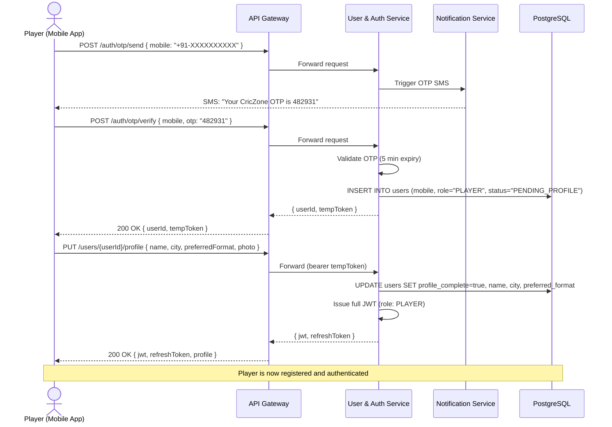
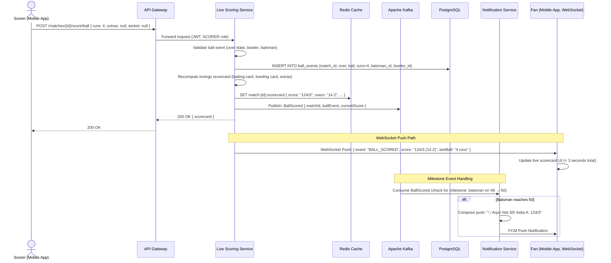
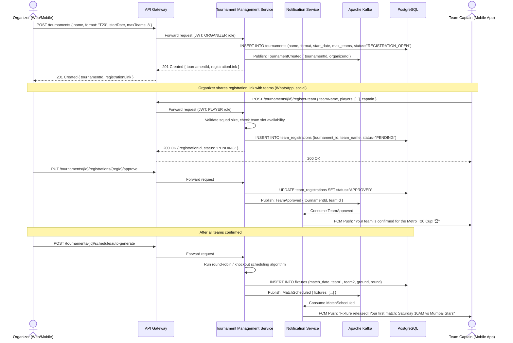
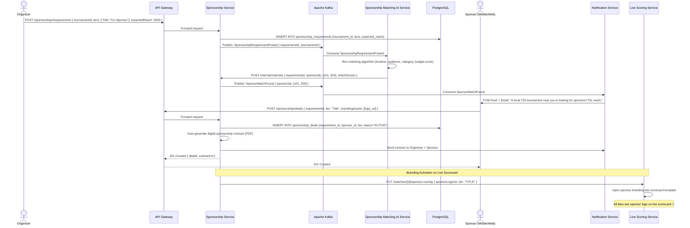

# Sequence Diagrams — CricZone: Local Cricket Community Platform

> Four key sequence diagrams covering the most critical workflows in CricZone.

---

## SD-1: Player Registration & Profile Setup

```mermaid
sequenceDiagram
    actor User as Player (Mobile App)
    participant GW as API Gateway
    participant AUTH as User & Auth Service
    participant NOTIFY as Notification Service
    participant PG as PostgreSQL

    User->>GW: POST /auth/otp/send { mobile: "+91-XXXXXXXXXX" }
    GW->>AUTH: Forward request
    AUTH->>NOTIFY: Trigger OTP SMS
    NOTIFY-->>User: SMS: "Your CricZone OTP is 482931"
    
    User->>GW: POST /auth/otp/verify { mobile, otp: "482931" }
    GW->>AUTH: Forward request
    AUTH->>AUTH: Validate OTP (5 min expiry)
    AUTH->>PG: INSERT INTO users (mobile, role="PLAYER", status="PENDING_PROFILE")
    AUTH-->>GW: { userId, tempToken }
    GW-->>User: 200 OK { userId, tempToken }
    
    User->>GW: PUT /users/{userId}/profile { name, city, preferredFormat, photo }
    GW->>AUTH: Forward (bearer tempToken)
    AUTH->>PG: UPDATE users SET profile_complete=true, name, city, preferred_format
    AUTH->>AUTH: Issue full JWT (role: PLAYER)
    AUTH-->>GW: { jwt, refreshToken }
    GW-->>User: 200 OK { jwt, refreshToken, profile }
    
    Note over User,PG: Player is now registered and authenticated
```

---

## SD-2: Ball-by-Ball Live Scoring & Real-Time Fan Update

```mermaid
sequenceDiagram
    actor Scorer as Scorer (Mobile App)
    participant GW as API Gateway
    participant SC as Live Scoring Service
    participant REDIS as Redis Cache
    participant KAFKA as Apache Kafka
    participant PG as PostgreSQL
    participant NOTIFY as Notification Service
    participant FAN as Fan (Mobile App, WebSocket)

    Scorer->>GW: POST /matches/{id}/score/ball { runs: 4, extras: null, wicket: null }
    GW->>SC: Forward request (JWT: SCORER role)
    SC->>SC: Validate ball event (over state, bowler, batsman)
    SC->>PG: INSERT INTO ball_events (match_id, over, ball, runs=4, batsman_id, bowler_id)
    SC->>SC: Recompute innings scorecard (batting card, bowling card, extras)
    SC->>REDIS: SET match:{id}:scorecard { score: "124/3", overs: "14.2", ... }
    SC->>KAFKA: Publish: BallScored { matchId, ballEvent, currentScore }
    SC-->>GW: 200 OK { scorecard }
    GW-->>Scorer: 200 OK

    Note over SC,FAN: WebSocket Push Path
    SC->>FAN: WebSocket Push: { event: "BALL_SCORED", score: "124/3 (14.2)", lastBall: "4 runs" }
    FAN->>FAN: Update live scorecard UI (< 3 seconds total)

    Note over KAFKA,NOTIFY: Milestone Event Handling
    KAFKA->>NOTIFY: Consume BallScored (check for milestone: batsman on 48 → 50)
    alt Batsman reaches 50
        NOTIFY->>NOTIFY: Compose push: "🏏 Arjun hits 50! India A: 124/3"
        NOTIFY->>FAN: FCM Push Notification
    end
```

---

## SD-3: Tournament Creation & Team Registration

```mermaid
sequenceDiagram
    actor Org as Organizer (Web/Mobile)
    participant GW as API Gateway
    participant TOUR as Tournament Management Service
    participant NOTIFY as Notification Service
    participant KAFKA as Apache Kafka
    participant PG as PostgreSQL
    actor Team as Team Captain (Mobile App)

    Org->>GW: POST /tournaments { name, format: "T20", startDate, maxTeams: 8 }
    GW->>TOUR: Forward request (JWT: ORGANIZER role)
    TOUR->>PG: INSERT INTO tournaments (name, format, start_date, max_teams, status="REGISTRATION_OPEN")
    TOUR->>KAFKA: Publish: TournamentCreated { tournamentId, organizerId }
    TOUR-->>GW: 201 Created { tournamentId, registrationLink }
    GW-->>Org: 201 Created { tournamentId, registrationLink }

    Note over Org,Team: Organizer shares registrationLink with teams (WhatsApp, social)
    
    Team->>GW: POST /tournaments/{id}/register-team { teamName, players: [...], captain }
    GW->>TOUR: Forward request (JWT: PLAYER role)
    TOUR->>TOUR: Validate squad size, check team slot availability
    TOUR->>PG: INSERT INTO team_registrations (tournament_id, team_name, status="PENDING")
    TOUR-->>GW: 200 OK { registrationId, status: "PENDING" }
    GW-->>Team: 200 OK

    Org->>GW: PUT /tournaments/{id}/registrations/{regId}/approve
    GW->>TOUR: Forward request
    TOUR->>PG: UPDATE team_registrations SET status="APPROVED"
    TOUR->>KAFKA: Publish: TeamApproved { tournamentId, teamId }
    KAFKA->>NOTIFY: Consume TeamApproved
    NOTIFY->>Team: FCM Push: "Your team is confirmed for the Metro T20 Cup! 🏆"

    Note over Org,PG: After all teams confirmed
    Org->>GW: POST /tournaments/{id}/schedule/auto-generate
    GW->>TOUR: Forward request
    TOUR->>TOUR: Run round-robin / knockout scheduling algorithm
    TOUR->>PG: INSERT INTO fixtures (match_date, team1, team2, ground, round)
    TOUR->>KAFKA: Publish: MatchScheduled { fixtures: [...] }
    KAFKA->>NOTIFY: Consume MatchScheduled
    NOTIFY->>Team: FCM Push: "Fixture released! Your first match: Saturday 10AM vs Mumbai Stars"
```

---

## SD-4: Sponsor Match & Branding Activation

```mermaid
sequenceDiagram
    actor Org as Organizer
    participant GW as API Gateway
    participant SP_SVC as Sponsorship Service
    participant KAFKA as Apache Kafka
    participant SP_AI as Sponsorship Matching AI Service
    participant PG as PostgreSQL
    actor Sponsor as Sponsor (Mobile/Web)
    participant NOTIFY as Notification Service
    participant SC as Live Scoring Service

    Org->>GW: POST /sponsorships/requirements { tournamentId, tiers: ["Title","Co-Sponsor"], expectedReach: 5000 }
    GW->>SP_SVC: Forward request
    SP_SVC->>PG: INSERT INTO sponsorship_requirements (tournament_id, tiers, expected_reach)
    SP_SVC->>KAFKA: Publish: SponsorshipRequirementPosted { requirementId, tournamentId }
    
    KAFKA->>SP_AI: Consume SponsorshipRequirementPosted
    SP_AI->>SP_AI: Run matching algorithm (location, audience, category, budget score)
    SP_AI->>SP_SVC: POST /internal/matches { requirementId, sponsorIds: [101, 204], matchScores }
    SP_SVC->>KAFKA: Publish: SponsorMatchFound { sponsorIds: [101, 204] }
    KAFKA->>NOTIFY: Consume SponsorMatchFound
    NOTIFY->>Sponsor: FCM Push + Email: "A local T20 tournament near you is looking for sponsors! ₹2L reach."
    
    Sponsor->>GW: POST /sponsorships/deals { requirementId, tier: "Title", brandingAssets: [logo_url] }
    GW->>SP_SVC: Forward request
    SP_SVC->>PG: INSERT INTO sponsorship_deals (requirement_id, sponsor_id, tier, status="ACTIVE")
    SP_SVC->>SP_SVC: Auto-generate digital sponsorship contract (PDF)
    SP_SVC->>NOTIFY: Send contract to Organizer + Sponsor
    SP_SVC-->>GW: 201 Created { dealId, contractUrl }
    GW-->>Sponsor: 201 Created

    Note over SP_SVC,SC: Branding Activation on Live Scorecard
    SP_SVC->>SC: PUT /matches/{id}/sponsor-overlay { sponsorLogoUrl, tier: "TITLE" }
    SC->>SC: Inject sponsor branding into scorecard template
    Note over SC: All fans see sponsor logo on live scorecard 🏏
```
