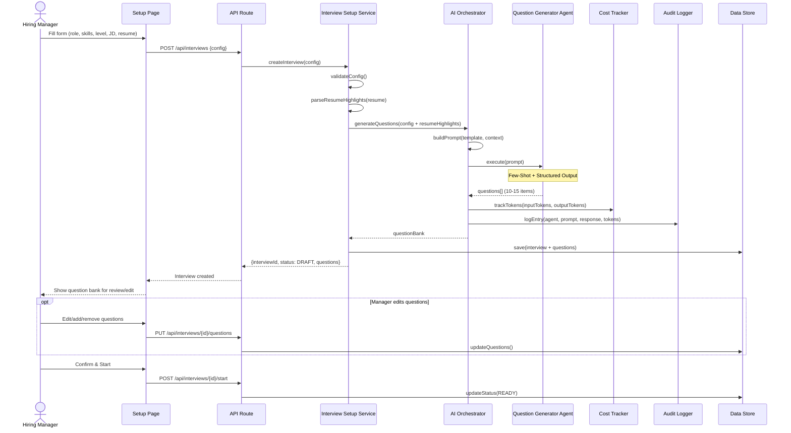
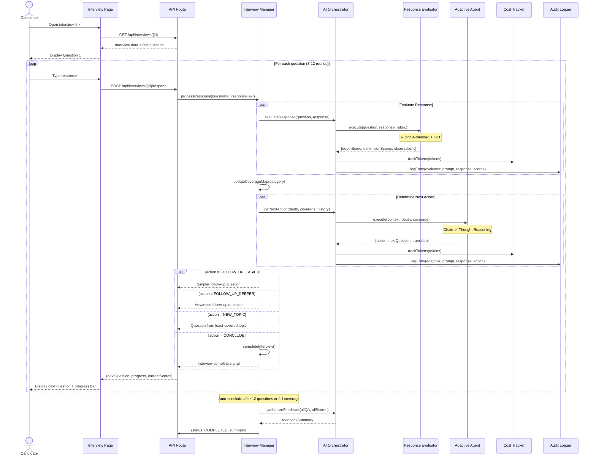
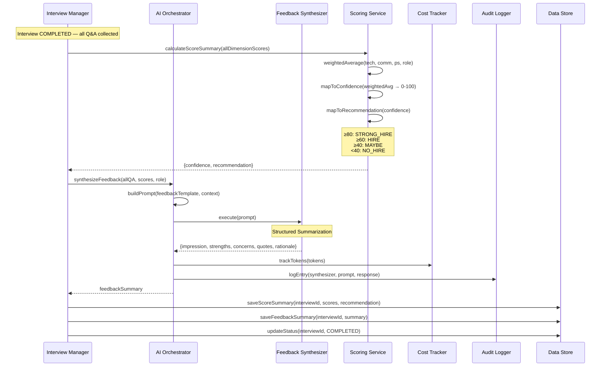
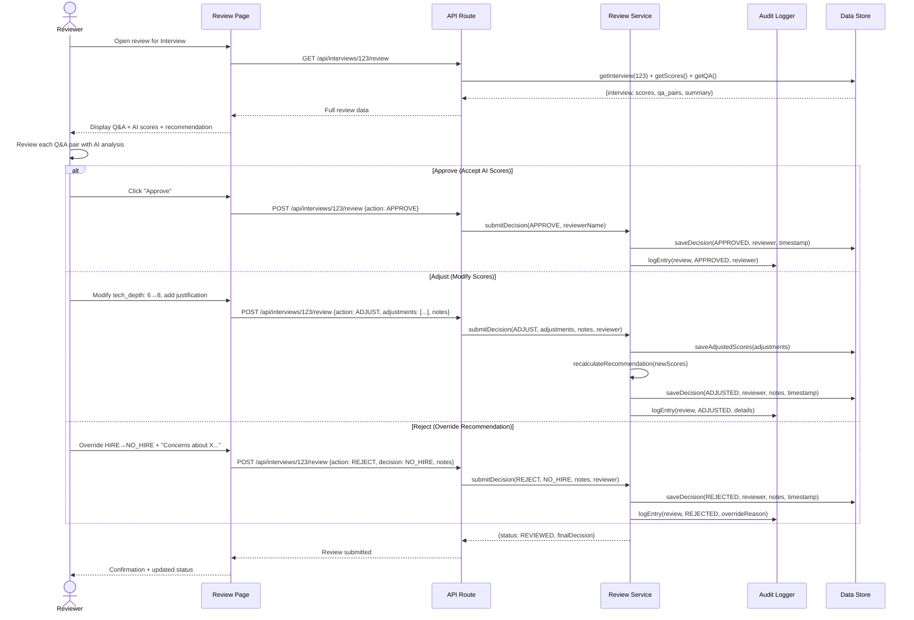

# Sequence Diagrams — AI-Assisted Interview Screening

---

## 1. Interview Setup & Question Generation

```mermaid
sequenceDiagram
    actor HM as Hiring Manager
    participant UI as Setup Page
    participant API as API Route
    participant IS as Interview Setup Service
    participant ORCH as AI Orchestrator
    participant QG as Question Generator Agent
    participant TC as Cost Tracker
    participant AL as Audit Logger
    participant DB as Data Store

    HM->>UI: Fill form (role, skills, level, JD, resume)
    UI->>API: POST /api/interviews {config}
    API->>IS: createInterview(config)
    IS->>IS: validateConfig()
    IS->>IS: parseResumeHighlights(resume)
    IS->>ORCH: generateQuestions(config + resumeHighlights)
    ORCH->>ORCH: buildPrompt(template, context)
    ORCH->>QG: execute(prompt)
    Note over QG: Few-Shot + Structured Output
    QG-->>ORCH: questions[] (10-15 items)
    ORCH->>TC: trackTokens(inputTokens, outputTokens)
    ORCH->>AL: logEntry(agent, prompt, response, tokens)
    ORCH-->>IS: questionBank
    IS->>DB: save(interview + questions)
    IS-->>API: {interviewId, status: DRAFT, questions}
    API-->>UI: Interview created
    UI-->>HM: Show question bank for review/edit
    
    opt Manager edits questions
        HM->>UI: Edit/add/remove questions
        UI->>API: PUT /api/interviews/{id}/questions
        API->>DB: updateQuestions()
    end
    
    HM->>UI: Confirm & Start
    UI->>API: POST /api/interviews/{id}/start
    API->>DB: updateStatus(READY)
```

---

## 2. Adaptive Interview Session

```mermaid
sequenceDiagram
    actor C as Candidate
    participant UI as Interview Page
    participant API as API Route
    participant IM as Interview Manager
    participant ORCH as AI Orchestrator
    participant RE as Response Evaluator
    participant AF as Adaptive Agent
    participant TC as Cost Tracker
    participant AL as Audit Logger

    C->>UI: Open interview link
    UI->>API: GET /api/interviews/{id}
    API-->>UI: Interview data + first question
    UI-->>C: Display Question 1

    loop For each question (8-12 rounds)
        C->>UI: Type response
        UI->>API: POST /api/interviews/{id}/respond
        API->>IM: processResponse(questionId, responseText)
        
        par Evaluate Response
            IM->>ORCH: evaluateResponse(question, response)
            ORCH->>RE: execute(question, response, rubric)
            Note over RE: Rubric-Grounded + CoT
            RE-->>ORCH: {depthScore, dimensionScores, observations}
            ORCH->>TC: trackTokens(tokens)
            ORCH->>AL: logEntry(evaluator, prompt, response, scores)
        end
        
        IM->>IM: updateCoverageMap(category)
        
        par Determine Next Action
            IM->>ORCH: getNextAction(depth, coverage, history)
            ORCH->>AF: execute(context, depth, coverage)
            Note over AF: Chain-of-Thought Reasoning
            AF-->>ORCH: {action, nextQuestion, transition}
            ORCH->>TC: trackTokens(tokens)
            ORCH->>AL: logEntry(adaptive, prompt, response, action)
        end

        alt action = FOLLOW_UP_EASIER
            IM-->>API: Simpler follow-up question
        else action = FOLLOW_UP_DEEPER
            IM-->>API: Advanced follow-up question
        else action = NEW_TOPIC
            IM-->>API: Question from least-covered topic
        else action = CONCLUDE
            IM->>IM: completeInterview()
            IM-->>API: Interview complete signal
        end
        
        API-->>UI: {nextQuestion, progress, currentScores}
        UI-->>C: Display next question + progress bar
    end

    Note over IM: Auto-conclude after 12 questions or full coverage
    IM->>ORCH: synthesizeFeedback(allQA, allScores)
    ORCH-->>IM: feedbackSummary
    IM->>API: {status: COMPLETED, summary}
```

---

## 3. Automated Scoring & Feedback Generation

```mermaid
sequenceDiagram
    participant IM as Interview Manager
    participant ORCH as AI Orchestrator
    participant FS as Feedback Synthesizer
    participant SS as Scoring Service
    participant TC as Cost Tracker
    participant AL as Audit Logger
    participant DB as Data Store

    Note over IM: Interview COMPLETED — all Q&A collected

    IM->>SS: calculateScoreSummary(allDimensionScores)
    SS->>SS: weightedAverage(tech, comm, ps, role)
    SS->>SS: mapToConfidence(weightedAvg → 0-100)
    SS->>SS: mapToRecommendation(confidence)
    Note over SS: ≥80: STRONG_HIRE<br/>≥60: HIRE<br/>≥40: MAYBE<br/><40: NO_HIRE

    SS-->>IM: {confidence, recommendation}

    IM->>ORCH: synthesizeFeedback(allQA, scores, role)
    ORCH->>ORCH: buildPrompt(feedbackTemplate, context)
    ORCH->>FS: execute(prompt)
    Note over FS: Structured Summarization
    FS-->>ORCH: {impression, strengths, concerns, quotes, rationale}
    ORCH->>TC: trackTokens(tokens)
    ORCH->>AL: logEntry(synthesizer, prompt, response)
    ORCH-->>IM: feedbackSummary

    IM->>DB: saveScoreSummary(interviewId, scores, recommendation)
    IM->>DB: saveFeedbackSummary(interviewId, summary)
    IM->>DB: updateStatus(interviewId, COMPLETED)
```

---

## 4. Human-in-the-Loop Review

```mermaid
sequenceDiagram
    actor R as Reviewer
    participant UI as Review Page
    participant API as API Route
    participant RS as Review Service
    participant AL as Audit Logger
    participant DB as Data Store

    R->>UI: Open review for Interview #123
    UI->>API: GET /api/interviews/123/review
    API->>DB: getInterview(123) + getScores() + getQA()
    DB-->>API: {interview, scores, qa_pairs, summary}
    API-->>UI: Full review data
    UI-->>R: Display Q&A + AI scores + recommendation

    R->>R: Review each Q&A pair with AI analysis

    alt Approve (Accept AI Scores)
        R->>UI: Click "Approve"
        UI->>API: POST /api/interviews/123/review {action: APPROVE}
        API->>RS: submitDecision(APPROVE, reviewerName)
        RS->>DB: saveDecision(APPROVED, reviewer, timestamp)
        RS->>AL: logEntry(review, APPROVED, reviewer)
    else Adjust (Modify Scores)
        R->>UI: Modify tech_depth: 6→8, add justification
        UI->>API: POST /api/interviews/123/review {action: ADJUST, adjustments: [...], notes}
        API->>RS: submitDecision(ADJUST, adjustments, notes, reviewer)
        RS->>DB: saveAdjustedScores(adjustments)
        RS->>RS: recalculateRecommendation(newScores)
        RS->>DB: saveDecision(ADJUSTED, reviewer, notes, timestamp)
        RS->>AL: logEntry(review, ADJUSTED, details)
    else Reject (Override Recommendation)
        R->>UI: Override HIRE→NO_HIRE + "Concerns about X..."
        UI->>API: POST /api/interviews/123/review {action: REJECT, decision: NO_HIRE, notes}
        API->>RS: submitDecision(REJECT, NO_HIRE, notes, reviewer)
        RS->>DB: saveDecision(REJECTED, reviewer, notes, timestamp)
        RS->>AL: logEntry(review, REJECTED, overrideReason)
    end

    RS-->>API: {status: REVIEWED, finalDecision}
    API-->>UI: Review submitted
    UI-->>R: Confirmation + updated status
```
