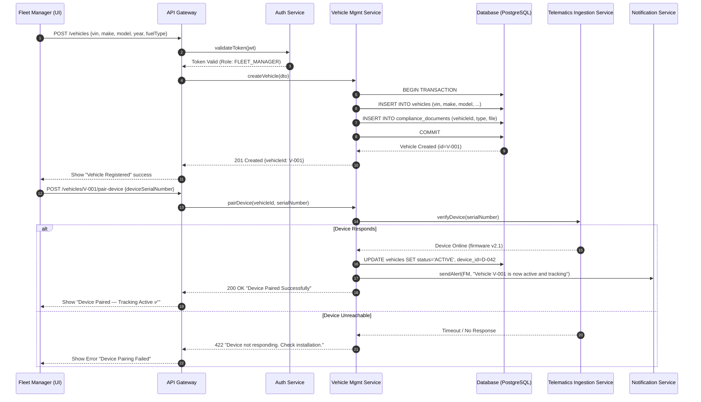
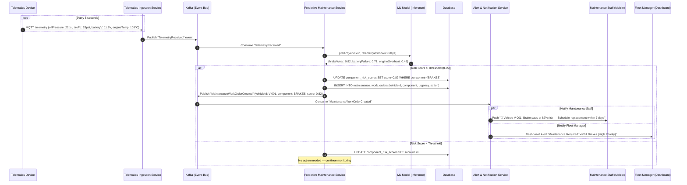
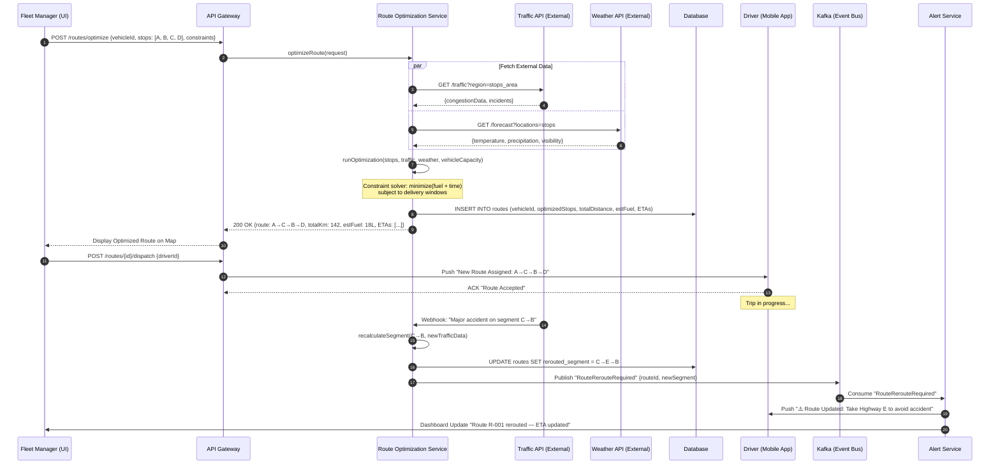
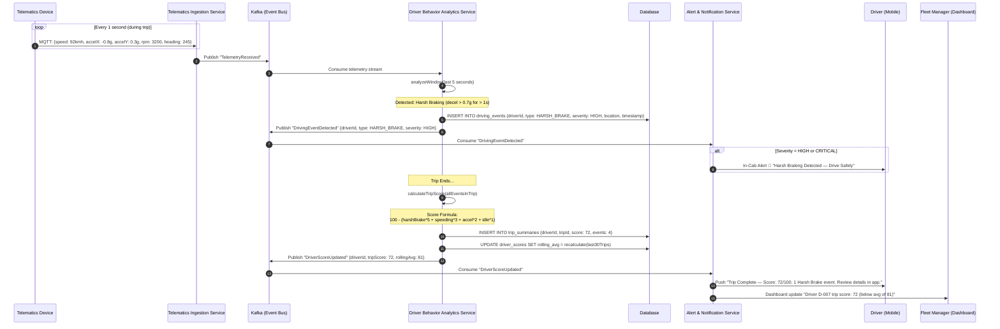

# Sequence Diagrams — AI-Driven Fleet Management Optimization Platform

> **⚠️ Core Requirements**: Each sequence diagram maps to the functional requirements defined in [FUNCTIONAL_REQUIREMENTS.md](./FUNCTIONAL_REQUIREMENTS.md).

## Table of Contents
1. [Vehicle Onboarding & Telematics Pairing](#vehicle-onboarding--telematics-pairing)
2. [Predictive Maintenance Alert Flow](#predictive-maintenance-alert-flow)
3. [Route Optimization & Dynamic Reroute](#route-optimization--dynamic-reroute)
4. [Driver Behavior Monitoring & Scoring](#driver-behavior-monitoring--scoring)

---

## Vehicle Onboarding & Telematics Pairing

**Requirement**: FR-02 (Vehicle Onboarding & Telematics Setup)
**Use Case**: UC-2 (Onboard Vehicle)

```mermaid
sequenceDiagram
    autonumber
    participant FM as Fleet Manager (UI)
    participant API as API Gateway
    participant Auth as Auth Service
    participant VehSvc as Vehicle Mgmt Service
    participant DB as Database (PostgreSQL)
    participant IoT as Telematics Ingestion Service
    participant Notif as Notification Service

    FM->>API: POST /vehicles {vin, make, model, year, fuelType}
    API->>Auth: validateToken(jwt)
    Auth-->>API: Token Valid (Role: FLEET_MANAGER)
    API->>VehSvc: createVehicle(dto)

    VehSvc->>DB: BEGIN TRANSACTION
    VehSvc->>DB: INSERT INTO vehicles (vin, make, model, ...)
    VehSvc->>DB: INSERT INTO compliance_documents (vehicleId, type, file)
    VehSvc->>DB: COMMIT
    DB-->>VehSvc: Vehicle Created (id=V-001)

    VehSvc-->>API: 201 Created {vehicleId: V-001}
    API-->>FM: Show "Vehicle Registered" success

    FM->>API: POST /vehicles/V-001/pair-device {deviceSerialNumber}
    API->>VehSvc: pairDevice(vehicleId, serialNumber)
    VehSvc->>IoT: verifyDevice(serialNumber)

    alt Device Responds
        IoT-->>VehSvc: Device Online (firmware v2.1)
        VehSvc->>DB: UPDATE vehicles SET status='ACTIVE', device_id=D-042
        VehSvc->>Notif: sendAlert(FM, "Vehicle V-001 is now active and tracking")
        VehSvc-->>API: 200 OK "Device Paired Successfully"
        API-->>FM: Show "Device Paired — Tracking Active ✅"
    else Device Unreachable
        IoT-->>VehSvc: Timeout / No Response
        VehSvc-->>API: 422 "Device not responding. Check installation."
        API-->>FM: Show Error "Device Pairing Failed"
    end
```

---

## Predictive Maintenance Alert Flow

**Requirement**: FR-05 (AI-Powered Predictive Maintenance)
**Use Case**: UC-5 (Predict Maintenance Needs)

```mermaid
sequenceDiagram
    autonumber
    participant Device as Telematics Device
    participant Ingest as Telematics Ingestion Service
    participant Kafka as Kafka (Event Bus)
    participant PM as Predictive Maintenance Service
    participant ML as ML Model (Inference)
    participant DB as Database
    participant Alert as Alert & Notification Service
    participant MS as Maintenance Staff (Mobile)
    participant FM as Fleet Manager (Dashboard)

    loop Every 5 seconds
        Device->>Ingest: MQTT: telemetry {oilPressure: 22psi, tireFL: 28psi, batteryV: 11.8V, engineTemp: 105°C}
    end

    Ingest->>Kafka: Publish "TelemetryReceived" event
    Kafka->>PM: Consume "TelemetryReceived"

    PM->>ML: predict(vehicleId, telemetryWindow=30days)
    ML-->>PM: {brakeWear: 0.82, batteryFailure: 0.71, engineOverheat: 0.45}

    alt Risk Score > Threshold (0.75)
        PM->>DB: UPDATE component_risk_scores SET score=0.82 WHERE component='BRAKES'
        PM->>DB: INSERT INTO maintenance_work_orders (vehicleId, component, urgency, action)

        PM->>Kafka: Publish "MaintenanceWorkOrderCreated" {vehicleId: V-001, component: BRAKES, score: 0.82}
        Kafka->>Alert: Consume "MaintenanceWorkOrderCreated"

        par Notify Maintenance Staff
            Alert->>MS: Push "🔧 Vehicle V-001: Brake pads at 82% risk — Schedule replacement within 7 days"
        and Notify Fleet Manager
            Alert->>FM: Dashboard Alert "Maintenance Required: V-001 Brakes (High Priority)"
        end
    else Risk Score < Threshold
        PM->>DB: UPDATE component_risk_scores SET score=0.45
        Note over PM: No action needed — continue monitoring
    end
```

---

## Route Optimization & Dynamic Reroute

**Requirement**: FR-06 (Route Optimization)
**Use Case**: UC-6 (Optimize Route)

```mermaid
sequenceDiagram
    autonumber
    participant FM as Fleet Manager (UI)
    participant API as API Gateway
    participant RouteSvc as Route Optimization Service
    participant Traffic as Traffic API (External)
    participant Weather as Weather API (External)
    participant DB as Database
    participant Driver as Driver (Mobile App)
    participant Kafka as Kafka (Event Bus)
    participant Alert as Alert Service

    FM->>API: POST /routes/optimize {vehicleId, stops: [A, B, C, D], constraints}
    API->>RouteSvc: optimizeRoute(request)

    par Fetch External Data
        RouteSvc->>Traffic: GET /traffic?region=stops_area
        Traffic-->>RouteSvc: {congestionData, incidents}
    and
        RouteSvc->>Weather: GET /forecast?locations=stops
        Weather-->>RouteSvc: {temperature, precipitation, visibility}
    end

    RouteSvc->>RouteSvc: runOptimization(stops, traffic, weather, vehicleCapacity)
    Note over RouteSvc: Constraint solver: minimize(fuel + time)<br/>subject to delivery windows

    RouteSvc->>DB: INSERT INTO routes (vehicleId, optimizedStops, totalDistance, estFuel, ETAs)
    RouteSvc-->>API: 200 OK {route: A→C→B→D, totalKm: 142, estFuel: 18L, ETAs: [...]}
    API-->>FM: Display Optimized Route on Map

    FM->>API: POST /routes/{id}/dispatch {driverId}
    API->>Driver: Push "New Route Assigned: A→C→B→D"
    Driver-->>API: ACK "Route Accepted"

    Note over Driver: Trip in progress...

    Traffic->>RouteSvc: Webhook: "Major accident on segment C→B"
    RouteSvc->>RouteSvc: recalculateSegment(C→B, newTrafficData)
    RouteSvc->>DB: UPDATE routes SET rerouted_segment = C→E→B

    RouteSvc->>Kafka: Publish "RouteRerouteRequired" {routeId, newSegment}
    Kafka->>Alert: Consume "RouteRerouteRequired"
    Alert->>Driver: Push "⚠️ Route Updated: Take Highway E to avoid accident"
    Alert->>FM: Dashboard Update "Route R-001 rerouted — ETA updated"
```

---

## Driver Behavior Monitoring & Scoring

**Requirement**: FR-07 (Driver Behavior Monitoring)
**Use Case**: UC-7 (Monitor Driver Behavior)

```mermaid
sequenceDiagram
    autonumber
    participant Device as Telematics Device
    participant Ingest as Telematics Ingestion Service
    participant Kafka as Kafka (Event Bus)
    participant DBA as Driver Behavior Analytics Service
    participant DB as Database
    participant Alert as Alert & Notification Service
    participant Driver as Driver (Mobile)
    participant FM as Fleet Manager (Dashboard)

    loop Every 1 second (during trip)
        Device->>Ingest: MQTT: {speed: 92kmh, accelX: -0.8g, accelY: 0.3g, rpm: 3200, heading: 245}
    end

    Ingest->>Kafka: Publish "TelemetryReceived"
    Kafka->>DBA: Consume telemetry stream

    DBA->>DBA: analyzeWindow(last 5 seconds)
    Note over DBA: Detected: Harsh Braking (decel > 0.7g for > 1s)

    DBA->>DB: INSERT INTO driving_events {driverId, type: HARSH_BRAKE, severity: HIGH, location, timestamp}
    DBA->>Kafka: Publish "DrivingEventDetected" {driverId, type: HARSH_BRAKE, severity: HIGH}

    Kafka->>Alert: Consume "DrivingEventDetected"

    alt Severity = HIGH or CRITICAL
        Alert->>Driver: In-Cab Alert 🔴 "Harsh Braking Detected — Drive Safely"
    end

    Note over DBA: Trip Ends...

    DBA->>DBA: calculateTripScore(allEventsInTrip)
    Note over DBA: Score Formula:<br/>100 - (harshBrake*5 + speeding*3 + accel*2 + idle*1)

    DBA->>DB: INSERT INTO trip_summaries {driverId, tripId, score: 72, events: 4}
    DBA->>DB: UPDATE driver_scores SET rolling_avg = recalculate(last30Trips)

    DBA->>Kafka: Publish "DriverScoreUpdated" {driverId, tripScore: 72, rollingAvg: 81}
    Kafka->>Alert: Consume "DriverScoreUpdated"

    Alert->>Driver: Push "Trip Complete — Score: 72/100. 1 Harsh Brake event. Review details in app."
    Alert->>FM: Dashboard update "Driver D-007 trip score: 72 (below avg of 81)"
```

---

**Last Updated**: February 2026
**Version**: 1.0
