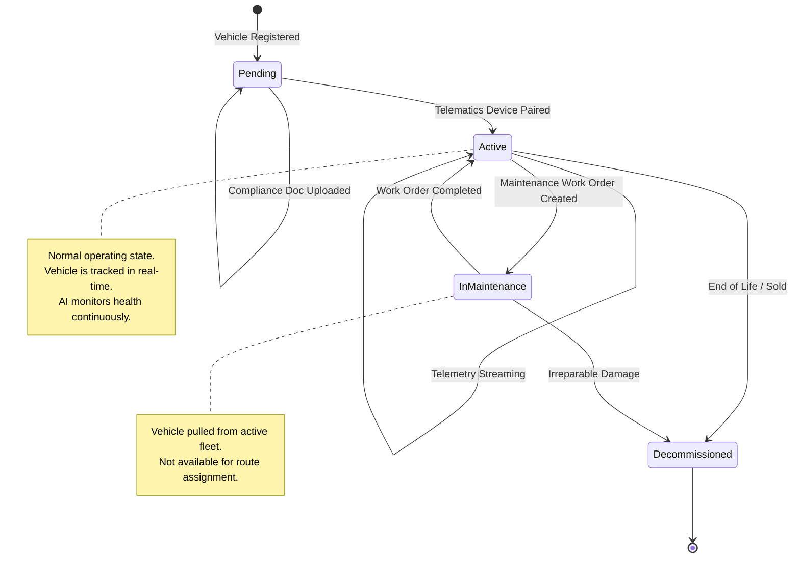
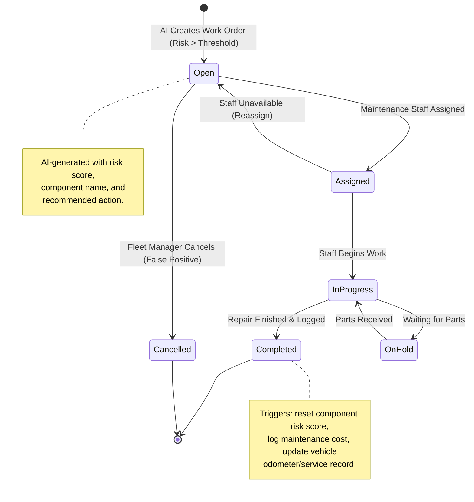
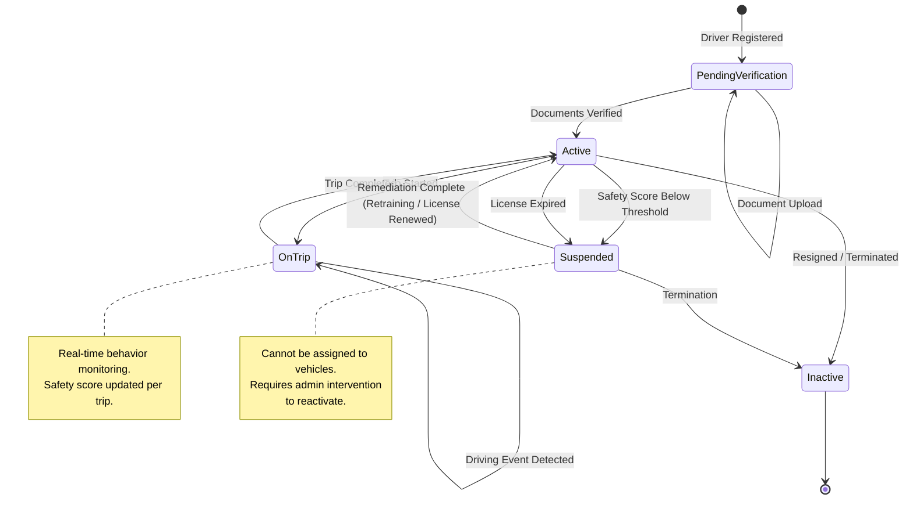
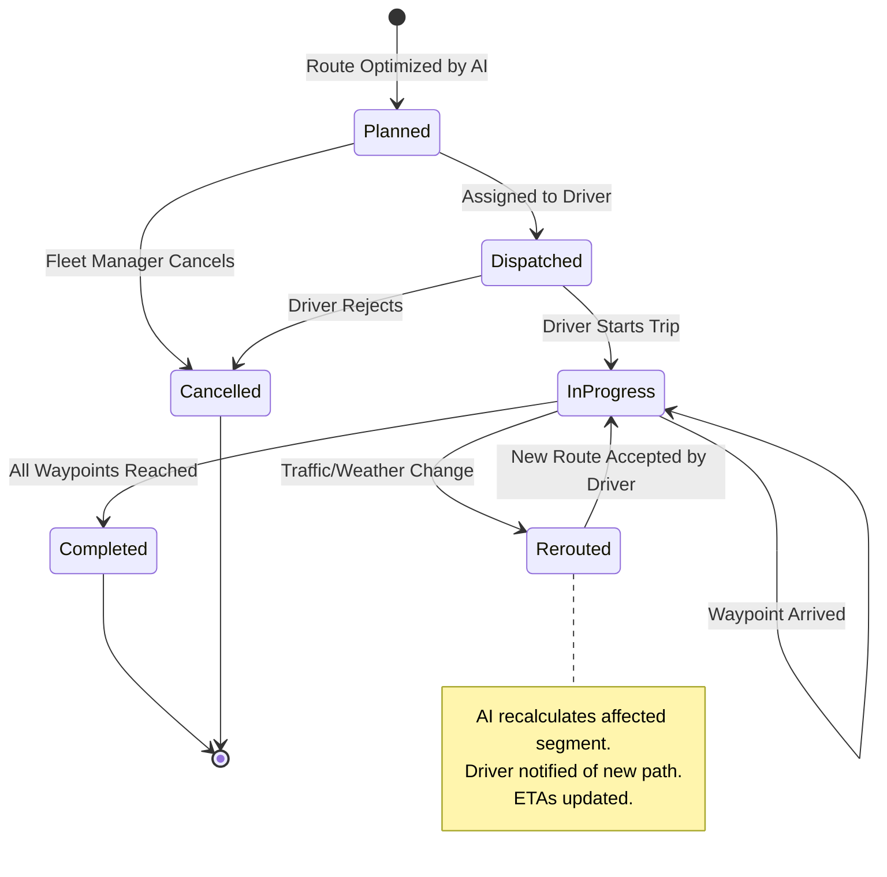
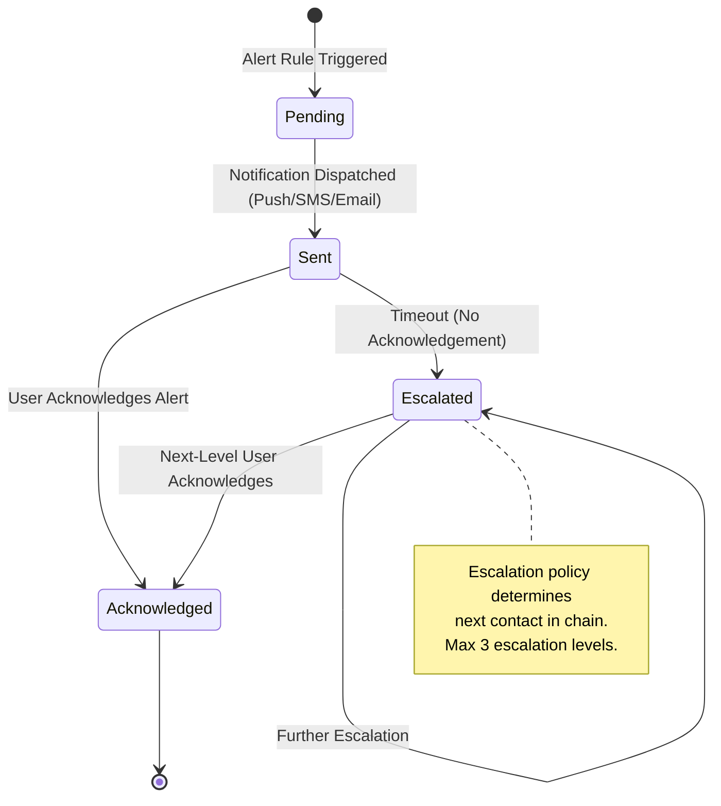

# State Diagrams — AI-Driven Fleet Management Optimization Platform

> **⚠️ Core Requirements**: State machines model the lifecycle of key domain entities as defined in [FUNCTIONAL_REQUIREMENTS.md](./FUNCTIONAL_REQUIREMENTS.md).

## Table of Contents
1. [Vehicle Lifecycle](#vehicle-lifecycle)
2. [Maintenance Work Order Lifecycle](#maintenance-work-order-lifecycle)
3. [Driver Status Lifecycle](#driver-status-lifecycle)
4. [Route Lifecycle](#route-lifecycle)
5. [Alert Instance Lifecycle](#alert-instance-lifecycle)

---

## Vehicle Lifecycle

---

## Maintenance Work Order Lifecycle

---

## Driver Status Lifecycle

---

## Route Lifecycle

---

## Alert Instance Lifecycle

---

**Last Updated**: February 2026
**Version**: 1.0
