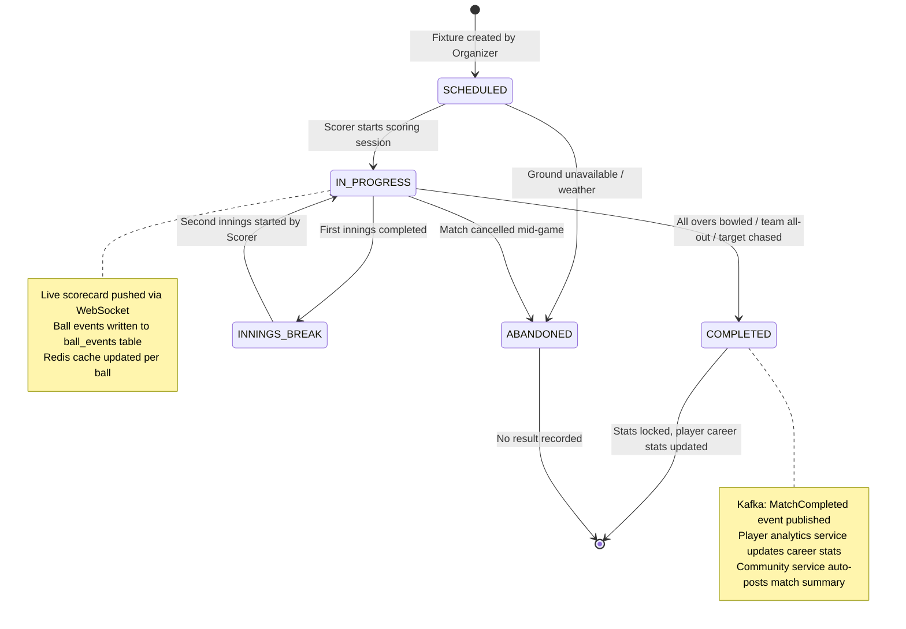
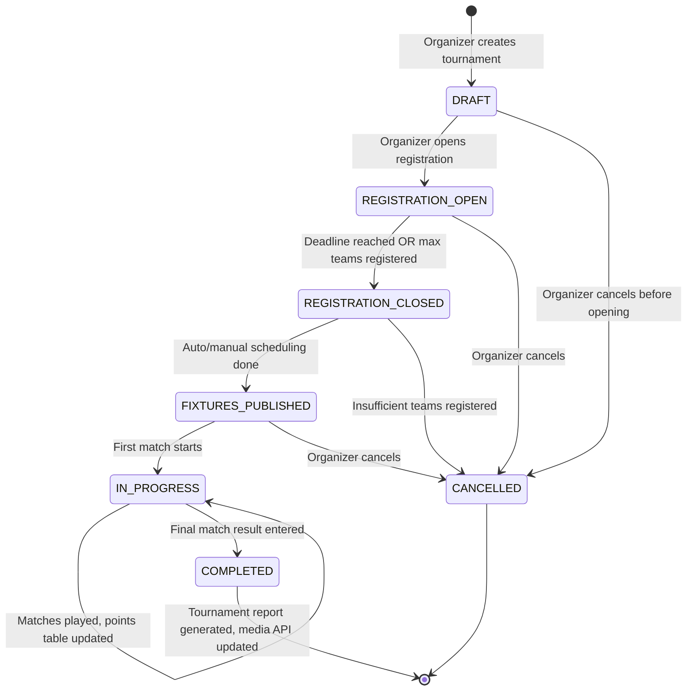
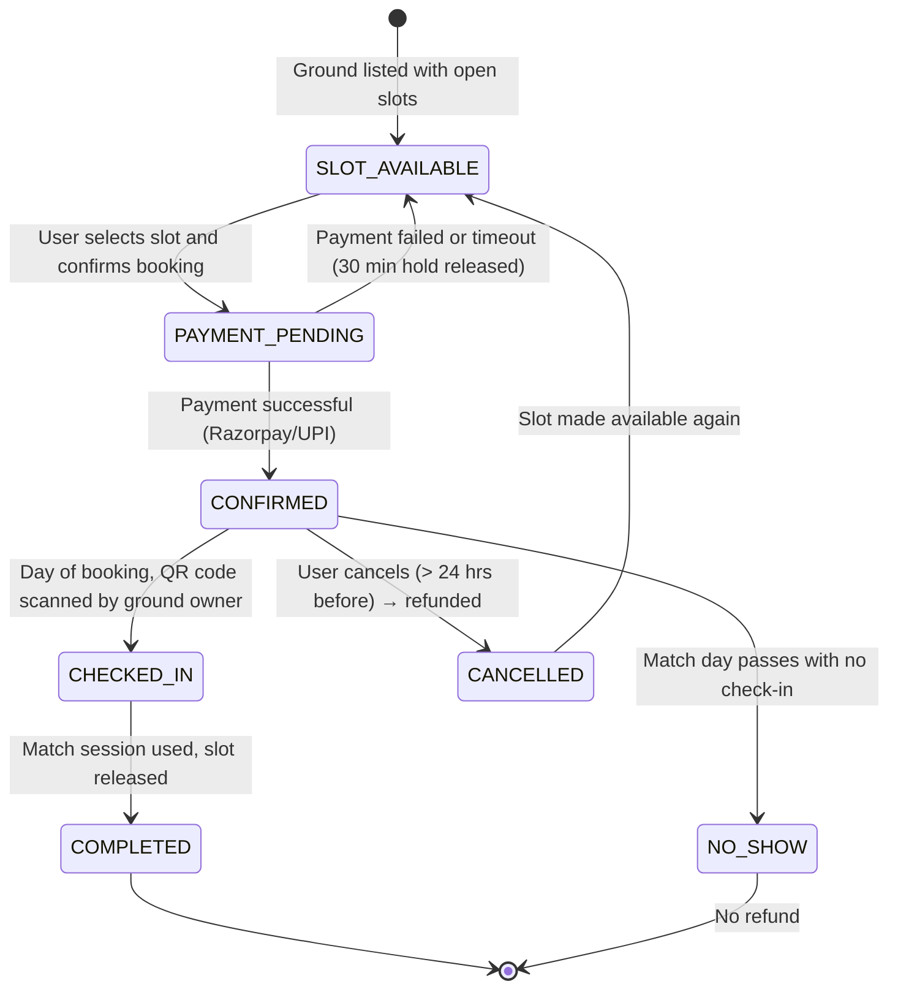
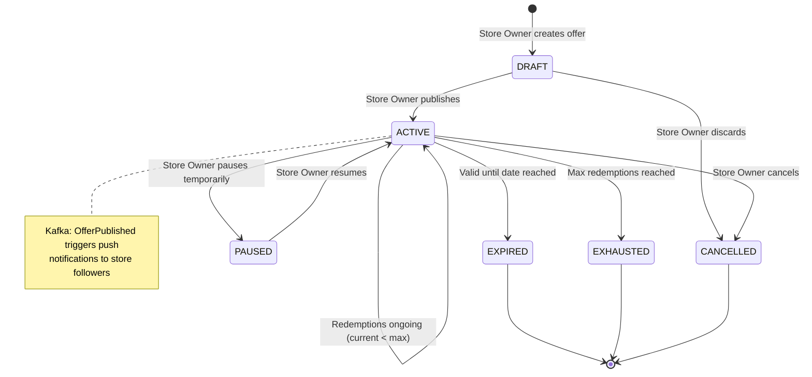

# State Diagrams — CricZone: Local Cricket Community Platform

> State machine diagrams for the five most important stateful entities in CricZone.

---

## SD-1: Match Lifecycle

---

## SD-2: Tournament Lifecycle

---

## SD-3: Ground Booking Lifecycle

---

## SD-4: Offer Lifecycle

---

## SD-5: Sponsorship Deal Lifecycle

```mermaid
stateDiagram-v2
    [*] --> REQUIREMENT_POSTED : Organizer posts sponsorship requirement

    REQUIREMENT_POSTED --> MATCHING : AI Engine runs sponsor matching
    MATCHING --> PROPOSALS_SENT : Matched sponsors notified
    MATCHING --> NO_MATCH : No matching sponsors found → posted to marketplace

    PROPOSALS_SENT --> NEGOTIATING : Sponsor expresses interest
    NEGOTIATING --> ACTIVE : Both parties accept; digital contract signed
    NEGOTIATING --> CANCELLED : Either party declines

    ACTIVE --> BRANDING_LIVE : Sponsor logos deployed on live scorecards
    BRANDING_LIVE --> BRANDING_LIVE : Tournament matches ongoing
    BRANDING_LIVE --> COMPLETED : Tournament completes
    BRANDING_LIVE --> CANCELLED : Tournament cancelled

    COMPLETED --> [*] : Sponsor ROI report generated
    CANCELLED --> [*]
    NO_MATCH --> [*] : Marketplace listing published
```

