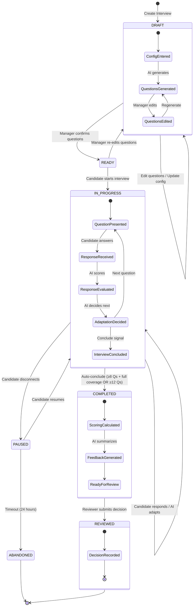
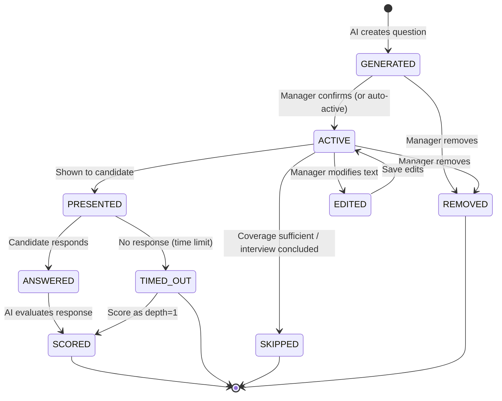
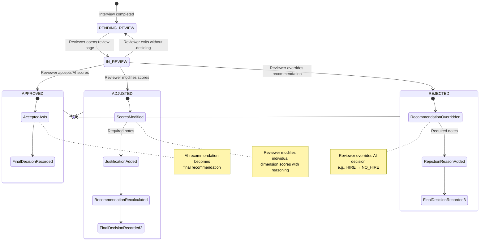
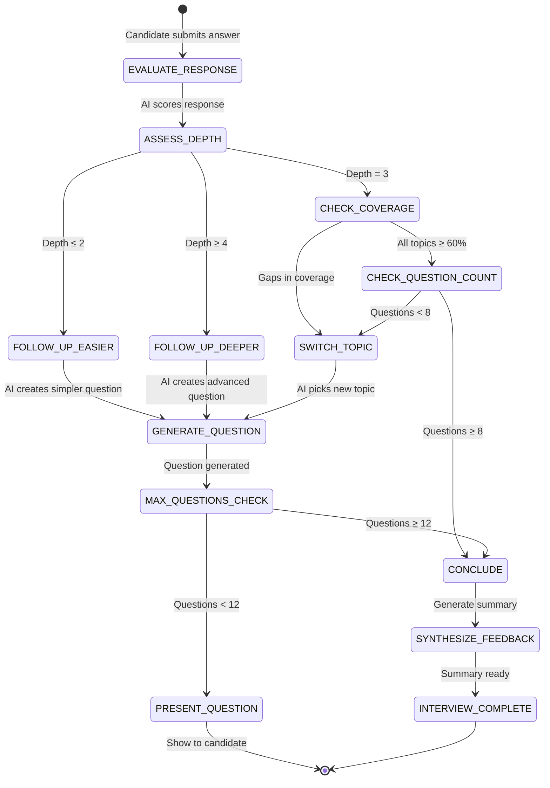
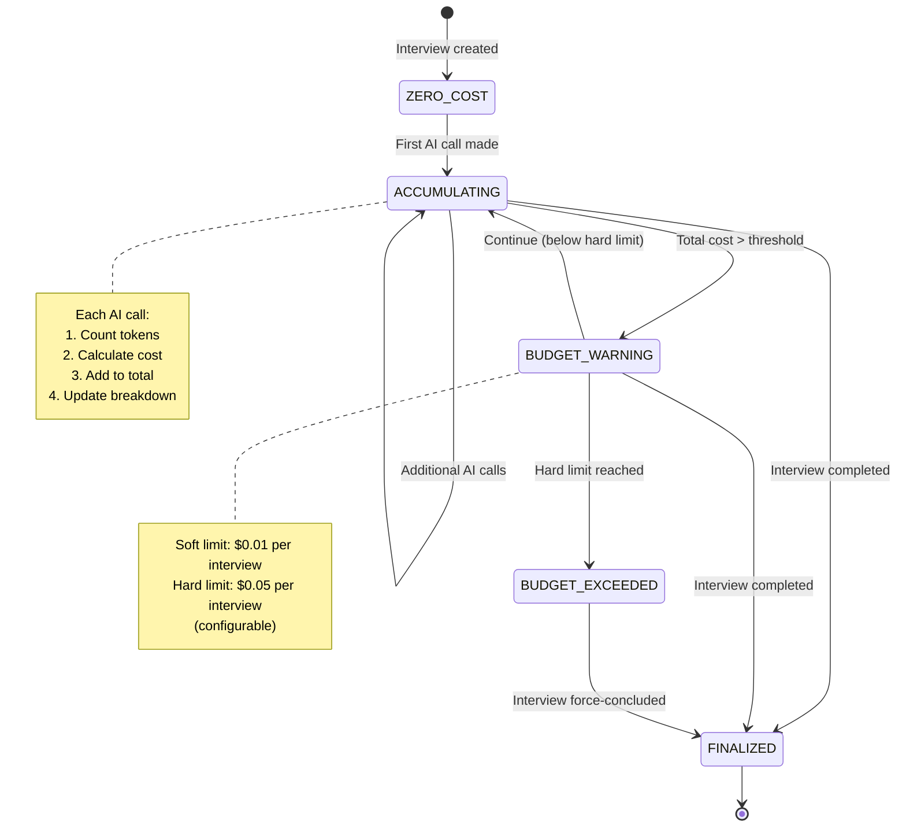

# State Diagram — AI-Assisted Interview Screening

---

## 1. Interview State Machine

---

## 2. Question State Machine

---

## 3. Review Decision State Machine

---

## 4. Adaptive Questioning State Machine

---

## 5. Cost Tracking State Machine

