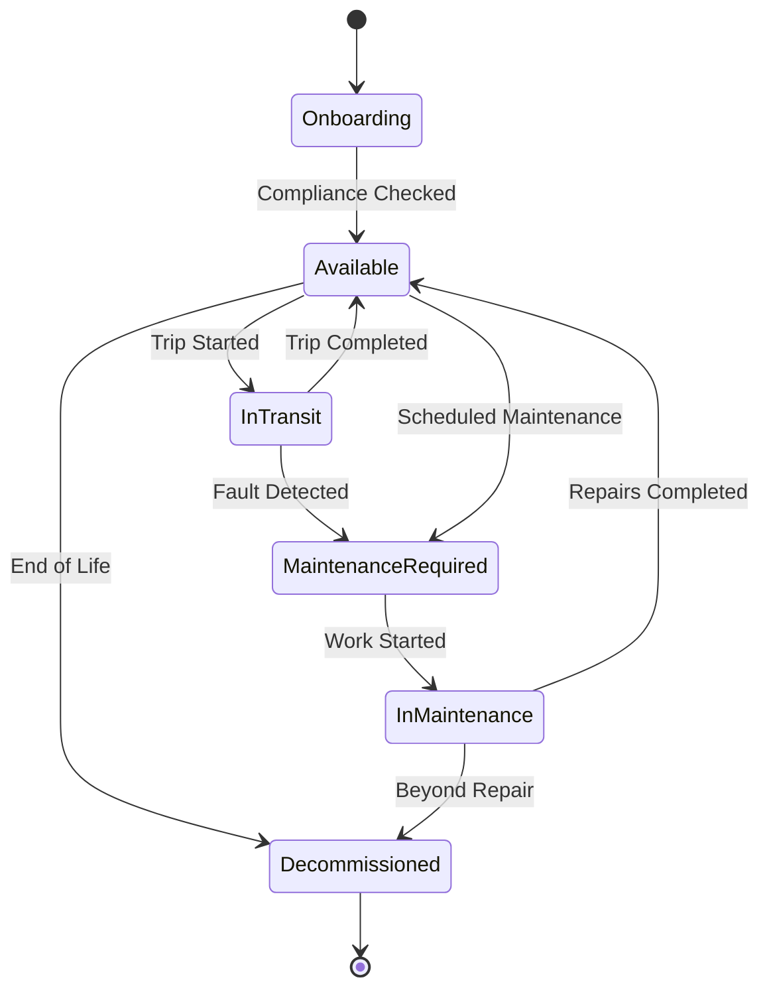
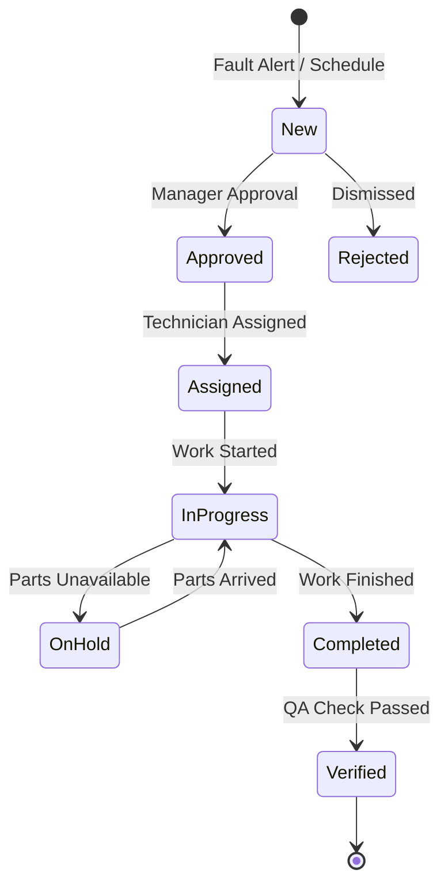

# State Diagrams

## Vehicle Lifecycle State

This diagram represents the states a vehicle can be in throughout its lifecycle in the fleet.

## Maintenance Ticket State

This diagram represents the lifecycle of a maintenance request.

