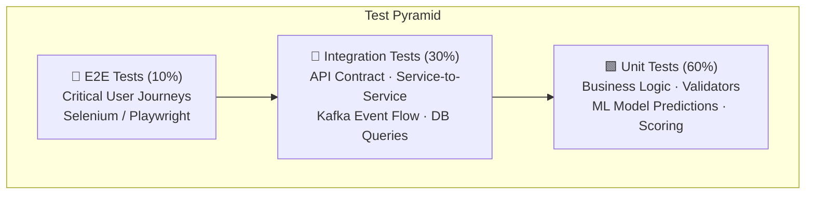

# Test Strategy — AI-Driven Fleet Management Optimization Platform

> This document provides a comprehensive testing blueprint for QA engineers, covering test approach, test scenarios mapped to use cases, API test specifications, integration test guidelines, and edge case coverage.

## Table of Contents
1. [Test Approach & Pyramid](#test-approach--pyramid)
2. [Test Environments](#test-environments)
3. [Functional Test Scenarios](#functional-test-scenarios)
4. [API Test Specifications](#api-test-specifications)
5. [Integration Test Plan](#integration-test-plan)
6. [Performance & Load Testing](#performance--load-testing)
7. [Security Testing](#security-testing)
8. [Edge Cases & Negative Testing](#edge-cases--negative-testing)
9. [Data-Driven Test Scenarios](#data-driven-test-scenarios)
10. [Acceptance Criteria Matrix](#acceptance-criteria-matrix)

---

## Test Approach & Pyramid



| Layer | Coverage Target | Tools | Responsibility |
|-------|----------------|-------|---------------|
| **Unit** | ≥ 80% line coverage | JUnit/pytest, Mockito, Jest | Dev team |
| **Integration** | All service boundaries | Testcontainers, WireMock, Kafka Testbed | Dev + QA |
| **API / Contract** | All public endpoints | Postman/Newman, REST Assured, Pact | QA team |
| **E2E** | 10–15 critical journeys | Playwright, Cypress | QA team |
| **Performance** | NFR thresholds | k6, Gatling, Locust | QA + DevOps |
| **Security** | OWASP Top 10 | OWASP ZAP, Burp Suite | Security + QA |

---

## Test Environments

| Environment | Purpose | Data | Refresh Cadence |
|-------------|---------|------|-----------------|
| **DEV** | Developer testing, unit + integration | Synthetic seed data | On-demand |
| **QA / SIT** | System Integration Testing, full regression | Anonymized production-like data | Weekly |
| **STAGING** | Pre-production validation, UAT | Production mirror (anonymized) | Per release |
| **PERF** | Load and stress testing | High-volume synthetic data (50K vehicles) | Per sprint |

---

## Functional Test Scenarios

### TS-01: User Registration & Authentication
**Mapped to**: FR-01, UC-1

| ID | Test Case | Precondition | Steps | Expected Result | Priority |
|----|-----------|-------------|-------|-----------------|----------|
| TS01-01 | Successful registration via Admin | Admin logged in | 1. POST `/auth/register` with valid data | 201 Created, invitation email sent | P1 |
| TS01-02 | Duplicate email registration | User exists with same email | 1. POST `/auth/register` with existing email | 409 Conflict, error: "Email already registered" | P1 |
| TS01-03 | Login with valid credentials | User registered | 1. POST `/auth/login` with correct email/password | 200 OK with JWT token | P1 |
| TS01-04 | Login with wrong password | User registered | 1. POST `/auth/login` with wrong password | 401 Unauthorized | P1 |
| TS01-05 | Access without token | — | 1. GET `/vehicles` without Authorization header | 401 Unauthorized | P1 |
| TS01-06 | Access with expired token | JWT expired | 1. GET `/vehicles` with expired JWT | 401 Unauthorized | P2 |
| TS01-07 | Role-based access — Driver cannot create vehicles | Driver logged in | 1. POST `/vehicles` as DRIVER role | 403 Forbidden | P1 |
| TS01-08 | Role-based access — Maintenance staff cannot see cost data | Maintenance staff logged in | 1. GET `/costs/summary` as MAINTENANCE_STAFF | 403 Forbidden | P2 |

---

### TS-02: Vehicle Onboarding
**Mapped to**: FR-02, UC-2

| ID | Test Case | Precondition | Steps | Expected Result | Priority |
|----|-----------|-------------|-------|-----------------|----------|
| TS02-01 | Register vehicle with valid data | Fleet Manager logged in | 1. POST `/vehicles` with VIN, make, model, year | 201 Created, status = PENDING | P1 |
| TS02-02 | Duplicate VIN registration | Vehicle with same VIN exists | 1. POST `/vehicles` with existing VIN | 409 Conflict | P1 |
| TS02-03 | Register vehicle with invalid VIN (wrong length) | — | 1. POST `/vehicles` with 10-char VIN | 400 Bad Request, validation error | P2 |
| TS02-04 | Pair telematics device — success | Vehicle registered, device online | 1. POST `/vehicles/{id}/pair-device` with valid serial | 200 OK, vehicle status → ACTIVE | P1 |
| TS02-05 | Pair telematics device — device offline | Vehicle registered, device offline | 1. POST `/vehicles/{id}/pair-device` | 422 "Device not responding" | P1 |
| TS02-06 | Pair device already paired to another vehicle | Device paired to vehicle A | 1. POST `/vehicles/B/pair-device` with device serial | 409 Conflict "Device already paired" | P2 |
| TS02-07 | Upload compliance document — valid | Vehicle registered | 1. Upload insurance PDF within expiry | Document saved, `is_verified` = false | P1 |
| TS02-08 | Upload compliance document — expired | Vehicle registered | 1. Upload expired insurance | 400 "Document is expired" | P2 |
| TS02-09 | Vehicle status transitions | Vehicle is ACTIVE | 1. Create maintenance work order | Vehicle status → IN_MAINTENANCE | P1 |

---

### TS-03: Driver Onboarding
**Mapped to**: FR-03, UC-3

| ID | Test Case | Precondition | Steps | Expected Result | Priority |
|----|-----------|-------------|-------|-----------------|----------|
| TS03-01 | Onboard driver with valid data | FM logged in | 1. POST `/drivers` with valid details | 201 Created, status = PENDING_VERIFICATION | P1 |
| TS03-02 | Duplicate license number | Driver with same license exists | 1. POST `/drivers` with existing license | 409 Conflict | P1 |
| TS03-03 | Assign driver to vehicle — success | Driver active, vehicle active, no conflict | 1. POST `/drivers/{id}/assign` | 201 Created, assignment ACTIVE | P1 |
| TS03-04 | Assign driver — schedule conflict | Another driver assigned to same vehicle/time | 1. POST `/drivers/{id}/assign` overlapping schedule | 409 Conflict "Schedule overlap" | P1 |
| TS03-05 | Assign driver with expired license | Driver license expired | 1. POST `/drivers/{id}/assign` | 400 "Driver license expired" | P2 |
| TS03-06 | Driver license expiry alert | License expires in 30 days | System checks nightly | Alert generated for Fleet Manager | P2 |

---

### TS-04: Real-Time Vehicle Tracking
**Mapped to**: FR-04, UC-4

| ID | Test Case | Precondition | Steps | Expected Result | Priority |
|----|-----------|-------------|-------|-----------------|----------|
| TS04-01 | Live location update | Vehicle active, device streaming | 1. Device sends GPS data 2. Check dashboard | Location pin updates within 5 seconds | P1 |
| TS04-02 | Vehicle status display | Vehicles in various states | 1. Open live map | Status icons: 🟢 In Transit, 🟡 Idle, 🔴 Maintenance | P1 |
| TS04-03 | Geofence entry alert | Geofence configured for depot | 1. Vehicle enters geofence boundary | Alert triggered: "Vehicle entered Depot Zone" | P1 |
| TS04-04 | Geofence exit alert | Vehicle inside geofence | 1. Vehicle exits geofence | Alert triggered: "Vehicle left Depot Zone" | P1 |
| TS04-05 | Telemetry gap — device loses signal | Device streaming, then goes offline | 1. No data for > 2 minutes | Vehicle shows "Signal Lost" status | P2 |
| TS04-06 | Historical trip replay | Completed trip exists | 1. GET trip history 2. Play route animation | Route rendered on map with timestamps | P3 |

---

### TS-05: Predictive Maintenance
**Mapped to**: FR-05, UC-5

| ID | Test Case | Precondition | Steps | Expected Result | Priority |
|----|-----------|-------------|-------|-----------------|----------|
| TS05-01 | Risk score below threshold — no action | Vehicle with 30+ days data | 1. ML predicts brake risk = 0.45 | Risk score updated, NO work order created | P1 |
| TS05-02 | Risk score above threshold — work order created | Vehicle with 30+ days data | 1. ML predicts brake risk = 0.82 | Work order created (OPEN, urgency=HIGH), maintenance staff notified | P1 |
| TS05-03 | Critical OBD-II fault code | Vehicle sends P0300 fault | 1. Device reports fault code | Urgent work order (CRITICAL), FM + Staff + Driver alerted | P1 |
| TS05-04 | Insufficient data — no prediction | Vehicle with < 30 days data | 1. ML check triggers | No prediction, status logged "Insufficient data" | P2 |
| TS05-05 | Duplicate work order prevention | Open WO exists for same component | 1. New risk score > threshold for same component | Existing WO updated (NOT duplicate created) | P1 |
| TS05-06 | Risk score reset after maintenance | Work order completed | 1. Complete WO 2. Check component risk score | Risk score reset to 0.0 | P1 |
| TS05-07 | Vehicle health report endpoint | Vehicle with scores | 1. GET `/vehicles/{id}/health` | Component breakdown with scores + recommendations | P2 |

---

### TS-06: Route Optimization
**Mapped to**: FR-06, UC-6

| ID | Test Case | Precondition | Steps | Expected Result | Priority |
|----|-----------|-------------|-------|-----------------|----------|
| TS06-01 | Optimize route — valid multi-stop | 4 stops with time windows | 1. POST `/routes/optimize` | Optimized order, ETAs, distance, fuel estimate | P1 |
| TS06-02 | Optimize route — infeasible constraints | Time windows impossible | 1. POST `/routes/optimize` with conflicting windows | 422 "No feasible route — relax constraints" | P1 |
| TS06-03 | Dynamic reroute — traffic incident | Route in progress | 1. Traffic API reports incident on segment | New route segment calculated, driver notified | P1 |
| TS06-04 | Route deviation detection | Driver deviates from route | 1. GPS shows off-route 2. System detects | Alert to FM: "Route deviation detected" | P1 |
| TS06-05 | Dispatch route to driver | Route optimized | 1. POST `/routes/{id}/dispatch` | Driver receives push notification | P1 |
| TS06-06 | Waypoint arrival logging | Driver arrives at waypoint | 1. GPS at waypoint location | actualArrival recorded, status = ARRIVED | P2 |
| TS06-07 | External API failure — traffic API down | Traffic API unreachable | 1. POST `/routes/optimize` | Circuit breaker activates, cached/fallback data used, route still generated | P2 |

---

### TS-07: Driver Behavior Monitoring
**Mapped to**: FR-07, UC-7

| ID | Test Case | Precondition | Steps | Expected Result | Priority |
|----|-----------|-------------|-------|-----------------|----------|
| TS07-01 | Harsh braking detection | Driver on trip | 1. Accelerometer: decel > 0.7g for 1s+ | DrivingEvent logged (HARSH_BRAKE, HIGH) | P1 |
| TS07-02 | Speeding detection | Driver on trip | 1. GPS speed > speed limit by 20%+ | DrivingEvent logged (SPEEDING) | P1 |
| TS07-03 | In-cab alert for high-severity event | Event severity = HIGH | 1. Harsh brake detected | Real-time push alert to driver | P1 |
| TS07-04 | Trip score calculation | Trip with 1 harsh brake + 2 speeding | 1. Trip ends | Score = 100 - (5 + 6) = 89 | P1 |
| TS07-05 | Rolling average update | New trip completed | 1. Trip score recorded | 30-day rolling average recalculated | P1 |
| TS07-06 | Low safety score — driver flagged | Rolling avg < 50 | 1. System evaluates score | Driver status → SUSPENDED, FM alerted | P1 |
| TS07-07 | Score history endpoint | Driver with trip history | 1. GET `/drivers/{id}/scores?period=MONTH` | Score trend, top events, improvement direction | P2 |

---

### TS-08: Alerts & Notifications
**Mapped to**: FR-08, UC-8

| ID | Test Case | Precondition | Steps | Expected Result | Priority |
|----|-----------|-------------|-------|-----------------|----------|
| TS08-01 | Alert delivery — push notification | Alert rule triggered | 1. Event occurs 2. Rule matches | Push notification sent within 30 seconds | P1 |
| TS08-02 | Alert acknowledgement | Alert sent | 1. PUT `/alerts/{id}/acknowledge` | Status → ACKNOWLEDGED, timestamp recorded | P1 |
| TS08-03 | Alert escalation — not acknowledged | HIGH alert, 10-min timeout | 1. Wait 10 minutes without ACK | Alert escalated to Fleet Manager via SMS | P1 |
| TS08-04 | CRITICAL alert — simultaneous channels | Critical event | 1. Event triggers critical alert | Push + SMS + Phone + Email sent simultaneously | P1 |
| TS08-05 | Alert rule configuration | Admin logged in | 1. Create custom alert rule | Rule saved, active for future events | P2 |
| TS08-06 | Disable alert rule | Active rule exists | 1. Deactivate rule | No future alerts triggered by this rule | P3 |

---

### TS-09: Analytics & Cost Management
**Mapped to**: FR-09, FR-11, UC-9, UC-10

| ID | Test Case | Precondition | Steps | Expected Result | Priority |
|----|-----------|-------------|-------|-----------------|----------|
| TS09-01 | KPI dashboard loads within SLA | Data populated | 1. GET `/analytics/kpis` | Response < 2 seconds, all KPIs present | P1 |
| TS09-02 | AI insights returned | Sufficient historical data | 1. GET `/analytics/insights` | At least 1 actionable insight with confidence score | P1 |
| TS09-03 | Cost summary by period | Cost entries exist | 1. GET `/costs/summary?period=MONTH` | Breakdown by category, total, cost/km | P1 |
| TS09-04 | Cost recommendation | Cost patterns exist | 1. GET `/costs/recommendations` | At least 1 recommendation with savings estimate | P2 |
| TS09-05 | Drill-down by vehicle | Fleet with 50+ vehicles | 1. GET `/costs/summary?vehicle_id=v-001` | Vehicle-specific cost breakdown | P2 |

---

### TS-10: Sustainability
**Mapped to**: FR-12, UC-11

| ID | Test Case | Precondition | Steps | Expected Result | Priority |
|----|-----------|-------------|-------|-----------------|----------|
| TS10-01 | Emissions report per period | Trip data exists | 1. GET `/sustainability/emissions?period=MONTH` | CO₂ total, per-vehicle avg, top emitters | P1 |
| TS10-02 | Progress against sustainability target | Target configured | 1. GET `/sustainability/emissions` | `vs_target` field shows progress % | P2 |
| TS10-03 | Green recommendations | Fleet with diesel vehicles | 1. GET `/sustainability/recommendations` | EV transition recommendations returned | P2 |

---

## API Test Specifications

### Automated API Test Suite Structure

```
tests/
├── auth/
│   ├── test_login.py
│   ├── test_registration.py
│   └── test_rbac.py
├── vehicles/
│   ├── test_vehicle_crud.py
│   ├── test_device_pairing.py
│   └── test_vehicle_health.py
├── drivers/
│   ├── test_driver_crud.py
│   ├── test_assignment.py
│   └── test_scores.py
├── routes/
│   ├── test_route_optimization.py
│   ├── test_reroute.py
│   └── test_waypoints.py
├── maintenance/
│   ├── test_work_orders.py
│   └── test_risk_scores.py
├── alerts/
│   ├── test_alert_delivery.py
│   └── test_escalation.py
├── analytics/
│   ├── test_kpis.py
│   └── test_insights.py
├── costs/
│   └── test_cost_management.py
├── sustainability/
│   └── test_emissions.py
└── conftest.py  # Shared fixtures, auth helpers
```

### API Response Validation Checklist

For every API endpoint, validate:

- [ ] **Status Code**: Correct HTTP status (200, 201, 400, 401, 403, 404, 409, 422)
- [ ] **Response Schema**: JSON structure matches API spec (required fields present, correct types)
- [ ] **Pagination**: `page`, `limit`, `total` fields in list endpoints
- [ ] **Error Format**: Consistent `{ "error": { "code", "message", "status", "timestamp" } }`
- [ ] **Auth Guard**: 401 without token, 403 with wrong role
- [ ] **Idempotency**: PUT operations are idempotent
- [ ] **Rate Limiting**: 429 returned after quota exceeded

---

## Integration Test Plan

### Service-to-Service Integration Tests

| Test | Producer | Consumer | Verification |
|------|----------|----------|-------------|
| Telemetry → Predictive Maintenance | Telematics Ingestion | Predictive Maintenance | Kafka event consumed, risk score updated in DB |
| Telemetry → Driver Behavior | Telematics Ingestion | Driver Behavior Analytics | Driving events detected and stored |
| Work Order → Notification | Predictive Maintenance | Alert & Notification | Push notification sent to correct user within 30s |
| Route Reroute → Driver Alert | Route Optimization | Alert & Notification | Driver receives updated route notification |
| Trip Complete → Sustainability | Driver Behavior | Sustainability | Emission record calculated for completed trip |

### Database Integration Tests

| Test | Service | Verification |
|------|---------|-------------|
| Vehicle CRUD | Vehicle Mgmt | INSERT, SELECT, UPDATE verified in PostgreSQL |
| Telemetry write throughput | Telematics Ingestion | 10K inserts/sec to TimescaleDB hypertable |
| Work order state transitions | Predictive Maintenance | Status transitions follow FSM (OPEN→ASSIGNED→IN_PROGRESS→COMPLETED) |
| Concurrent device pairing | Vehicle Mgmt | Only one vehicle pairs with a device (race condition test) |

### External API Integration Tests (Mocked)

| External API | Mock Strategy | Test |
|-------------|--------------|------|
| Google Maps Traffic | WireMock stub | Route optimization uses traffic data correctly |
| OpenWeatherMap | WireMock stub | Weather penalty applied to route scoring |
| SMS Provider (Twilio) | Mock gateway | Notification delivered with correct content |
| Traffic API down | WireMock 503 response | Circuit breaker activates, fallback route generated |

---

## Performance & Load Testing

### Load Profiles

| Scenario | Virtual Users | Duration | Success Criteria |
|----------|--------------|----------|-----------------|
| **Normal Load** | 500 concurrent (100 FM + 350 Drivers + 50 Maintenance) | 30 min | p95 response < 2s, 0% errors |
| **Peak Load** | 2,000 concurrent | 15 min | p95 response < 5s, < 0.1% errors |
| **Telemetry Stress** | 10,000 vehicles streaming at 5s intervals | 60 min | No data loss, ingestion lag < 10s |
| **Spike Test** | 0 → 3,000 users in 60s | 5 min | Auto-scaling triggers, no 5xx errors |
| **Soak Test** | 500 concurrent | 24 hours | No memory leaks, stable response times |

### Key Performance Metrics

| Metric | Target | Measurement |
|--------|--------|-------------|
| Dashboard load time | < 2s (p95) | k6 HTTP response timer |
| Route optimization response | < 3s for 20 stops | k6 API test |
| Telemetry ingestion throughput | ≥ 10K events/sec | Kafka consumer lag monitoring |
| Alert delivery latency | < 30s end-to-end | Event timestamp → notification received |
| WebSocket update latency | < 1s | Client-side measurement |

---

## Security Testing

### OWASP Top 10 Coverage

| # | Vulnerability | Test Cases |
|---|--------------|------------|
| A01 | **Broken Access Control** | Driver accessing FM endpoints; horizontal privilege escalation (Driver A accessing Driver B's data) |
| A02 | **Cryptographic Failures** | Verify TLS 1.3 enforcement; check JWT token signing algorithm; verify password hashing (bcrypt) |
| A03 | **Injection** | SQL injection in query params (`vehicle_id='; DROP TABLE--`); NoSQL injection in JSONB fields |
| A04 | **Insecure Design** | Missing rate limiting on login (brute force); predictable resource IDs |
| A05 | **Security Misconfiguration** | Default credentials check; CORS policy verification; error messages don't leak stack traces |
| A07 | **Identity & Auth Failures** | Token expiry enforcement; refresh token rotation; session invalidation on password change |
| A09 | **Security Logging** | Failed login attempts logged; admin actions audited; sensitive data not in logs |

### Data Privacy Tests

| Test | Verification |
|------|-------------|
| PII Encryption | Driver phone, email encrypted at rest (AES-256) |
| Data Isolation | Multi-tenant: Fleet A cannot see Fleet B's vehicles |
| GDPR Right to Delete | DELETE `/users/{id}` anonymizes linked records |
| Audit Log Immutability | Cannot UPDATE or DELETE audit_logs entries |

---

## Edge Cases & Negative Testing

### Boundary & Edge Cases

| Category | Test Case | Expected Behavior |
|----------|-----------|------------------|
| **Vehicle** | Register vehicle with max VIN length (17 chars) | Accepted |
| **Vehicle** | Register vehicle with future year (2030) | Accepted (pre-order scenario) |
| **Vehicle** | Odometer rollback (new reading < previous) | Warning logged, FM alerted |
| **Driver** | Assign driver to 0 vehicles | Valid — driver is on bench |
| **Driver** | Safety score exactly at threshold (50.00) | Treated as MODERATE, not suspended |
| **Route** | Optimize with 1 stop (just origin) | 400 "Minimum 2 stops required" |
| **Route** | Optimize with 50 stops | Route returned within 10s (NP-hard, heuristic timeout) |
| **Telemetry** | GPS coordinates at (0.0, 0.0) — "Null Island" | Flagged as invalid, not plotted on map |
| **Telemetry** | Negative speed value | Rejected in validation |
| **Telemetry** | Engine temp = 9999°C (sensor malfunction) | Outlier detection flags as sensor error |
| **Maintenance** | Complete work order with $0 cost | Accepted (warranty repair) |
| **Alert** | 1,000 alerts generated in 1 minute | Alert batching/dedup prevents notification flood |

### Concurrency & Race Conditions

| Scenario | Test | Expected Behavior |
|----------|------|------------------|
| Two FMs pair same device simultaneously | Parallel POST `/pair-device` | One succeeds (201), other fails (409) |
| Driver assigned to 2 vehicles at same time | Parallel POST `/assign` for overlapping dates | One succeeds, other returns schedule conflict |
| Simultaneous work order completion | Two staff mark same WO complete | First succeeds, second gets 409 "Already completed" |

---

## Data-Driven Test Scenarios

### Fuel Type Matrix (Route Optimization)

| Fuel Type | Fuel Cost/L | Emission Factor (kg CO₂/L) | Test Verification |
|-----------|------------|---------------------------|-------------------|
| DIESEL | $1.45 | 2.68 | Cost + emission calculated correctly |
| PETROL | $1.65 | 2.31 | Cost + emission calculated correctly |
| ELECTRIC | $0.12/kWh | 0.0 (direct) | Zero direct emissions, energy cost used |
| HYBRID | $1.55 | 1.80 | Blended calculation applied |
| CNG | $0.95 | 1.88 | Correct factor applied |

### Driver Safety Score Scenarios

| Events in Trip | Expected Score | Risk Level |
|---------------|---------------|------------|
| 0 events | 100 | 🟢 LOW |
| 1 harsh brake (×5) | 95 | 🟢 LOW |
| 2 speeding (×3) + 1 harsh brake (×5) | 89 | 🟢 LOW |
| 5 harsh brakes + 3 speeding + 2 rapid accel | 100 - (25+9+4) = 62 | 🟠 HIGH |
| 10 harsh brakes + 5 speeding + 5 idle | 100 - (50+15+5) = 30 | 🔴 CRITICAL |

---

## Acceptance Criteria Matrix

### Per-Requirement Acceptance Criteria

| FR | Acceptance Criteria | Automated? |
|----|-------------------|------------|
| FR-01 | User can register, login, and access only role-permitted endpoints | ✅ API tests |
| FR-02 | Vehicle registered, device paired, telemetry confirmed within 5 min flow | ✅ API + Integration |
| FR-03 | Driver onboarded, documents verified, assigned to vehicle without conflicts | ✅ API tests |
| FR-04 | Vehicle location visible on map within 5s of device ping | ⚠️ E2E + manual |
| FR-05 | Work order auto-created when risk > 0.75; notification sent within 30s | ✅ Integration test |
| FR-06 | Route optimized for 4 stops in < 3s; reroute on traffic change | ✅ API + Integration |
| FR-07 | Harsh braking event detected, logged, driver alerted in real-time | ✅ Integration test |
| FR-08 | Alert delivered within 30s; escalation triggers after timeout | ✅ Integration test |
| FR-09 | Dashboard loads KPIs in < 2s; insights returned with confidence > 0.80 | ✅ Perf + API test |
| FR-10 | Webhook registered, events dispatched to subscriber within 60s | ✅ Integration test |
| FR-11 | Cost summary by period/vehicle with category breakdown | ✅ API test |
| FR-12 | Emissions calculated per vehicle, progress vs target shown | ✅ API test |

---

### Definition of Done (DoD) for QA Sign-off

- [ ] All P1 test cases pass
- [ ] All P2 test cases pass (P3 deferred ok)
- [ ] API contract tests pass against OpenAPI spec
- [ ] Integration tests pass in SIT environment
- [ ] Performance tests pass NFR thresholds
- [ ] No open P1/P2 bugs
- [ ] Security scan (OWASP ZAP) shows no HIGH/CRITICAL findings
- [ ] Test coverage report reviewed (≥ 80% unit, ≥ 70% integration)
- [ ] Regression suite green on STAGING

---

**Last Updated**: February 2026
**Version**: 1.0
